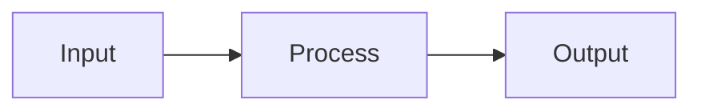

# Rule: Mermaid-Only Diagrams

## Context

To ensure consistent, renderable documentation diagrams, all graphs must be authored in Mermaid.
ASCII diagrams are not allowed.

## The Protocol

- Use Mermaid for any diagram or graph.
- Do not create ASCII art diagrams.

## Example (Allowed)

## Example (Forbidden)

- ASCII diagramming (for example, arrow chains or box drawings) is not allowed.
