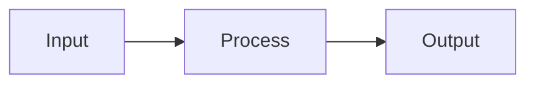

# AGENTS.md - Guidelines for AI Coding Agents in yoga-files

## 🔧 Repository Context
This repository (`yoga-files`) is a **shell scripting project** (Bash/Zsh) that provides a development environment framework (ASDF, LazyVim, Git profiles, AI configs).
- **There is no JavaScript/TypeScript application code here.** Do not attempt to use `tsc`, `biome`, `jest`, or write React components in this repository.
- The `.opencode/` directory contains rules and templates that are distributed to *other* projects. They do not apply to the `yoga-files` codebase itself.

## 📁 Architecture & Boundaries
- `bin/`: Executable CLI commands (e.g., `yoga`, `yoga-create`, `yoga-doctor`).
- `core/`: Shared shell libraries, helpers, and UI functions.
- `tests/`: Bash/Zsh smoke tests.
- `docs/`, `specs/`: Markdown documentation and technical designs.
- `.opencode/`: Meta-repository configuration and AI agent rules meant for deployment to target backend projects.

## 🛠️ Development Workflow
- **Tests**: Run `./tests/run-all.sh`. Tests are purely shell-based (`smoke.bash`, `smoke.zsh`).
- **Modifying AI Rules**: If you change any file inside `.opencode/` (such as rules, commands, or agents), you **must** run `npm run opencode:compile` or `./bin/opencode-compile`. This updates the compiled block at the bottom of `AGENTS.md`.

## 📝 Shell Coding Standards
When modifying `yoga-files` shell scripts, adhere to `CODE_STANDARDS.md`:
- Use `#!/usr/bin/env bash` or `zsh` for portability.
- **Safety**: Prefer explicit checks. Use `set -euo pipefail` (in Bash). Avoid `eval` and unchecked `sudo`.
- **UI & Messaging**: Use the internal `yoga_*` functions (e.g., `yoga_fogo`, `yoga_terra`, `yoga_agua`) for colorized UI feedback instead of raw `echo`. See `core/utils.sh`.
- **Dependencies**: Always check if a command exists (e.g., `command -v lsof`) before using it.

<!-- BEGIN OPENCODE AUTO -->
# 🔒 Compiled OpenCode Configuration

> Auto-generated. Do not edit manually.


## commands/code-review.md

---
description: Revisa código para qualidade e melhores práticas
mode: subagent
model: opencode/big-pickle
temperature: 0.1
tools:
  write: false
  edit: false
  bash: false
---

Você está no modo de revisão de código. Foque em:

- Qualidade do código e melhores práticas
- Bugs potenciais e casos de borda
- Implicações de desempenho
- Considerações de segurança

Forneça feedback construtivo sem fazer alterações diretas.

## commands/finish-task.md

---
description: Finalizar tarefa, resumir entrega e solicitar aprovação
agent: plan
---

Siga o protocolo de Finalização de Tarefa:

## 1. Revisar a entrega concluída
Revise a tarefa executada e produza um resumo objetivo contendo:
- o que foi implementado, corrigido ou alterado
- arquivos principais impactados
- impactos técnicos relevantes
- classificação preliminar da mudança:
  - fix
  - feat
  - breaking change

## 2. Identificar a origem da versão
Localize a fonte oficial da versão do projeto, seguindo esta ordem de prioridade:
1. `package.json`
2. `composer.json`
3. `pyproject.toml`
4. `Cargo.toml`
5. outro manifesto/version file do projeto

Se nenhuma origem de versão for encontrada, informe isso claramente no output.

## 3. Sugerir o version bump
Use Semantic Versioning:
- `fix` -> PATCH
- `feat` -> MINOR
- `breaking change` -> MAJOR

Você deve informar:
- versão atual
- bump recomendado
- próxima versão estimada

## 4. Output obrigatório
O output deve conter obrigatoriamente:

1. Summary of delivered work
2. Main files changed
3. Change classification
4. Current version
5. Recommended bump
6. Next version

## 5. Pergunta obrigatória
Após exibir o resumo, você deve PARAR e perguntar exatamente:

"Do you approve these changes and the proposed version bump, Developer?"

## 6. Regras obrigatórias
- Não atualizar versão neste comando
- Não atualizar `CHANGELOG.md` neste comando
- Não criar commit, tag ou push neste comando
- Apenas revisar, classificar, sugerir o bump e pedir aprovação
- Se houver dúvida sobre a classificação (`fix`, `feat`, `breaking change`), expor isso objetivamente antes da pergunta final

## Tarefa Solicitada
$ARGUMENTS

## commands/release.md

---
description: Executar release update após aprovação explícita
agent: plan
---

Siga o protocolo de Release Update Pós-Aprovação:

## 1. Pré-condição obrigatória
Este comando só pode prosseguir se houver aprovação explícita prévia do Developer para:
- as mudanças entregues
- o version bump proposto

Se não houver aprovação explícita no contexto atual, PARE e informe exatamente:

"Explicit approval is required before running the release update."

## 2. Validar fluxo correto
Antes de prosseguir, verifique se houve um resumo prévio da entrega no contexto atual.

Se não houver evidência clara de revisão prévia da tarefa, PARE e informe exatamente:

"Run /finish-task before /release so the work can be reviewed and approved first."

## 3. Identificar a origem da versão
Localize a fonte oficial da versão do projeto, seguindo esta ordem de prioridade:
1. `package.json`
2. `composer.json`
3. `pyproject.toml`
4. `Cargo.toml`
5. outro manifesto/version file do projeto

Se nenhuma origem confiável for encontrada, pare e informe isso claramente.

## 4. Determinar o tipo de bump
Use a classificação já aprovada:
- `fix` -> PATCH
- `feat` -> MINOR
- `breaking change` -> MAJOR

Se a classificação aprovada não estiver clara, pare e informe a inconsistência antes de alterar arquivos.

## 5. Atualizar versão
Atualize a versão na fonte oficial identificada.

Se houver outros arquivos que devam refletir a mesma versão, atualize-os também para manter consistência.

## 6. Atualizar `CHANGELOG.md`
Atualize o arquivo `CHANGELOG.md` adicionando a nova entrada no topo com:
- nova versão
- data atual no formato `YYYY-MM-DD`
- categorias aplicáveis:
  - Added
  - Changed
  - Fixed
  - Removed

Formato esperado:

```md
## [<new-version>] - <YYYY-MM-DD>

### Added
- ...

### Changed
- ...

### Fixed
- ...

### Removed
- ...
```

Regras:

entrada mais recente no topo não inventar categorias vazias descrever somente mudanças reais da entrega manter texto objetivo e curto

## 7. Validar consistência

Após atualizar a versão e o changelog, valide: se a nova versão está consistente em todos os arquivos relevantes se o changelog corresponde ao que foi entregue se o bump aplicado corresponde ao tipo aprovado

## 8. Preparar release metadata

Ao final, fornecer: versão anterior nova versão arquivos alterados no release update sugestão de commit message sugestão de tag

Formato sugerido:

Commit: chore(release): bump version to <new-version>

Tag: v<new-version>

## 9. Regras obrigatórias

- Nunca executar este comando sem aprovação explícita 
- Nunca fazer push automaticamente
- Nunca criar tag ou commit automaticamente, a menos que isso seja solicitado explicitamente
- Nunca atualizar changelog sem atualizar a versão oficial
 
Se CHANGELOG.md não existir, crie-o somente neste momento

Tarefa Solicitada

$ARGUMENTS

## commands/tdp.md

---
description: Iniciar Technical Design Phase (TDP)
agent: plan
---

Siga o protocolo TDP (Mandatory Technical Design Phase):

## 1. Identificar Stable Base
Determine qual é a branch estável (stable > main > master) usando:
```
git fetch --all --prune
git branch
```

## 2. Regras do Protocolo (do AGENTS.md)
- Não gere código antes de criar o TDD
- Crie o documento em `specs/tdd-<feature-slug>.md`
- Inclua: Objective & Scope, Proposed Technical Strategy, Implementation Plan

## 3. Output Obrigatório
Após criar o TDD, você deve PARAR e perguntar:
"Do you approve this technical approach, Developer?"

Aguarde aprovação explícita antes de qualquer implementação.

## Tarefa Solicitadas
$ARGUMENTS

## rules/10-no-pull-main.md

# Rule: Protected Branch Guard (PBG)

## Context

To prevent accidental production instability and preserve repository integrity, **no changes may be pushed, merged, rebased, or committed directly to `main` or `master` without explicit developer approval**.

These branches are considered **protected production branches**.

This rule overrides convenience. Stability takes precedence over speed.

---

## Protected Branches

The following branches are permanently protected:

* `main`
* `master`

If additional protected branches exist (e.g., `stable`, `production`), they must be treated the same way.

---

## The Protocol

Whenever a task would result in changes affecting `main` or `master`, you MUST:

### 1. Detect Branch Context

Before any git operation, verify the current branch:

```bash
git branch --show-current
```

If current branch is:

* `main`
* `master`

You MUST enter **Protection Mode**.

---

### 2. Protection Mode (Mandatory Stop)

You MUST NOT:

* Commit directly
* Merge into
* Rebase onto
* Push to
* Force push to
* Cherry-pick into

`main` or `master`

Instead, you MUST output:

> "You are currently on a protected branch (`main`/`master`). Direct modifications are blocked."

---

### 3. Mandatory Developer Confirmation

You MUST explicitly ask:

> "Do you authorize changes directly to `<branch-name>`?"

And WAIT for a clear confirmation such as:

* "Yes, proceed"
* "I approve"
* "Authorized"

No implicit approval is valid.

---

### 4. If No Explicit Approval

If approval is not explicitly granted:

* STOP immediately.
* Suggest creating a feature branch instead:

  * `feat/<slug>`
  * `fix/<slug>`

Provide the exact safe alternative:

```bash
git checkout -b feat/<feature-slug>
```

---

### 5. If Explicit Approval Is Granted

Only after explicit authorization, you may proceed with:

* Commit
* Merge
* Push

But you MUST still:

* Avoid force push unless explicitly authorized.
* State clearly:

> "Proceeding with authorized changes on protected branch `<branch-name>`."

---

## Hard Execution Gate

Under no circumstances may the system:

* Auto-commit to `main`
* Auto-merge into `master`
* Auto-push to protected branches
* Perform force operations

Without explicit developer confirmation.

---

## Security Principle

Protected branches are treated as **production infrastructure**.

Unauthorized modification = architectural violation.

Stability > velocity.

## rules/20-new-branch-feature.md

# Rule: Stable-Base Branching for Every New Feature (SBB)

## Context

To ensure predictable releases, avoid integration drift, and keep features isolated, **every new feature must be developed in its own branch created from the most stable branch available**.

This rule is complementary to the **Mandatory Technical Design Phase (TDP)**: no code is written before a TDD exists, and now **no feature work starts before the correct branch exists**.

## Definitions

### Stable Branch (Source of Truth)

The **most stable branch** is defined by this priority order:

1. `stable` (if it exists)
2. `main` (if it exists)
3. `master` (if it exists)
4. The branch explicitly marked in repository docs as stable

If more than one exists, select the highest priority found.

## The Protocol

Whenever the user requests a **new feature** (not a trivial doc change), you MUST do the following **in order**:

### 1. Identify the Stable Base

* Determine which branch is the **stable branch** using the priority order above.
* If branch detection is not possible, default to `main`.
* You MUST state explicitly in the output:

> “Stable base branch selected: `<branch-name>`”

### 2. Ensure the Stable Base is Up-to-date

Before creating the feature branch, the workflow MUST include:

* `git fetch --all --prune`
* `git checkout <stable-branch>`
* `git pull --ff-only`

If `--ff-only` fails, STOP and report the conflict/divergence and request manual intervention.

### 3. Create the Feature Branch (Mandatory)

You MUST create a new branch from the stable base **before** generating any implementation code.

#### Naming Standard (Mandatory)

Use exactly one of:

* `feat/<feature-slug>`
* `feature/<feature-slug>`

Where `<feature-slug>` is lowercase, kebab-case, no spaces, e.g.:

* `feat/todo-due-indicators`
* `feat/sqlite-task-status`

You MUST output the exact command sequence:

* `git checkout -b feat/<feature-slug>`

### 4. Apply the Existing TDP Rule

After branch creation, you MUST follow **Mandatory Technical Design Phase (TDP)**:

* Generate the TDD in **`specs/tdd-<feature-slug>.md`**
* STOP and ask:

> “Do you approve this technical approach, Developer?”

### 5. Execution Gate

**HARD STOP CONDITIONS** (do not proceed to code):

* If the stable base branch is not confirmed or not updated.
* If the feature branch was not created.
* If the TDD was not produced in `specs/`.
* If explicit approval was not given.

## Notes

* Bugfixes may use `fix/<slug>` but still must branch from stable.
* Hotfixes may use `hotfix/<slug>` but still must branch from stable.
* No direct commits to stable branches (`main/master/stable`) are allowed for feature work.

## rules/30-no-push-forcce.md

# Rule: Git Governance System (GGS)

## Context

To maintain release safety, auditability, and predictable collaboration, the repository must follow a strict governance protocol for:

* Force operations
* Protected branch updates (`main`/`master`)
* Branch naming
* Commit message standards

This rule stacks on top of:

* Stable-Base Feature Branching (SBB)
* Protected Branch Guard (PBG)

If any rule conflicts, the strictest restriction wins.

---

## 1) Force Operations Are Blocked by Default

### Forbidden without explicit authorization

The system MUST NOT execute any of the following unless the developer explicitly authorizes it:

* `git push --force`
* `git push -f`
* `git push --force-with-lease`
* `git reset --hard` (when it rewrites shared history)
* `git rebase` (if it affects remote-tracked/shared branches)

### Mandatory Stop + Ask

Before any force-like operation, you MUST STOP and ask:

> "Force operation detected (`<operation>`). Do you explicitly authorize rewriting history on `<branch>`?"

If authorization is not explicitly granted, STOP and propose a safe alternative (new branch + PR).

---

## 2) PR-Only Policy Into Protected Branches

### Scope

Any change that ends up in:

* `main`
* `master`
  (and optionally `stable`, `production` if present)

MUST be delivered via **Pull Request / Merge Request**.

### Enforcement

The system MUST NOT:

* Merge directly into protected branches locally
* Push commits directly to protected branches
* Cherry-pick into protected branches

Unless the developer explicitly authorizes a **direct change** (and even then, prefer PR).

### Required Output

When target is a protected branch, you MUST output:

* The PR strategy (what branch merges into what)
* A checklist for PR readiness:

  * tests passing
  * lint passing
  * build passing
  * TDD exists in `specs/`
  * reviewers (if applicable)

---

## 3) Branch Naming Must Include Issue ID

### Mandatory Format

All non-protected work branches MUST include an Issue ID.

Allowed patterns:

* `feat/<issueId>-<slug>`
* `fix/<issueId>-<slug>`
* `chore/<issueId>-<slug>`
* `refactor/<issueId>-<slug>`
* `hotfix/<issueId>-<slug>`

Where:

* `<issueId>` = one of:

  * `GH-<number>` (GitHub issues), e.g. `GH-123`
  * `JIRA-<number>` (Jira key), e.g. `PROJ-42`
  * `ISSUE-<number>` (generic), e.g. `ISSUE-7`
* `<slug>` = lowercase kebab-case (no spaces)

Examples:

* `feat/GH-214-todo-due-indicators`
* `fix/ISSUE-9-sqlite-migration-order`

### If Issue ID is Missing

If the user did not provide an issue ID, you MUST NOT invent one.

You MUST:

* STOP and ask the developer to provide one, OR
* Use the generic pattern `ISSUE-<number>` ONLY if the developer explicitly gives the number.

---

## 4) Conventional Commits Are Mandatory

### Allowed Types

Commit messages MUST follow:

`<type>(<scope>): <description>`

Allowed `<type>`:

* `feat`
* `fix`
* `docs`
* `refactor`
* `test`
* `chore`
* `build`
* `ci`
* `perf`

Rules:

* `<description>` must be imperative, present tense (e.g. “add”, “fix”, “remove”)
* No trailing period
* Keep it concise

Examples:

* `feat(api): add task due status endpoint`
* `fix(ui): highlight overdue tasks in red`
* `docs(tdd): add due-indicators design`

### If the system is about to commit

Before generating the exact commit command, you MUST output the proposed commit message and ask:

> "Approve this commit message?"

If not approved, STOP and revise.

---

## Hard Execution Gates

The system MUST STOP (no code, no git ops) if any of the following is true:

* Force op requested without explicit authorization
* Target is `main/master` without PR strategy or explicit authorization
* Branch name missing Issue ID
* Commit message not Conventional Commits compliant

---

## Default Safe Workflow (Reference)

When implementing a feature:

1. Sync stable base:

* `git fetch --all --prune`
* `git checkout <stable>`
* `git pull --ff-only`

2. Create branch:

* `git checkout -b feat/<issueId>-<slug>`

3. Produce TDD in:

* `specs/tdd-<issueId>-<slug>.md`

4. Implement + commit with Conventional Commits

5. Open PR:

* source: `feat/<issueId>-<slug>`
* target: `<stable>` (usually `main`)

## rules/40-no-root-aliasses-backend.md

# Rule: Strict Relative Imports (No Root Aliases)

## Context

The use of `@/` or any custom root aliases (e.g., `~/*`, `#/*`) is strictly prohibited in backend code. Aliases often cause resolution failures during build steps, test execution (Jest/Vitest), or when using low-config tools like `ts-node` and `esbuild`.

## Strict Path Requirements

Every import statement MUST follow these constraints:

1. **Relative Navigation:**
* Use `./` for files in the same directory.
* Use `../` to move up the directory tree.


2. **Zero Aliasing:**
* Never use `@/` to reference the `src` or `root` directory.
* Even if a project configuration (like `tsconfig.json`) supports aliases, ignore them in favor of explicit relative paths.


3. **Automatic Refactoring:**
* When refactoring existing code, if you encounter an `@` alias, you must convert it to a relative path based on the current file's location.


## Path Calculation Logic

When determining the import string:

1. Identify the **Source File** (where the import lives).
2. Identify the **Target File** (the module being imported).
3. Calculate the steps to the common ancestor and build the `../` string.

## Standard Import Pattern

### ❌ Incorrect (Aliased)

```typescript
import { AuthService } from '@/services/auth.service';
import { db } from '@/config/database';
import { User } from '@/models/user.model';

``` cara o como 

### ✅ Correct (Strict Relative)

```typescript
// Example: If current file is at src/controllers/user/register.ts
import { AuthService } from '../../services/auth.service';
import { db } from '../../config/database';
import { User } from '../../models/user.model';

// Example: If current file is at src/services/auth.service.ts
import { db } from '../config/database';
import { User } from '../models/user.model';

```

## rules/50-plan-before-work.md

# Rule: Mandatory Technical Design Phase (TDP)

## Context

To ensure system integrity and prevent architectural drift, no code changes—refactors, new features, or bug fixes—shall be implemented without a prior **Technical Design Document (TDD)**. All TDDs must be targeted for the existing **`specs/`** directory (strictly plural) to maintain a single source of truth.

## The Protocol

Whenever a task is assigned, you **MUST NOT** generate implementation code immediately. Instead, provide a document following this exact structure:

### 1. Objective & Scope

* **What:** A concise summary of the requested change.
* **Why:** The technical reasoning (e.g., "Standardizing directory structure to `specs/` to fix CI/CD pathing").
* **File Target:** Explicitly state: "This document is intended for `specs/tdd-[feature-name].md`".

### 2. Proposed Technical Strategy

* **Logic Flow:** A step-by-step breakdown of the algorithmic changes.
* **Impacted Files:** A list of every file modified or created. **Note:** Ensure no new `doc/` (singular) directories are proposed.
* **Language-Specific Guardrails:**
* **TypeScript:** Define how **Type Safety** will be maintained (interfaces, DTOs, or strict null checks).
* **Shell/Go:** Define **Error Handling** strategies (e.g., `set -e`, explicit `if err != nil` checks).


### 3. Implementation Plan (The "How")

* Show brief **pseudocode** or **method signatures**.
* **Path Resolution:** Explicitly state how you will handle directory depth (e.g., "Using exactly $n$ sets of `../` to reach the target from `specs/`").
* **Naming Standards:** Ensure all new assets follow the project's existing naming conventions.

## Execution Gate

> **STOP:** After generating the TDD, you must ask: *"Do you approve this technical approach, Developer?"* > **Wait for explicit confirmation** before proceeding to code generation.

---

### Why this works for the Senior Lead:

* **Directory Discipline:** Hard-codes the requirement for the `specs/` folder, preventing redundant "doc" folders.
* **Pre-emptive Debugging:** Forces a check for Go/TypeScript safety before a single line of logic is written.
* **Audit Trail:** Every TDD becomes a permanent `.md` file in your repository.

## rules/55-mermaid-only-graphs.md

# Rule: Mermaid-Only Diagrams

## Context

To ensure consistent, renderable documentation diagrams, all graphs must be authored in Mermaid.
ASCII diagrams are not allowed.

## The Protocol

- Use Mermaid for any diagram or graph.
- Do not create ASCII art diagrams.

## Example (Allowed)



## Example (Forbidden)

- ASCII diagramming (for example, arrow chains or box drawings) is not allowed.

## rules/60-migration-entity.md

# Rule: Entity + Migration Completeness and Immediate Execution (EMC-IE)

## Context

To ensure schema integrity, environment consistency, and deployment safety, **any introduction of a new database table MUST include:**

1. A corresponding TypeORM Entity file
2. A complete, production-ready migration
3. Detailed commentary inside the migration
4. Immediate execution of the migration after creation

No entity is considered valid until its migration has been created **and executed successfully**.

If any rule conflicts, the strictest restriction wins.

---

# 1) Mandatory Trigger Conditions

This rule applies whenever:

* A new entity is introduced
* A new table is created
* A join/pivot table is required
* An audit/history table is added
* A persistence model is added

---

# 2) Hard Requirements

## A) Entity File (Mandatory)

The system MUST create:

* A properly decorated `*.entity.ts` file
* Explicit `@Entity()` with table name
* Explicit `@Column()` types and nullability
* Explicit defaults
* Index decorators where appropriate
* Relation mappings with correct cascade rules
* Consistent naming strategy with project standards

---

## B) Migration File (Mandatory & Complete)

The migration MUST:

* Create the table
* Define primary key explicitly
* Define all indexes (including unique)
* Define all foreign keys with onDelete/onUpdate rules
* Define constraints (unique, check, etc.)
* Include complete `down()` rollback
* Include meaningful header comment explaining:

  * purpose of the table
  * performance considerations
  * relationship reasoning
  * production safety considerations

Auto-generated migrations MUST be reviewed and enhanced before acceptance.

---

# 3) Immediate Execution Requirement (NEW – Mandatory)

After generating or creating the migration, the system MUST:

1. Output the exact command required to run the migration
2. Execute it (if shell access is enabled)
3. Confirm successful execution

### Required command (based on your project standard)

For your backend (from AGENTS.md):

```
npm run migration:run
```

### Execution Protocol

After migration creation:

You MUST output:

> "Running migration to ensure schema consistency..."

Then execute:

* `npm run migration:run`

If execution fails:

* STOP immediately
* Output the error
* Do NOT proceed with any feature implementation
* Request developer intervention

No implementation code is considered valid until the migration has been successfully applied.

---

# 4) Execution Order (Strict Sequence)

Whenever a new table is requested:

1. Confirm schema design
2. Create Entity file
3. Create Migration file
4. Review migration completeness
5. Run migration immediately
6. Confirm success
7. Only then proceed with feature implementation

---

# 5) Hard Stop Conditions

The system MUST STOP if:

* Entity exists but no migration exists
* Migration exists but has not been executed
* Migration execution failed
* Migration lacks indexes, constraints, or rollback
* Migration and entity definitions diverge

When stopping, the system MUST:

* Identify the missing step
* Provide corrective action
* Refuse to proceed until resolved

---

# 6) Definition of Done (Database Changes)

A database-related feature is considered complete ONLY IF:

* [ ] Entity file exists and follows standards
* [ ] Migration file exists and is fully defined
* [ ] Migration includes commentary
* [ ] Migration executed successfully
* [ ] Application boots without schema errors

---

# Important Enforcement Clause

This rule overrides:

* Any attempt to “just create the entity”
* Any request to delay migration execution
* Any request to manually update the database outside migrations

Schema changes MUST be version-controlled and applied immediately.

## rules/70-vbca.md

# Rule: Version Bump & Changelog After Task Approval (VBCA)

## Context

To maintain consistent versioning and an accurate project history, every completed task must follow a controlled approval and versioning process.

After finishing any requested implementation, bug fix, refactor, or feature, the system must request explicit approval from the developer before applying version updates and modifying the project changelog.

This ensures that only validated work modifies the official version history.

---

## 1) Mandatory Approval After Task Completion

After completing any requested task, the system MUST:

1. Present a concise summary of what was done.
2. Ask the developer if the changes are approved.

Example:

```
Task completed. Summary of changes:

- Fixed integration tests for API payments
- Added boleto-exclusive plan in Layer
- Updated related service logic

Do you approve these changes?
```

---

## 2) If Approval Is Granted

If the developer explicitly approves (examples: **"sim"**, **"approved"**, **"ok"**, **"pode subir"**, etc.), the system MUST:

1. Perform a **version bump**.
2. Update the **CHANGELOG.md**.

### Version bump rules

Use **Semantic Versioning**:

| Change Type     | Version Change |
| --------------- | -------------- |
| Bug fix         | PATCH          |
| New feature     | MINOR          |
| Breaking change | MAJOR          |

Example:

```
1.3.2 → 1.3.3
```

The version must be updated in:

```
package.json
```

or other version source used by the project.

---

## 3) Updating CHANGELOG.md

The system MUST append a new entry to the top of `CHANGELOG.md`.

Format:

```
## [1.3.3] - 2026-03-06

### Fixed
- Corrected integration tests in api-pagamentos

### Added
- Boleto-exclusive plan for Layer integration tests
```

Rules:

* Always place the **newest entry at the top**
* Use the current date
* Categorize changes as:

```
Added
Changed
Fixed
Removed
```

---

## 4) If Approval Is Denied

If the developer does **not approve**:

The system MUST:

* Not perform version bump
* Not update the changelog
* Ask what should be adjusted

Example:

```
Understood. What adjustments should be made before approval?
```

---

## 5) Execution Order (Mandatory)

The workflow MUST follow this order:

1️⃣ Task implementation
2️⃣ Show summary
3️⃣ Ask approval
4️⃣ If approved → bump version
5️⃣ Update CHANGELOG.md

Skipping steps is **not allowed**.

## rules/80-release-governance.md

# Rule: Release Governance with Explicit Approval (RGEA)

## Context

To maintain release safety, auditability, and predictable version history, every completed task must go through an explicit approval flow before any version bump or changelog update is performed.

This rule establishes mandatory governance for task finalization and release execution.

---

## 1) Approval Before Release Is Mandatory

After completing any implementation, fix, refactor, or feature, the system MUST NOT:
- bump version
- update `CHANGELOG.md`
- prepare release metadata as executed work
- create commit or tag automatically

until the Developer explicitly approves the delivered changes.

---

## 2) Mandatory Review Command Before Release

Before any release-related action, the system MUST first run the task review flow through:

- `/finish-task`

This review step must produce:
- summary of delivered work
- main files changed
- change classification
- current version
- recommended bump
- next version
- explicit approval request

If this review step has not happened in the current context, `/release` MUST NOT proceed.

---

## 3) Mandatory Approval Question

At the end of the review flow, the system MUST ask exactly:

"Do you approve these changes and the proposed version bump, Developer?"

The system must then stop and wait for explicit approval.

---

## 4) Release Execution Requires Explicit Approval

The release flow may only proceed through:

- `/release`

and only if the Developer has explicitly approved the reviewed work in the current context.

Valid examples of explicit approval include direct confirmations such as:
- yes
- approved
- ok
- proceed
- sim
- aprovado

If approval is denied, unclear, or absent, the release flow MUST stop.

---

## 5) Mandatory Release Actions After Approval

Once approval is explicit, the system MUST:
1. identify the official version source
2. apply the correct semantic version bump
3. update `CHANGELOG.md`
4. validate consistency between version source and changelog
5. provide release metadata summary

---

## 6) Semantic Versioning Policy

The system MUST use Semantic Versioning as default:

- `fix` -> PATCH
- `feat` -> MINOR
- `breaking change` -> MAJOR

If classification is uncertain, the system must expose the uncertainty before requesting approval.

---

## 7) Git Safety Restrictions

Even after approval, the system MUST NOT automatically:
- commit
- tag
- push
- publish

unless the Developer explicitly requests those actions.

It may only prepare suggested release metadata, such as:
- commit message
- tag name

---

## 8) Source of Truth for Version

The system MUST identify the official version source using this priority order:
1. `package.json`
2. `composer.json`
3. `pyproject.toml`
4. `Cargo.toml`
5. another project-defined version source

`CHANGELOG.md` must never be treated as the only source of truth if an official manifest exists.

---

## 9) Changelog Rules

When updating `CHANGELOG.md`, the system MUST:
- add the newest entry at the top
- include the new version
- include the current date in `YYYY-MM-DD`
- use only applicable sections:
  - Added
  - Changed
  - Fixed
  - Removed
- describe only real delivered changes

---

## 10) Strict Order of Execution

The mandatory order is:

1. Task implementation
2. `/finish-task`
3. Explicit approval
4. `/release`

Skipping steps is not allowed.

If any step is missing, the system must stop and indicate the required previous step.

## rules/90-mandatory-tests.md

# Rule: Mandatory Test Coverage for All Features

## Context

To ensure code quality, prevent regressions, and maintain maintainability, **no feature, fix, or refactor shall be delivered without corresponding test coverage**. This rule ensures that every code change is validated and can be safely modified in the future.

## The Protocol

Whenever implementing a task, you **MUST** create tests that cover:

### Required Test Scenarios

1. **Happy Path**: The main functionality works as expected
2. **Edge Cases**: Boundary conditions, empty inputs, null/undefined values
3. **Error Handling**: How the code behaves when things go wrong
4. **Type Conversions**: Any type transformations or validations

### Test Location

- Place tests in the `tests/` directory
- Follow the naming convention: `<module>.test.ts`
- Use Vitest with `describe`/`it` pattern

### Test Coverage Requirements

- **New features**: At minimum, test the main exported functions
- **Bug fixes**: Add regression tests that would have caught the bug
- **CLI commands**: Test the main execution paths
- **Utility functions**: Test all exported functions with representative inputs

## Hard Execution Gates

**STOP** and do not deliver if:

- Tests do not exist for new functionality
- Tests fail to run (`npm run test` fails)
- Tests do not cover the main use cases

## Exceptions

This rule does NOT apply to:

- Documentation-only changes
- Configuration file updates
- Dependency updates (unless they affect behavior)

## Running Tests

```bash
npm run test        # Run all tests
npm run test:watch  # Run tests in watch mode
```

## Enforcement

Before finishing any task, verify:

1. Run `npm run test` - all tests must pass
2. New tests exist in `tests/` directory
3. Tests cover the main functionality

## rules/95-opencode-compile-on-change.md

# Rule: OpenCode Configuration Synchronization (OCCS)

## Context

To ensure that the agent's operational instructions are always up-to-date, any modification within the `.opencode/` directory must be immediately reflected in the compiled `AGENTS.md` file. This compiled file is the single source of truth for the agent's rules and configurations during runtime.

## The Protocol

### Trigger Conditions

This rule is triggered by any of the following operations within the `.opencode/` directory or its subdirectories:

- Creating a new file (rule, agent, command, skill, etc.)
- Modifying an existing file
- Deleting a file

### Mandatory Action

Immediately after any of the trigger conditions are met, you **MUST** execute the following command:

```bash
npm run opencode:compile
```

### Verification

After execution, you must confirm that the command ran successfully and that the `AGENTS.md` file has been updated. No task involving a change to the `.opencode/` directory is complete until this command has been successfully executed.

## Hard Execution Gate

**STOP** and do not proceed with any other actions if:

- A change was made in `.opencode/`.
- `npm run opencode:compile` has not been executed yet.

This ensures the agent never operates with outdated instructions.

## rules/99-no-unsafetypes-policy.md

Perfeito — entendi o padrão que você quer:
**regra formal, nome + sigla, contexto, protocolo rígido, gate de execução e princípio de segurança.**

Seguindo exatamente essa estrutura, aqui vai uma nova regra no mesmo nível de rigor 👇

---

# Rule: No Unsafe Types Policy (NUTP)

## Context

To ensure **type safety, maintainability, and long-term code reliability**, the usage of the `any` type is strictly prohibited.

The `any` type bypasses the type system, disables static guarantees, and introduces hidden runtime risks. Its usage is considered a **type system violation**.

This rule enforces strict typing discipline. Flexibility must not compromise correctness.

---

## Restricted Patterns

The following are strictly forbidden:

* `any` type usage
* Implicit `any`
* Function parameters typed as `any`
* Variables declared as `any`
* Return types inferred as `any`
* Type assertions using `as any`

Examples of violations:

```ts
let data: any;
function handle(input: any) {}
const result = value as any;
```

---

## The Protocol

Whenever a task introduces or encounters `any`, you MUST:

---

### 1. Detect Unsafe Type Usage

Before writing or modifying code, verify:

* Explicit `any`
* Implicit `any` (TypeScript inference fallback)
* Unsafe casts

If detected, you MUST enter **Type Safety Mode**.

---

### 2. Type Safety Mode (Mandatory Stop)

You MUST NOT:

* Introduce `any`
* Preserve existing `any`
* Suggest `any` as a workaround

Instead, you MUST output:

> "Unsafe type (`any`) detected. This violates the No Unsafe Types Policy."

---

### 3. Mandatory Type Resolution

You MUST replace `any` with one of the following:

* Precise interface/type
* `unknown` (with proper narrowing)
* Generics (`<T>`)
* Union types
* Discriminated unions

Example correction:

```ts
// ❌ Invalid
function handle(data: any): any {}

// ✅ Valid
function handle<T>(data: T): T {}
```

---

### 4. If Type Cannot Be Determined

If the exact type is unclear:

* Use `unknown`
* Apply type guards or validation

Example:

```ts
function handle(data: unknown) {
  if (typeof data === "string") {
    return data.toUpperCase();
  }
}
```

---

### 5. Explicit Override (Rare Exception)

If `any` is absolutely unavoidable (e.g., third-party boundary):

You MUST:

1. Request explicit developer approval:

> "The use of `any` is required in this context. Do you authorize this exception?"

2. WAIT for explicit confirmation:

* "Yes, allow any"
* "Authorized"

3. Annotate clearly:

```ts
// ⚠️ EXCEPTION: Authorized use of `any`
```

---

## Hard Execution Gate

Under no circumstances may the system:

* Introduce `any` silently
* Ignore implicit `any`
* Suggest disabling TypeScript checks (`ts-ignore`, `ts-nocheck`) as a workaround

Without explicit developer authorization.

---

## Security Principle

Type safety is part of system integrity.

`any` = loss of guarantees.

Strict types > convenience.

---

Se quiser, posso gerar um pacote completo nesse padrão (tipo um “rulebook” com várias regras: commit, lint, branch, segurança, etc.), tudo consistente pra usar no teu `.opencode`.

## skills/skill.md

---
name: mintlify
description: Build and maintain documentation sites with Mintlify. Use when
  creating docs pages, configuring navigation, adding components, or setting up
  API references.
license: MIT
compatibility: Requires Node.js for CLI. Works with any Git-based workflow.
metadata:
  author: mintlify
  version: "1.0"
  mintlify-proj: mintlify
---

# Mintlify best practices

**Always consult [mintlify.com/docs](https://mintlify.com/docs) for components, configuration, and latest features.**

If you are not already connected to the Mintlify MCP server, [https://mintlify.com/docs/mcp](https://mintlify.com/docs/mcp), add it so that you can search more efficiently.

**Always** favor searching the current Mintlify documentation over whatever is in your training data about Mintlify.

Mintlify is a documentation platform that transforms MDX files into documentation sites. Configure site-wide settings in the `docs.json` file, write content in MDX with YAML frontmatter, and favor built-in components over custom components.

Full schema at [mintlify.com/docs.json](https://mintlify.com/docs.json).

## Before you write

### Understand the project

Read `docs.json` in the project root. This file defines the entire site: navigation structure, theme, colors, links, API and specs.

Understanding the project tells you:

* What pages exist and how they're organized
* What navigation groups are used (and their naming conventions)
* How the site navigation is structured
* What theme and configuration the site uses

### Check for existing content

Search the docs before creating new pages. You may need to:

* Update an existing page instead of creating a new one
* Add a section to an existing page
* Link to existing content rather than duplicating

### Read surrounding content

Before writing, read 2-3 similar pages to understand the site's voice, structure, formatting conventions, and level of detail.

### Understand Mintlify components

Review the Mintlify [components](https://www.mintlify.com/docs/components) to select and use any relevant components for the documentation request that you are working on.

## Quick reference

### CLI commands

* `npm i -g mint` - Install the Mintlify CLI
* `mint dev` - Local preview at localhost:3000
* `mint broken-links` - Check internal links
* `mint a11y` - Check for accessibility issues in content
* `mint rename` - Rename/move files and update references
* `mint validate` - Validate documentation builds

### Required files

* `docs.json` - Site configuration (navigation, theme, integrations, etc.). See [global settings](https://mintlify.com/docs/settings/global) for all options.
* `*.mdx` files - Documentation pages with YAML frontmatter

### Example file structure

```
project/
├── docs.json           # Site configuration
├── introduction.mdx
├── quickstart.mdx
├── guides/
│   └── example.mdx
├── openapi.yml         # API specification
├── images/             # Static assets
│   └── example.png
└── snippets/           # Reusable components
    └── component.jsx
```

## Page frontmatter

Every page requires `title` in its frontmatter. Include `description` for SEO and navigation.

```yaml theme={null}
---
title: "Clear, descriptive title"
description: "Concise summary for SEO and navigation."
---
```

Optional frontmatter fields:

* `sidebarTitle`: Short title for sidebar navigation.
* `icon`: Lucide or Font Awesome icon name, URL, or file path.
* `tag`: Label next to the page title in the sidebar (for example, "NEW").
* `mode`: Page layout mode (`default`, `wide`, `custom`).
* `keywords`: Array of terms related to the page content for local search and SEO.
* Any custom YAML fields for use with personalization or conditional content.

## File conventions

* Match existing naming patterns in the directory
* If there are no existing files or inconsistent file naming patterns, use kebab-case: `getting-started.mdx`, `api-reference.mdx`
* Use root-relative paths without file extensions for internal links: `/getting-started/quickstart`
* Do not use relative paths (`../`) or absolute URLs for internal pages
* When you create a new page, add it to `docs.json` navigation or it won't appear in the sidebar

## Organize content

When a user asks about anything related to site-wide configurations, start by understanding the [global settings](https://www.mintlify.com/docs/organize/settings). See if a setting in the `docs.json` file can be updated to achieve what the user wants.

### Navigation

The `navigation` property in `docs.json` controls site structure. Choose one primary pattern at the root level, then nest others within it.

**Choose your primary pattern:**

| Pattern       | When to use                                                                                    |
| ------------- | ---------------------------------------------------------------------------------------------- |
| **Groups**    | Default. Single audience, straightforward hierarchy                                            |
| **Tabs**      | Distinct sections with different audiences (Guides vs API Reference) or content types          |
| **Anchors**   | Want persistent section links at sidebar top. Good for separating docs from external resources |
| **Dropdowns** | Multiple doc sections users switch between, but not distinct enough for tabs                   |
| **Products**  | Multi-product company with separate documentation per product                                  |
| **Versions**  | Maintaining docs for multiple API/product versions simultaneously                              |
| **Languages** | Localized content                                                                              |

**Within your primary pattern:**

* **Groups** - Organize related pages. Can nest groups within groups, but keep hierarchy shallow
* **Menus** - Add dropdown navigation within tabs for quick jumps to specific pages
* **`expanded: false`** - Collapse nested groups by default. Use for reference sections users browse selectively
* **`openapi`** - Auto-generate pages from OpenAPI spec. Add at group/tab level to inherit

**Common combinations:**

* Tabs containing groups (most common for docs with API reference)
* Products containing tabs (multi-product SaaS)
* Versions containing tabs (versioned API docs)
* Anchors containing groups (simple docs with external resource links)

### Links and paths

* **Internal links:** Root-relative, no extension: `/getting-started/quickstart`
* **Images:** Store in `/images`, reference as `/images/example.png`
* **External links:** Use full URLs, they open in new tabs automatically

## Customize docs sites

**What to customize where:**

* **Brand colors, fonts, logo** → `docs.json`. See [global settings](https://mintlify.com/docs/settings/global)
* **Component styling, layout tweaks** → `custom.css` at project root
* **Dark mode** → Enabled by default. Only disable with `"appearance": "light"` in `docs.json` if brand requires it

Start with `docs.json`. Only add `custom.css` when you need styling that config doesn't support.

## Write content

### Components

The [components overview](https://mintlify.com/docs/components) organizes all components by purpose: structure content, draw attention, show/hide content, document APIs, link to pages, and add visual context. Start there to find the right component.

**Common decision points:**

| Need                       | Use                     |
| -------------------------- | ----------------------- |
| Hide optional details      | `<Accordion>`           |
| Long code examples         | `<Expandable>`          |
| User chooses one option    | `<Tabs>`                |
| Linked navigation cards    | `<Card>` in `<Columns>` |
| Sequential instructions    | `<Steps>`               |
| Code in multiple languages | `<CodeGroup>`           |
| API parameters             | `<ParamField>`          |
| API response fields        | `<ResponseField>`       |

**Callouts by severity:**

* `<Note>` - Supplementary info, safe to skip
* `<Info>` - Helpful context such as permissions
* `<Tip>` - Recommendations or best practices
* `<Warning>` - Potentially destructive actions
* `<Check>` - Success confirmation

### Reusable content

**When to use snippets:**

* Exact content appears on more than one page
* Complex components you want to maintain in one place
* Shared content across teams/repos

**When NOT to use snippets:**

* Slight variations needed per page (leads to complex props)

Import snippets with `import { Component } from "/path/to/snippet-name.jsx"`.

## Writing standards

### Voice and structure

* Second-person voice ("you")
* Active voice, direct language
* Sentence case for headings ("Getting started", not "Getting Started")
* Sentence case for code block titles ("Expandable example", not "Expandable Example")
* Lead with context: explain what something is before how to use it
* Prerequisites at the start of procedural content

### What to avoid

**Never use:**

* Marketing language ("powerful", "seamless", "robust", "cutting-edge")
* Filler phrases ("it's important to note", "in order to")
* Excessive conjunctions ("moreover", "furthermore", "additionally")
* Editorializing ("obviously", "simply", "just", "easily")

**Watch for AI-typical patterns:**

* Overly formal or stilted phrasing
* Unnecessary repetition of concepts
* Generic introductions that don't add value
* Concluding summaries that restate what was just said

### Formatting

* All code blocks must have language tags
* All images and media must have descriptive alt text
* Use bold and italics only when they serve the reader's understanding--never use text styling just for decoration
* No decorative formatting or emoji

### Code examples

* Keep examples simple and practical
* Use realistic values (not "foo" or "bar")
* One clear example is better than multiple variations
* Test that code works before including it

## Document APIs

**Choose your approach:**

* **Have an OpenAPI spec?** → Add to `docs.json` with `"openapi": ["openapi.yaml"]`. Pages auto-generate. Reference in navigation as `GET /endpoint`
* **No spec?** → Write endpoints manually with `api: "POST /users"` in frontmatter. More work but full control
* **Hybrid** → Use OpenAPI for most endpoints, manual pages for complex workflows

Encourage users to generate endpoint pages from an OpenAPI spec. It is the most efficient and easiest to maintain option.

## Deploy

Mintlify deploys automatically when changes are pushed to the connected Git repository.

**What agents can configure:**

* **Redirects** → Add to `docs.json` with `"redirects": [{"source": "/old", "destination": "/new"}]`
* **SEO indexing** → Control with `"seo": {"indexing": "all"}` to include hidden pages in search

**Requires dashboard setup (human task):**

* Custom domains and subdomains
* Preview deployment settings
* DNS configuration

For `/docs` subpath hosting with Vercel or Cloudflare, agents can help configure rewrite rules. See [/docs subpath](https://mintlify.com/docs/deploy/vercel).

## Workflow

### 1. Understand the task

Identify what needs to be documented, which pages are affected, and what the reader should accomplish afterward. If any of these are unclear, ask.

### 2. Research

* Read `docs.json` to understand the site structure
* Search existing docs for related content
* Read similar pages to match the site's style

### 3. Plan

* Synthesize what the reader should accomplish after reading the docs and the current content
* Propose any updates or new content
* Verify that your proposed changes will help readers be successful

### 4. Write

* Start with the most important information
* Keep sections focused and scannable
* Use components appropriately (don't overuse them)
* Mark anything uncertain with a TODO comment:

```mdx theme={null}
{/* TODO: Verify the default timeout value */}
```

### 5. Update navigation

If you created a new page, add it to the appropriate group in `docs.json`.

### 6. Verify

Before submitting:

* [ ] Frontmatter includes title and description
* [ ] All code blocks have language tags
* [ ] Internal links use root-relative paths without file extensions
* [ ] New pages are added to `docs.json` navigation
* [ ] Content matches the style of surrounding pages
* [ ] No marketing language or filler phrases
* [ ] TODOs are clearly marked for anything uncertain
* [ ] Run `mint broken-links` to check links
* [ ] Run `mint validate` to find any errors

## Edge cases

### Migrations

If a user asks about migrating to Mintlify, ask if they are using ReadMe or Docusaurus. If they are, use the [@mintlify/scraping](https://www.npmjs.com/package/@mintlify/scraping) CLI to migrate content. If they are using a different platform to host their documentation, help them manually convert their content to MDX pages using Mintlify components.

### Hidden pages

Any page that is not included in the `docs.json` navigation is hidden. Use hidden pages for content that should be accessible by URL or indexed for the assistant or search, but not discoverable through the sidebar navigation.

### Exclude pages

The `.mintignore` file is used to exclude files from a documentation repository from being processed.

## Common gotchas

1. **Component imports** - JSX components need explicit import, MDX components don't
2. **Frontmatter required** - Every MDX file needs `title` at minimum
3. **Code block language** - Always specify language identifier
4. **Never use `mint.json`** - `mint.json` is deprecated. Only ever use `docs.json`

## Resources

* [Documentation](https://mintlify.com/docs)
* [Configuration schema](https://mintlify.com/docs.json)
* [Feature requests](https://github.com/orgs/mintlify/discussions/categories/feature-requests)
* [Bugs and feedback](https://github.com/orgs/mintlify/discussions/categories/bugs-feedback)
<!-- END OPENCODE AUTO -->
