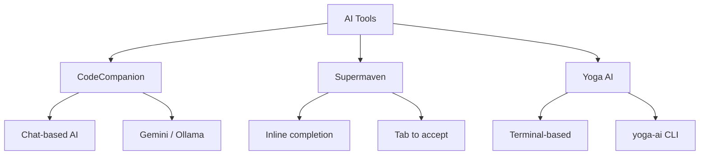

# AI Integration Reference

Complete reference for AI integration in the Yoga Files LazyVim setup, covering CodeCompanion, Supermaven, and yoga-ai CLI.

---

## Table of Contents

- [Overview](#overview)
- [CodeCompanion](#codecompanion)
- [Supermaven](#supermaven)
- [Yoga AI](#yoga-ai)
- [Configuration Guide](#configuration-guide)
- [Provider Comparison](#provider-comparison)
- [Troubleshooting](#troubleshooting)

---

## Overview

The Yoga Files LazyVim configuration includes three distinct AI tools, each serving a different purpose:



| Tool | Type | Trigger | Purpose |
|------|------|---------|---------|
| **CodeCompanion** | Chat + Inline | `<leader>cg/co/cc/ca` | Multi-provider AI conversations and code actions |
| **Supermaven** | Inline completion | Tabs while typing | Real-time code suggestions as you type |
| **Yoga AI** | Terminal | `<leader>ah/af/ac` | CLI-based AI help, fix, and code generation |

---

## CodeCompanion

### Overview

CodeCompanion is a multi-provider AI chat interface for Neovim. It supports switching between Gemini and Ollama backends, performing inline code actions, and managing persistent chat sessions.

**Plugin**: `olimorris/codecompanion.nvim`
**Config file**: `lua/plugins/codecompanion.lua`
**GitHub**: https://github.com/olimorris/codecompanion.nvim

### Configuration

```lua
-- lua/plugins/codecompanion.lua
opts = {
  strategies = {
    chat = { adapter = "gemini" },
    inline = { adapter = "gemini" },
  },
  adapters = {
    ollama = function()
      return require("codecompanion.adapters").extend("ollama", {
        name = "ollama",
        schema = {
          model = { default = "qwen2.5-coder:7b-instruct-q5_K_M" },
        },
      })
    end,
    gemini = function()
      return require("codecompanion.adapters").extend("gemini", {
        name = "gemini",
        schema = {
          model = { default = "gemini-3-pro" },
        },
      })
    end,
  },
}
```

### Keymaps

| Mode | Key | Action | Description |
|------|-----|--------|-------------|
| n, v | `<leader>cg` | `:CodeCompanionChat gemini` | Open chat with Gemini |
| n, v | `<leader>co` | `:CodeCompanionChat ollama` | Open chat with Ollama (Qwen2.5-Coder) |
| n, v | `<leader>cc` | `:CodeCompanionChat Toggle` | Toggle last active chat |
| n, v | `<leader>ca` | `:CodeCompanionActions` | Open actions menu (explain, refactor, etc.) |

### Adapters

#### Gemini (Default)

| Setting | Value |
|---------|-------|
| Name | `gemini` |
| Model | `gemini-3-pro` |
| Usage | Default for both chat and inline |
| API Key | Requires `GEMINI_API_KEY` environment variable |

**Setting the Gemini API key**:

```bash
# Add to ~/.bashrc or ~/.zshrc
export GEMINI_API_KEY="your-api-key-here"
```

Or set it in Neovim:

```lua
vim.env.GEMINI_API_KEY = "your-api-key-here"  -- Not recommended for security
```

#### Ollama

| Setting | Value |
|---------|-------|
| Name | `ollama` |
| Model | `qwen2.5-coder:7b-instruct-q5_K_M` |
| Usage | Secondary provider, invoked with `<leader>co` |
| Requires | Ollama running locally on default port (11434) |

**Setting up Ollama**:

```bash
# Install Ollama
curl -fsSL https://ollama.com/install.sh | sh

# Pull the Qwen2.5-Coder model
ollama pull qwen2.5-coder:7b-instruct-q5_K_M

# Start Ollama (if not running)
ollama serve
```

### Strategies

| Strategy | Description | Default Adapter |
|----------|-------------|----------------|
| `chat` | Interactive chat in a Neovim buffer | `gemini` |
| `inline` | Inline code assistance within the buffer | `gemini` |

### Usage Patterns

#### Chat with Gemini

1. Press `<leader>cg` to open a Gemini chat
2. Type your prompt in the chat buffer
3. Press `<CR>` (Enter) or the configured submit key
4. Gemini responds in the same buffer
5. Use `<leader>cc` to toggle the chat open/closed

#### Chat with Ollama (Local)

1. Press `<leader>co` to open an Ollama chat
2. Type your prompt (responses come from local Qwen2.5-Coder)
3. Use `<leader>cc` to toggle the chat

#### Inline Actions

1. Visually select code (press `V` and select lines)
2. Press `<leader>ca` to open the actions menu
3. Choose an action: explain, refactor, document, test, etc.
4. CodeCompanion applies the result inline

### Dependencies

| Plugin | Purpose |
|--------|---------|
| `nvim-lua/plenary.nvim` | Lua utility functions |
| `nvim-treesitter/nvim-treesitter` | Syntax awareness |
| `nvim-telescope/telescope.nvim` | Picker for actions |

---

## Supermaven

### Overview

Supermaven provides real-time inline AI code completion. It suggests code as you type, similar to GitHub Copilot but using Supermaven's models.

**Plugin**: `supermaven-inc/supermaven-nvim`
**Config file**: `lua/plugins/supermaven.lua`
**GitHub**: https://github.com/supermaven-inc/supermaven-nvim

### Configuration

```lua
-- lua/plugins/supermaven.lua
require("supermaven-nvim").setup({
  keymaps = {
    accept_suggestion = "<Tab>",
    clear_suggestion = "<C-]>",
    accept_word = "<C-j>",
  },
})
```

### Keymaps

| Mode | Key | Action | Description |
|------|-----|--------|-------------|
| i | `<Tab>` | Accept suggestion | Accept the full Supermaven suggestion |
| i | `<C-]>` | Clear suggestion | Dismiss the current suggestion |
| i | `<C-j>` | Accept word | Accept just the next word of the suggestion |

### Usage

1. Start typing in a buffer
2. Supermaven shows ghost text suggestions (grayed out)
3. Press `<Tab>` to accept the full suggestion
4. Press `<C-j>` to accept just the next word
5. Press `<C-]>` to dismiss the suggestion

### Free Tier

Supermaven's free tier provides a generous completion budget. For more advanced features, a Pro subscription is available at https://supermaven.com.

---

## Yoga AI

### Overview

Yoga AI is a terminal-based AI assistant that uses the `yoga-ai` CLI tool. It provides three modes: help, fix, and code — each opening a terminal buffer for AI interaction.

**Plugin**: LazyVim keymaps only (no separate plugin)
**Config file**: `lua/plugins/yoga-ai.lua`
**Requires**: `yoga-ai` CLI in `$PATH`

### Configuration

```lua
-- lua/plugins/yoga-ai.lua
local function yoga_ai(mode)
  local input = vim.fn.input("yoga-ai " .. mode .. ": ")
  if input == nil or input == "" then return end
  local cmd = { "yoga-ai", mode, input }
  vim.fn.termopen(cmd)
end

keys = {
  { "<leader>ah", function() yoga_ai("help") end, desc = "AI Help (yoga-ai)" },
  { "<leader>af", function() yoga_ai("fix") end, desc = "AI Fix (yoga-ai)" },
  { "<leader>ac", function() yoga_ai("code") end, desc = "AI Code (yoga-ai)" },
}
```

### Keymaps

| Mode | Key | Action | Description |
|------|-----|--------|-------------|
| n | `<leader>ah` | `yoga-ai help <input>` | AI Help — prompts for input, opens terminal |
| n | `<leader>af` | `yoga-ai fix <input>` | AI Fix — prompts for input, opens terminal |
| n | `<leader>ac` | `yoga-ai code <input>` | AI Code — prompts for input, opens terminal |

### How It Works

1. Press `<leader>ah`, `<leader>af`, or `<leader>ac`
2. An input prompt appears: `yoga-ai help: ` (or `fix`, `code`)
3. Type your question or prompt and press Enter
4. A terminal buffer opens with `yoga-ai <mode> <input>`
5. The AI response appears in the terminal
6. Press `<Esc><Esc>` or `:q` to close the terminal

### Modes

| Mode | Purpose | Example |
|------|---------|---------|
| `help` | General help and explanation | "how do I git rebase interactively" |
| `fix` | Fix a bug or error | "fix the TypeError on line 42" |
| `code` | Generate code | "write a function to calculate fibonacci" |

### Prerequisites

The `yoga-ai` CLI must be installed and available in your `$PATH`. If it's not found, the terminal will fail to open.

```bash
# Verify yoga-ai is installed
which yoga-ai
yoga-ai --help
```

---

## Configuration Guide

### Changing the Default Provider

To change the default CodeCompanion provider from Gemini to Ollama:

```lua
-- lua/plugins/codecompanion.lua
opts = {
  strategies = {
    chat = { adapter = "ollama" },  -- changed from "gemini"
    inline = { adapter = "ollama" },
  },
}
```

### Changing the Model

#### Gemini Model

```lua
-- lua/plugins/codecompanion.lua
adapters = {
  gemini = function()
    return require("codecompanion.adapters").extend("gemini", {
      schema = {
        model = { default = "gemini-3-pro" },  -- change this
      },
    })
  end,
}
```

Available Gemini models: `gemini-3-pro`, `gemini-2.5-flash`, `gemini-2.0-flash`, etc.

#### Ollama Model

```lua
-- lua/plugins/codecompanion.lua
adapters = {
  ollama = function()
    return require("codecompanion.adapters").extend("ollama", {
      schema = {
        model = { default = "qwen2.5-coder:7b-instruct-q5_K_M" },  -- change this
      },
    })
  end,
}
```

Available models: any model available via `ollama list`. Pull new models with `ollama pull <model-name>`.

### API Keys

| Provider | Environment Variable | Where to Get |
|----------|---------------------|--------------|
| Gemini | `GEMINI_API_KEY` | https://aistudio.google.com/apikey |
| Ollama | None (local) | N/A |
| Supermaven | None (uses account) | https://supermaven.com |

**Setting environment variables**:

```bash
# Add to ~/.bashrc or ~/.zshrc
export GEMINI_API_KEY="your-api-key-here"
```

Or use a `.env` file loaded by your shell or a secrets manager.

### Disabling an AI Plugin

To disable Supermaven (if you prefer only CodeCompanion):

```lua
-- lua/plugins/supermaven.lua
return {
  "supermaven-inc/supermaven-nvim",
  enabled = false,
}
```

To disable CodeCompanion:

```lua
-- lua/plugins/codecompanion.lua
return {
  "olimorris/codecompanion.nvim",
  enabled = false,
}
```

---

## Provider Comparison

| Feature | CodeCompanion (Gemini) | CodeCompanion (Ollama) | Supermaven | Yoga AI |
|---------|----------------------|----------------------|------------|---------|
| **Type** | Chat + inline | Chat + inline | Inline completion | Terminal CLI |
| **Requires API key** | Yes | No | No (free tier) | No |
| **Requires local server** | No | Yes (Ollama) | No | No (needs yoga-ai CLI) |
| **Internet** | Yes | No | Yes | Depends on yoga-ai |
| **Latency** | Medium | Low (local) | Very low | Medium |
| **Privacy** | Cloud | Fully local | Cloud | Depends on provider |
| **Context window** | Large (Gemini) | Limited by model | Inline only | Depends on CLI |

---

## Troubleshooting

### CodeCompanion: "Adapter not found"

1. Check the adapter name: must be `"gemini"` or `"ollama"`
2. Verify the adapter configuration in `lua/plugins/codecompanion.lua`
3. Run `:Lazy sync` to ensure the plugin is up to date

### CodeCompanion: "API key not set" (Gemini)

```bash
# Verify the key is set
echo $GEMINI_API_KEY

# Set it in your shell
export GEMINI_API_KEY="your-key-here"
```

### CodeCompanion: Ollama not responding

1. Check Ollama is running: `curl http://localhost:11434/api/tags`
2. Check the model is pulled: `ollama list`
3. Pull the model if needed: `ollama pull qwen2.5-coder:7b-instruct-q5_K_M`
4. Restart Ollama: `ollama serve`

### Supermaven: Suggestions not appearing

1. Check the plugin is loaded: `:Lazy check supermaven-nvim`
2. Verify the keymaps: `:Telescope keymaps` and search for "supermaven"
3. Check Supermaven status: `:SupermavenStatus`
4. Restart Neovim

### Yoga AI: "yoga-ai: command not found"

1. Check `yoga-ai` is in `$PATH`: `which yoga-ai`
2. If missing, check the Yoga Files installation: `./bin/yoga doctor`
3. Try running directly: `yoga-ai help "test question"`

### CodeCompanion: Chat buffer not opening

1. Check `:messages` for errors
2. Verify dependencies are installed: `:Lazy check codecompanion`
3. Verify plenary.nvim is available: `:lua print(require('plenary').enabled)`

### General: AI keymaps not working

1. Check which-key: `<leader>` then wait for the popup
2. List all keymaps: `:Telescope keymaps` and search for the prefix
3. Check for conflicts: `:verbose map <leader>cg`
4. Restart Neovim after config changes