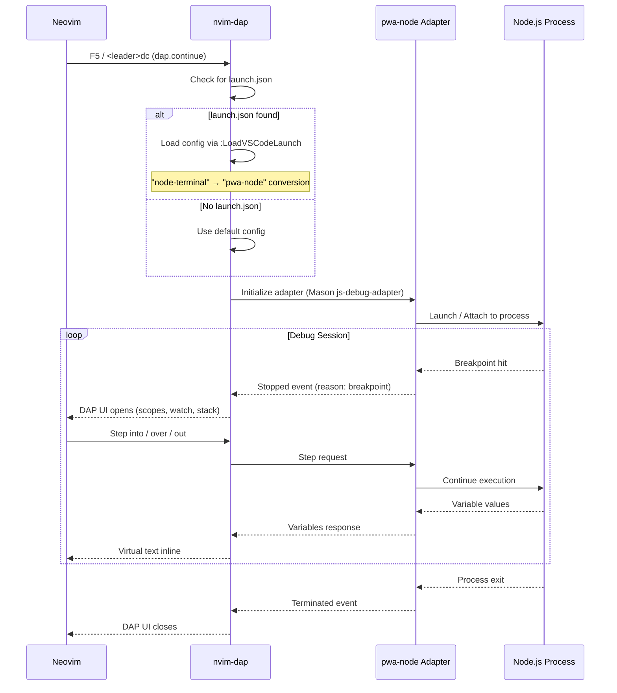

# Debug JavaScript/TypeScript - OBRIGATÓRIO

## 🐛 Configuração Debug JS/TS - MANDATÓRIO

Esta é a configuração **OBRIGATÓRIA** para debugar JavaScript e TypeScript no LazyVim.

## Requisitos

- `js-debug-adapter` instalado via Mason
- nvim-dap configurado com `pwa-node` (não `node2`)
- VS Code launch.json support habilitado



## Instalação

### 1. Instalar js-debug-adapter

No LazyVim:
```
:MasonInstall js-debug-adapter
```

Ou automático (já configurado em `lua/plugins/yoga-js.lua`):
```lua
opts.ensure_installed = {
  "typescript-language-server",
  "biome",
  "js-debug-adapter",  -- ESSENCIAL
}
```

### 2. Configuração DAP

Arquivo: `lua/config/dap-node.lua`

Usa `pwa-node` (moderno), NÃO `node2` (deprecated):

```lua
dap.configurations.javascript = {
  {
    name = "Launch Current File (JS)",
    type = "pwa-node",  -- MODERNO
    request = "launch",
    program = "${file}",
    cwd = "${workspaceFolder}",
    sourceMaps = true,
  },
  {
    name = "Attach to Process",
    type = "pwa-node",
    request = "attach",
    processId = require("dap.utils").pick_process,
    cwd = "${workspaceFolder}",
    sourceMaps = true,
  },
}
```

### 3. VS Code launch.json Support

Estratégia HÍBRIDA (Opção C):
- Auto-detecta `.vscode/launch.json` na raiz
- Se não achar, procura em `src/.vscode/launch.json`
- Converte `"type": "node-terminal"` → `"pwa-node"`

Comandos:
```vim
:LoadVSCodeLaunch              " Carrega launch.json (pergunta se múltiplos)
:LoadVSCodeLaunch <path>      " Carrega específico
```

Atalho: `<leader>dl`

## Uso

### Breakpoints
- `F9` ou `<leader>db` - Toggle breakpoint

### Execução
- `F5` ou `<leader>dc` - Continue/Start debugging
- `<leader>di` - Step into
- `<leader>do` - Step over
- `<leader>dO` - Step out

### UI
- DAP UI abre automaticamente
- Scopes, Watch, Stack trace, Breakpoints

## Troubleshooting

### "js-debug-adapter not found"
Instale: `:MasonInstall js-debug-adapter`

### "Cannot launch program path"
Verifique se `program = "${file}"` está correto

### "Connection refused"
Verifique se nenhum outro debug está rodando na porta 9229

### launch.json não encontrado
Use `:LoadVSCodeLaunch` e selecione manualmente

## Exemplos

### Debug arquivo atual
1. Abra arquivo JS/TS
2. Coloque breakpoint (`F9`)
3. Pressione `F5`
4. Debug ativo!

### Debug com launch.json
1. Crie `.vscode/launch.json`:
```json
{
  "version": "0.2.0",
  "configurations": [
    {
      "type": "node-terminal",
      "request": "launch",
      "name": "Launch Server",
      "command": "npm run dev"
    }
  ]
}
```
2. `:LoadVSCodeLaunch`
3. Selecione configuração
4. `F5` para debugar

