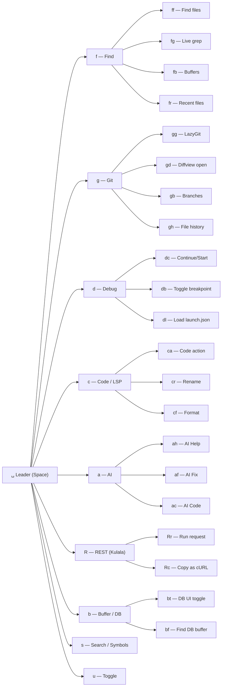

# LazyVim Keymap Reference

Complete keymap reference for the Yoga Files LazyVim configuration. All keymaps are organized by category, with mode (`n` = normal, `i` = insert, `v` = visual), key sequence, action, and description.

> **Leader Key**: `Space` (LazyVim default)

---

## Table of Contents

- [General](#general)
- [LSP](#lsp)
- [Debug (DAP)](#debug-dap)
- [Git](#git)
- [Search (Telescope)](#search-telescope)
- [AI](#ai)
- [HTTP (Kulala)](#http-kulala)
- [Database (Dadbod)](#database-dadbod)
- [Code Navigation (Aerial)](#code-navigation-aerial)
- [Formatting](#formatting)
- [Session (Obsession)](#session-obsession)
- [Terminal](#terminal)



---

## General

These are LazyVim default keymaps, extended by Yoga Files.

| Mode | Key | Action | Description |
|------|-----|--------|-------------|
| n | `<leader>` | Leader prefix | Space is the leader key |
| n | `<leader>bs` | `:w<cr>` | Save buffer |
| n | `<leader>bq` | `:bd<cr>` | Close buffer |
| n | `<leader>bd` | `:bdelete<cr>` | Delete buffer |
| n | `<leader>bb` | Telescope buffers | Switch buffer |
| n | `<leader>bc` | `:bdelete!<cr>` | Close buffer (force) |
| n | `<leader><Tab>` | Buffer next | Next buffer |
| n | `<leader><S-Tab>` | Buffer prev | Previous buffer |
| n | `<leader>qq` | Quit all | Quit all windows |
| n | `<leader>l` | Lazy | Open Lazy.nvim dashboard |
| n | `<leader>L` | LazyVim | Open LazyVim health/info |
| n | `j` | `gj` | Move down (display line) |
| n | `k` | `gk` | Move up (display line) |
| n | `<C-s>` | `:w<cr>` | Save file (Ctrl+S) |
| i | `<C-s>` | `<Esc>:w<cr>` | Save file from insert mode |
| n | `<leader>uf` | Toggle autoformat | Toggle format on save |
| n | `<leader>uw` | Toggle wrap | Toggle word wrap |
| n | `<leader>ul` | Toggle line numbers | Toggle relative line numbers |
| n | `<leader>uc` | Toggle conceal | Toggle conceal level |

---

## LSP

LazyVim default LSP keymaps (active when an LSP server is attached).

| Mode | Key | Action | Description |
|------|-----|--------|-------------|
| n | `gd` | Telescope lsp_definitions | Go to definition |
| n | `gr` | Telescope lsp_references | Find references |
| n | `gD` | Vim lsp buf declaration | Go to declaration |
| n | `gI` | Telescope lsp_implementations | Go to implementation |
| n | `gy` | Telescope lsp_type_definitions | Go to type definition |
| n | `K` | Hover | Show hover documentation |
| n | `gK` | Vim lsp buf signature help | Signature help |
| i | `<C-k>` | Vim lsp buf signature help | Signature help (insert) |
| n | `<leader>ca` | Vim lsp buf code_action | Code action |
| v | `<leader>ca` | Vim lsp buf range_code_action | Range code action |
| n | `<leader>cr` | Vim lsp buf rename | Rename symbol |
| n | `<leader>cf` | Conform format | Format buffer (conform.nvim) |
| n | `<leader>cd` | Telescope lsp_document_diagnostics | Document diagnostics |
| n | `<leader>cw` | Telescope lsp_workspace_diagnostics | Workspace diagnostics |
| n | `<leader>ss` | Telescope lsp_document_symbols | Document symbols |
| n | `<leader>sS` | Telescope lsp_workspace_symbols | Workspace symbols |

> **Note**: `<leader>ca` is overridden by CodeCompanion Actions when CodeCompanion is active. See [AI keymaps](#ai) for CodeCompanion keys.

---

## Debug (DAP)

Debug Adapter Protocol keymaps for JavaScript/TypeScript debugging.

### Custom Keymaps (from `lua/config/keymaps.lua`)

| Mode | Key | Action | Description |
|------|-----|--------|-------------|
| n | `<leader>db` | `dap.toggle_breakpoint()` | Toggle breakpoint |
| n | `<leader>dc` | `dap.continue()` | Continue / Start debugging |
| n | `<leader>di` | `dap.step_into()` | Step into |
| n | `<leader>do` | `dap.step_over()` | Step over |
| n | `<leader>dO` | `dap.step_out()` | Step out |
| n | `<leader>dr` | `dap.repl.open()` | Open REPL |

### VS Code launch.json Integration (from `lua/plugins/dap-vscode.lua`)

| Mode | Key | Action | Description |
|------|-----|--------|-------------|
| n | `<leader>dl` | `:LoadVSCodeLaunch` | Load VS Code launch.json |

### LazyVim Default DAP Keymaps

| Mode | Key | Action | Description |
|------|-----|--------|-------------|
| n | `<leader>dB` | Set conditional breakpoint | Set breakpoint with condition |
| n | `<leader>dC` | Run to cursor | Run to cursor |
| n | `<leader>da` | Debug attach | Attach to process |
| n | `<leader>dd` | Debug start (dap) | Start debugging (no pre-config) |
| n | `<leader>dt` | Debug toggle DAP UI | Toggle DAP UI |

### Functional Keymaps

| Mode | Key | Action | Description |
|------|-----|--------|-------------|
| n | `F5` | `dap.continue()` | Continue / Start debugging |
| n | `F9` | `dap.toggle_breakpoint()` | Toggle breakpoint |

### DAP Commands

| Command | Description |
|---------|-------------|
| `:LoadVSCodeLaunch` | Search for launch.json (root + src/.vscode/) |
| `:LoadVSCodeLaunch <path>` | Load specific launch.json |
| `:DapUIOpen` | Open DAP UI |
| `:DapUIClose` | Close DAP UI |
| `:DapToggleBreakpoint` | Toggle breakpoint (command form) |
| `:DapContinue` | Continue debugging (command form) |

---

## Git

### Custom Keymaps (from `lua/plugins/diffview.lua`)

| Mode | Key | Action | Description |
|------|-----|--------|-------------|
| n | `<leader>gd` | `:DiffviewOpen<cr>` | Open diff view (all changes) |
| n | `<leader>gD` | `:DiffviewClose<cr>` | Close diff view |
| n | `<leader>gh` | `:DiffviewFileHistory %<cr>` | File history for current file |

### Custom Branch Keymap (from `lua/config/keymaps.lua`)

| Mode | Key | Action | Description |
|------|-----|--------|-------------|
| n | `<leader>B` | Echo current git branch | Show git branch in command line (auto-clears after 3s) |

### LazyVim Default Git Keymaps

| Mode | Key | Action | Description |
|------|-----|--------|-------------|
| n | `<leader>gb` | Telescope git branches | Browse git branches |
| n | `<leader>gc` | Telescope git commits | Browse git commits |
| n | `<leader>gg` | LazyGit | Open LazyGit |
| n | `<leader>gG` | LazyGit (cwd) | Open LazyGit in current directory |
| n | `<leader>gl` | Git log (file) | Git log for current file |
| n | `<leader>gp` | Git preview hunk | Preview hunk |
| n | `<leader>gr` | Git reset hunk | Reset hunk |
| n | `<leader>gR` | Git reset buffer | Reset buffer |
| n | `<leader>gs` | Git stage hunk | Stage hunk |
| n | `<leader>gS` | Git stage buffer | Stage entire buffer |
| n | `<leader>gu` | Git undo stage | Undo stage hunk |
| n | `<leader>gw` | Git stage hunk (word) | Stage hunk (word diff) |

### Diffview Commands

| Command | Description |
|---------|-------------|
| `:DiffviewOpen` | Open diff view for all changes |
| `:DiffviewClose` | Close diff view |
| `:DiffviewFileHistory %` | Show file history for current file |
| `:DiffviewFileHistory` | Show file history (pick file) |
| `:DiffviewRefresh` | Refresh diff view |

---

## Search (Telescope)

### Custom Telescope Configuration (from `lua/plugins/telescope.lua`)

Telescope is configured to **include hidden files** (dotfiles) and **exclude `.git/`** directories in both find_files and live_grep.

### LazyVim Default Telescope Keymaps

| Mode | Key | Action | Description |
|------|-----|--------|-------------|
| n | `<leader>ff` | Telescope find_files | Find files (includes dotfiles) |
| n | `<leader>fF` | Telescope find_files (hidden=false) | Find files (no dotfiles) |
| n | `<leader>fg` | Telescope live_grep | Live grep (includes hidden) |
| n | `<leader>fG` | Telescope live_grep (hidden=false) | Live grep (no dotfiles) |
| n | `<leader>fb` | Telescope buffers | Find buffer |
| n | `<leader>fB` | Telescope buffers (all) | Find buffer (sort by last used) |
| n | `<leader>fr` | Telescope oldfiles | Recent files |
| n | `<leader>fR` | Telescope oldfiles (cwd) | Recent files in cwd |
| n | `<leader>fc` | Telescope commands | Vim commands |
| n | `<leader>fC` | Telescope command history | Command history |
| n | `<leader>fh` | Telescope help_tags | Help tags |
| n | `<leader>fk` | Telescope keymaps | List keymaps |
| n | `<leader>fM` | Telescope man_pages | Man pages |
| n | `<leader>fm` | Telescope marks | Marks |
| n | `<leader>fo` | Telescope vim_options | Vim options |
| n | `<leader>fq` | Telescope quickfix | Quickfix list |
| n | `<leader>f:`, `<leader>f;` | Telescope command_history | Command history |
| n | `<leader>fa` | Telescope autocommands | Autocommands |
| n | `<leader>fd` | Telescope diagnostics | Document diagnostics |
| n | `<leader>fD` | Telescope diagnostics (all) | All diagnostics |
| n | `<leader>ft` | Telescope colorscheme | Colorschemes |
| n | `<leader>fp` | Telescope resume | Resume last picker |
| n | `<leader>/` | Telescope live_grep | Live grep (shortcut) |
| n | `<leader><space>` | Telescope find_files | Find files (shortcut) |

### Telescope Configuration Details

The Yoga Files configuration modifies Telescope defaults:

```lua
-- Find files: includes hidden files, excludes .git/
opts.pickers.find_files = {
  hidden = true,
  file_ignore_patterns = { ".git/" },
}

-- Live grep: includes hidden files, excludes .git/
opts.defaults.vimgrep_arguments = {
  "rg", "--color=never", "--no-heading", "--with-filename",
  "--line-number", "--column", "--smart-case",
  "--hidden", "--glob", "!**/.git/*",
}
```

---

## AI

### CodeCompanion Keymaps (from `lua/config/keymaps.lua`)

| Mode | Key | Action | Description |
|------|-----|--------|-------------|
| n, v | `<leader>cg` | `:CodeCompanionChat gemini<cr>` | Open chat with Gemini |
| n, v | `<leader>co` | `:CodeCompanionChat ollama<cr>` | Open chat with Ollama (Qwen2.5-Coder) |
| n, v | `<leader>cc` | `:CodeCompanionChat Toggle<cr>` | Toggle last active chat |
| n, v | `<leader>ca` | `:CodeCompanionActions<cr>` | Open CodeCompanion actions menu |

> **Note**: `<leader>ca` overlaps with LazyVim's `code_action` LSP keymap. CodeCompanion takes priority when its plugin is loaded.

### Supermaven Keymaps (from `lua/plugins/supermaven.lua`)

| Mode | Key | Action | Description |
|------|-----|--------|-------------|
| i | `<Tab>` | Accept suggestion | Accept full Supermaven suggestion |
| i | `<C-]>` | Clear suggestion | Dismiss current suggestion |
| i | `<C-j>` | Accept word | Accept one word of the suggestion |

### Yoga AI Keymaps (from `lua/plugins/yoga-ai.lua`)

| Mode | Key | Action | Description |
|------|-----|--------|-------------|
| n | `<leader>ah` | `yoga-ai help <input>` | AI Help (opens terminal with yoga-ai help) |
| n | `<leader>af` | `yoga-ai fix <input>` | AI Fix (opens terminal with yoga-ai fix) |
| n | `<leader>ac` | `yoga-ai code <input>` | AI Code (opens terminal with yoga-ai code) |

All Yoga AI keymaps prompt for input via `vim.fn.input()` and execute in a terminal via `vim.fn.termopen()`.

### LazyVim Default AI Keymaps

| Mode | Key | Action | Description |
|------|-----|--------|-------------|
| n | `<leader>cp` | Copilot suggestions | GitHub Copilot panel (if enabled) |

---

## HTTP (Kulala)

### Custom Keymaps (from `lua/config/keymaps.lua`)

| Mode | Key | Action | Description |
|------|-----|--------|-------------|
| n | `<leader>Rr` | `require('kulala').run()` | Run current HTTP request |
| n | `<leader>Ra` | `require('kulala').run_all()` | Run all requests in buffer |
| n | `<leader>Rb` | `require('kulala').scratchpad()` | Open HTTP scratchpad |
| n | `<leader>Rc` | `require('kulala').copy()` | Copy request as cURL |
| n | `<leader>RC` | `require('kulala').from_curl()` | Paste cURL as HTTP request |
| n | `<leader>Ri` | `require('kulala').inspect()` | Inspect HTTP request |
| n | `<leader>Kh` | `require('kulala_cheatsheet').open()` | Open Kulala cheatsheet |

### Kulala Configuration

| Setting | Value | Description |
|---------|-------|-------------|
| `global_keymaps` | `true` | Enable global keymaps |
| `global_keymaps_prefix` | `<leader>R` | Prefix for all Kulala keymaps |
| `default_env` | `"dev"` | Default environment |
| `vscode_rest_client_environmentvars` | `true` | Import env from VS Code rest-client |
| `request_timeout` | `nil` | No timeout (wait indefinitely) |
| `infer_content_type` | `true` | Auto-detect content type |

### Kulala Commands

| Command | Description |
|---------|-------------|
| `:lua require('kulala').run()` | Run current request |
| `:lua require('kulala').run_all()` | Run all requests in buffer |
| `:lua require('kulala').scratchpad()` | Open scratchpad |
| `:lua require('kulala').copy()` | Copy as cURL |
| `:lua require('kulala').from_curl()` | Paste from cURL |
| `:lua require('kulala').inspect()` | Inspect request |
| `:lua require('kulala').env_select()` | Select environment (dev/stage/prod) |
| `:lua require('kulala').response_show()` | Show last response |

---

## Database (Dadbod)

### Keymaps (from `lua/plugins/dadbod.lua`)

| Mode | Key | Action | Description |
|------|-----|--------|-------------|
| n | `<leader>bt` | `:DBUIToggle<cr>` | Toggle Database UI |
| n | `<leader>bf` | `:DBUIFindBuffer<cr>` | Find database buffer |
| n | `<leader>bl` | `:DBUILastQueryInfo<cr>` | Last query info |

### Dadbod Configuration

| Setting | Value | Description |
|---------|-------|-------------|
| `db_ui_use_nerd_fonts` | `1` | Use Nerd Font icons |
| `db_ui_show_database_icon` | `1` | Show database icon |

### Connection Management

Connections are defined in `lua/plugins/dadbod.lua` as a `connections` table. Each connection requires:

| Field | Description |
|-------|-------------|
| `name` | Display name in DB UI |
| `user` | Database username |
| `pass` | Database password |
| `host` | Database host |
| `port` | Database port |
| `db` | Database name |

> **Security Warning**: The default configuration contains hardcoded credentials. Move credentials to environment variables (`$DB_USER`, `$DB_PASS`, etc.) before committing to shared repositories.

### Dadbod Commands

| Command | Description |
|---------|-------------|
| `:DBUI` | Open Database UI |
| `:DBUIToggle` | Toggle Database UI |
| `:DBUIFindBuffer` | Find active DB buffer |
| `:DBUILastQueryInfo` | Show last query info |
| `:DBUIAddConnection` | Add new connection interactively |

---

## Code Navigation (Aerial)

### Keymaps (from `lua/plugins/aerial.lua`)

| Mode | Key | Action | Description |
|------|-----|--------|-------------|
| n | `<leader>cs` | `:AerialToggle!<cr>` | Toggle code outline sidebar |
| n | `<leader>ca` | `:AerialNavToggle<cr>` | Toggle floating navigation |
| n | `[[` | `:AerialPrev<cr>` | Previous symbol (buffer-local) |
| n | `]]` | `:AerialNext<cr>` | Next symbol (buffer-local) |

> **Note**: `<leader>cs` overrides LazyVim's default which uses `<leader>cs` for `telescope lsp_document_symbols`. Aerial provides an enhanced outline view.

### Aerial Configuration

| Setting | Value | Description |
|---------|-------|-------------|
| `backends` | `treesitter, lsp, markdown, man` | Backend priority order |
| `layout.min_width` | `28` | Minimum sidebar width |
| `layout.default_direction` | `"right"` | Open sidebar to the right |
| `layout.placement` | `"window"` | Place in window (not editor) |
| `show_guides` | `true` | Show guide markers |
| `filter_kind` | `false` | Show all symbol kinds |

---

## Formatting

### Keymaps

| Mode | Key | Action | Description |
|------|-----|--------|-------------|
| n | `<leader>cf` | Conform format | Format current buffer |
| n | `<leader>uf` | Toggle autoformat | Toggle format-on-save |
| v | `<leader>cf` | Conform format (range) | Format selection |

### Formatters by Filetype

| Filetype | Formatter(s) | Source |
|----------|-------------|--------|
| `javascript` | `biome`, `prettier` | `yoga-js.lua` + `formatting.lua` |
| `typescript` | `biome`, `prettier` | `yoga-js.lua` + `formatting.lua` |
| `javascriptreact` | `biome`, `prettier` | `yoga-js.lua` + `formatting.lua` |
| `typescriptreact` | `biome`, `prettier` | `yoga-js.lua` + `formatting.lua` |
| `json` | `biome`, `prettier` | `yoga-js.lua` + `formatting.lua` |
| `html` | `prettier` | `formatting.lua` |

> **Note**: `yoga-js.lua` sets `biome` as the formatter for JS/TS/JSX/TSX/JSON. `formatting.lua` adds `prettier` as an additional formatter for the same filetypes plus HTML. Conform.nvim will use the first available formatter in the list.

### Auto-Format

Global option `vim.g.autoformat = true` is set in `lua/config/options.lua`, which enables format-on-save by default.

---

## Session (Obsession)

### Keymaps

| Mode | Key | Action | Description |
|------|-----|--------|-------------|
| n | `:Obsess` | Start session recording | Start tracking session |
| n | `:Obsess!` | Stop session recording | Stop tracking session |
| n | `:SaveSession` | Save session | Explicitly save current session |

### Configuration

vim-obsession is loaded on `VeryLazy` event. It automatically saves session state to `Session.vim` in the current directory.

---

## Terminal

LazyVim provides terminal keymaps:

| Mode | Key | Action | Description |
|------|-----|--------|-------------|
| n | `<leader>ft` | `:terminal<cr>` | Open terminal |
| n | `<C-/>` | Toggle terminal | Toggle floating terminal |
| t | `<Esc><Esc>` | Exit terminal mode | Double Esc to exit terminal |
| n | `<leader>fT` | Terminal (cwd) | Open terminal in current directory |

### Yoga AI Terminal Keymaps

The `yoga-ai` plugin opens a terminal for AI commands. These run in terminal mode and accept the user's typed input via `vim.fn.input()`.

---

## Keymap Conflict Summary

| Key | LazyVim Default | Custom Override | Winner |
|-----|----------------|----------------|--------|
| `<leader>ca` | LSP code_action | CodeCompanion Actions | CodeCompanion (when loaded) |
| `<leader>cs` | Telescope lsp_document_symbols | Aerial code outline | Aerial |
| `<leader>R*` | None (reserved) | Kulala keymaps | Kulala |
| `<leader>B` | None | Git branch display | Custom |
| `<leader>d*` | DAP keymaps | DAP keymaps (extended) | Custom (compatible) |
| `<leader>g*` | Git keymaps | Diffview (gd, gD, gh) | Coexist (different keys) |