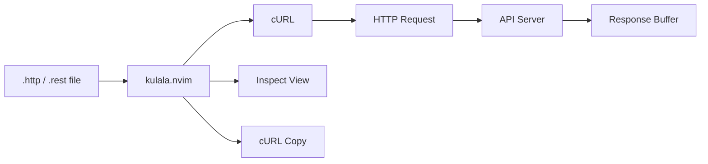

# Kulala HTTP REST Client Reference

Complete reference for the kulala.nvim HTTP REST client integration in the Yoga Files LazyVim setup.

---

## Table of Contents

- [Overview](#overview)
- [Plugin Configuration](#plugin-configuration)
- [Keymaps](#keymaps)
- [Cheatsheet](#cheatsheet)
- [File Format](#file-format)
- [Usage Examples](#usage-examples)
- [Environments](#environments)
- [Advanced Features](#advanced-features)
- [Troubleshooting](#troubleshooting)

---

## Overview

Kulala is a REST client for Neovim that lets you write and execute HTTP requests directly in `.http` or `.rest` files, similar to VS Code's REST Client extension.

**Plugin**: `mistweaverco/kulala.nvim`
**Config file**: `lua/plugins/kulala.lua`
**GitHub**: https://github.com/mistweaverco/kulala.nvim
**File types**: `http`, `rest`



### Why Kulala?

| Feature | Kulala | curl (CLI) | Postman |
|---------|--------|-----------|---------|
| Edit in editor | Yes | No | Limited |
| Version control | Yes (.http files) | No | Import/export |
| Environment variables | Yes | Manual | Yes |
| cURL conversion | Yes | N/A | Yes |
| Scratchpad | Yes | No | No |
| Neovim integration | Native | External | None |

---

## Plugin Configuration

```lua
-- lua/plugins/kulala.lua
return {
  "mistweaverco/kulala.nvim",
  ft = { "http", "rest" },
  dependencies = { "nvim-lua/plenary.nvim" },
  opts = {
    global_keymaps = true,
    global_keymaps_prefix = "<leader>R",
    default_env = "dev",
    vscode_rest_client_environmentvars = true,
    request_timeout = nil,
    infer_content_type = true,
  },
}
```

### Configuration Options

| Setting | Value | Description |
|---------|-------|-------------|
| `global_keymaps` | `true` | Register keymaps globally (not just in http/rest buffers) |
| `global_keymaps_prefix` | `"<leader>R"` | Prefix for all Kulala keymaps |
| `default_env` | `"dev"` | Default environment for variable substitution |
| `vscode_rest_client_environmentvars` | `true` | Import environment variables from VS Code REST Client format |
| `request_timeout` | `nil` | No timeout (wait indefinitely for responses) |
| `infer_content_type` | `true` | Automatically infer Content-Type from request body |

### Lazy Loading

Kulala is lazy-loaded on filetype. It only activates when you open a `.http` or `.rest` file, or when you use `<leader>Rb` (scratchpad).

---

## Keymaps

### Core Keymaps (from `lua/config/keymaps.lua`)

| Mode | Key | Action | Description |
|------|-----|--------|-------------|
| n | `<leader>Rr` | `require('kulala').run()` | Run the current HTTP request under cursor |
| n | `<leader>Ra` | `require('kulala').run_all()` | Run all requests in the current buffer |
| n | `<leader>Rb` | `require('kulala').scratchpad()` | Open HTTP scratchpad |
| n | `<leader>Rc` | `require('kulala').copy()` | Copy current request as cURL command |
| n | `<leader>RC` | `require('kulala').from_curl()` | Paste a cURL command as an HTTP request |
| n | `<leader>Ri` | `require('kulala').inspect()` | Inspect the current request details |
| n | `<leader>Kh` | `require('kulala_cheatsheet').open()` | Open interactive Kulala cheatsheet |

### Additional Commands (not bound to keys)

| Command | Description |
|---------|-------------|
| `:lua require('kulala').env_select()` | Select environment (dev/staging/prod) |
| `:lua require('kulala').response_show()` | Show last response |
| `:lua require('kulala').set_env(env_name, value)` | Set environment variable |

---

## Cheatsheet

Press `<leader>Kh` to open an interactive cheatsheet with all keymaps and tips. This opens a floating window. Press `q` to close it.

The cheatsheet is defined in `lua/kulala_cheatsheet.lua` and provides a quick reference for:

- Execution keymaps (`<leader>Rr`, `<leader>Ra`, etc.)
- Environment selection
- Response handling
- Advanced tips (`@name`, variables, cURL export)

---

## File Format

Kulala supports `.http` and `.rest` file extensions. Both use the same format.

### Basic Syntax

```http
METHOD URL
Header: Value
Header: Value

Body
```

### Request Separator

Multiple requests in one file are separated by `###`:

```http
GET https://api.example.com/users

###

POST https://api.example.com/users
Content-Type: application/json

{
  "name": "John"
}
```

### Named Requests

Use `# @name` to label requests for `run_all()`:

```http
# @name ListUsers
GET https://api.example.com/users

###

# @name CreateUser
POST https://api.example.com/users
Content-Type: application/json

{
  "name": "John"
}
```

### Comments

Lines starting with `#` are comments (except `# @name`):

```http
# This is a comment
GET https://api.example.com/users
```

---

## Usage Examples

### GET Request

```http
GET https://api.example.com/users
Accept: application/json
```

### GET with Query Parameters

```http
GET https://api.example.com/users?page=1&limit=10
Accept: application/json
```

### POST with JSON Body

```http
POST https://api.example.com/users
Content-Type: application/json
Authorization: Bearer {{TOKEN}}

{
  "name": "John Doe",
  "email": "john@example.com",
  "role": "admin"
}
```

### PUT Request

```http
PUT https://api.example.com/users/1
Content-Type: application/json
Authorization: Bearer {{TOKEN}}

{
  "name": "Jane Doe",
  "email": "jane@example.com"
}
```

### DELETE Request

```http
DELETE https://api.example.com/users/1
Authorization: Bearer {{TOKEN}}
```

### PATCH Request

```http
PATCH https://api.example.com/users/1
Content-Type: application/json

{
  "role": "moderator"
}
```

### POST with Form Data

```http
POST https://api.example.com/login
Content-Type: application/x-www-form-urlencoded

username=admin&password=secret123
```

### POST with File Upload

```http
POST https://api.example.com/upload
Content-Type: multipart/form-data; boundary=----WebKitFormBoundary

------WebKitFormBoundary
Content-Disposition: form-data; name="file"; filename="data.csv"
Content-Type: text/csv

< ./data.csv
------WebKitFormBoundary--
```

### Request with Custom Headers

```http
GET https://api.example.com/protected
Authorization: Bearer {{TOKEN}}
X-Custom-Header: custom-value
Accept: application/json
Cache-Control: no-cache
```

---

## Environments

### Environment Files

Kulala supports environment variables defined in `http-client.env.json` files:

```json
{
  "dev": {
    "BASE_URL": "http://localhost:3000",
    "TOKEN": "dev-token-123"
  },
  "staging": {
    "BASE_URL": "https://staging-api.example.com",
    "TOKEN": "staging-token-456"
  },
  "prod": {
    "BASE_URL": "https://api.example.com",
    "TOKEN": "prod-token-789"
  }
}
```

Place this file in your project root.

### Using Variables in Requests

```http
GET {{BASE_URL}}/users
Authorization: Bearer {{TOKEN}}
```

### Selecting an Environment

1. Press `<leader>Ri` to inspect the current environment
2. Or run: `:lua require('kulala').env_select()`
3. Choose from `dev`, `staging`, or `prod`

The default environment is `dev` (set in `kulala.lua`).

### VS Code REST Client Environment Variables

The configuration enables `vscode_rest_client_environmentvars = true`, which means Kulala reads variables from VS Code REST Client's `http-client.env.json` format. This provides compatibility if you share `.http` files with team members using VS Code.

---

## Advanced Features

### Copy as cURL

Press `<leader>Rc` to copy the current request as a cURL command. This is useful for:

- Sharing requests with team members
- Debugging in the terminal
- Integrating with CI/CD pipelines

Example output:

```bash
curl -X GET 'https://api.example.com/users' \
  -H 'Accept: application/json' \
  -H 'Authorization: Bearer dev-token-123'
```

### Paste from cURL

Press `<leader>RC` to paste a cURL command and convert it to an HTTP request:

1. Copy a cURL command to clipboard
2. Open a `.http` file
3. Press `<leader>RC`
4. The request is converted and inserted

Example input:

```bash
curl -X POST 'https://api.example.com/users' -H 'Content-Type: application/json' -d '{"name":"John"}'
```

Converts to:

```http
POST https://api.example.com/users
Content-Type: application/json

{"name":"John"}
```

### Inspect Request

Press `<leader>Ri` to inspect the current request details, including:

- URL after variable substitution
- Headers
- Body
- Selected environment
- Response status and headers

### Scratchpad

Press `<leader>Rb` to open a scratchpad buffer. This is a temporary `.http` buffer where you can prototype requests without creating a file.

- The scratchpad is not saved to disk
- Use it for quick API testing
- Close with `:bd` or `:q`

### Run All Requests

Press `<leader>Ra` to run all requests in the current buffer sequentially. This respects the `# @name` labels and executes requests in order.

### Request Timeout

The configuration sets `request_timeout = nil`, meaning requests wait indefinitely. To add a timeout:

```lua
-- lua/plugins/kulala.lua
opts = {
  request_timeout = 30000,  -- 30 seconds in milliseconds
}
```

---

## Creating .http Files

### Recommended Project Structure

```
project/
├── http-client.env.json        # Environment variables
├── requests/
│   ├── auth.http                # Authentication endpoints
│   ├── users.http               # User CRUD endpoints
│   ├── orders.http              # Order endpoints
│   └── admin.http               # Admin-only endpoints
└── README.md
```

### Example: Complete API Test File

```http
# @name HealthCheck
GET {{BASE_URL}}/health
Accept: application/json

###

# @name Login
POST {{BASE_URL}}/auth/login
Content-Type: application/json

{
  "email": "{{TEST_USER}}",
  "password": "{{TEST_PASS}}"
}

###

# @name ListUsers
GET {{BASE_URL}}/users
Authorization: Bearer {{TOKEN}}
Accept: application/json

###

# @name CreateUser
POST {{BASE_URL}}/users
Authorization: Bearer {{TOKEN}}
Content-Type: application/json

{
  "name": "Test User",
  "email": "test@example.com"
}

###

# @name DeleteUser
DELETE {{BASE_URL}}/users/{{USER_ID}}
Authorization: Bearer {{TOKEN}}
```

With `http-client.env.json`:

```json
{
  "dev": {
    "BASE_URL": "http://localhost:3000",
    "TEST_USER": "admin@example.com",
    "TEST_PASS": "password123",
    "TOKEN": "dev-jwt-token"
  }
}
```

---

## Troubleshooting

### "Kulala keymaps not working"

1. Ensure you're in a `.http` or `.rest` file, or that `global_keymaps = true`
2. Check the filetype: `:set filetype?`
3. Verify kulala is loaded: `:Lazy check kulala`
4. Try `<leader>Rb` (scratchpad) to force-load the plugin

### "Request not executing"

1. Check that the URL is valid and includes the scheme (`http://` or `https://`)
2. Verify the request is formatted correctly (METHOD on first line, no leading spaces)
3. Check for variable substitution errors: `{{VARIABLE}}` must be defined in `http-client.env.json`
4. Try a simple GET request first:

```http
GET https://httpbin.org/get
```

### "cURL not found"

Kulala depends on `curl` being available:

```bash
which curl
curl --version
```

Install curl if missing:

```bash
# Ubuntu/Debian
sudo apt install curl

# macOS (usually pre-installed)
brew install curl
```

### "Environment variables not substituted"

1. Check `http-client.env.json` is in the project root
2. Verify the JSON is valid: `!jq . http-client.env.json`
3. Check the environment name matches: default is `dev`
4. Try `:lua require('kulala').env_select()` to manually select

### "Response body not showing"

1. Check `infer_content_type = true` is set (enabled by default)
2. Verify the response Content-Type is supported (JSON, XML, HTML)
3. Try `:lua require('kulala').response_show()` to manually show the response
4. Check `request_timeout` — if set too low, the request may time out before the response arrives

### "Cannot paste from cURL"

1. Copy the cURL command to your clipboard first
2. Make sure you're in a `.http` or `.rest` file
3. Press `<leader>RC` (capital C, not lowercase c)
4. The cURL command must be on your system clipboard

### "JSON formatting issues"

1. Install `jq` for JSON formatting: `brew install jq` or `sudo apt install jq`
2. Kulala uses `jq` to format JSON responses
3. Verify: `!jq --version`