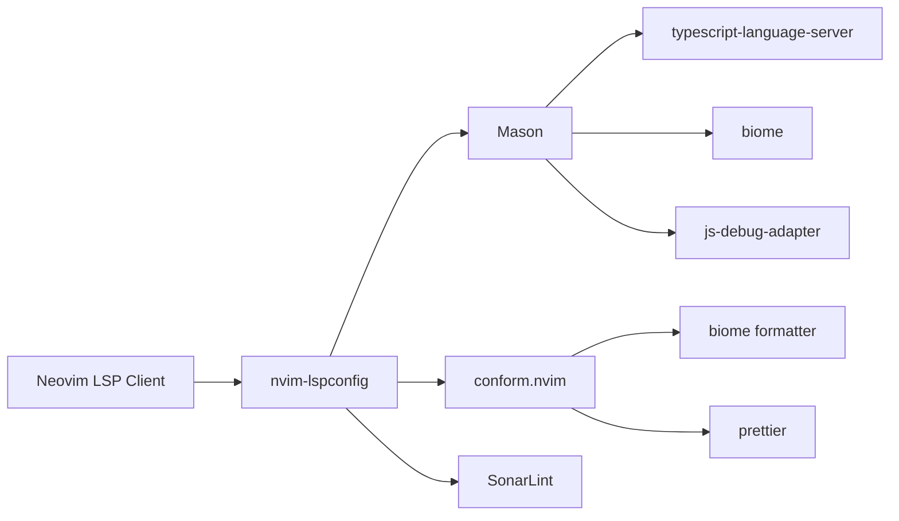

# LSP Configuration Reference

Complete reference for Language Server Protocol (LSP) configuration in the Yoga Files LazyVim setup, including Mason, conform.nvim, DAP adapters, and troubleshooting.

---

## Table of Contents

- [Overview](#overview)
- [LSP Servers](#lsp-servers)
- [Mason Configuration](#mason-configuration)
- [conform.nvim (Formatter)](#conformnvim-formatter)
- [Linting (SonarLint)](#linting-sonarlint)
- [Adding New LSP Servers](#adding-new-lsp-servers)
- [Adding New Mason Packages](#adding-new-mason-packages)
- [LSP Keymaps](#lsp-keymaps)
- [Debug Adapter (DAP)](#debug-adapter-dap)
- [Troubleshooting](#troubleshooting)

---

## Overview

The Yoga Files LazyVim setup uses a layered LSP architecture:



**Layer responsibilities**:

| Layer | Role | Config File |
|-------|------|-------------|
| `nvim-lspconfig` | LSP client configuration, server setup | LazyVim defaults |
| `mason.nvim` | Package installation (LSP, DAP, linters, formatters) | `lua/plugins/yoga-js.lua` |
| `conform.nvim` | Format on save, multi-formatter support | `lua/plugins/yoga-js.lua` + `lua/plugins/formatting.lua` |
| `sonarlint.nvim` | Static analysis linting | `lua/plugins/sonarlint.lua` |

---

## LSP Servers

### Configured LSP Servers

| Server | File Types | Source | Mason Auto-Install |
|--------|-----------|--------|-------------------|
| `ts_ls` (typescript-language-server) | JS, TS, JSX, TSX | LazyVim + Mason | Yes |
| `biome` | JS, TS, JSX, TSX, JSON | Mason (formatter/linter) | Yes |

### How Servers Are Installed

LazyVim auto-installs LSP servers configured in `opts.servers` via Mason. The `yoga-js.lua` plugin extends this:

```lua
-- lua/plugins/yoga-js.lua
{
  "mason-org/mason.nvim",
  opts = function(_, opts)
    opts.ensure_installed = opts.ensure_installed or {}
    vim.list_extend(opts.ensure_installed, {
      "typescript-language-server",
      "biome",
    })
  end,
}
```

Mason installs these packages to `~/.local/share/nvim/mason/`.

---

## Mason Configuration

### Mason Package List

| Package | Type | Auto-Install | Purpose |
|---------|------|-------------|---------|
| `typescript-language-server` | LSP | Yes (via yoga-js.lua) | TypeScript/JavaScript language server |
| `biome` | Formatter/Linter | Yes (via yoga-js.lua) | JS/TS/JSON formatter and linter |
| `js-debug-adapter` | DAP | No (install manually) | JavaScript debug adapter |

> **Note**: `js-debug-adapter` is referenced by `dap-vscode.lua` via its Mason path but is NOT in the `ensure_installed` list. Install it manually with `:MasonInstall js-debug-adapter`.

### Mason Commands

| Command | Description |
|---------|-------------|
| `:Mason` | Open Mason UI |
| `:MasonInstall <package>` | Install a package |
| `:MasonUninstall <package>` | Uninstall a package |
| `:MasonUpdate` | Update all installed packages |
| `:MasonLog` | View Mason logs |
| `:MasonClean` | Clean unused packages |

### Mason Installation Paths

All Mason packages are installed to:

```
~/.local/share/nvim/mason/packages/<package-name>/
```

The DAP adapter specifically references:

```
~/.local/share/nvim/mason/packages/js-debug-adapter/
```

---

## conform.nvim (Formatter)

### Configuration

Conform.nvim is configured in two files that merge their settings:

**`lua/plugins/yoga-js.lua`** (primary):

```lua
opts.formatters_by_ft = {
  javascript = { "biome" },
  javascriptreact = { "biome" },
  typescript = { "biome" },
  typescriptreact = { "biome" },
  json = { "biome" },
}
```

**`lua/plugins/formatting.lua`** (additional):

```lua
opts.formatters_by_ft = {
  javascript = { "prettier" },
  typescript = { "prettier" },
  javascriptreact = { "prettier" },
  typescriptreact = { "prettier" },
  html = { "prettier" },
  json = { "prettier" },
}
```

### Merged Formatter Configuration

| Filetype | Formatters (in order) | Primary |
|----------|----------------------|---------|
| `javascript` | `biome`, `prettier` | biome |
| `typescript` | `biome`, `prettier` | biome |
| `javascriptreact` | `biome`, `prettier` | biome |
| `typescriptreact` | `biome`, `prettier` | biome |
| `json` | `biome`, `prettier` | biome |
| `html` | `prettier` | prettier |

**How it works**: When multiple formatters are listed for a filetype, conform.nvim runs them sequentially. The first available formatter in the list is the primary. If `biome` is not available, `prettier` is used as fallback.

### Format on Save

Auto-formatting is enabled globally:

```lua
-- lua/config/options.lua
vim.g.autoformat = true
```

Toggle format-on-save with `<leader>uf` or format manually with `<leader>cf`.

### Adding a New Formatter

Edit `lua/plugins/formatting.lua` or create a new file:

```lua
-- lua/plugins/formatting.lua (append)
return {
  "stevearc/conform.nvim",
  opts = {
    formatters_by_ft = {
      python = { "black" },
      go = { "gofmt" },
    },
  },
}
```

Then install the formatter via Mason: `:MasonInstall black`

---

## Linting (SonarLint)

### Configuration

SonarLint is configured in `lua/plugins/sonarlint.lua`:

| Setting | Value |
|---------|-------|
| File types | `typescript`, `javascript`, `dockerfile` |
| Server command | `sonarlint-language-server -stdio` |
| Analyzers | `sonarts.jar`, `sonarjs.jar`, `sonariac.jar` |

SonarLint analyzers are loaded from Mason's shared directory:

```
~/.local/share/nvim/mason/share/sonarlint-analyzers/
```

### Installing SonarLint

```vim
:MasonInstall sonarlint-language-server
```

> **Note**: SonarLint is not in the `ensure_installed` list for Mason. Install it manually.

---

## Adding New LSP Servers

### Method 1: Extend Mason ensure_installed

Edit `lua/plugins/yoga-js.lua`:

```lua
vim.list_extend(opts.ensure_installed, {
  "typescript-language-server",
  "biome",
  "lua-language-server",  -- add new server
  "pyright",               -- add Python server
})
```

### Method 2: Create a new plugin file

Create `lua/plugins/lsp-extras.lua`:

```lua
return {
  {
    "neovim/nvim-lspconfig",
    opts = {
      servers = {
        pyright = {},    -- Python
        gopls = {},      -- Go
        rust_analyzer = {}, -- Rust
      },
    },
  },
}
```

This will auto-configure the servers via LazyVim's LSP setup and install them through Mason.

### Method 3: Manual Mason install

For one-off use:

```vim
:MasonInstall <server-name>
```

Then configure manually in a plugin file.

---

## Adding New Mason Packages

### Current ensure_installed List

```lua
-- lua/plugins/yoga-js.lua
opts.ensure_installed = {
  "typescript-language-server",
  "biome",
}
```

### Extending the List

Edit `lua/plugins/yoga-js.lua` and add to the `vim.list_extend` call:

```lua
vim.list_extend(opts.ensure_installed, {
  "typescript-language-server",
  "biome",
  "js-debug-adapter",     -- DAP adapter
  "stylua",                -- Lua formatter
  "shellcheck",            -- Shell linter
})
```

### Mason Package Categories

| Category | Example Packages | Config File |
|----------|-----------------|-------------|
| LSP servers | `typescript-language-server`, `biome`, `pyright` | `lua/plugins/yoga-js.lua` |
| DAP adapters | `js-debug-adapter` | `lua/plugins/dap-vscode.lua` |
| Formatters | `biome`, `prettier`, `stylua` | `lua/plugins/formatting.lua` |
| Linters | `biome`, `shellcheck` | Various |

---

## LSP Keymaps

### LazyVim Default LSP Keymaps

These keymaps are active when an LSP server is attached to the current buffer:

| Mode | Key | Action | Description |
|------|-----|--------|-------------|
| n | `gd` | `:Telescope lsp_definitions` | Go to definition |
| n | `gr` | `:Telescope lsp_references` | Find references |
| n | `gD` | `:lua vim.lsp.buf.declaration()` | Go to declaration |
| n | `gI` | `:Telescope lsp_implementations` | Go to implementation |
| n | `gy` | `:Telescope lsp_type_definitions` | Go to type definition |
| n | `K` | `:lua vim.lsp.buf.hover()` | Hover documentation |
| n | `gK` | `:lua vim.lsp.buf.signature_help()` | Signature help |
| i | `<C-k>` | `:lua vim.lsp.buf.signature_help()` | Signature help (insert) |
| n | `<leader>ca` | `:lua vim.lsp.buf.code_action()` | Code actions |
| v | `<leader>ca` | `:lua vim.lsp.buf.range_code_action()` | Range code actions |
| n | `<leader>cr` | `:lua vim.lsp.buf.rename()` | Rename symbol |
| n | `<leader>cf` | Conform format | Format buffer |
| n | `<leader>cd` | `:Telescope lsp_document_diagnostics` | Document diagnostics |
| n | `<leader>cw` | `:Telescope lsp_workspace_diagnostics` | Workspace diagnostics |
| n | `<leader>ss` | `:Telescope lsp_document_symbols` | Document symbols |
| n | `<leader>sS` | `:Telescope lsp_workspace_symbols` | Workspace symbols |

> **Note**: `<leader>ca` is overridden by CodeCompanion Actions when CodeCompanion is loaded. Use `<leader>cA` for LSP code actions if needed, or disable CodeCompanion's `<leader>ca` keymap.

### LSP Commands

| Command | Description |
|---------|-------------|
| `:LspInfo` | Show LSP client status for current buffer |
| `:LspLog` | View LSP client logs |
| `:LspStart <server>` | Manually start an LSP server |
| `:LspStop <server>` | Stop an LSP server |
| `:LspRestart <server>` | Restart an LSP server |
| `:Mason` | Open Mason package manager |
| `:MasonInstall <pkg>` | Install a Mason package |

---

## Debug Adapter (DAP)

### pwa-node Adapter

The `pwa-node` adapter is configured in `lua/plugins/dap-vscode.lua`:

```lua
require("dap-vscode-js").setup({
  node_path = "node",
  debugger_path = vim.fn.stdpath("data") .. "/mason/packages/js-debug-adapter",
  adapters = { "pwa-node", "node-terminal", "node" },
  debugger_cmd = { "js-debug-adapter" },
  log_file_path = vim.fn.stdpath("cache") .. "/dap_vscode_js.log",
  log_file_level = vim.log.levels.ERROR,
  log_console_level = vim.log.levels.ERROR,
})
```

### Supported Debug Types

| VS Code Type | Neovim DAP Type | Use Case |
|-------------|-----------------|----------|
| `pwa-node` | `pwa-node` | Modern JS/TS debugging (launch/attach) |
| `node-terminal` | `pwa-node` (converted) | Running npm scripts |
| `node` | `node` | Legacy Node.js debugging |

### Registered File Types

```lua
local js_languages = { "typescript", "javascript", "typescriptreact", "javascriptreact" }
```

### DAP UI Auto-Open

The DAP UI automatically opens and closes:

| Event | Action |
|-------|--------|
| `event_initialized` | `dapui.open()` |
| `event_terminated` | `dapui.close()` |
| `event_exited` | `dapui.close()` |

### Legacy node2 Adapter

A legacy `node2` adapter configuration exists in `lua/config/dap-node.lua` for backward compatibility. It uses attach mode on port 9229. The recommended adapter is `pwa-node` via `dap-vscode.lua`.

**Legacy configuration**:

| Setting | Value |
|---------|-------|
| Type | `node2` (deprecated) |
| Mode | `attach` |
| Port | `9229` |
| Protocol | `inspector` |

### Loading VS Code launch.json

Use `:LoadVSCodeLaunch` or `<leader>dl`. See [VS Code launch.json](./vscode-launch-json.md) for full documentation.

---

## Troubleshooting

### LSP Server Not Starting

1. Check if the server is installed: `:Mason`
2. View LSP client status: `:LspInfo`
3. Check LSP logs: `:LspLog`
4. Restart the server: `:LspRestart`

### Mason Can't Install Servers

1. Check Node.js is available: `:Version` or `!node --version`
2. Check npm is available: `!npm --version`
3. Check PATH includes Mason bin: `!echo $PATH | grep mason`
4. Install manually: `:MasonInstall <server-name>`
5. Clear Mason cache: `rm -rf ~/.local/share/nvim/mason`

### Biome Not Formatting

1. Check biome is installed: `:Mason` → look for `biome`
2. Check conform.nvim logs: `:ConformInfo`
3. Try manual format: `<leader>cf`
4. Check if `biome.json` exists in project root (biome respects project config)

### TypeScript LSP Issues

1. Check `typescript-language-server` is installed: `:Mason`
2. Check project has `tsconfig.json` or `jsconfig.json`
3. Restart the server: `:LspRestart tsserver`
4. Re-index: `:TypeScriptOrganizeImports`

### js-debug-adapter Not Found

1. Install it: `:MasonInstall js-debug-adapter`
2. Verify path: `:!ls ~/.local/share/nvim/mason/packages/js-debug-adapter/`
3. Check `dap-vscode.lua` references the correct Mason path

### Health Check

Run comprehensive LSP health check:

```vim
:checkhealth lsp
:checkhealth mason
:checkhealth dap
```

### Conform.nvim Debug

```vim
:ConformInfo
```

This shows which formatters are available and which will be used for the current buffer.

### Complete Reset

If LSP is completely broken:

```bash
# Reset Neovim data (nuclear option)
rm -rf ~/.local/share/nvim
rm -rf ~/.local/state/nvim
rm -rf ~/.cache/nvim

# Then restart Neovim — LazyVim will re-bootstrap everything
nvim
```