# Tmux Keybindings - TODOS Documentados

## Prefix
**Prefix:** `Ctrl+Space`

Todas as teclas abaixo pressupõem que você já pressionou `Ctrl+Space` primeiro.

```mermaid
flowchart TD
    P["Prefix (Ctrl+Space)"]
    P --> W["Window Management"]
    P --> PM["Pane Management"]
    P --> SM["Session Management"]
    P --> PK["Plugin & Popup Keys"]

    W --> W1["c — New window"]
    W --> W2["n / p — Next / Previous"]
    W --> W3["& — Kill window"]
    W --> W4["> / < — Swap window"]
    W --> W5["Tab — Last window"]

    PM --> PM1["\\ — Split horizontal"]
    PM --> PM2["- — Split vertical"]
    PM --> PM3["h / j / k / l — Resize"]
    PM --> PM4["m — Maximize / Restore"]
    PM --> PM5["x — Kill pane"]

    SM --> SM1["s — Smart switcher<br/>(tms)"]
    SM --> SM2["S — New session"]
    SM --> SM3["$ — Rename session"]
    SM --> SM4["X — Kill session"]
    SM --> SM5[". — Last session"]
    SM --> SM6["d — Detach"]

    PK --> PK1["g — Lazygit popup"]
    PK --> PK2["b — System monitor"]
    PK --> PK3["t — Floating terminal"]
    PK --> PK4["f — FZF windows"]
    PK --> PK5["F — FZF sessions"]
    PK --> PK6["P — FZF panes"]
```

---

## Sessões (Session Management A+++)

| Tecla | Ação | Descrição |
|-------|------|-----------|
| `s` | `tms switch` | Smart session switcher (fuzzy + preview) |
| `S` | `new-session` | Criar nova sessão (prompt nome) |
| `$` | `rename-session` | Renomear sessão atual |
| `X` | `kill-session` | Matar sessão (com confirmação) |
| `.` | `switch-client -l` | Toggle última sessão |

---

## Janelas (Windows)

| Tecla | Ação | Descrição |
|-------|------|-----------|
| `n` | `next-window` | Próxima janela |
| `p` | `previous-window` | Janela anterior |
| `>` | `swap-window -d -t +1` | Mover janela → direita |
| `<` | `swap-window -d -t -1` | Mover janela → esquerda |
| `Tab` | `last-window` | Toggle última janela |
| `c` | `new-window` | Nova janela (mesmo diretório) |

---

## Panes (Divisões)

| Tecla | Ação | Descrição |
|-------|------|-----------|
| `\` | `split-window -h` | Split horizontal (direita) |
| `-` | `split-window -v` | Split vertical (baixo) |
| `j` | `resize-pane -D 5` | Redimensionar ↓ 5 células |
| `k` | `resize-pane -U 5` | Redimensionar ↑ 5 células |
| `l` | `resize-pane -R 5` | Redimensionar → 5 células |
| `h` | `resize-pane -L 5` | Redimensionar ← 5 células |
| `m` | `resize-pane -Z` | Maximizar/Restaurar pane |

---

## Popups (Ferramentas Rápidas)

| Tecla | Ação | Descrição |
|-------|------|-----------|
| `g` | `lazygit popup` | Git TUI (90%x90%) |
| `b` | `btm popup` | System monitor (80%x80%) |
| `t` | `display-popup` | Terminal flutuante |

---

## FZF Integration

| Tecla | Ação | Descrição |
|-------|------|-----------|
| `f` | Fuzzy window finder | Busca janelas fuzzy |
| `F` | Fuzzy session finder | Busca sessões fuzzy |
| `P` | Fuzzy pane finder | Busca panes fuzzy |

---

## Copy Mode (VIM)

| Tecla | Ação | Descrição |
|-------|------|-----------|
| `[` | `copy-mode` | Entrar copy mode |
| `v` (no copy mode) | `begin-selection` | Iniciar seleção |
| `y` (no copy mode) | `copy-selection` | Copiar e sair |
| `r` (no copy mode) | `rectangle-toggle` | Modo bloco |
| `]` | `paste-buffer` | Colar |

---

## Outros

| Tecla | Ação | Descrição |
|-------|------|-----------|
| `r` | `source-file` | Reload tmux.conf |

---

## Navegação VIM-TMUX (Sem Prefix!)

| Tecla | Ação |
|-------|------|
| `Ctrl+h` | Pane/esquerda (ou nvim) |
| `Ctrl+j` | Pane/abaixo (ou nvim) |
| `Ctrl+k` | Pane/acima (ou nvim) |
| `Ctrl+l` | Pane/direita (ou nvim) |

*Via `vim-tmux-navigator` plugin*

