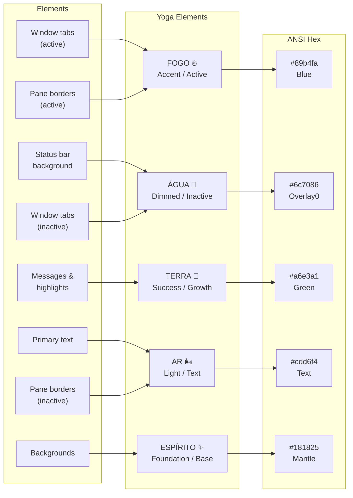

# Tmux Themes — Yoga 3.0

> Theme and status line configuration for Tmux A++

---

## Active Theme

The Yoga 3.0 Tmux A++ configuration uses a **custom theme** based on the **Catppuccin Mocha** color palette. The theme is applied directly through tmux configuration options rather than the `catppuccin/tmux` plugin.

### Catppuccin Mocha Palette

The core colors used across all elements:

| Name | Hex | ANSI | Usage |
|------|-----|------|-------|
| Base | `#1e1e2e` | — | Background |
| Mantle | `#181825` | — | Status bar background |
| Crust | `#11111b` | — | Pane borders (inactive) |
| Surface0 | `#313244` | — | Pane borders (active) |
| Overlay0 | `#6c7086` | — | Dimmed text |
| Subtext0 | `#a6adc8` | — | Secondary text |
| Text | `#cdd6f4` | — | Primary text |
| Lavender | `#b4befe` | — | Highlight |
| Blue | `#89b4fa` | — | Accent, session name |
| Green | `#a6e3a1` | — | Success indicators |
| Red | `#f38ba8` | — | Error/attention |
| Yellow | `#f9e2af` | — | Warning |
| Peach | `#fab387` | — | Modified state |
| Mauve | `#cba6f7` | — | Directory |



---

## Status Line Layout

The status bar is positioned at the **top** (`set -g status-position top`) with a **3-second refresh interval** (`set -g status-interval 3`).

### status-left

The left segment displays the session context:

```
[session_name] [working_directory]
```

- Session name uses the **Blue** accent color
- Working directory uses the **Mauve** color
- Separator elements with **Surface0** backgrounds

### status-right

The right segment displays system information:

```
[CPU%] [MEM%] [prefix_state] [datetime]
```

- CPU and memory percentages come from `tmux-cpu-mem-monitor`
- Prefix state indicator comes from `tmux-prefix-highlight`
- Datetime uses default tmux formatting

### Window Status

Windows in the status bar use:
- **Active window**: Highlighted with Blue accent, bold text
- **Inactive windows**: Dimmed with Overlay0 text
- **Window index**: Base-1 numbering (`set -g base-index 1`)

---

## Configuration Reference

These settings control the visual appearance:

```tmux
# Core display
set -g default-terminal "tmux-256color"
set -ga terminal-overrides ",*256col*:Tc"
set -g status-position top
set -g status-interval 3

# Pane appearance
setw -g pane-base-index 1
set -g renumber-windows on
```

### True Color Support

True color (24-bit) is enabled via:

```tmux
set -g default-terminal "tmux-256color"
set -ga terminal-overrides ",*256col*:Tc"
```

Ensure your terminal reports `$COLORTERM` as `truecolor` or `24bit` for this to work correctly.

---

## Customizing Colors

### Method 1: Direct tmux Options

Edit `~/.config/tmux/tmux.conf` and modify the status line segments:

```tmux
# Status bar colors
set -g status-style "bg=#181825,fg=#cdd6f4"

# Active window
set -g window-status-current-style "bg=#313244,fg=#89b4fa,bold"

# Inactive window
set -g window-status-style "bg=#181825,fg=#6c7086"

# Pane borders
set -g pane-border-style "fg=#313244"
set -g pane-active-border-style "fg=#89b4fa"
```

After editing, reload with `prefix+r`.

### Method 2: Using the Catppuccin Plugin

If you prefer the structured plugin approach, replace the custom theme with `catppuccin/tmux`:

```tmux
set -g @plugin 'catppuccin/tmux'
set -g @catppuccin_flavor 'mocha'
```

Then run `prefix+I` to install. The plugin provides additional customization options:

```tmux
set -g @catppuccin_window_left_separator ""
set -g @catppuccin_window_right_separator ""
set -g @catppuccin_status_left_separator ""
set -g @catppuccin_status_right_separator ""
```

### Method 3: Switching to a Different Theme

To switch from Catppuccin Mocha to another palette:

1. Edit the color hex values in your `tmux.conf` status-style settings
2. Or install a different tmux theme plugin (e.g., `tmux-themepack`, `oh-my-tmux`)
3. Reload with `prefix+r`

Popular alternatives:

| Theme | Style | Install |
|-------|-------|---------|
| Catppuccin Latte | Light | `@catppuccin_flavor 'latte'` |
| Catppuccin Frappé | Medium-dark | `@catppuccin_flavor 'frappe'` |
| Catppuccin Macchiato | Dark | `@catppuccin_flavor 'macchiato'` |
| Solarized | Classic dark | `theme-pack solarized` |
| Dracula | Purple-dark | `@plugin 'dracula/tmux'` |

---

## Mouse Mode

Mouse support is enabled globally:

```tmux
set -g mouse on
```

This allows:
- Click to select panes
- Drag pane borders to resize
- Scroll with mouse wheel (enters copy mode automatically)
- Click to select windows in the status bar

---

## Font Requirements

For the best visual experience:
- Use a **Nerd Font** (e.g., JetBrains Mono Nerd Font, FiraCode Nerd Font)
- Required for: session icons, folder icons, and git symbols in the status line
- Install: `yoga lazyvim fonts` or manually from [nerdfonts.com](https://nerdfonts.com)