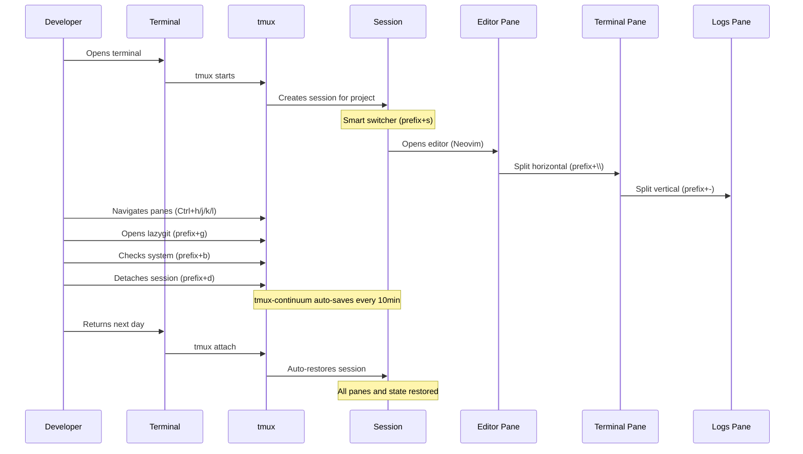

# Tmux Workflows — Yoga 3.0

> Common daily workflows with the Tmux A++ configuration



---

## Starting a Session

### From Yoga Workspace

```bash
yoga workspace create my-project
```

This creates a tmux session named `my-project` rooted at the project directory. The session is automatically registered in the Yoga workspace system.

### Manual Session Creation

```bash
# Create and attach to a named session
tmux new-session -s my-project

# Or use the tmux popup within an existing session
# Press: Ctrl+Space + S, then type the session name
```

### Smart Session Switcher

```
Ctrl+Space  s
```

Opens `tms switch` in a popup. Lists all sessions with fuzzy search and directory preview. Start typing to filter, press Enter to switch.

---

## Switching Sessions

| Method | Key | Description |
|--------|-----|-------------|
| Smart switcher | `prefix+s` | Fuzzy popup with preview |
| Fuzzy sessions | `prefix+F` | fzf-based session list |
| Last session | `prefix+.` | Toggle to previous session |
| Rename session | `prefix+$` | Rename current session |
| Kill session | `prefix+X` | Kill current session (with confirm) |

---

## Popup Workflows

Popups are overlay windows that appear on top of your current layout without disrupting it.

### Lazygit

```
Ctrl+Space  g
```

Opens **lazygit** in a 90%x90% popup rooted at the current pane's directory. Use lazygit to stage, commit, push, and manage git operations. Press `q` to close and return to tmux.

### System Monitor (btop/btm)

```
Ctrl+Space  b
```

Opens **btm** (bottom) in an 80%x80% popup. Monitor CPU, memory, processes, and disk usage. Press `q` to exit.

### Floating Terminal

```
Ctrl+Space  t
```

Opens a plain terminal popup (80%x80%) at the current pane's directory. Useful for quick one-off commands without creating a new pane. Type `exit` or press `Ctrl+d` to close.

---

## Split Workflows

### Horizontal Split (Right)

```
Ctrl+Space  \
```

Creates a new pane to the right of the current pane, in the same directory.

### Vertical Split (Below)

```
Ctrl+Space  -
```

Creates a new pane below the current pane, in the same directory.

### New Window

```
Ctrl+Space  c
```

Creates a new window (tab) in the same directory.

### Resizing Panes

Hold the prefix and repeat:

| Key | Action | Size |
|-----|--------|------|
| `prefix+j` | Resize down | 5 cells |
| `prefix+k` | Resize up | 5 cells |
| `prefix+l` | Resize right | 5 cells |
| `prefix+h` | Resize left | 5 cells |

The `-r` flag on these bindings allows repeat without pressing the prefix again.

### Maximizing Panes

```
Ctrl+Space  m
```

Toggles the current pane between maximized (full window) and restored (original size). Great for focusing on a single task temporarily.

---

## FZF Workflows

### Fuzzy Find Windows

```
Ctrl+Space  f
```

Lists all windows across all sessions in a fzf popup. Start typing to filter by window name. Press Enter to jump to the selected window.

### Fuzzy Find Sessions

```
Ctrl+Space  F
```

Lists all sessions in a fzf popup. Filter and switch to any session instantly.

### Fuzzy Find Panes

```
Ctrl+Space  P
```

Lists all panes in the current session with their running commands. Select a pane to jump to it directly.

---

## Copy Mode

Copy mode uses Vi keybindings for text selection and yanking.

### Enter Copy Mode

```
Ctrl+Space  [
```

### Navigation (Copy Mode)

| Key | Action |
|-----|--------|
| `h/j/k/l` | Move cursor |
| `w` | Word forward |
| `b` | Word backward |
| `Ctrl+u` | Half page up |
| `Ctrl+d` | Half page down |
| `g` | Top of buffer |
| `G` | Bottom of buffer |
| `/` | Search forward |
| `?` | Search backward |
| `n` | Next search result |
| `N` | Previous search result |

### Selection (Copy Mode)

| Key | Action |
|-----|--------|
| `v` | Start visual selection |
| `r` | Toggle rectangle (block) mode |
| `y` | Copy selection and exit copy mode |

### Paste

```
Ctrl+Space  ]
```

Pastes the most recently copied content from the tmux buffer.

### System Clipboard

With `tmux-yank` installed, content copied with `y` is also pushed to the system clipboard. Use `Ctrl+Shift+v` (Linux) or `Cmd+v` (macOS) to paste into other applications.

---

## Vim-Tmux Navigation

Seamless pane navigation between tmux and Neovim without using the prefix key.

| Key | Action |
|-----|--------|
| `Ctrl+h` | Move left |
| `Ctrl+j` | Move down |
| `Ctrl+k` | Move up |
| `Ctrl+l` | Move right |

When you're in a Neovim split, `Ctrl+h/j/k/l` moves between Neovim splits. When you reach the edge of Neovim, the keystroke passes to tmux and moves to the adjacent pane. This works both ways — tmux to Neovim and Neovim to tmux.

**Prerequisite:** The `vim-tmux-navigator` plugin must be installed in both tmux and Neovim for this to work.

---

## Session Persistence

### Automatic Save

`tmux-continuum` saves your session every **10 minutes** automatically:

```tmux
set -g @continuum-save-interval '10'
```

### Auto-Restore

When tmux starts, `tmux-continuum` will automatically restore the last saved session:

```tmux
set -g @continuum-restore 'on'
```

### Manual Save/Restore

| Key | Action |
|-----|--------|
| `prefix+Ctrl+s` | Save session now |
| `prefix+Ctrl+r` | Restore last session |

Saved sessions are stored in `~/.tmux/resurrect/` as plain text files. You can inspect or manually edit them if needed.

---

## Window Navigation

| Key | Action |
|-----|--------|
| `prefix+n` | Next window |
| `prefix+p` | Previous window |
| `prefix+Tab` | Last window (toggle) |
| `prefix+>` | Swap window right |
| `prefix+<` | Swap window left |
| `prefix+c` | New window |
| `prefix+,` | Rename window |
| `prefix+&` | Kill window |

---

## Typical Daily Flow

```
1. Start tmux:       tmux new-session -s work
2. Open project:      Ctrl+Space s → select session
3. Split layout:     Ctrl+Space \ (right), Ctrl+Space - (bottom)
4. Open lazygit:     Ctrl+Space g
5. Check system:     Ctrl+Space b
6. Quick command:    Ctrl+Space t
7. Navigate panes:   Ctrl+h/j/k/l (no prefix!)
8. Find a window:    Ctrl+Space f
9. Maximize focus:   Ctrl+Space m
10. Leave for day:   Sessions auto-saved by continuum
11. Return next day: tmux attach — sessions restored
```