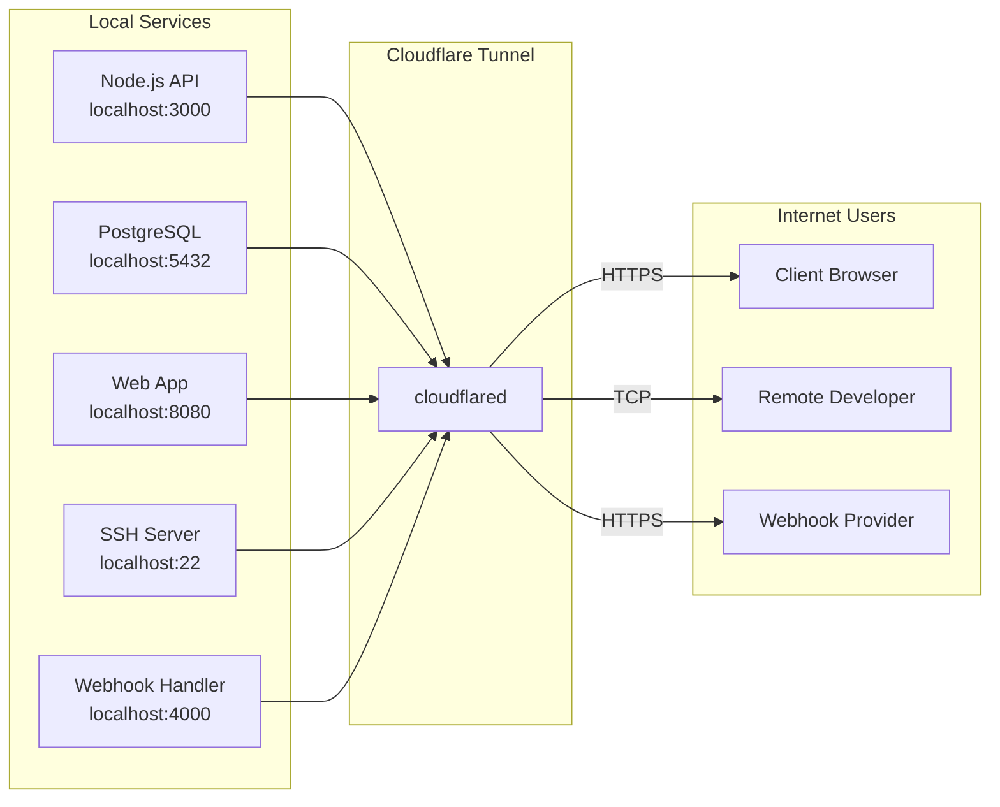

# Tunnel Examples — Practical Scenarios

> Real-world examples for using yoga tunnel with common development workflows

---

## Tunnel Scenarios Overview



---

## Exposing a Local Node.js API

Expose a Node.js/Express API running on port 3000:

```bash
# Start your API locally
npm run dev  # runs on localhost:3000

# Add the tunnel
yoga tunnel add --hostname api.dev.example.com --type http --service localhost:3000

# Start the tunnel
yoga tunnel start api.dev.example.com

# Verify
yoga tunnel status api.dev.example.com

# Test
curl https://api.dev.example.com/health
```

Anyone with the URL can now access your local API through Cloudflare's network.

---

## Exposing a React Dev Server

Expose a React (Vite/Create React App) development server:

```bash
# Start your React app
npm run dev  # runs on localhost:5173

# Add the tunnel
yoga tunnel add --hostname app.dev.example.com --type http --service localhost:5173

# Start the tunnel
yoga tunnel start app.dev.example.com

# Share with your team
# URL: https://app.dev.example.com
```

**Note:** Make sure your dev server is configured to allow external connections if needed (Vite uses `--host` flag).

---

## Multiple Tunnels: API + Frontend

Run both an API and a frontend simultaneously:

```bash
# Add the API tunnel
yoga tunnel add --hostname api.staging.example.com --type http --service localhost:3000

# Add the frontend tunnel
yoga tunnel add --hostname app.staging.example.com --type http --service localhost:5173

# Start both
yoga tunnel start api.staging.example.com
yoga tunnel start app.staging.example.com

# Check all tunnels
yoga tunnel list
yoga tunnel status

# View dashboard
yoga tunnel hud
```

This setup allows you to test frontend-backend integration with real HTTPS URLs.

---

## Tunnel with Custom Hostname

Set up a tunnel with a specific subdomain and path:

```bash
# Expose only the /api path of your service
yoga tunnel add --hostname dev.example.com --type http --service localhost:8080 --path /api

# Start
yoga tunnel start dev.example.com

# Only /api/* routes are tunneled
# URL: https://dev.example.com/api
```

---

## Tunnel for Database Access

Expose a local database for remote access (use with caution):

```bash
# Expose PostgreSQL
yoga tunnel add --hostname db.dev.example.com --type tcp --service localhost:5432

# Start
yoga tunnel start db.dev.example.com

# Connect from another machine
psql -h db.dev.example.com -U myuser -d mydb
```

**Exposing SSH access:**

```bash
# Expose SSH
yoga tunnel add --hostname ssh.dev.example.com --type ssh --service localhost:22

# Start
yoga tunnel start ssh.dev.example.com

# Connect from another machine
ssh -o ProxyCommand="cloudflared access ssh --hostname ssh.dev.example.com" user@ssh.dev.example.com
```

**Note:** TCP and SSH tunnels are powerful but carry security implications. Always use appropriate authentication and restrict access when possible.

---

## Webhook Testing

Expose a local service to receive webhooks from external providers:

```bash
# Add tunnel for Stripe webhooks
yoga tunnel add --hostname webhooks.dev.example.com --type http --service localhost:4000

# Start
yoga tunnel start webhooks.dev.example.com

# Configure your Stripe webhook URL:
# https://webhooks.dev.example.com/stripe/webhook

# Watch logs in real-time
yoga tunnel logs --tail
```

**Common webhook services:**
- Stripe: `--path /stripe/webhook`
- GitHub: `--path /github/webhook`
- Slack: `--path /slack/events`

---

## Daily Workflow

A typical development session:

```bash
# Morning: start tunnels for your project
yoga tunnel start api.dev.example.com
yoga tunnel start app.dev.example.com

# Check status
yoga tunnel status

# View dashboard
yoga tunnel hud

# Monitor logs while developing
yoga tunnel logs --tail

# Evening: stop tunnels
yoga tunnel stop api.dev.example.com
yoga tunnel stop app.dev.example.com
```

---

## Monitoring Multiple Tunnels

```bash
# List all tunnels
yoga tunnel list

# Check overall status
yoga tunnel status

# Open TUI dashboard
yoga tunnel hud

# Real-time monitoring
yoga tunnel logs --tail

# Check specific tunnel
yoga tunnel status api.dev.example.com
```

---

## Troubleshooting Tunnels

### Tunnel won't start

```bash
# Check if cloudflared is authenticated
cloudflared tunnel login

# Verify cf-tunnels is installed
ls ~/cf-tunnels/run.sh

# Check tunnel status
yoga tunnel status

# View error logs
yoga tunnel logs
```

### DNS not resolving

```bash
# Cloudflare may need to create a CNAME record
# This is usually handled automatically by cloudflared
# If not, add a CNAME record manually:
# api.dev.example.com -> <tunnel-id>.cfargotunnel.com
```

### Connection refused

```bash
# Verify your local service is running
curl localhost:3000/health

# Check the service address matches
yoga tunnel list

# Verify no firewall is blocking the local port
ss -tlnp | grep 3000
```

### Tunnel command not found

```bash
# Check yoga is in PATH
which yoga

# Check cf-tunnels installation
ls ~/cf-tunnels/

# Reinstall cf-tunnels if needed
git clone <repo> ~/cf-tunnels
cd ~/cf-tunnels && ./install.sh
```

### Performance issues

```bash
# Check cloudflared version
cloudflared --version

# Update if needed
cloudflared update

# Monitor tunnel metrics
yoga tunnel logs --tail
```