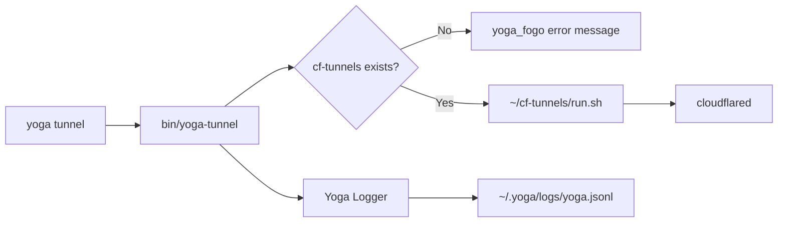

# Tunnel Integration — Yoga System

> How `yoga tunnel` integrates with the Yoga 3.0 ecosystem

---

## Architecture Overview



The `yoga tunnel` command is a thin wrapper that delegates all tunnel operations to `~/cf-tunnels/run.sh` while adding Yoga-specific UI and logging.

---

## Wrapper: bin/yoga-tunnel

The main integration point is `bin/yoga-tunnel`, which:

1. **Validates** that `~/cf-tunnels/` directory exists
2. **Validates** that `~/cf-tunnels/run.sh` is executable
3. **Displays** a Yoga-branded header using `yoga_section`
4. **Delegates** all arguments to `~/cf-tunnels/run.sh "$@"`
5. **Logs** the command invocation to `~/.yoga/logs/yoga.jsonl`

### Source Flow

```zsh
# Simplified flow from bin/yoga-tunnel

YOGA_HOME="${YOGA_HOME:-$HOME/.yoga}"
source "$YOGA_HOME/core/utils/ui.sh"

CF_TUNNEL_PATH="$HOME/cf-tunnels"

# 1. Validate cf-tunnels exists
if [[ ! -d "$CF_TUNNEL_PATH" ]]; then
    yoga_fogo "cf-tunnels not found"  # Red error
    yoga_agua "Install instructions"   # Blue info
    exit 1
fi

# 2. Validate run.sh exists
if [[ ! -f "$CF_TUNNEL_PATH/run.sh" ]]; then
    yoga_fogo "run.sh not found"
    exit 1
fi

# 3. Display header
yoga_section "Cloudflare Tunnel"
yoga_agua "Starting cf-tunnel..."

# 4. Delegate to cf-tunnels
"$CF_TUNNEL_PATH/run.sh" "$@"

# 5. Log silently
echo "$log_entry" >> "${YOGA_HOME}/logs/yoga.jsonl"
```

---

## UI Integration

The tunnel wrapper uses the Yoga UI system from `core/utils/ui.sh`:

| Function | Element | Color | Usage |
|----------|---------|-------|-------|
| `yoga_fogo` | Fire | Red | Error messages when cf-tunnels is missing |
| `yoga_agua` | Water | Blue | Informational messages, progress indicators |
| `yoga_terra` | Earth | Green | Success messages |
| `yoga_section` | Section header | Bold | Section separators |

### Error Display

When `cf-tunnels` is not installed, the wrapper displays:

```
🔥 ERRO: 🚇 cf-tunnels não encontrado em /home/user/cf-tunnels
💧 💡 Instale:
   git clone <repo> ~/cf-tunnels
   cd ~/cf-tunnels && ./install.sh
```

### Success Display

When tunnel operations succeed:

```
════════════════════════════
🚇 Cloudflare Tunnel
💧 🚀 Executando cf-tunnel...
════════════════════════════
```

---

## Logging Integration

Every `yoga tunnel` command is logged to `${YOGA_HOME}/logs/yoga.jsonl`:

```json
{
  "timestamp": "2026-04-14T10:30:00-03:00",
  "level": "INFO",
  "module": "tunnel",
  "command": "tunnel",
  "args": "start api.dev.example.com"
}
```

### Log Fields

| Field | Description |
|-------|-------------|
| `timestamp` | ISO 8601 timestamp |
| `level` | Log level (INFO, ERROR) |
| `module` | Always `"tunnel"` for this wrapper |
| `command` | Always `"tunnel"` |
| `args` | Full argument string passed to the command |

### Querying Logs

```bash
# View recent tunnel logs
cat ~/.yoga/logs/yoga.jsonl | jq 'select(.module == "tunnel")'

# View tunnel errors
cat ~/.yoga/logs/yoga.jsonl | jq 'select(.module == "tunnel" and .level == "ERROR")'

# View today's tunnel commands
cat ~/.yoga/logs/yoga.jsonl | jq "select(.module == \"tunnel\" and .timestamp | startswith(\"$(date -I)\"))"
```

Logging is non-blocking — if the log write fails, it silently continues without interrupting the tunnel operation.

---

## Daews and Daemon Awareness

While `yoga tunnel` does not directly depend on the Yoga daemon, it is aware of the daemon's existence:

### Status Checking

The `yoga tunnel status` command can report whether the daemon is tracking tunnel processes. This is useful for:
- Checking if a tunnel was started within a Yoga workspace
- Correlating tunnel status with workspace sessions

### Future Integration Points

Potential daemon-aware features:

| Feature | Description |
|---------|-------------|
| Auto-start tunnels | Start tunnels when a workspace session begins |
| Health checks | Daemon monitors tunnel liveness |
| Auto-restart | Restart tunnels that crash unexpectedly |
| Status sync | Sync tunnel status across workspace switches |

---

## Workspace Integration

### Starting Tunnels with Workspaces

When switching to a workspace that requires tunnels, you can start them as part of the workspace setup:

```bash
# Create a workspace with tunnel integration
yoga workspace create my-api

# Within the workspace tmux session, start tunnels
yoga tunnel start api.dev.example.com
```

### Workspace-Aware Tunnel Commands

The tunnel command respects the current working directory:

- Tunnels started within a tmux pane inherit `#{pane_current_path}` as their working directory
- This ensures relative paths and environment variables are workspace-correct

### Potential Enhancement: Workspace Tunnel Auto-Start

A future enhancement could auto-start tunnels defined in workspace configuration:

```yaml
# Example: ~/.yoga/workspaces/my-api/config.yaml (conceptual)
workspace:
  name: my-api
  tunnels:
    - hostname: api.dev.example.com
      type: http
      service: localhost:3000
```

On `yoga workspace switch my-api`, the defined tunnels would start automatically.

---

## CF_TUNNEL_PATH Override

By default, `yoga-tunnel` looks for `cf-tunnels` at `$HOME/cf-tunnels`. This is defined in the script:

```zsh
CF_TUNNEL_PATH="$HOME/cf-tunnels"
```

To use a different location, modify the `CF_TUNNEL_PATH` variable in `bin/yoga-tunnel` or set the environment variable before calling:

```bash
CF_TUNNEL_PATH=/opt/cf-tunnels yoga tunnel list
```

**Note:** The `CF_TUNNEL_PATH` is used for both the directory check and the `run.sh` invocation. Changing it affects both validation and execution.

---

## Integration with Yoga Logging

The tunnel wrapper uses `jq` to construct structured log entries:

```zsh
local log_entry=$(jq -n \
    --arg ts "$(date -Iseconds)" \
    --arg module "tunnel" \
    --arg args "$*" \
    '{timestamp: $ts, level: "INFO", module: $module, command: "tunnel", args: $args}')

echo "$log_entry" >> "${YOGA_HOME}/logs/yoga.jsonl" 2>/dev/null || true
```

This ensures logs are:
- **Structured** — Valid JSON for easy querying
- **Timestamped** — ISO 8601 format
- **Non-blocking** — Failures are silently ignored (`2>/dev/null || true`)
- **Append-only** — Uses `>>` to preserve existing logs

---

## Summary

| Integration Point | Description |
|-------------------|-------------|
| `bin/yoga-tunnel` | Wrapper script that delegates to `cf-tunnels` |
| `core/utils/ui.sh` | Yoga UI colors and section formatting |
| `~/.yoga/logs/yoga.jsonl` | Structured JSONL logging |
| `~/cf-tunnels/run.sh` | Actual tunnel management engine |
| Workspace tmux sessions | Tunnel commands inherit pane working directory |