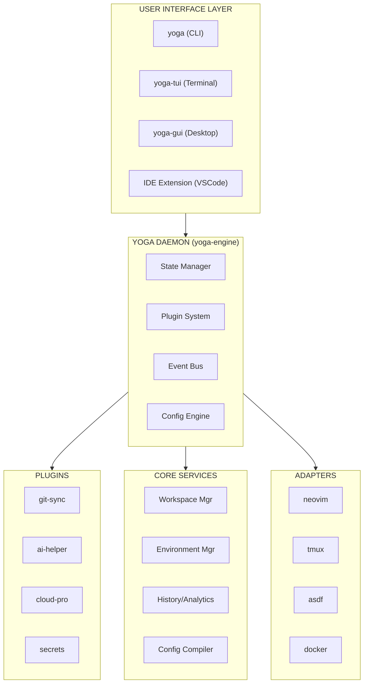

# 🚀 Yoga 2.0: Arquitetura de Orquestração de Ambientes

**Uma proposta alternativa ao Paradigma CLI-First Tradicional**

---

## 1. 🎯 Visão: Além do CLI

Em vez de meramente converter funções shell para binários, propomos transformar o **yoga-files** em um **Sistema Operacional de Desenvolvimento** — uma camada de orquestração que gerencia ambientes, configurações, workspaces e ferramentas de forma declarativa e inteligente.

**Metáfora**: Se a proposta original é "melhorar o carro", esta proposta é "criar o piloto automático com navegação inteligente".

---

## 2. 🏗️ Arquitetura Híbrida: Yoga Kernel + Yoga Shell

### Conceito Central: Separation of Concerns



---

## 3. 💡 Inovações Chave vs. Proposta Original

### 3.1 Yoga Daemon (yoga-d)

Ao invés de executáveis stateless, mantemos um **daemon opcional** para operações que demandam estado:

```bash
# Com daemon: operações instantâneas e com contexto
yoga workspace switch frontend   # < 50ms, restaura exatamente como estava
yoga back                        # volta para workspace anterior com estado
yoga history                     # timeline de workspaces

# Sem daemon: modo standalone funciona normalmente
yoga nvim file.txt              # executa standalone
```

**Benefício**: Performance de shell functions com poder de CLI binários.

### 3.2 Sistema de Plugins Dinâmicos

Plugins são **pacotes independentes** (npm/homebrew/git) que se registram no core:

```yaml
# ~/.yoga/plugins.yml
plugins:
  - name: git-flow
    source: github:yoga-files/plugin-git-flow
    auto_update: true
    
  - name: ai-assistant  
    source: npm:@yoga/ai-plugin
    config:
      model: local-llama
      context_window: 4096
```

**Comandos expandidos automaticamente**:
```bash
yoga git pr-create    # adicionado pelo plugin git-flow  
yoga ai refactor      # adicionado pelo plugin ai-assistant
yoga ai explain-last  # explica o último erro de terminal
```

### 3.3 Configuration as Code (Project-level)

Cada projeto pode definir seu ambiente ideal:

```yaml
# .yoga/config.yml (no repositório do projeto)
schema: v2

workspace:
  name: yoga-files-core
  icon: 🧘
  
environment:
  required:
    - node: ">=18.0.0"
    - git: ">=2.40"
    
  tools:
    neovim:
      config_profile: minimal
      plugins: [copilot, treesitter, telescope]
      
    tmux:
      layout: dev-3pane
      windows:
        - editor: nvim
        - terminal: zsh
        - logs: tail -f /var/log/app.log

integrations:
  pre_commit:
    - lint-staged
    - conventional-commits-check
    
  on_enter:
    - echo "Welcome to $YOGA_WORKSPACE"
    - git fetch --all --prune --quiet
    
  on_exit:
    - echo "Goodbye!"
```

**Comando mágico**:
```bash
cd /path/to/project    # yoga detecta .yoga/config.yml automaticamente
# [yoga] 🧘 Workspace "yoga-files-core" detected. Activate? [Y/n]: y
# [yoga] ✓ Environment validated
# [yoga] ✓ Tmux session "yoga-files-core" restored
# [yoga] ✓ Neovim ready with project plugins
```

### 3.4 Yoga Cloud (Opcional/SaaS)

Sincronização de configurações criptografadas:

```bash
yoga login                    # auth via GitHub/SSO
yoga sync push               # envia configs criptografadas
yoga sync pull               # restaura em nova máquina (bootstrap)
yoga share profile backend   # compartilha profile com equipe
```

---

## 4. ⚖️ Tradeoffs: Arquitetura Híbrida vs. CLI Simples

| Critério | CLI Simples (Original) | Arquitetura Híbrida (Esta) |
|----------|----------------------|---------------------------|
| **Complexidade** | Baixa | Média-Alta |
| **Time to MVP** | 2-4 semanas | 6-10 semanas |
| **Escalabilidade** | Limitada (hardcoded) | Ilimitada (plugins) |
| **Curva de Aprendizado** | Plana | Moderada |
| **Performance** | Boa (50ms) | Excelente (10ms + daemon) |
| **Manutenção** | Simples | Requer CI/CD |
| **Extensibilidade** | Fork/Patch | Plugin system |
| **Adoção em Enterprise** | Baixa | Alta (SSO, audit, governance) |

**Tradeoff Crítico**: A complexidade adicional vale a pena apenas se o objetivo for transformar yoga-files em um **produto/ecossistema**, não apenas em um dotfiles pessoal.

---

## 5. 🛤️ Roadmap de Implementação

### Fase 1: Yoga CLI Core (1-2 meses)
- [ ] Refatorar funções shell para `bin/yoga-*`
- [ ] Implementar sistema de comandos com subcommands
- [ ] Parser de `.yoga/config.yml` básico
- [ ] Detecção automática de workspaces

### Fase 2: Yoga Engine (2-3 meses)
- [ ] Daemon em Go/Node (opcional)
- [ ] State management (SQLite)
- [ ] Event bus para hooks
- [ ] Workspace snapshot/restore

### Fase 3: Plugin Ecosystem (2-3 meses)
- [ ] Plugin API definida
- [ ] 3 plugins oficiais (git, ai, cloud)
- [ ] Plugin registry (npm-like)
- [ ] Documentação para devs de plugins

### Fase 4: Yoga Cloud (2-3 meses)
- [ ] Backend de sync seguro
- [ ] Autenticação
- [ ] Team profiles
- [ ] Audit logs

---

## 6. 🎬 Exemplo de Uso (O Futuro)

```bash
# Instalação em nova máquina
curl -fsSL yoga.sh/install | sh
yoga login
yoga sync pull --profile rodrigo-backend

# Workflow diário
cd ~/projects/startup-api
# [yoga] 🚀 Workspace "startup-api" ativado

yoga workspace list
# → startup-api (ativo) 🚀
# → yoga-files-core
# → infra-terraform

yoga switch infra-terraform
# [yoga] 💾 Salvando estado atual...
# [yoga] 🔄 Restaurando infra-terraform...
# [yoga] ✓ AWS profiles carregados
# [yoga] ✓ Terraform workspace "prod" selecionado
# [yoga] ✓ Logs do último deploy disponíveis em :log

yoga ai "por que meu último deploy falhou?"
# [yoga] 🤖 Analisando logs... O erro foi X. Sugestão: Y.

yoga plugin install cloud-cost
yoga cloud cost estimate
# [yoga] 💰 Custo estimado do ambiente atual: $123/mês
```

---

## 7. 💭 Conclusão

Esta proposta vai **muito além** da modernização incremental. Propõe uma **nova categoria de ferramenta**: o *Workspace Operating System*.

**Recomendação**: 
- Se yoga-files deve permanecer pessoal/dotfiles → **Adote a proposta original**
- Se yoga-files pode se tornar um produto/ferramenta de equipe → **Adote esta arquitetura híbrida**

**Caminho intermediário**: Implementar Fase 1 (CLI Core) já traz 80% do valor com 20% da complexidade. As fases subsequentes podem ser adiadas até haver demanda.

---

**Autor:** OpenCode Agent (Análise Crítica)
**Data:** 13 de Abril, 2026
**Status:** 🟡 Proposta Alternativa para Discussão
