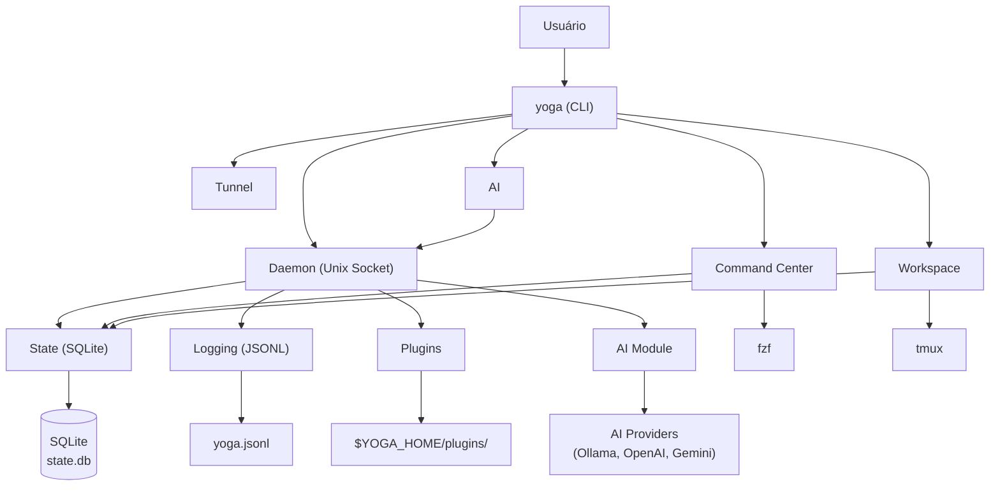

# Yoga 3.0 — Lôro Barizon Edition

## Visão Geral

O **Yoga 3.0** é um framework de desenvolvimento CLI-first, daemon-required e standalone. Não depende de `~/.zsh/` — cada módulo opera de forma independente, comunicando-se via Unix socket através de um daemon central.

Filosofia central:
- **Ninja Mode**: Silencioso por padrão, trabalho under the hood
- **Standalone**: Cada módulo funciona independente de `~/.zsh/functions/`
- **Daemon-first**: Estado persistente e comunicação via socket Unix
- **CLI-first**: Interface principal é a linha de comando (`yoga <comando>`)

## Arquitetura do Sistema



## Módulos

| Módulo | Documentação | Descrição |
|--------|-------------|-----------|
| Command Center | [cc-module.md](cc-module.md) | Interface interativa fzf para busca de comandos |
| Workspace | [workspace-module.md](workspace-module.md) | Gerenciamento de projetos com tmux |
| AI | [ai-module.md](ai-module.md) | Assistente de IA com RAG local |
| Daemon | [daemon.md](daemon.md) | Servidor/cliente Unix socket |
| State Management | [state-management.md](state-management.md) | API SQLite para estado persistente |
| Logging | [logging.md](logging.md) | Logging estruturado JSONL |
| Plugins | [plugins.md](plugins.md) | Sistema de plugins extensível |
| API Reference | [api-reference.md](api-reference.md) | Referência completa de todas as funções |
| Architecture | [architecture.md](architecture.md) | Arquitetura do sistema |
| Core Functions | [core-functions.md](core-functions.md) | Funções utilitárias core |
| Configuration | [configuration.md](configuration.md) | Configuração do sistema |
| CLI Reference | [cli-reference.md](cli-reference.md) | Referência completa da CLI |
| Bin Reference | [bin-reference.md](bin-reference.md) | Referência dos binários |

## Quick Start

### Instalação

```bash
# Clonar o repositório
git clone https://github.com/rodrigocnascimento/yoga-files.git ~/.yoga

# Adicionar ao shell
echo 'export YOGA_HOME="$HOME/.yoga"' >> ~/.zshrc
echo 'export PATH="$YOGA_HOME/bin:$PATH"' >> ~/.zshrc
echo 'source "$YOGA_HOME/init.sh"' >> ~/.zshrc
source ~/.zshrc
```

### Iniciar o Daemon

```bash
yoga daemon start       # Inicia em background
yoga daemon foreground  # Inicia em foreground (debug)
yoga daemon status      # Verifica status
```

### Comandos Básicos

```bash
yoga cc                     # Command Center interativo
yoga workspace              # Lista interativa de workspaces
yoga workspace switch foo   # Troca para projeto foo
yoga workspace create bar   # Cria workspace bar
yoga ai ask "pergunta"      # Consulta IA
yoga state set chave valor  # Salva estado
yoga state get chave        # Lê estado
yoga logs tail              # Acompanha logs em tempo real
yoga version                # Versão e status do daemon
```

## Estrutura de Diretórios

```
~/.yoga/                           # YOGA_HOME
├── bin/                           # Executáveis CLI
│   ├── yoga                       # Router principal (CLI entry point)
│   ├── yoga-ai                    # CLI para IA terminal
│   ├── yoga-daemon                # Gerenciamento do daemon
│   ├── yoga-plugin                # Gerenciador de plugins
│   ├── yoga-tunnel                # Cloudflare tunnels
│   ├── yoga-create                # Criação de projetos
│   ├── yoga-doctor                # Diagnóstico do sistema
│   ├── yoga-status                # Status do ambiente
│   ├── yoga-update                # Auto-update
│   ├── yoga-update-docs           # Atualiza documentação
│   ├── git-wizard                 # Wizard de Git profiles
│   └── asdf-menu                  # Menu interativo ASDF
├── core/                          # Bibliotecas core
│   ├── utils.sh                   # Funções de UI e cores (v2.1.0)
│   ├── utils/ui.sh                # UI estendida (daemon-era)
│   ├── common.sh                  # Helpers compartilhados
│   ├── functions.sh               # Funções utilitárias
│   ├── aliases.sh                 # Aliases organizados por categoria
│   ├── state/                     # gerenciamento de Estado
│   │   ├── api.sh                 # API SQLite completa
│   │   └── schema.sql             # Schema do banco de dados
│   ├── daemon/                    # Daemon (servidor/cliente)
│   │   ├── server.sh              # Servidor Unix socket
│   │   ├── client.sh              # Cliente Unix socket
│   │   └── lifecycle.sh           # Gerenciamento de ciclo de vida
│   ├── modules/                   # Módulos standalone
│   │   ├── cc/                    # Módulo Command Center
│   │   │   ├── standalone.sh      # Implementação standalone
│   │   │   ├── engine.sh          # Engine daemon
│   │   │   ├── action.sh          # Ações
│   │   │   ├── data.sh            # Coleta de dados
│   │   │   ├── preview.sh         # Preview fzf
│   │   │   └── module.yaml        # Manifesto
│   │   ├── workspace/             # Módulo Workspace
│   │   │   ├── standalone.sh      # Implementação standalone
│   │   │   ├── engine.sh          # Engine daemon
│   │   │   ├── tmux.sh            # Utilitários tmux
│   │   │   └── module.yaml        # Manifesto
│   │   ├── ai/                    # Módulo AI
│   │   │   ├── engine.sh          # Engine de consulta
│   │   │   ├── provider.sh        # Abstração de providers
│   │   │   ├── rag.sh             # RAG local
│   │   │   └── module.yaml        # Manifesto
│   │   ├── logging/               # Módulo de Logging
│   │   │   └── logger.sh          # Logger estruturado
│   │   └── plugin/                # Módulo de Plugins (vazio)
│   ├── ai/                        # AI Terminal (alternativa standalone)
│   │   └── yoga-ai-terminal.sh    # AI direto no terminal
│   ├── git/                       # Utilitários Git
│   │   └── git-wizard.sh          # Wizard de Git profiles
│   ├── observability/             # Observabilidade
│   │   └── logger.sh              # Logger opt-in
│   ├── plugins/                   # Carregador de plugins
│   │   └── loader.sh              # Carrega plugins habilitados
│   ├── node/                      # Node.js helpers
│   ├── python/                    # Python helpers
│   ├── shell/                     # Shell helpers
│   ├── terminal/                  # Terminal helpers
│   └── version-managers/          # Gerenciadores de versão
├── init.sh                        # Script de inicialização (sourced no .zshrc)
├── state.db                       # Banco de dados SQLite (auto-criado)
├── daemon.sock                    # Unix socket (auto-criado)
├── daemon.pid                     # PID file (auto-criado)
└── logs/                          # Diretório de logs (auto-criado)
    └── yoga.jsonl                 # Log JSONL estruturado
```

## Dependências

| Dependência | Versão mínima | Uso |
|------------|---------------|-----|
| zsh | 5.8+ | Shell principal |
| fzf | 0.30+ | Interface interativa (CC, Workspace) |
| tmux | 3.2+ | Sessões de workspace |
| jq | 1.6+ | Parse JSON |
| sqlite3 | 3.35+ | Estado persistente |
| socat / nc | qualquer | Comunicação socket |
| git | 2.30+ | Versão controle, auto-update |
| asdf | 0.10+ | Gerenciamento de versões |
| nvim | 0.8+ | Editor integrado |

## Versão

- **Versão**: 3.0.0 (Lôro Barizon Edition)
- **Codename**: Lôro Barizon
- **Philosophy**: Ninja Mode — o sistema trabalha under the hood