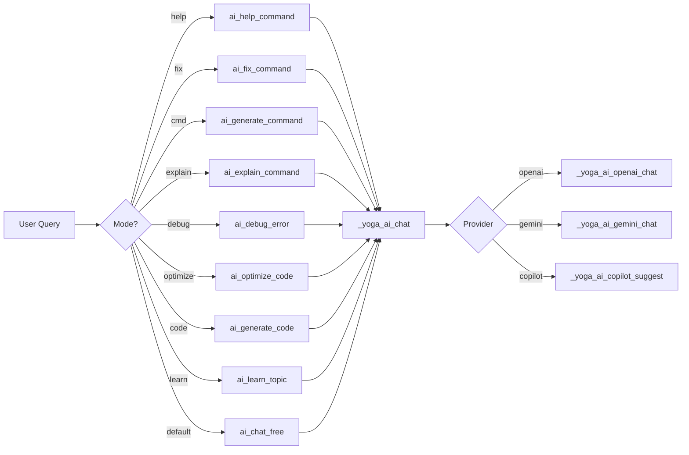

# AI Module

The AI module provides two implementations: a **daemon-based module** (`core/modules/ai/`) used when the Yoga daemon is running, and a **terminal-based module** (`core/ai/yoga-ai-terminal.sh`) used as a standalone CLI tool. Both share the same goal: bringing AI capabilities to the terminal.

---

## Architecture Overview



---

## Daemon-Based Implementation (`core/modules/ai/`)

This implementation is designed for the daemon architecture. It sources its own provider and RAG subsystems.

### Source Files

| File | Path | Purpose |
|------|------|---------|
| engine.sh | `core/modules/ai/engine.sh` | Main query engine |
| provider.sh | `core/modules/ai/provider.sh` | Provider abstraction layer |
| rag.sh | `core/modules/ai/rag.sh` | RAG (Retrieval-Augmented Generation) retrieval |
| module.yaml | `core/modules/ai/module.yaml` | Module metadata |

### Module Configuration (`module.yaml`)

```yaml
name: "ai"
version: "2.0.0"
description: "AI Assistant com integracao local (Ollama) e RAG"
dependencies:
  - jq
  - curl
config:
  provider: "ollama"     # ollama | openai | anthropic
  model: "llama3.2"
  host: "${OLLAMA_HOST:-http://localhost:11434}"
commands:
  - name: "ask"
    description: "Pergunta a IA"
  - name: "context"
    description: "Gerencia contexto RAG"
```

**Key configuration fields:**

| Field | Type | Default | Description |
|-------|------|---------|-------------|
| `name` | string | `"ai"` | Module identifier |
| `version` | string | `"2.0.0"` | Module version |
| `dependencies` | list | `[jq, curl]` | Required external tools |
| `config.provider` | string | `"ollama"` | Active AI provider |
| `config.model` | string | `"llama3.2"` | Default model name |
| `config.host` | string | `${OLLAMA_HOST:-http://localhost:11434}` | Ollama server host |

---

### `ai_engine_ask`

**File:** `core/modules/ai/engine.sh:20`

**Signature:**
```zsh
function ai_engine_ask {
    local question="$1"
    ...
}
```

**Description:** Main entry point for the daemon-based AI engine. Takes a user question, retrieves relevant context from the RAG subsystem, queries the configured AI provider, and returns the response.

**Parameters:**

| Parameter | Type | Required | Description |
|-----------|------|----------|-------------|
| `$1` (`question`) | string | Yes | The question to ask the AI |

**Return value:** Outputs the AI response to stdout.

**Side effects:**
1. Calls `ai_rag_retrieve` to fetch context from the SQLite FTS5 index
2. Calls `ai_provider_query` to send the prompt to the active provider
3. Prints status messages via `yoga_agua` UI function

**Example:**
```zsh
source "${YOGA_HOME}/core/modules/ai/engine.sh"
response=$(ai_engine_ask "How do I debug a Node.js memory leak?")
echo "$response"
```

---

### `ai_provider_query`

**File:** `core/modules/ai/provider.sh:23`

**Signature:**
```zsh
function ai_provider_query {
    local question="$1"
    local context="${2:-}"
    ...
}
```

**Description:** Provider dispatch function. Routes the query to the appropriate provider implementation based on the `YOGA_AI_PROVIDER` environment variable.

**Parameters:**

| Parameter | Type | Required | Default | Description |
|-----------|------|----------|---------|-------------|
| `$1` (`question`) | string | Yes | — | The question text |
| `$2` (`context`) | string | No | `""` | RAG context to include in the prompt |

**Return value:** Outputs the provider response to stdout. Returns 1 if the provider is unknown.

**Behavior by provider:**

| Provider Value | Dispatches To | Status |
|----------------|---------------|--------|
| `ollama` | `_ai_provider_ollama` | Implemented |
| `openai` | `_ai_provider_openai` | TODO (not implemented) |
| `anthropic` | `_ai_provider_anthropic` | TODO (not implemented) |
| _(other)_ | Error message via `yoga_fogo` | Returns 1 |

**Environment variables:**

| Variable | Default | Description |
|----------|---------|-------------|
| `YOGA_AI_PROVIDER` | `ollama` | Active AI provider |
| `YOGA_AI_MODEL` | `llama3.2` | Model to use for generation |
| `YOGA_OLLAMA_HOST` | `${OLLAMA_HOST:-http://localhost:11434}` | Ollama server host |

**Example:**
```zsh
YOGA_AI_PROVIDER=ollama YOGA_AI_MODEL=llama3.2
response=$(ai_provider_query "Explain closures in JS" "Closures are a fundamental concept...")
```

---

### `_ai_provider_ollama`

**File:** `core/modules/ai/provider.sh:44`

**Signature:**
```zsh
function _ai_provider_ollama {
    local question="$1"
    local context="$2"
    ...
}
```

**Description:** Ollama provider implementation. Sends a POST request to the Ollama `/api/generate` endpoint. If context is provided, it is prepended to the prompt with a `Contexto:` header.

**Parameters:**

| Parameter | Type | Required | Description |
|-----------|------|----------|-------------|
| `$1` (`question`) | string | Yes | The user question |
| `$2` (`context`) | string | Yes (can be empty) | RAG-retrieved context |

**Return value:** Outputs the generated response text extracted via `jq -r '.response'`. If the response is null or missing, returns the fallback message.

**Side effects:**
1. Checks Ollama availability via `curl "$YOGA_OLLAMA_HOST/api/tags"`
2. If Ollama is not running, prints error via `yoga_fogo` and returns 1
3. Sends a POST request to `$YOGA_OLLAMA_HOST/api/generate` with `stream: false`

**API request format:**
```json
{
  "model": "<YOGA_AI_MODEL>",
  "prompt": "<question or context+question>",
  "stream": false
}
```

**Example:**
```zsh
YOGA_OLLAMA_HOST="http://localhost:11434"
YOGA_AI_MODEL="llama3.2"
_ai_provider_ollama "What is a monad?" "Monads are a design pattern..."
```

---

### `_ai_provider_openai`

**File:** `core/modules/ai/provider.sh:72`

**Signature:**
```zsh
function _ai_provider_openai {
    local question="$1"
    local context="$2"
    ...
}
```

**Description:** OpenAI provider stub. Not yet implemented. Calls `yoga_error` and returns 1.

**Parameters:**

| Parameter | Type | Required | Description |
|-----------|------|----------|-------------|
| `$1` (`question`) | string | Yes | The user question |
| `$2` (`context`) | string | Yes | Context to include |

**Return value:** Always returns 1 (not implemented).

**Example:**
```zsh
_ai_provider_openai "Hello" "context"  # Returns 1 with error message
```

---

### `_ai_provider_anthropic`

**File:** `core/modules/ai/provider.sh:80`

**Signature:**
```zsh
function _ai_provider_anthropic {
    local question="$1"
    local context="$2"
    ...
}
```

**Description:** Anthropic provider stub. Not yet implemented. Calls `yoga_error` and returns 1.

**Parameters:**

| Parameter | Type | Required | Description |
|-----------|------|----------|-------------|
| `$1` (`question`) | string | Yes | The user question |
| `$2` (`context`) | string | Yes | Context to include |

**Return value:** Always returns 1 (not implemented).

---

### `ai_rag_retrieve`

**File:** `core/modules/ai/rag.sh:19`

**Signature:**
```zsh
function ai_rag_retrieve {
    local query="$1"
    local limit="${2:-5}"
    ...
}
```

**Description:** Retrieves relevant context from the SQLite FTS5 virtual table (`logs_fts`). Uses keyword-based matching with SQLite's built-in BM25 ranking. The query terms are split on spaces and joined with `|` (OR operator) for FTS5 MATCH.

**Parameters:**

| Parameter | Type | Required | Default | Description |
|-----------|------|----------|---------|-------------|
| `$1` (`query`) | string | Yes | — | Search query string |
| `$2` (`limit`) | integer | No | `5` | Maximum number of results |

**Return value:** Outputs formatted context to stdout. If results are found, each line is prefixed with `- `. If no results, returns `(sem contexto relevante encontrado)`.

**SQL query executed:**
```sql
SELECT content FROM logs_fts
WHERE logs_fts MATCH '<keywords>'
ORDER BY rank
LIMIT <limit>;
```

**Side effects:**
1. Sources `core/state/api.sh` (which initializes SQLite if needed)
2. Converts spaces in query to `|` for FTS5 MATCH syntax
3. Errors are suppressed (`2>/dev/null || true`)

**Example:**
```zsh
context=$(ai_rag_retrieve "docker container stop" 3)
echo "$context"
# Output:
# Contexto relevante dos logs:
# - docker stop command executed successfully
# - container shutdown procedure...
# - ...
```

---

### `ai_rag_index_log`

**File:** `core/modules/ai/rag.sh:45`

**Signature:**
```zsh
function ai_rag_index_log {
    local content="$1"
    local source="${2:-log}"
    ...
}
```

**Description:** Indexes content into the `ai_context` table for future RAG retrieval. This is a convenience wrapper around `yoga_ai_context_add`.

**Parameters:**

| Parameter | Type | Required | Default | Description |
|-----------|------|----------|---------|-------------|
| `$1` (`content`) | string | Yes | — | The text content to index |
| `$2` (`source`) | string | No | `"log"` | Source identifier for the content |

**Return value:** None (delegates to `yoga_ai_context_add`).

**Side effects:** Inserts a row into the `ai_context` SQLite table.

**Example:**
```zsh
ai_rag_index_log "Deployed version 2.1.0 to production" "deploy"
ai_rag_index_log "Fixed memory leak in worker process" "fix"
```

---

## Terminal Implementation (`core/ai/yoga-ai-terminal.sh`)

Standalone terminal AI assistant that works without the daemon. Supports multiple providers (OpenAI, Gemini, GitHub Copilot) and offers several specialized modes.

### Entry Point: `bin/yoga-ai`

**File:** `bin/yoga-ai`

**Description:** CLI entry point that validates the environment, sources `yoga-ai-terminal.sh`, and delegates to `yoga_ai_terminal`.

**Usage:**
```bash
yoga-ai --help
yoga-ai <mode> <query...>
```

**Modes:**
```
help | fix | cmd | explain | debug | optimize | code | learn
```

**Examples:**
```bash
yoga-ai help "how to list modified files"
yoga-ai fix "git comit -m 'msg'"
yoga-ai "freeform question"
```

**Exit codes:**

| Code | Condition |
|------|-----------|
| 0 | Success |
| 1 | Missing `YOGA_HOME`, missing `yoga-ai-terminal.sh`, or `yoga_ai_terminal` not found after sourcing |

---

### `yoga_ai_terminal`

**File:** `core/ai/yoga-ai-terminal.sh:197`

**Signature:**
```zsh
yoga_ai_terminal() {
    local command="$1"
    shift
    local query="$*"
    ...
}
```

**Description:** Main dispatch function for the terminal AI assistant. Routes the first argument as a mode/command, with all remaining arguments concatenated as the query string. If the command doesn't match a known mode, it falls through to `ai_chat_free`.

**Parameters:**

| Parameter | Type | Required | Description |
|-----------|------|----------|-------------|
| `$1` (`command`) | string | Yes | Mode: `help`, `fix`, `cmd`, `explain`, `debug`, `optimize`, `code`, `learn`, or any text for free chat |
| `$@` (remaining) | string | Yes | Query text (all remaining args joined) |

**Mode routing:**

| Command | Dispatches To | Description |
|---------|---------------|-------------|
| `help` | `ai_help_command` | Suggest shell commands |
| `fix` | `ai_fix_command` | Fix a broken command |
| `cmd` | `ai_generate_command` | Generate a complex command |
| `explain` | `ai_explain_command` | Explain a command |
| `debug` | `ai_debug_error` | Debug an error message |
| `optimize` | `ai_optimize_code` | Optimize code |
| `code` | `ai_generate_code` | Generate code |
| `learn` | `ai_learn_topic` | Learn about a topic |
| _(any other)_ | `ai_chat_free` | Free-form chat |

**Examples:**
```bash
yoga_ai_terminal help "how to find large files"
yoga_ai_terminal fix "git comit -m 'message'"
yoga_ai_terminal cmd "find all js files modified in last 7 days"
yoga_ai_terminal explain "tar -xzf archive.tar.gz"
yoga_ai_terminal debug "TypeError: Cannot read property 'map' of undefined"
yoga_ai_terminal optimize "const result = arr.filter(x => x > 0).map(x => x * 2)"
yoga_ai_terminal code "a function that validates Brazilian CPF"
yoga_ai_terminal learn "async generators in JavaScript"
yoga_ai_terminal hello how are you    # Falls through to chat mode
```

---

### `_yoga_ai_config_file`

**File:** `core/ai/yoga-ai-terminal.sh:7`

**Signature:**
```zsh
_yoga_ai_config_file() {
    ...
}
```

**Description:** Locates the Yoga configuration file. Checks `$YOGA_HOME/config/config.yaml` first, then falls back to `$YOGA_HOME/config.yaml`.

**Parameters:** None.

**Return value:** Outputs the config file path to stdout. Returns empty string if no config file is found.

**Search order:**

| Priority | Path | Condition |
|----------|------|-----------|
| 1 | `$YOGA_HOME/config/config.yaml` | File exists |
| 2 | `$YOGA_HOME/config.yaml` | File exists |

**Example:**
```zsh
cfg=$(_yoga_ai_config_file)
echo "Config at: $cfg"
```

---

### `_yoga_ai_get_config_value`

**File:** `core/ai/yoga-ai-terminal.sh:19`

**Signature:**
```zsh
_yoga_ai_get_config_value() {
    local key="$1"
    ...
}
```

**Description:** Minimalist YAML value extractor using `awk`. Supports only two keys: `preferences.ai_provider` and `tools.ai.model`. Returns the value for the given dot-notation key from the config file.

**Parameters:**

| Parameter | Type | Required | Description |
|-----------|------|----------|-------------|
| `$1` (`key`) | string | Yes | Dot-notation config key |

**Supported keys:**

| Key | YAML Path | Description |
|-----|-----------|-------------|
| `preferences.ai_provider` | `preferences.ai_provider` | AI provider name |
| `tools.ai.model` | `tools.ai.model` | AI model name |

**Return value:** The config value as a string. Empty if key is unsupported or config file is missing.

**Example:**
```zsh
provider=$(_yoga_ai_get_config_value "preferences.ai_provider")
model=$(_yoga_ai_get_config_value "tools.ai.model")
```

---

### `_yoga_ai_provider`

**File:** `core/ai/yoga-ai-terminal.sh:39`

**Signature:**
```zsh
_yoga_ai_provider() {
    ...
}
```

**Description:** Returns the active AI provider name. Checks config first, falls back to `openai`.

**Parameters:** None.

**Return value:** Provider name string. Default: `openai`.

**Fallback chain:** `_yoga_ai_get_config_value("preferences.ai_provider")` → `"openai"`

**Example:**
```zsh
provider=$(_yoga_ai_provider)
echo "Using provider: $provider"  # e.g., "openai", "gemini", "copilot"
```

---

### `_yoga_ai_model`

**File:** `core/ai/yoga-ai-terminal.sh:46`

**Signature:**
```zsh
_yoga_ai_model() {
    ...
}
```

**Description:** Returns the configured AI model name. Checks config first, falls back to `gpt-4`.

**Parameters:** None.

**Return value:** Model name string. Default: `gpt-4`.

**Fallback chain:** `_yoga_ai_get_config_value("tools.ai.model")` → `"gpt-4"`

**Example:**
```zsh
model=$(_yoga_ai_model)
echo "Using model: $model"  # e.g., "gpt-4", "gemini-pro"
```

---

### `_yoga_ai_openai_chat`

**File:** `core/ai/yoga-ai-terminal.sh:53`

**Signature:**
```zsh
_yoga_ai_openai_chat() {
    local system_msg="$1"
    local user_msg="$2"
    local temperature="${3:-0.3}"
    local max_tokens="${4:-800}"
    ...
}
```

**Description:** Sends a chat completion request to the OpenAI API (`POST https://api.openai.com/v1/chat/completions`). Uses the `OPENAI_API_KEY` environment variable for authentication.

**Parameters:**

| Parameter | Type | Required | Default | Description |
|-----------|------|----------|---------|-------------|
| `$1` (`system_msg`) | string | Yes | — | System prompt (role context) |
| `$2` (`user_msg`) | string | Yes | — | User message/query |
| `$3` (`temperature`) | float | No | `0.3` | Sampling temperature (0.0-2.0) |
| `$4` (`max_tokens`) | integer | No | `800` | Maximum tokens in the response |

**Return value:** Outputs the assistant's response content extracted via `jq -r '.choices[0].message.content'`.

**Environment variables:**

| Variable | Required | Description |
|----------|----------|-------------|
| `OPENAI_API_KEY` | Yes | OpenAI API key (checked before call) |

**Error handling:**
- If `OPENAI_API_KEY` is not set, prints error via `yoga_fogo` and returns 1

**API request format:**
```json
{
  "model": "<from _yoga_ai_model()>",
  "messages": [
    {"role": "system", "content": "<system_msg>"},
    {"role": "user", "content": "<user_msg>"}
  ],
  "temperature": <temperature>,
  "max_tokens": <max_tokens>
}
```

**Example:**
```zsh
response=$(_yoga_ai_openai_chat \
    "You are a shell command expert." \
    "How do I find files larger than 1GB?" \
    0.3 500)
echo "$response"
```

---

### `_yoga_ai_copilot_suggest`

**File:** `core/ai/yoga-ai-terminal.sh:88`

**Signature:**
```zsh
_yoga_ai_copilot_suggest() {
    local prompt="$1"
    ...
}
```

**Description:** Uses GitHub CLI (`gh copilot suggest`) to generate shell command suggestions. Requires `gh` CLI to be installed and authenticated.

**Parameters:**

| Parameter | Type | Required | Description |
|-----------|------|----------|-------------|
| `$1` (`prompt`) | string | Yes | Description of the desired command |

**Return value:** Outputs the copilot suggestion to stdout.

**Error handling:**
- If `gh` is not installed, prints error via `yoga_fogo` and suggestion via `yoga_agua`, returns 1

**Dependencies:**
- `gh` CLI (https://cli.github.com/)

**Example:**
```zsh
_yoga_ai_copilot_suggest "list all docker containers"
```

---

### `_yoga_ai_copilot_explain`

**File:** `core/ai/yoga-ai-terminal.sh:100`

**Signature:**
```zsh
_yoga_ai_copilot_explain() {
    local prompt="$1"
    ...
}
```

**Description:** Uses GitHub CLI (`gh copilot explain`) to explain a shell command or concept. Requires `gh` CLI.

**Parameters:**

| Parameter | Type | Required | Description |
|-----------|------|----------|-------------|
| `$1` (`prompt`) | string | Yes | Command or concept to explain |

**Return value:** Outputs the copilot explanation to stdout.

**Error handling:** Same as `_yoga_ai_copilot_suggest` — requires `gh` CLI.

**Example:**
```zsh
_yoga_ai_copilot_explain "awk '{print $2}' file.txt"
```

---

### `_yoga_ai_gemini_chat`

**File:** `core/ai/yoga-ai-terminal.sh:111`

**Signature:**
```zsh
_yoga_ai_gemini_chat() {
    local system_msg="$1"
    local user_msg="$2"
    local temperature="${3:-0.3}"
    local max_tokens="${4:-800}"
    ...
}
```

**Description:** Sends a generate content request to the Google Gemini API. Uses the Gemini-specific format with `system_instruction` and `contents` fields.

**Parameters:**

| Parameter | Type | Required | Default | Description |
|-----------|------|----------|---------|-------------|
| `$1` (`system_msg`) | string | Yes | — | System instruction |
| `$2` (`user_msg`) | string | Yes | — | User message |
| `$3` (`temperature`) | float | No | `0.3` | Sampling temperature |
| `$4` (`max_tokens`) | integer | No | `800` | Maximum output tokens |

**Return value:** Extracts response via `jq -r '.candidates[0].content.parts[0].text // empty'`.

**Environment variables:**

| Variable | Required | Description |
|----------|----------|-------------|
| `GEMINI_API_KEY` | Yes | Google Gemini API key |

**API endpoint:** `https://generativelanguage.googleapis.com/v1beta/models/$model:generateContent`

**API request format:**
```json
{
  "model": "<from _yoga_ai_model()>",
  "system_instruction": {
    "parts": [{"text": "<system_msg>"}]
  },
  "contents": [{
    "role": "user",
    "parts": [{"text": "<user_msg>"}]
  }],
  "generationConfig": {
    "temperature": <temperature>,
    "maxOutputTokens": <max_tokens>
  }
}
```

**Example:**
```zsh
response=$(_yoga_ai_gemini_chat \
    "You are a TypeScript expert." \
    "Explain discriminated unions" \
    0.5 1000)
```

---

### `_yoga_ai_chat`

**File:** `core/ai/yoga-ai-terminal.sh:153`

**Signature:**
```zsh
_yoga_ai_chat() {
    local system_msg="$1"
    local user_msg="$2"
    local temperature="${3:-0.3}"
    local max_tokens="${4:-800}"
    ...
}
```

**Description:** Provider dispatcher for the terminal implementation. Routes to the correct provider function based on `_yoga_ai_provider()`.

**Parameters:**

| Parameter | Type | Required | Default | Description |
|-----------|------|----------|---------|-------------|
| `$1` (`system_msg`) | string | Yes | — | System prompt |
| `$2` (`user_msg`) | string | Yes | — | User message |
| `$3` (`temperature`) | float | No | `0.3` | Sampling temperature |
| `$4` (`max_tokens`) | integer | No | `800` | Maximum response tokens |

**Provider routing:**

| Provider | Dispatches To | API Key Required |
|----------|---------------|------------------|
| `openai` | `_yoga_ai_openai_chat` | `OPENAI_API_KEY` |
| `gemini` | `_yoga_ai_gemini_chat` | `GEMINI_API_KEY` |
| `copilot` | `_yoga_ai_copilot_suggest` | `gh` CLI auth |
| `claude` | Error (not implemented) | — |
| _(other)_ | Error (unknown provider) | — |

**Error handling:**
- Checks for required API keys before dispatching
- Missing `OPENAI_API_KEY` prints error and returns 1
- Missing `GEMINI_API_KEY` prints error and returns 1
- Unknown/unimplemented provider prints error via `yoga_fogo` and returns 1

**Example:**
```zsh
_yoga_ai_chat "Be concise." "What is TCP?" 0.3 200
```

---

### Mode Functions

#### `ai_help_command`

**File:** `core/ai/yoga-ai-terminal.sh:234`

**Signature:**
```zsh
ai_help_command() {
    local query="$*"
    ...
}
```

**Description:** Suggests the correct shell command for a given natural language query. Uses a system prompt that instructs the AI to be a shell command expert. The command is NOT executed automatically — only suggested.

**Parameters:**

| Parameter | Type | Required | Description |
|-----------|------|----------|-------------|
| `$@` (`query`) | string | Yes | Natural language description of desired command |

**AI configuration:**

| Setting | Value |
|---------|-------|
| System prompt | "You are an expert in macOS/Linux shell commands. Be precise. Never execute commands; only suggest." |
| Temperature | 0.3 |
| Max tokens | 500 |

**Example:**
```bash
yoga-ai help "find all files modified in the last 24 hours"
# Output: Suggested command with explanation
```

---

#### `ai_fix_command`

**File:** `core/ai/yoga-ai-terminal.sh:256`

**Signature:**
```zsh
ai_fix_command() {
    local wrong_cmd="$*"
    ...
}
```

**Description:** Takes a mistyped or broken command and returns ONLY the corrected version. No explanation given by the AI — just the fix. If `pbcopy` (macOS) or `xclip` (Linux) is available, the corrected command is automatically copied to the clipboard.

**Parameters:**

| Parameter | Type | Required | Description |
|-----------|------|----------|-------------|
| `$@` (`wrong_cmd`) | string | Yes | The incorrect command |

**AI configuration:**

| Setting | Value |
|---------|-------|
| System prompt | "Fix shell commands. Output ONLY the corrected command, no explanation. Don't add backticks." |
| Temperature | 0.1 |
| Max tokens | 200 |

**Side effects:**
- Copies corrected command to clipboard if `pbcopy` or `xclip` is available

**Example:**
```bash
yoga-ai fix "git comit -m 'message'"
# Output:
# ❌ Errado: git comit -m 'message'
# ✅ Correto: git commit -m 'message'
# 📋 Comando copiado para clipboard!
```

---

#### `ai_generate_command`

**File:** `core/ai/yoga-ai-terminal.sh:285`

**Signature:**
```zsh
ai_generate_command() {
    local requirement="$*"
    ...
}
```

**Description:** Generates a complex shell command from a natural language description. The AI is instructed to consider best practices, performance, and security, and to avoid destructive commands by default.

**Parameters:**

| Parameter | Type | Required | Description |
|-----------|------|----------|-------------|
| `$@` (`requirement`) | string | Yes | Natural language description |

**AI configuration:**

| Setting | Value |
|---------|-------|
| System prompt | "Generate safe shell commands for macOS/Linux. Prefer non-destructive commands." |
| Temperature | 0.3 |
| Max tokens | 500 |

**Example:**
```bash
yoga-ai cmd "delete all node_modules directories recursively"
```

---

#### `ai_explain_command`

**File:** `core/ai/yoga-ai-terminal.sh:306`

**Signature:**
```zsh
ai_explain_command() {
    local cmd="$*"
    ...
}
```

**Description:** Explains a shell command in detail, breaking down each part and parameter. Output is in clear, technical language.

**Parameters:**

| Parameter | Type | Required | Description |
|-----------|------|----------|-------------|
| `$@` (`cmd`) | string | Yes | The command to explain |

**AI configuration:**

| Setting | Value |
|---------|-------|
| System prompt | "Explain shell commands clearly and precisely." |
| Temperature | 0.5 |
| Max tokens | 800 |

**Example:**
```bash
yoga-ai explain "find . -name '*.js' -exec grep -l 'TODO' {} \;"
```

---

#### `ai_debug_error`

**File:** `core/ai/yoga-ai-terminal.sh:326`

**Signature:**
```zsh
ai_debug_error() {
    local error="$*"
    ...
}
```

**Description:** Analyzes an error message and provides: (1) probable cause, (2) recommended solution, (3) prevention tips. Focused on JavaScript/TypeScript debugging context.

**Parameters:**

| Parameter | Type | Required | Description |
|-----------|------|----------|-------------|
| `$@` (`error`) | string | Yes | The error message to analyze |

**AI configuration:**

| Setting | Value |
|---------|-------|
| System prompt | "You are a senior JS/TS debugging assistant." |
| Temperature | 0.5 |
| Max tokens | 1000 |

**Example:**
```bash
yoga-ai debug "TypeError: Cannot read property 'map' of undefined"
# Output: Probable cause, solution, and prevention tips
```

---

#### `ai_optimize_code`

**File:** `core/ai/yoga-ai-terminal.sh:349`

**Signature:**
```zsh
ai_optimize_code() {
    local code="$*"
    ...
}
```

**Description:** Takes JavaScript/TypeScript code and returns an optimized version with explanations of the improvements.

**Parameters:**

| Parameter | Type | Required | Description |
|-----------|------|----------|-------------|
| `$@` (`code`) | string | Yes | The code to optimize |

**AI configuration:**

| Setting | Value |
|---------|-------|
| System prompt | "You optimize JS/TS for performance and readability." |
| Temperature | 0.3 |
| Max tokens | 1000 |

**Example:**
```bash
yoga-ai optimize "const result = arr.filter(x => x > 0).map(x => x * 2)"
```

---

#### `ai_generate_code`

**File:** `core/ai/yoga-ai-terminal.sh:370`

**Signature:**
```zsh
ai_generate_code() {
    local requirement="$*"
    ...
}
```

**Description:** Generates modern JavaScript/TypeScript code from a requirement description. The AI is instructed to use TypeScript, async/await, include types, and output only code (no markdown).

**Parameters:**

| Parameter | Type | Required | Description |
|-----------|------|----------|-------------|
| `$@` (`requirement`) | string | Yes | Description of desired code |

**AI configuration:**

| Setting | Value |
|---------|-------|
| System prompt | "You are a senior TypeScript developer. Output only code." |
| Temperature | 0.5 |
| Max tokens | 1500 |

**Side effects:** Prints a safety note that the code is not saved automatically.

**Example:**
```bash
yoga-ai code "a function that validates Brazilian CPF numbers"
```

---

#### `ai_learn_topic`

**File:** `core/ai/yoga-ai-terminal.sh:393`

**Signature:**
```zsh
ai_learn_topic() {
    local topic="$*"
    ...
}
```

**Description:** Generates a structured learning module about a topic in the context of modern JavaScript/TypeScript development. Includes: (1) fundamental concepts, (2) practical examples, (3) best practices, (4) common pitfalls, (5) further resources.

**Parameters:**

| Parameter | Type | Required | Description |
|-----------|------|----------|-------------|
| `$@` (`topic`) | string | Yes | Topic to learn about |

**AI configuration:**

| Setting | Value |
|---------|-------|
| System prompt | "You are a practical JS/TS teacher. Provide concise structure and examples." |
| Temperature | 0.7 |
| Max tokens | 2000 |

**Example:**
```bash
yoga-ai learn "async generators in JavaScript"
# Output: Structured learning material with examples
```

---

#### `ai_chat_free`

**File:** `core/ai/yoga-ai-terminal.sh:417`

**Signature:**
```zsh
ai_chat_free() {
    local query="$*"
    ...
}
```

**Description:** Free-form chat with the AI assistant. This is the fallback mode when no recognized command is provided. Uses a general JS/TS development assistant system prompt.

**Parameters:**

| Parameter | Type | Required | Description |
|-----------|------|----------|-------------|
| `$@` (`query`) | string | Yes | Any question or message |

**AI configuration:**

| Setting | Value |
|---------|-------|
| System prompt | "You are a helpful JS/TS development assistant." |
| Temperature | 0.7 |
| Max tokens | 1500 |

**Example:**
```bash
yoga-ai "what are the benefits of using Zod for validation?"
```

---

### Aliases

**File:** `core/ai/yoga-ai-terminal.sh:433-441`

Convenient aliases for quick terminal access:

| Alias | Expands To | Description |
|-------|-------------|-------------|
| `yai` | `yoga_ai_terminal` | Shorthand for main function |
| `ai` | `yoga_ai_terminal` | Quick AI access |
| `aihelp` | `yoga_ai_terminal help` | Help mode |
| `aifix` | `yoga_ai_terminal fix` | Fix a broken command |
| `aicmd` | `yoga_ai_terminal cmd` | Generate a command |
| `aiexplain` | `yoga_ai_terminal explain` | Explain a command |
| `aidebug` | `yoga_ai_terminal debug` | Debug an error |
| `aicode` | `yoga_ai_terminal code` | Generate code |
| `ailearn` | `yoga_ai_terminal learn` | Learn a topic |

**Note:** The `yoga-ai` binary in `bin/` also provides CLI access via `yoga-ai <mode> <query>`.

---

## Comparison: Daemon vs Terminal

| Feature | Daemon (`core/modules/ai/`) | Terminal (`core/ai/yoga-ai-terminal.sh`) |
|---------|-----------------------------|-------------------------------------------|
| Entry point | `ai_engine_ask` | `yoga_ai_terminal` |
| Providers | Ollama (local) | OpenAI, Gemini, GitHub Copilot |
| RAG | Built-in (`ai_rag_retrieve`) | None |
| Config | Env vars (`YOGA_AI_PROVIDER`, etc.) | `config.yaml` + env vars |
| Modes | `ask`, `context` | `help`, `fix`, `cmd`, `explain`, `debug`, `optimize`, `code`, `learn`, chat |
| CLI | Via daemon socket | `bin/yoga-ai` |
| Dependencies | `jq`, `curl`, `sqlite3` | `jq`, `curl`, `gh` (for copilot) |

---

## Environment Variables

| Variable | Default | Used By | Description |
|----------|---------|---------|-------------|
| `YOGA_HOME` | `$HOME/.yoga` | Both | Yoga installation directory |
| `YOGA_AI_PROVIDER` | `ollama` | Daemon | AI provider for daemon module |
| `YOGA_AI_MODEL` | `llama3.2` | Daemon | Model for daemon module |
| `YOGA_OLLAMA_HOST` | `${OLLAMA_HOST:-http://localhost:11434}` | Daemon | Ollama server URL |
| `YOGA_STATE_DB` | `${YOGA_HOME}/state.db` | Daemon (RAG) | SQLite database path |
| `OPENAI_API_KEY` | — | Terminal | Required for OpenAI provider |
| `GEMINI_API_KEY` | — | Terminal | Required for Gemini provider |

---

## Configuration File

The terminal implementation reads from `$YOGA_HOME/config/config.yaml` (or `$YOGA_HOME/config.yaml`). Relevant YAML keys:

```yaml
preferences:
  ai_provider: openai          # openai | gemini | copilot | claude

tools:
  ai:
    model: gpt-4               # Model name for the selected provider
```