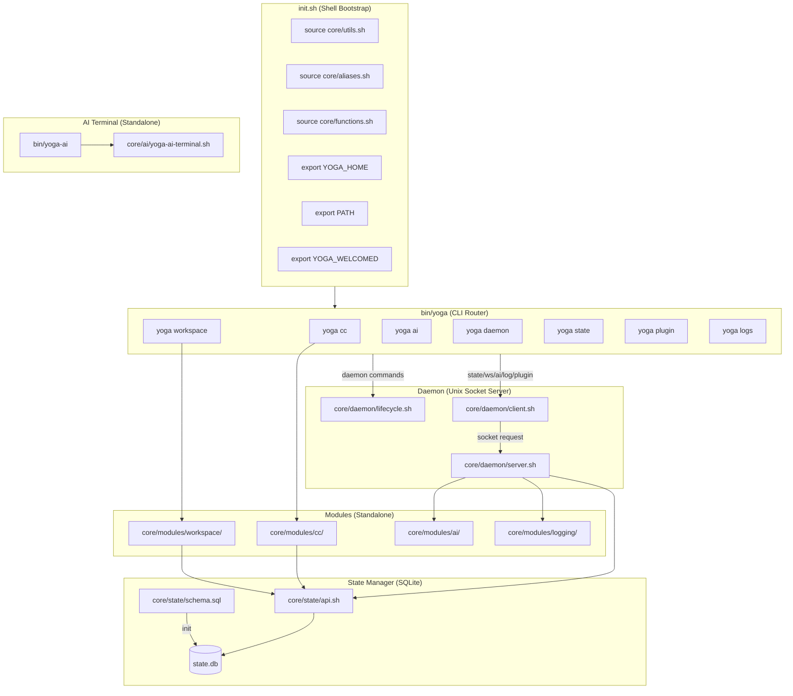
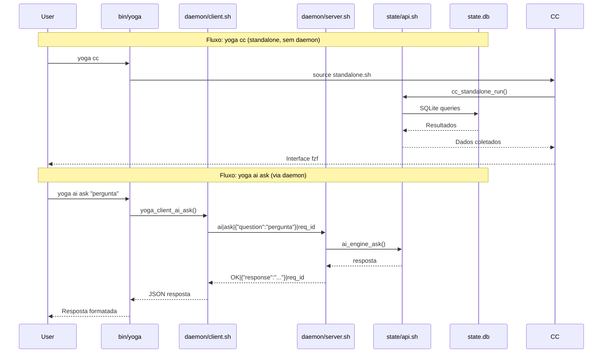
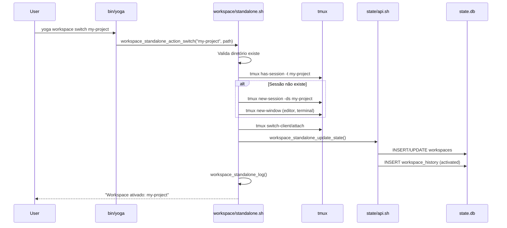
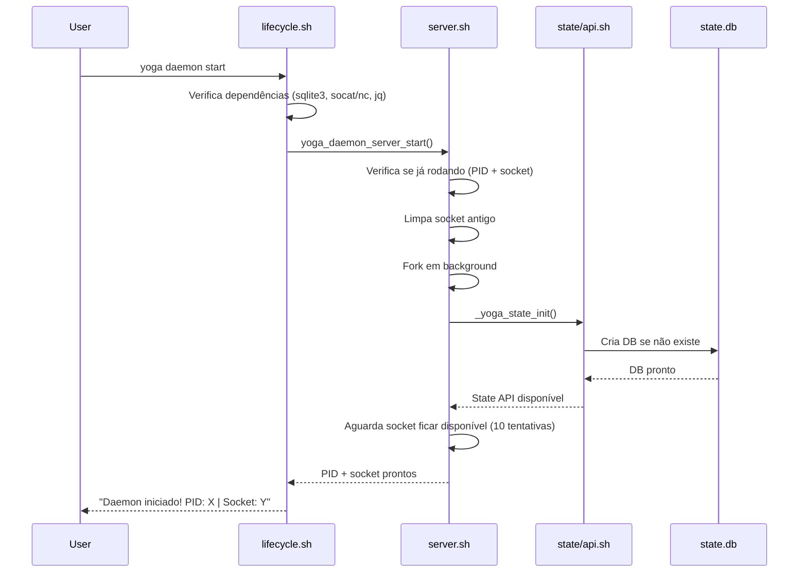
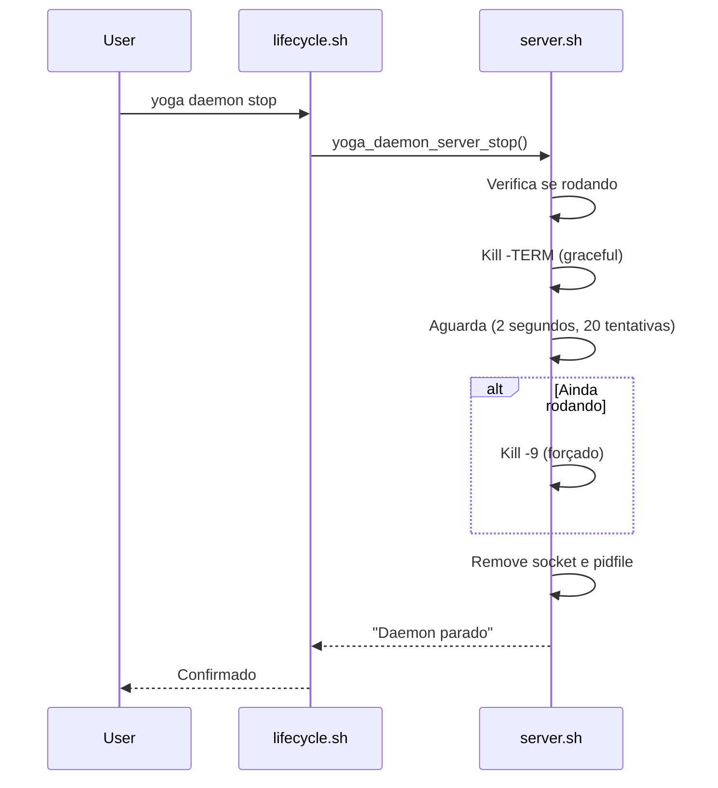

# Arquitetura — Yoga 3.0

## Visão Geral

O Yoga 3.0 adota arquitetura **CLI-first, daemon-required, standalone**. Cada módulo opera de forma independente, comunicando-se via Unix socket através de um daemon central que gerencia estado em SQLite.

## Diagrama de Arquitetura



## Diagrama de Fluxo de Dados



## Diagrama: yoga workspace switch



## Componentes

### init.sh

Arquivo de bootstrap, sourced no `.zshrc`. Responsabilidades:
- Define `YOGA_HOME` (default: `~/.yoga`)
- Sources `core/utils.sh`, `core/aliases.sh`, `core/functions.sh`
- Exporta `YOGA_HOME`, `PATH`, `YOGA_WELCOMED`
- **NÃO** carrega dashboard, **NÃO** instala alias trap

### bin/yoga (CLI Router)

Entry point principal da CLI. Sources:
- `core/utils/ui.sh`
- `core/daemon/lifecycle.sh`
- `core/daemon/client.sh`

Rotas de comando:

| Comando | Alias | Destino |
|---------|-------|---------|
| `daemon` | — | `yoga_daemon_command` |
| `cc` | — | `core/modules/cc/standalone.sh` |
| `workspace` | `ws` | `core/modules/workspace/standalone.sh` |
| `tunnel` | — | `bin/yoga-tunnel` |
| `ai` | `ask` | `yoga_client_ai_ask` (requer daemon) |
| `plugin` | `plugins` | `yoga_client_plugin_list` (requer daemon) |
| `state` | — | `yoga_client_state_get/set` (requer daemon) |
| `status` | — | `yoga_daemon_status` |
| `update` | — | git pull + restart daemon |
| `logs` | `log` | tail/show JSONL |
| `version` | `-v`, `--version` | Banner + info |
| `help` | `-h`, `--help` | Lista de comandos |

### Daemon

Arquivos: `core/daemon/{server.sh, client.sh, lifecycle.sh}`

#### server.sh — Servidor Unix Socket

Variáveis:
- `YOGA_SOCKET` → `${YOGA_HOME}/daemon.sock`
- `YOGA_PIDFILE` → `${YOGA_HOME}/daemon.pid`
- `YOGA_LOG` → `${YOGA_HOME}/logs/daemon.log`
- `PROTOCOL_VERSION` → `"1.0"`
- `DELIMITER` → `$'\x1E'` (ASCII Record Separator)

Funções:
- `yoga_daemon_server_start()` — Inicia servidor em background, aguarda socket
- `yoga_daemon_server_stop()` — Para servidor (graceful + force kill)
- `yoga_daemon_is_running()` — Verifica PID + socket
- `yoga_daemon_server_loop()` — Loop principal com socat
- `_yoga_daemon_handle_request()` — Parser de requests `MODULE|COMMAND|ARGS|REQ_ID`
- `_yoga_daemon_handle_state()` — Handler para módulo `state`
- `_yoga_daemon_handle_workspace()` — Handler para módulo `workspace`
- `_yoga_daemon_handle_cc()` — Handler para módulo `cc`
- `_yoga_daemon_handle_ai()` — Handler para módulo `ai`
- `_yoga_daemon_handle_log()` — Handler para módulo `log`
- `_yoga_daemon_handle_plugin()` — Handler para módulo `plugin`
- `_yoga_daemon_handle_daemon()` — Handler para módulo `daemon` (ping/stop/status)

#### client.sh — Cliente Unix Socket

Variáveis:
- `YOGA_SOCKET` → `${YOGA_HOME}/daemon.sock`
- `DELIMITER` → `$'\x1E'`
- `TIMEOUT` → `5`

Funções públicas:
- `_yoga_client_send(module, command, args_json)` — Envia request, recebe response
- `yoga_client_state_get(key, scope)` — Lê estado
- `yoga_client_state_set(key, value, scope)` — Escreve estado
- `yoga_client_workspace_list()` — Lista workspaces
- `yoga_client_workspace_create(name, path)` — Cria workspace
- `yoga_client_workspace_activate(id)` — Ativa workspace
- `yoga_client_cc_data()` — Dados do Command Center
- `yoga_client_ai_ask(question)` — Consulta IA
- `yoga_client_log_write(level, module, message)` — Escreve log
- `yoga_client_plugin_list()` — Lista plugins
- `yoga_client_daemon_ping()` — Ping no daemon
- `yoga_client_daemon_stop()` — Para daemon

#### lifecycle.sh — Gerenciamento de Ciclo de Vida

Funções:
- `yoga_daemon_start([--foreground])` — Inicia com check de dependências
- `yoga_daemon_stop([--force])` — Para com graceful/force
- `yoga_daemon_status()` — Status completo com estatísticas
- `yoga_daemon_restart()` — Stop + sleep + start
- `yoga_daemon_cleanup()` — Remove socket/pidfiles stale
- `yoga_daemon_command(action)` — CLI router para `yoga daemon <action>`

### State Manager

Arquivos: `core/state/{api.sh, schema.sql}`

API completa em `state-management.md`. Schema com 15 tabelas em `schema.sql`.

### Modules

Cada módulo tem versão standalone (sem daemon) e engine (via daemon):

| Módulo | Standalone | Engine |
|--------|-----------|--------|
| CC | `cc/standalone.sh` → `cc_standalone_run()` | `cc/engine.sh` (via daemon) |
| Workspace | `workspace/standalone.sh` → `workspace_standalone_list_interactive()` | `workspace/engine.sh` (via daemon) |
| AI | `ai/yoga-ai-terminal.sh` → `yoga_ai_terminal()` | `ai/engine.sh` → `ai_engine_ask()` |
| Logging | `logging/logger.sh` → `yoga_log()` | Integrado no daemon |

## Protocolo de Comunicação

### Formato de Mensagem

Mensagens são delimitadas por `<<<END>>>` no stream do socket.

Formato do request:
```
MODULE|COMMAND|ARGS_JSON|REQUEST_ID
```

Formato do response:
```
STATUS|RESPONSE_JSON|REQUEST_ID
```

### Categorias e Ações

| Categoria | Ações | Descrição |
|-----------|-------|-----------|
| `ping` | (nenhuma) | Health check, retorna `{"pong":true}` |
| `state` | `get`, `set`, `del`, `list` | Operações key-value |
| `workspace` | `list`, `create`, `activate`, `current`, `kill` | Gerenciamento de workspaces |
| `cc` | `data`, `execute` | Dados e execução do Command Center |
| `ai` | `ask`, `context_add`, `context_search` | Consultas IA e RAG |
| `log` | `write`, `query` | Logging estruturado |
| `plugin` | `list`, `enable`, `disable` | Gerenciamento de plugins |
| `daemon` | `ping`, `stop`, `status` | Controle do próprio daemon |

### Exemplo Request/Response

Request (state get):
```
state|get|{"key":"last_workspace","scope":"global"}|1681500000000
```

Response:
```
OK|{"key":"last_workspace","value":"my-project","scope":"global"}|1681500000000
```

## Sequência de Startup



## Sequência de Shutdown



## Dependências Detalhadas

| Dependência | Uso | Módulo |
|-------------|-----|--------|
| `zsh` | Shell principal | Todos |
| `fzf` | Interface interativa | CC, Workspace |
| `tmux` | Sessões de workspace | Workspace |
| `jq` | Parse/formatação JSON | Daemon, State, AI, Logging |
| `sqlite3` | Banco de dados | State, CC, AI |
| `socat` | Comunicação socket Unix | Daemon (preferível) |
| `nc` | Comunicação socket (fallback) | Daemon |
| `git` | Versão controle, auto-update | bin/yoga, Update |
| `asdf` | Gerenciamento de versões | init.sh, bin/yoga-asdf |
| `nvim` | Editor integrado | CC (Ctrl-E), aliases |
| `curl` | HTTP requests | AI (Ollama, OpenAI) |