# Bin Reference

Complete reference for every executable in `bin/`.

## Entry Points e Dependências

```mermaid
flowchart TD
    yoga["bin/yoga<br/>(CLI router)"]
    yoga --> ui["core/utils/ui.sh"]
    yoga --> lifecycle["core/daemon/lifecycle.sh"]
    yoga --> client["core/daemon/client.sh"]

    yoga_daemon["bin/yoga-daemon"]
    yoga_daemon --> ui
    yoga_daemon --> server["core/daemon/server.sh"]

    yoga_tunnel["bin/yoga-tunnel"]
    yoga_tunnel --> ui
    yoga_tunnel --> cf_tunnels["$HOME/cf-tunnels/run.sh"]

    yoga_ai["bin/yoga-ai"]
    yoga_ai --> ai_terminal["core/ai/yoga-ai-terminal.sh"]

    yoga_asdf["bin/yoga-asdf"]
    yoga_asdf --> init["init.sh"]
    yoga_asdf --> asdf_interactive["core/version-managers/asdf/interactive.sh"]

    yoga_create["bin/yoga-create"]
    yoga_doctor["bin/yoga-doctor"]
    yoga_doctor --> utils["core/utils.sh"]

    yoga_status["bin/yoga-status"]
    yoga_status --> utils

    yoga_plugin["bin/yoga-plugin"]
    yoga_wizard["bin/git-wizard"]
    yoga_wizard --> git_wiz["core/git/git-wizard.sh"]

    yoga_update["bin/yoga-update"]
    yoga_update_docs["bin/yoga-update-docs"]
    yoga_update_docs --> ui

    yoga_remove["bin/yoga-remove"]
    yoga_remove --> init

    opencode_compile["bin/opencode-compile"]

    asdf_menu["bin/asdf-menu"]
    asdf_menu --> asdf_interactive

    create_js["bin/create_js_project"]
    create_js --> yoga_create
```



---

## yoga — Main CLI

**File:** `bin/yoga`
**Sources:** `core/utils/ui.sh`, `core/daemon/lifecycle.sh`, `core/daemon/client.sh`

Main entry point. Routes subcommands to internal functions.

### Subcommands

| Subcommand | Aliases | Function | Description |
|-----------|---------|----------|-------------|
| `daemon` | — | `yoga_daemon_command` | Manage daemon (start/stop/restart/status) |
| `cc` | — | `_yoga_cmd_cc` | Command Center (fzf interactive) |
| `workspace` | `ws` | `_yoga_cmd_workspace` | Workspace Manager (tmux) |
| `tunnel` | — | `_yoga_cmd_tunnel` | Cloudflare Tunnels |
| `ai` | `ask` | `_yoga_cmd_ai` | AI Assistant |
| `plugin` | `plugins` | `_yoga_cmd_plugin` | Plugin lifecycle |
| `state` | — | `_yoga_cmd_state` | State manager (get/set/del/list) |
| `status` | — | `yoga_daemon_status` | Daemon and environment status |
| `update` | — | `_yoga_cmd_update` | Self-update via git pull |
| `logs` | `log` | `_yoga_cmd_logs` | View/tail logs |
| `version` | `-v`, `--version` | `_yoga_cmd_version` | Show version |
| `help` | `-h`, `--help` | `_yoga_cmd_help` | Show help |

### yoga cc

Interactive command center using fzf. Sources `core/modules/cc/standalone.sh`.

```bash
yoga cc                    # Launch CC
yoga cc --query="git"      # Pre-filtered search
```

### yoga workspace

Workspace manager with tmux integration. Sources `core/modules/workspace/standalone.sh`.

```bash
yoga workspace list               # List workspaces (fzf)
yoga workspace list --open         # List only open workspaces
yoga workspace list --simple        # List (one per line)
yoga workspace list --simple --open # List only open (one per line)
yoga workspace create myproject    # Create workspace
yoga workspace switch myproject    # Switch to workspace
yoga workspace activate myproject  # Alias for switch
yoga workspace kill myproject      # Remove workspace
yoga workspace delete myproject    # Alias for kill
yoga ws list                      # Abbreviated
yoga ws create myproject
yoga ws switch myproject
yoga ws kill myproject
```

### yoga tunnel

Wrapper for `~/cf-tunnels/run.sh`. Sources `bin/yoga-tunnel`.

```bash
yoga tunnel list
yoga tunnel add
yoga tunnel remove
yoga tunnel start
yoga tunnel stop
yoga tunnel status
yoga tunnel logs
yoga tunnel hud
```

**Requires:** `$HOME/cf-tunnels/run.sh` to exist.

### yoga ai

AI assistant. Requires daemon running. Sources `core/ai/yoga-ai-terminal.sh` via daemon.

```bash
yoga ai ask "how to grep recursively?"
yoga ai context                   # Add context (future)
```

### yoga plugin

Plugin lifecycle management. Sources `bin/yoga-plugin`.

```bash
yoga plugin list                  # List installed + enabled
yoga plugin install myplugin https://github.com/user/plugin
yoga plugin enable myplugin
yoga plugin disable myplugin
```

### yoga state

State manager via daemon client.

```bash
yoga state get <key>              # Get value (default scope: global)
yoga state get <key> <scope>      # Get value with scope
yoga state set <key> <value>       # Set value (global scope)
yoga state set <key> <value> <scope>  # Set with scope
yoga state list                   # List keys (global scope)
yoga state list <scope>           # List keys in scope
yoga state delete <key>           # Delete key
```

### yoga status

Shows daemon status and environment info.

### yoga update

Self-update via `git pull origin main`. Checks for updates, stops daemon if running, pulls changes.

### yoga logs

```bash
yoga logs tail                    # Follow logs (Ctrl+C to exit)
yoga logs show                    # Show last 50 log entries
yoga logs show 100                # Show last 100 entries
```

### yoga version

Shows version info: version string, codename, release year, YOGA_HOME path, daemon status.

---

## yoga-daemon

**File:** `bin/yoga-daemon`
**Sources:** `core/utils/ui.sh`, `core/daemon/server.sh`

Starts the Yoga daemon.

```bash
yoga-daemon                    # Start daemon (background)
yoga-daemon --foreground       # Start daemon (foreground, for debug)
```

Environment variables:
- `YOGA_HOME` — Root directory
- `YOGA_SOCKET` — Unix socket path
- `YOGA_PIDFILE` — PID file path
- `YOGA_LOG` — Log file path

---

## yoga-tunnel

**File:** `bin/yoga-tunnel`
**Version:** 3.0.0
**Sources:** `core/utils/ui.sh`

Wrapper for Cloudflare Tunnels (`~/cf-tunnels/run.sh`) with Yoga UI and logging.

```bash
yoga tunnel list
yoga tunnel add --hostname api.example.com --type http --service localhost:3000
yoga tunnel remove <name>
yoga tunnel start <name>
yoga tunnel stop <name>
yoga tunnel status
yoga tunnel logs
yoga tunnel hud
```

**Requires:** `$HOME/cf-tunnels/run.sh` — Errors if not found.

Logs every invocation to `${YOGA_HOME}/logs/yoga.jsonl`.

---

## yoga-ai

**File:** `bin/yoga-ai`
**Sources:** `core/ai/yoga-ai-terminal.sh`

Terminal AI assistant entry point.

```bash
yoga-ai help "how to grep in .js files?"
yoga-ai fix "git comit -m 'msg'"
yoga-ai cmd "find files modified today"
yoga-ai explain "tar -czf backup.tar.gz --exclude=node_modules ."
yoga-ai "what is serverless?"
yoga-ai code "TypeScript function to validate CPF"
yoga-ai debug "TypeError: Cannot read property 'map' of undefined"
yoga-ai optimize "for (let i = 0; i < arr.length; i++) ..."
yoga-ai learn "Server Components in Next.js 14"
yoga-ai --help
```

Available modes: help, fix, cmd, explain, debug, code, optimize, learn, chat (free)

---

## yoga-asdf

**File:** `bin/yoga-asdf`
**Sources:** `init.sh`, `$HOME/.asdf/asdf.sh`

Yoga wrapper for ASDF interactive menu.

```bash
yoga-asdf           # Launch interactive ASDF menu
```

Delegates to `core/version-managers/asdf/interactive.sh`.

---

## yoga-create

**File:** `bin/yoga-create`

Project scaffolding from templates.

```bash
yoga-create react my-app           # React + TypeScript (Vite)
yoga-create node my-api             # Node.js + TypeScript
yoga-create next my-frontend        # Next.js + TypeScript
yoga-create ts my-lib               # TypeScript library
yoga-create express my-server       # Express + TypeScript
yoga-create community nextjs my-site # Community: Next.js
yoga-create community react-vite my-app  # Community: React + Vite
```

Community templates require `$YOGA_HOME/templates/community/index.yaml`.

---

## yoga-doctor

**File:** `bin/yoga-doctor`

Environment health checker.

```bash
yoga-doctor           # Standard check
yoga-doctor --full    # Full diagnostics
yoga-doctor --report  # Generate report
```

Checks: required tools (zsh, bash, git, curl, fzf, tmux, nvim, node, npm, jq, sqlite3, socat), optional tools (python, docker, asdf), directory structure, config files, shell integration.

---

## yoga-status

**File:** `bin/yoga-status`

Shows environment status by calling `yoga_status` from `core/utils.sh`.

```bash
yoga-status
```

Displays: YOGA_HOME path, shell version, ASDF versions, Node version, git branch, tmux sessions, system info.

---

## yoga-remove

**File:** `bin/yoga-remove`

Remove ASDF-managed language versions completely.

```bash
yoga-remove nodejs        # Remove all Node.js versions + plugin
yoga-remove python         # Remove all Python versions + plugin
yoga-remove all            # Remove everything
```

Functions:
- `cleanup_tool_versions` — Clean .tool-versions entries
- `remove_plugin` — Uninstall ASDF plugin
- `offer_plugin_removal` — Interactive prompt to remove plugin

Sources: `init.sh`, `$HOME/.asdf/asdf.sh`

---

## yoga-plugin

**File:** `bin/yoga-plugin`

Plugin lifecycle management.

```bash
yoga-plugin list                                    # List installed + enabled plugins
yoga-plugin install myplugin https://github.com/user/plugin  # Install from git
yoga-plugin enable myplugin                         # Enable plugin
yoga-plugin disable myplugin                        # Disable plugin
```

Configuration stored in `$YOGA_HOME/config.yaml` under `plugins.enabled` and `$YOGA_HOME/plugins/` directory.

Functions: `cfg_file`, `ensure_cfg`, `list_plugins`, `enable_plugin`, `disable_plugin`, `install_plugin`, `usage`

---

## yoga-templates

**File:** `bin/yoga-templates`

List and show community project templates.

```bash
yoga-templates list                # List available templates
yoga-templates show <name>          # Show template details
```

Reads from `$YOGA_HOME/templates/community/index.yaml`.

---

## yoga-update

**File:** `bin/yoga-update`

Self-update mechanism.

```bash
yoga-update
```

Also runs: `npm update -g` and `asdf plugin update --all` after pulling changes.

---

## yoga-update-docs

**File:** `bin/yoga-update-docs`

Safe documentation updater. Copies/updates docs without modifying settings.

```bash
yoga-update-docs
```

Uses `yoga_ar`, `yoga_terra`, `yoga_fogo`, `yoga_agua` color functions for output.

---

## asdf-menu

**File:** `bin/asdf-menu`

Simple wrapper that delegates to `core/version-managers/asdf/interactive.sh`.

```bash
asdf-menu
```

---

## create_js_project

**File:** `bin/create_js_project`

Thin wrapper that delegates to `bin/yoga-create`.

```bash
create_js_project react my-app
```

---

## git-wizard

**File:** `bin/git-wizard`

Interactive Git profile management. Delegates to `core/git/git-wizard.sh`.

```bash
git-wizard
```

---

## opencode-compile

**File:** `bin/opencode-compile`

Compiles all `.opencode/rules/*.md` files into the compiled block at the bottom of `AGENTS.md`.

```bash
opencode-compile
```

Functions: `collect_md_files`, `compile_section`, `upsert`

Reads `.opencode/commands/*.md` and `.opencode/rules/*.md`, compiles them into the `<!-- BEGIN OPENCODE AUTO -->` section of `AGENTS.md`.