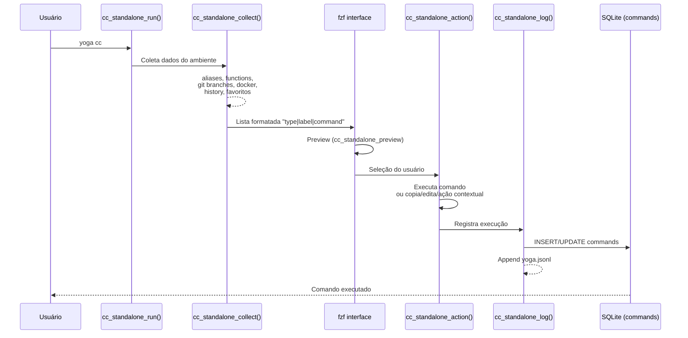

# CC Module (Command Center)

## Visão Geral

Módulo **Command Center** - Interface interativa fzf para comandos.

Versão: 3.0.0  
Standalone: Sim (não depende de ~/.zsh/)  
Arquivo: `core/modules/cc/standalone.sh`

## Funcionalidade

Reimplementação nativa do comportamento da função `cc()` original, mas:
- 100% independente
- Não chama ~/.zsh/functions/cc.sh
- Logging silencioso em SQLite
- Favoritos automáticos

## Uso

```bash
yoga cc                    # Interface interativa
yoga cc --query="git"      # Busca pré-filtrada
```

## Arquitetura



## Funções

### cc_standalone_run()

**Descrição:** Inicia Command Center interativo

**Uso:** `cc_standalone_run [query] [filter_type]`

**Parâmetros:**
- `query` (opcional): String para pré-filtrar
- `filter_type` (opcional): Tipo (alias, function, git, docker, history)

**Retorno:** Executa comando selecionado

**Side-effects:**
- Log no SQLite (tabela `commands`)
- Atualiza `last_cc_command`
- Atualiza `cc_usage_count`

**Exemplo:**
```bash
cc_standalone_run
cc_standalone_run "git" "alias"
```

### cc_standalone_collect()

**Descrição:** Coleta dados do ambiente

**Uso:** `cc_standalone_collect [filter_type]`

**Retorno:** Lista formatada "type|label|command"

**Coleta:**
1. Aliases do shell
2. Funções definidas
3. Git branches (se em repo)
4. Docker containers
5. Histórico de comandos
6. Favoritos do usuário (SQLite)

### cc_standalone_preview()

**Descrição:** Gera preview para fzf

**Uso:** `cc_standalone_preview <line>`

**Parâmetros:**
- `line`: String no formato "type|label|command"

**Preview por tipo:**
- alias: Mostra comando
- function: Mostra `type` da função
- git: Mostra log recente
- docker: Mostra status
- history: Mostra comando

### cc_standalone_action()

**Descrição:** Processa ação selecionada

**Uso:** `cc_standalone_action <key> <line>`

**Ações por tecla:**
- `Enter`: Executa comando
- `Ctrl-Y`: Copia para clipboard
- `Ctrl-E`: Abre no nvim
- `Ctrl-X`: Ação contextual

### cc_standalone_contextual()

**Descrição:** Ação especial por tipo

**Uso:** `cc_standalone_contextual <type> <cmd> <label>`

**Ações:**
- git: `git checkout <branch>`
- docker: `docker exec -it <container> bash`

### cc_standalone_log()

**Descrição:** Log silencioso

**Side-effects:**
- Insere/atualiza tabela `commands` no SQLite
- Append em `~/.yoga/logs/yoga.jsonl`

**Campos SQLite:**
- type, command, description, status, usage_count, last_used

### cc_standalone_update_favorite()

**Descrição:** Marca como favorito se usado 5+ vezes

**Lógica:**
- Verifica usage_count
- Se > 5, seta is_favorite=1

## Keybindings

| Tecla | Ação |
|-------|------|
| Enter | Executa comando |
| Ctrl-Y | Copia para clipboard |
| Ctrl-E | Abre no nvim |
| Ctrl-X | Ação contextual |

## State

**Tabela SQLite:** `commands`

```sql
CREATE TABLE commands (
  id INTEGER PRIMARY KEY,
  type TEXT,
  command TEXT UNIQUE,
  description TEXT,
  usage_count INTEGER DEFAULT 1,
  is_favorite BOOLEAN DEFAULT 0,
  status TEXT,
  last_used DATETIME
);
```

## Logs

**Arquivo:** `~/.yoga/logs/yoga.jsonl`

**Formato:**
```json
{
  "timestamp": "2026-04-13T20:00:00",
  "level": "INFO",
  "module": "cc",
  "command": "git status",
  "type": "alias",
  "status": "success",
  "duration_ms": 150
}
```

## Troubleshooting

### "fzf não encontrado"
**Solução:** `apt install fzf` ou `brew install fzf`

### Comandos não aparecem
**Verificar:** Shell precisa ter aliases e funções definidas

## Integração

Este módulo é **standalone**.
Não chama funções externas de ~/.zsh/.
Reimplementa comportamento de cc() original.

