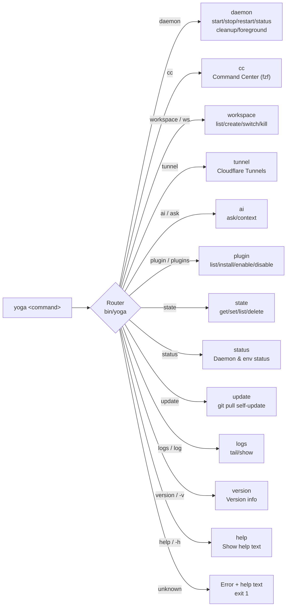

# Yoga CLI Reference

Complete reference for all `yoga` subcommands and standalone executables.

## Roteamento de Comandos



---

## Table of Contents

- [yoga (Main CLI)](#yoga-main-cli)
- [Subcommands](#subcommands)
  - [daemon](#daemon)
  - [cc (Command Center)](#cc-command-center)
  - [workspace / ws](#workspace--ws)
  - [tunnel](#tunnel)
  - [ai / ask](#ai--ask)
  - [plugin / plugins](#plugin--plugins)
  - [state](#state)
  - [status](#status)
  - [update](#update)
  - [logs / log](#logs--log)
  - [version](#version)
  - [help](#help)
- [Standalone Executables](#standalone-executables)
  - [yoga-daemon](#yoga-daemon)
  - [yoga-tunnel](#yoga-tunnel)
  - [yoga-ai](#yoga-ai)
  - [yoga-asdf](#yoga-asdf)
  - [yoga-create](#yoga-create)
  - [yoga-doctor](#yoga-doctor)
  - [yoga-status](#yoga-status-bin)
  - [yoga-remove](#yoga-remove)
  - [yoga-plugin](#yoga-plugin-bin)
  - [yoga-templates](#yoga-templates)
  - [yoga-update](#yoga-update-bin)
  - [yoga-update-docs](#yoga-update-docs)
  - [asdf-menu](#asdf-menu)
  - [create_js_project](#create_js_project)
  - [git-wizard](#git-wizard)
  - [opencode-compile](#opencode-compile)

---

## yoga (Main CLI)

**File:** `bin/yoga` (466 lines)
**Shell:** `#!/usr/bin/env zsh`
**Sources:** `core/utils/ui.sh`, `core/daemon/lifecycle.sh`, `core/daemon/client.sh`

### Syntax

```
yoga <command> [args...]
```

### Environment Variables

| Variable | Default | Description |
|----------|---------|-------------|
| `YOGA_HOME` | `$HOME/.yoga` | Root directory for yoga-files installation |

### Behavior

On startup, `yoga` sources three core modules:

1. **`core/utils/ui.sh`** — Colorized output functions (`yoga_fogo`, `yoga_terra`, etc.) and ANSI color exports
2. **`core/daemon/lifecycle.sh`** — Daemon start/stop/restart/status/cleanup management (sources `server.sh` + `state/api.sh` transitively)
3. **`core/daemon/client.sh`** — Unix socket client for communicating with the daemon (`_yoga_client_send` and high-level API functions)

For commands `daemon`, `cc`, `workspace`, `ai`, `plugin`, `state`, `update`, and `version`, the CLI displays the Yoga 3.0 banner via `yoga_banner` before executing.

### Unknown Command Handling

If an unrecognized subcommand is provided, `yoga` prints a red error message with the unknown command name and then displays the help text, returning exit code 1.

---

## Subcommands

### daemon

**Internal function:** `yoga_daemon_command`
**Source:** `core/daemon/lifecycle.sh`

Manages the Yoga daemon background process. The daemon is a Unix socket server that handles state, workspaces, AI queries, logging, and plugin management.

#### Syntax

```
yoga daemon <action>
```

#### Actions

| Action | Description |
|--------|-------------|
| `start` | Start the daemon in background mode |
| `stop` | Stop the running daemon |
| `restart` | Stop then start the daemon |
| `status` | Show daemon PID, uptime, socket path, database location, log path, and statistics |
| `cleanup` | Remove stale socket and PID files if daemon is not running |
| `foreground` | Start the daemon in foreground mode (blocking) |

#### Dependencies Checked on Start

- `sqlite3` — Required for state management
- `socat` or `nc` — Required for Unix socket communication
- `jq` — Required for JSON parsing

#### Directories Created

- `$YOGA_HOME/logs/` — Created if missing
- `$YOGA_HOME/plugins/` — Created if missing

#### Side Effects

- Writes to `$YOGA_HOME/daemon.pid` (PID file)
- Creates `$YOGA_HOME/daemon.sock` (Unix domain socket)
- Writes to `$YOGA_HOME/state.db` (SQLite database, auto-initialized from `core/state/schema.sql`)
- Logs to `$YOGA_HOME/logs/daemon.log`

#### Examples

```bash
yoga daemon start        # Start daemon in background
yoga daemon foreground   # Start daemon in foreground (Ctrl+C to stop)
yoga daemon status       # Show daemon info and statistics
yoga daemon stop         # Graceful stop
yoga daemon restart      # Restart daemon
yoga daemon cleanup      # Remove stale socket/PID files
```

#### Error Messages

- `💾 SQLite3 não instalado!` — SQLite3 is not installed
- `🔌 Socat ou nc não instalados!` — Neither socat nor nc is available
- `📦 jq não instalado!` — jq is not installed
- `👹 Daemon não está rodando` — Daemon PID file missing or process not alive
- `👹 Falha ao iniciar daemon!` — Socket file was not created within timeout

---

### cc (Command Center)

**Internal function:** `_yoga_cmd_cc`
**Source:** `core/modules/cc/standalone.sh`
**Aliases:** None (only `cc`)

Interactive command center using fzf (or gum if available).

#### Syntax

```
yoga cc
```

#### Behavior

Sources `core/modules/cc/standalone.sh` and calls `cc_standalone_run` with any arguments. The Command Center aggregates aliases, shell functions, git branches, Docker containers, executable scripts, and shell history into an interactive fzf/gum picker.

#### Key Bindings (in fzf)

| Key | Action |
|-----|--------|
| `Enter` | Execute selected item |
| `Ctrl-Y` | Copy command to clipboard |
| `Ctrl-E` | Open command in nvim |
| `Ctrl-X` | Run `cc_action` for context-aware execution |

#### Examples

```bash
yoga cc    # Opens interactive command center
```

---

### workspace / ws

**Internal function:** `_yoga_cmd_workspace`
**Source:** `core/modules/workspace/standalone.sh`
**Aliases:** `ws`

Workspace manager powered by SQLite (via `core/state/api.sh`) and tmux.

#### Syntax

```
yoga workspace <action> [args...]
yoga ws <action> [args...]
```

#### Actions

| Action | Aliases | Arguments | Description |
|--------|---------|-----------|-------------|
| `list` | `ls` | `[--simple]` | List workspaces. `--simple` for plain output, default is interactive |
| `create` | `new` | `<name> [path]` | Create a new workspace. Default path is `$CODE_DIR/<name>` or `$(pwd)` |
| `activate` | `switch`, `use` | `<name>` | Switch to a workspace by name. Path defaults to `$CODE_DIR/<name>` |
| `kill` | `rm`, `delete` | `<name>` | Delete a workspace from the database |

#### Side Effects

- Reads/writes `$YOGA_HOME/state.db` (workspaces table, workspace_history table)
- Calls `workspace_standalone_action_switch` to activate tmux sessions
- Calls `workspace_standalone_action_kill` to remove workspace DB entries

#### Error Messages

- `🏷️ Nome é obrigatório!` — Name argument missing
- `🌌 Workspace não encontrado: <identifier>` — Workspace ID or name not found in database

#### Examples

```bash
yoga ws list                  # Interactive workspace list
yoga ws list --open           # List only open workspaces
yoga ws ls --simple           # Plain text workspace list
yoga ws ls --simple --open    # Plain text only open workspaces
yoga ws create my-project     # Create workspace in $CODE_DIR/my-project
yoga ws create my-proj ~/dev # Create workspace in ~/dev
yoga ws switch my-project     # Activate workspace
yoga ws kill my-project       # Remove workspace
```

---

### tunnel

**Internal function:** `_yoga_cmd_tunnel`
**Source:** `bin/yoga-tunnel`

Cloudflare Tunnel wrapper that delegates to `~/cf-tunnels/run.sh`.

#### Syntax

```
yoga tunnel [args...]
```

#### Behavior

Any arguments are passed directly to `~/cf-tunnels/run.sh`. Before execution, checks that `$HOME/cf-tunnels/` directory and `$HOME/cf-tunnels/run.sh` exist.

#### Side Effects

- Appends a JSONL entry to `$YOGA_HOME/logs/yoga.jsonl` with timestamp, module, and arguments

#### Error Messages

- `🚇 cf-tunnels não encontrado em $HOME/cf-tunnels` — cf-tunnels directory missing
- `❌ $HOME/cf-tunnels/run.sh não encontrado` — run.sh script missing

#### Examples

```bash
yoga tunnel list
yoga tunnel add --hostname api.example.com --type http --service localhost:3000
yoga tunnel hud
```

---

### ai / ask

**Internal function:** `_yoga_cmd_ai`
**Source:** `core/daemon/client.sh` (uses `yoga_client_ai_ask`)
**Aliases:** `ask`

AI Assistant powered by the daemon's AI module.

#### Syntax

```
yoga ai [ask|query] <question>
yoga ask <question>
```

#### Actions

| Action | Aliases | Arguments | Description |
|--------|---------|-----------|-------------|
| `ask` | `query` | `<question>` | Send a question to the AI. If no question provided, prompts interactively |
| `context` | `ctx` | — | Future feature: add context (not yet implemented) |

#### Prerequisites

- Daemon must be running (`yoga_daemon_is_running` check)

#### Error Messages

- `👹 Daemon não está rodando!` — Daemon is not running
- `❓ Pergunta é obrigatória!` — No question provided

#### Examples

```bash
yoga ai ask "How to list modified files in git"
yoga ai "What does docker ps -a do?"
```

---

### plugin / plugins

**Internal function:** `_yoga_cmd_plugin`
**Source:** `core/daemon/client.sh` (uses `yoga_client_plugin_list`)
**Aliases:** `plugins`

Plugin lifecycle management.

#### Syntax

```
yoga plugin <action> [args...]
yoga plugins <action> [args...]
```

#### Actions

| Action | Arguments | Description |
|--------|-----------|-------------|
| `list` | `ls` | List all plugins via daemon API |
| `install` | `<source>` | Install plugin from source (future feature) |
| `enable` | `<name>` | Enable a plugin by name (future feature) |
| `disable` | `<name>` | Disable a plugin by name (future feature) |
| `remove` | `uninstall` `<name>` | Remove a plugin (future feature) |

#### Prerequisites

- Daemon must be running

#### Error Messages

- `👹 Daemon não está rodando!` — Daemon is not running
- `📦 Fonte é obrigatória!` — Install source missing
- `🏷️ Nome é obrigatório!` — Plugin name missing
- `❌ Ação desconhecida: <action>` — Unknown action

#### Examples

```bash
yoga plugin list       # List installed plugins
yoga plugin install https://github.com/user/yoga-plugin-x
yoga plugin enable my-plugin
yoga plugin disable my-plugin
```

---

### state

**Internal function:** `_yoga_cmd_state`
**Source:** `core/daemon/client.sh` (uses `yoga_client_state_get`, `yoga_client_state_set`)
**Aliases:** None

State manager for key-value data stored in SQLite.

#### Syntax

```
yoga state <action> [args...]
```

#### Actions

| Action | Arguments | Description |
|--------|-----------|-------------|
| `get` | `<key> [scope]` | Retrieve a value by key. Default scope is `global` |
| `set` | `<key> <value> [scope]` | Store a key-value pair. Default scope is `global` |
| `list` | `ls` `[scope]` | List all keys in a scope (future feature) |
| `delete` | `del`, `rm` `<key>` | Delete a key (future feature) |

#### Prerequisites

- Daemon must be running

#### Side Effects

- Reads/writes `$YOGA_HOME/state.db` (state table)

#### Error Messages

- `👹 Daemon não está rodando!` — Daemon is not running
- `🔑 Key é obrigatória!` — Key argument missing
- `🔑 Key e Value são obrigatórios!` — Key or value missing for set

#### Examples

```bash
yoga state get editor            # Get value of "editor" in global scope
yoga state set editor nvim       # Set "editor" to "nvim" in global scope
yoga state set editor vim ws-1   # Set "editor" to "vim" in workspace scope "ws-1"
yoga state list                  # List keys in global scope
yoga state delete editor         # Delete "editor" key
```

---

### status

**Internal function:** `yoga_daemon_status`
**Source:** `core/daemon/lifecycle.sh`

Displays daemon status information including PID, uptime, socket path, database location, and log file. If the daemon is running, also shows workspace count, plugin count, and log count from the SQLite database.

#### Syntax

```
yoga status
```

#### Output (when running)

```
📊 Status do Yoga Daemon
────────────────────────────────────

🧘 Workspace Status
🔹 PID: 12345
🔹 Uptime: 01:23:45
🔹 Socket: ~/.yoga/daemon.sock
🔹 Database: ~/.yoga/state.db
🔹 Log: ~/.yoga/logs/daemon.log

📈 Statistics
  🌌 Workspaces: 3
  🔌 Plugins: 2
  📝 Logs: 42
```

#### Output (when stopped)

```
👹 Daemon não está rodando
💡 Inicie com: yoga daemon start
```

---

### update

**Internal function:** `_yoga_cmd_update`
**Source:** `bin/yoga` (inline in main CLI)

Self-update for yoga-files using git.

#### Syntax

```
yoga update
```

#### Behavior

1. Checks if `$YOGA_HOME` is a git repository
2. Records current commit ref
3. Runs `git fetch origin`
4. Checks if local is behind `origin/main` by counting commits
5. If behind, prompts for confirmation before pulling
6. If daemon is running, stops it before update
7. Runs `git pull origin main`
8. Advises restarting daemon

#### Side Effects

- Stops daemon if running (`yoga_daemon_stop`)
- Runs `git fetch origin` and `git pull origin main`

#### Error Messages

- `❌ Instalação não é um repositório git` — Not a git checkout
- `❌ Falha na atualização!` — Git pull failed
- `❌ Falha ao verificar atualizações` — Git fetch failed

#### Examples

```bash
yoga update    # Check for and apply updates
```

---

### logs / log

**Internal function:** `_yoga_cmd_logs`
**Source:** `bin/yoga` (inline in main CLI)
**Aliases:** `log`

View and tail daemon logs.

#### Syntax

```
yoga logs <action>
yoga log <action>
```

#### Actions

| Action | Aliases | Arguments | Description |
|--------|---------|-----------|-------------|
| `tail` | `follow`, `f` | — | Follow logs in real-time (like `tail -f`). Parses JSONL and formats output |
| `list` | `show` | `[count]` | Show last N log entries. Default count is 50 |

#### Log Format

Logs are stored in `$YOGA_HOME/logs/yoga.jsonl` as JSON Lines. Each line is a JSON object with `timestamp`, `level`, `module`, and `message` fields. The output is formatted as:

```
[2026-04-14T10:30:00] [INFO] [workspace] Workspace activated
```

#### Error Messages

- `❌ Arquivo de log não encontrado` — `$YOGA_HOME/logs/yoga.jsonl` does not exist

#### Examples

```bash
yoga logs tail        # Follow logs in real-time (Ctrl+C to stop)
yoga logs follow      # Same as tail
yoga logs list        # Show last 50 entries
yoga logs show 100    # Show last 100 entries
```

---

### version

**Internal function:** `_yoga_cmd_version`
**Source:** `bin/yoga` (inline in main CLI)
**Aliases:** `-v`, `--version`

Displays version information and daemon status.

#### Syntax

```
yoga version
yoga -v
yoga --version
```

#### Output

```
╭──────────────────────────────────────╮
│  🦜  YOGA 3.0 - Lôro Barizon Edition  │
│     ✨ Engine de Desenvolvimento     │
╰──────────────────────────────────────╯

🔧 Propriedade          📋 Valor
────────────────────────────────────────────────
🎨 Versão               3.0.0-Lôro Barizon
🏷️ Codename              🦜 Lôro Barizon Edition
📅 Release               2026
📦 YOGA_HOME             ~/.yoga

👹 Daemon: Rodando (v1.0)  # or: 👹 Daemon: Parado
```

---

### help

**Internal function:** `_yoga_cmd_help`
**Source:** `bin/yoga` (inline in main CLI)
**Aliases:** `-h`, `--help`

Displays the available commands help text with the Yoga banner.

#### Syntax

```
yoga help
yoga -h
yoga --help
```

---

## Standalone Executables

### yoga-daemon

**File:** `bin/yoga-daemon` (30 lines)
**Shell:** `#!/usr/bin/env zsh`

Starts the Yoga daemon server directly.

#### Syntax

```
yoga-daemon [--foreground]
```

#### Arguments

| Argument | Description |
|----------|-------------|
| `--foreground` | Run daemon in foreground mode (blocking). Shows banner and waits for Ctrl+C |
| (none) | Run daemon in background mode |

#### Behavior

1. Sets `YOGA_HOME` (default: `$HOME/.yoga`)
2. Sources `core/utils/ui.sh` and `core/daemon/server.sh`
3. If `--foreground`, displays banner and header, then calls `yoga_daemon_start --foreground`
4. Otherwise, calls `yoga_daemon_start` (background)

#### Side Effects

- Creates `$YOGA_HOME/daemon.pid` (PID file)
- Creates `$YOGA_HOME/daemon.sock` (Unix socket)
- Initializes `$YOGA_HOME/state.db` if not present

---

### yoga-tunnel

**File:** `bin/yoga-tunnel` (59 lines)
**Shell:** `#!/usr/bin/env zsh`

Cloudflare Tunnel wrapper with Yoga UI.

#### Syntax

```
yoga-tunnel [args...]
```

#### Behavior

1. Validates `$HOME/cf-tunnels/` directory exists
2. Validates `$HOME/cf-tunnels/run.sh` exists
3. Displays Yoga-themed header
4. Delegates all arguments to `$HOME/cf-tunnels/run.sh`
5. Appends a JSONL log entry to `$YOGA_HOME/logs/yoga.jsonl`

#### Error Messages

- `🚇 cf-tunnels não encontrado em $HOME/cf-tunnels` — Directory missing, with install instructions
- `❌ $HOME/cf-tunnels/run.sh não encontrado` — Script missing

---

### yoga-ai

**File:** `bin/yoga-ai` (46 lines)
**Shell:** `#!/usr/bin/env bash`

AI assistant terminal interface.

#### Syntax

```
yoga-ai <mode> <query...>
yoga-ai --help
```

#### Modes

| Mode | Description |
|------|-------------|
| `help` | Get help writing shell commands |
| `fix` | Fix a broken shell command |
| `cmd` | Generate a complex shell command from a description |
| `explain` | Explain what a command does |
| `debug` | Debug an error message |
| `optimize` | Optimize code for performance |
| `code` | Generate TypeScript/JavaScript code |
| `learn` | Learn a topic with examples |

If no recognized mode is provided, the query is treated as a freeform question (falls through to `ai_chat_free`).

#### Behavior

1. Validates `$YOGA_HOME` directory exists
2. Sources `$YOGA_HOME/core/ai/yoga-ai-terminal.sh`
3. Validates `yoga_ai_terminal` function is available
4. Delegates to `yoga_ai_terminal` with all arguments

#### AI Provider Configuration

The AI provider is read from `config.yaml` → `preferences.ai_provider`. Supported providers:

| Provider | Config Value | API Key Env Var |
|----------|-------------|-----------------|
| OpenAI | `openai` | `OPENAI_API_KEY` |
| Gemini | `gemini` | `GEMINI_API_KEY` |
| GitHub Copilot | `copilot` | (uses `gh` CLI auth) |

Default model is read from `config.yaml` → `tools.ai.model` (fallback: `gpt-4`).

#### Error Messages

- `yoga-ai: YOGA_HOME not found: $YOGA_HOME` — Installation directory missing
- `yoga-ai: missing: $YOGA_HOME/core/ai/yoga-ai-terminal.sh` — AI module file missing
- `yoga-ai: failed to load yoga_ai_terminal` — Function not available after sourcing
- `❌ OPENAI_API_KEY não configurada` — OpenAI key not set
- `❌ GEMINI_API_KEY não configurada` — Gemini key not set
- `❌ Provider not implemented yet: claude` — Provider not yet supported
- `❌ Unknown provider: <provider>` — Invalid provider value in config

#### Examples

```bash
yoga-ai help "how to list modified files"
yoga-ai fix "git comit -m 'msg'"
yoga-ai cmd "find all .ts files modified in last 7 days"
yoga-ai explain "awk '{print $2}' file.txt | sort -u"
yoga-ai debug "TypeError: Cannot read properties of undefined"
yoga-ai code "express middleware for JWT authentication"
yoga-ai learn "async iterators in TypeScript"
yoga-ai "what does docker compose up -d do?"
```

---

### yoga-asdf

**File:** `bin/yoga-asdf` (28 lines)
**Shell:** `#!/usr/bin/env zsh`

Yoga-themed wrapper for ASDF version manager.

#### Syntax

```
yoga-asdf [args...]
```

#### Behavior

1. Sources `$YOGA_HOME/init.sh`
2. Sources `$HOME/.asdf/asdf.sh` (exits with error if ASDF not found)
3. Delegates to `$YOGA_HOME/core/version-managers/asdf/interactive.sh` with all arguments via `exec bash`

#### Error Messages

- `yoga-asdf: missing: $YOGA_HOME/init.sh` — Init file missing
- `❌ ASDF not found at $HOME/.asdf/asdf.sh` — ASDF not installed

---

### yoga-create

**File:** `bin/yoga-create` (96 lines)
**Shell:** `#!/usr/bin/env bash`

Project scaffolding tool for common JavaScript/TypeScript templates.

#### Syntax

```
yoga-create <template> <project-name>
yoga-create community <community-template> <project-name>
yoga-create --help
```

#### Templates

| Template | Description |
|----------|-------------|
| `react` | Creates a React + TypeScript project using Vite (`npm create vite@latest <name> -- --template react-ts`) |
| `node` | Creates a Node.js project with TypeScript, tsx, and nodemon (`npm init -y`, installs dev dependencies) |
| `next` | Creates a Next.js app with TypeScript, Tailwind, and App Router (`npx create-next-app@latest`) |
| `ts` | Creates a minimal TypeScript project (`npm init -y`, installs TypeScript, `npx tsc --init`) |
| `express` | Creates an Express.js project with TypeScript (`npm init -y`, installs express + dev deps) |

#### Community Templates

| Name | Description |
|------|-------------|
| `nextjs` | Next.js with TypeScript, Tailwind, and App Router |
| `react-vite` | React + Vite with TypeScript |

Community templates require `$YOGA_HOME/templates/community/index.yaml` to exist.

#### Behavior

- For `node`, `ts`, and `express` templates: creates directory, initializes npm, and installs dependencies
- For `react` and `next` templates: delegates to `npm create` or `npx create-next-app`
- For `community` templates: looks up in `$YOGA_HOME/templates/community/index.yaml` and uses npx

#### Error Messages

- `yoga-create: missing community index: $YOGA_HOME/templates/community/index.yaml` — Community template index missing
- `yoga-create: unknown community template: <name>` — Unknown community template name
- `yoga-create: unknown template: <template>` — Unknown template name

#### Examples

```bash
yoga-create react my-app         # Create React+TS project
yoga-create node my-api          # Create Node.js+TS project
yoga-create next my-site        # Create Next.js project
yoga-create ts my-lib            # Create minimal TS project
yoga-create express my-server    # Create Express+TS project
yoga-create community nextjs my-site
yoga-create community react-vite my-app
```

---

### yoga-doctor

**File:** `bin/yoga-doctor` (110 lines)
**Shell:** `#!/usr/bin/env bash`

Environment health checker that verifies required and optional dependencies.

#### Syntax

```
yoga-doctor [--full|--report]
```

#### Options

| Option | Description |
|--------|-------------|
| `--full` | Run extended checks (e.g., Neovim headless startup test) |
| `--report` | Output machine-readable report of all tool versions |

#### Required Dependencies Checked

| Tool | Check |
|------|-------|
| `git` | `command -v git` |
| `curl` | `command -v curl` |
| `jq` | `command -v jq` |
| `zsh` | `command -v zsh` |
| `bash` | `command -v bash` |

If any required dependency is missing, the script exits with code 1 and shows `Doctor result: FAIL`.

#### Optional Dependencies Checked

| Tool | Check |
|------|-------|
| `asdf` | `command -v asdf` |
| `node` | `command -v node` |
| `npm` | `command -v npm` |
| `nvim` | `command -v nvim` |
| `fzf` | `command -v fzf` |
| `gum` | `command -v gum` |

If `gum` is missing, a tip is shown suggesting installation.

#### Additional Checks

- `OPENAI_API_KEY` — Checked if set; shows "set" or "not set (AI commands disabled)"

#### Full Mode (`--full`)

- Runs `nvim --headless +qall` to verify Neovim starts correctly

#### Report Mode (`--report`)

Outputs key-value pairs:
- `os`, `arch`, `shell`
- `zsh`, `git`, `asdf`, `node`, `npm`, `nvim` versions (or "missing")
- `openai_api_key` (set/not-set)

#### Side Effects

- Sources `$YOGA_HOME/core/utils.sh`
- No writes; read-only checks

#### Examples

```bash
yoga-doctor           # Quick health check
yoga-doctor --full    # Extended checks
yoga-doctor --report  # Machine-readable output
```

---

### yoga-status (bin)

**File:** `bin/yoga-status` (21 lines)
**Shell:** `#!/usr/bin/env bash`

Environment status dashboard.

#### Syntax

```
yoga-status
```

#### Behavior

1. Sources `$YOGA_HOME/core/utils.sh`
2. Checks if `yoga_status` function is available
3. Calls `yoga_status` to display status dashboard

The `yoga_status` function (from `core/utils.sh`) displays a box-formatted dashboard showing:
- Git: installed / not found
- Node.js: installed with version / not found
- Neovim: installed / not found
- ASDF: installed / not found

#### Error Messages

- `yoga-status: missing: $YOGA_HOME/core/utils.sh` — Core utils not found
- `yoga-status: yoga_status not available` — Function not available after sourcing

---

### yoga-remove

**File:** `bin/yoga-remove` (184 lines)
**Shell:** `#!/usr/bin/env zsh`

Interactive ASDF runtime and plugin remover.

#### Syntax

```
yoga-remove <language> [version]
```

#### Behavior

1. Sources `$YOGA_HOME/init.sh` and `$HOME/.asdf/asdf.sh`
2. If no language specified, shows installed plugins and usage
3. If language specified with no version and only one version installed, auto-selects it
4. If language specified with multiple versions and no version, prompts for selection
5. Supports `all` keyword to remove all versions and the plugin
6. Confirms before uninstalling
7. After removing a version, if no versions remain, offers to remove the plugin entirely

#### Helper Functions

| Function | Description |
|----------|-------------|
| `cleanup_tool_versions` | Removes the language entry from `~/.tool-versions` |
| `remove_plugin` | Calls `asdf plugin remove <lang>` and cleans `~/.tool-versions` |
| `offer_plugin_removal` | Prompts user whether to remove the ASDF plugin entirely |

#### Side Effects

- Calls `asdf uninstall <language> <version>`
- Calls `asdf plugin remove <language>`
- Modifies `~/.tool-versions`

#### Error Messages

- `Usage: yoga-remove <language> [version]` — No language provided
- `Plugin '<language>' is not installed` — ASDF plugin not found
- `Version <version> is not installed for <language>` — Specified version not found

#### Examples

```bash
yoga-remove                    # Show installed plugins and usage
yoga-remove nodejs             # Interactive: choose version to remove
yoga-remove nodejs 20.11.0     # Remove specific version
yoga-remove python             # If only one version, auto-selects it
yoga-remove nodejs all         # Remove all versions + plugin
```

---

### yoga-plugin (bin)

**File:** `bin/yoga-plugin` (235 lines)
**Shell:** `#!/usr/bin/env zsh`

Plugin lifecycle management for yoga-files. Manages plugins via config.yaml and `$YOGA_HOME/plugins/` directory.

#### Syntax

```
yoga-plugin list
yoga-plugin enable <name>
yoga-plugin disable <name>
yoga-plugin install <name> <git-url>
yoga-plugin --help
```

#### Commands

| Command | Arguments | Description |
|---------|-----------|-------------|
| `list` | — | Lists installed plugins (from `$YOGA_HOME/plugins/`) and enabled plugins (from `config.yaml`) |
| `enable` | `<name>` | Adds plugin name to `config.yaml` under `plugins.enabled` list |
| `disable` | `<name>` | Removes plugin name from `config.yaml` `plugins.enabled` list |
| `install` | `<name> <git-url>` | Clones a git repository into `$YOGA_HOME/plugins/<name>`. If already exists, runs `git pull --rebase` |

#### Config File Resolution

Looks for config in this order:
1. `$YOGA_HOME/config/config.yaml`
2. `$YOGA_HOME/config.yaml`

The `enable` command uses awk to surgically modify the YAML file. If no `plugins:` section exists, it appends one.

#### Side Effects

- Creates `$YOGA_HOME/config/` directory if needed
- Copies `$YOGA_HOME/config.yaml` to `$YOGA_HOME/config/config.yaml` if needed
- Modifies `config.yaml` (enable/disable)
- Runs `git clone` or `git pull --rebase` (install)

#### Examples

```bash
yoga-plugin list                              # Show installed and enabled plugins
yoga-plugin install my-plugin https://github.com/user/plugin
yoga-plugin enable my-plugin                  # Add to enabled list in config.yaml
yoga-plugin disable my-plugin                 # Remove from enabled list in config.yaml
```

---

### yoga-templates

**File:** `bin/yoga-templates` (52 lines)
**Shell:** `#!/usr/bin/env zsh`

List and show community project templates.

#### Syntax

```
yoga-templates list
yoga-templates show <name>
yoga-templates --help
```

#### Commands

| Command | Arguments | Description |
|---------|-----------|-------------|
| `list` | — | Lists all template names from `$YOGA_HOME/templates/community/index.yaml` |
| `show` | `<name>` | Shows the full YAML configuration for a specific template |

#### Error Messages

- `No index: $YOGA_HOME/templates/community/index.yaml` — Index file missing
- `Unknown command: <cmd>` — Invalid subcommand

#### Examples

```bash
yoga-templates list         # List all available community templates
yoga-templates show nextjs  # Show nextjs template configuration
```

---

### yoga-update (bin)

**File:** `bin/yoga-update` (20 lines)
**Shell:** `#!/usr/bin/env bash`

Quick self-update for yoga-files.

#### Syntax

```
yoga-update
```

#### Behavior

1. Checks `$YOGA_HOME/.git` exists (must be a git checkout)
2. Runs `git -C "$YOGA_HOME" pull --rebase`
3. If `npm` is available, runs `npm update -g` (silently ignores errors)
4. If `asdf` is available, runs `asdf plugin update --all` (silently ignores errors)

#### Side Effects

- Updates the yoga-files git repository
- Updates global npm packages
- Updates all ASDF plugins

#### Error Messages

- `yoga-update: not a git checkout: $YOGA_HOME` — Not a git repo

---

### yoga-update-docs

**File:** `bin/yoga-update-docs` (158 lines)
**Shell:** `#!/usr/bin/env zsh`

Safe documentation updater that copies documentation files without modifying settings.

#### Syntax

```
yoga-update-docs
```

#### Behavior

1. Checks `$YOGA_HOME` directory exists
2. Checks `$SCRIPT_DIR/README.md` exists (validates repo directory)
3. Copies root-level docs (`README.md`, `CONTRIBUTING.md`, `CHANGELOG.md`) from repo to `$YOGA_HOME/`
4. Copies `$YOGA_HOME/docs/` files from repo to `$YOGA_HOME/docs/`
5. For existing files that differ, creates a backup with timestamp suffix (`.backup.YYYYMMDD-HHMMSS`)
6. Skips files that are already identical
7. Reports summary: new files copied, files updated, files skipped

#### Side Effects

- Creates backup files with `.backup.YYYYMMDD-HHMMSS` suffix for modified docs
- Creates `$YOGA_HOME/docs/` directory if missing
- Does NOT modify any settings or configuration files

#### Error Messages

- `❌ Yoga não está instalado em $YOGA_HOME` — YOGA_HOME missing
- `❌ Diretório do repositório não encontrado` — Script not run from yoga-files repo

---

### asdf-menu

**File:** `bin/asdf-menu` (7 lines)
**Shell:** `#!/usr/bin/env bash`

Alias for the ASDF interactive menu.

#### Syntax

```
asdf-menu [args...]
```

#### Behavior

Delegates to `$YOGA_HOME/core/version-managers/asdf/interactive.sh` via `exec bash`.

---

### create_js_project

**File:** `bin/create_js_project` (5 lines)
**Shell:** `#!/usr/bin/env bash`

Alias for `yoga-create`.

#### Syntax

```
create_js_project <template> <name>
```

#### Behavior

Calls `$(dirname "$0")/yoga-create` with all arguments.

---

### git-wizard

**File:** `bin/git-wizard` (7 lines)
**Shell:** `#!/usr/bin/env bash`

Interactive Git profile management for multi-account setups.

#### Syntax

```
git-wizard [list|switch|add|repo|current]
```

#### Subcommands

| Command | Description |
|---------|-------------|
| `list` | List available Git profiles |
| `switch` | Switch to a profile (interactive selector if no name given) |
| `add` | Add a new Git profile interactively |
| `repo` | Configure repository-specific profile |
| `current` | Show current global Git configuration |

If no subcommand is given, shows an interactive menu.

#### Source

Delegates to `$YOGA_HOME/core/git/git-wizard.sh`.

#### Profile Storage

Profiles are stored in `$YOGA_HOME/config/git-profiles.yaml`. Default template includes `personal` and `work` profiles.

#### Behavior

- Reads/writes `$YOGA_HOME/config/git-profiles.yaml`
- Sets `git config --global user.name`, `user.email`, `user.signingkey`
- Sets `git config` (local) for repository-specific profiles
- Lists profiles parsed from YAML

#### Examples

```bash
git-wizard              # Interactive menu
git-wizard list         # List profiles
git-wizard switch       # Interactive profile switcher
git-wizard switch work  # Switch to "work" profile directly
git-wizard add          # Add a new profile
git-wizard repo         # Configure profile for current repo
git-wizard current       # Show current config
```

---

### opencode-compile

**File:** `bin/opencode-compile` (100 lines)
**Shell:** `#!/usr/bin/env bash`

Compiles all `.opencode/rules/*.md` files into the `AGENTS.md` file.

#### Syntax

```
opencode-compile
```

#### Behavior

1. Sets `ROOT=$(pwd)` and `OPENCODE_DIR="$ROOT/.opencode"`
2. Finds all `.md` files in `.opencode/` (excluding `plans/` and `node_modules/`)
3. Compiles each file into a section with `## <relative-path>` header
4. Wraps everything in `<!-- BEGIN OPENCODE AUTO -->` and `<!-- END OPENCODE AUTO -->` markers
5. If `AGENTS.md` exists, replaces the auto-compiled block; otherwise appends it
6. Reports count of included files

#### Side Effects

- Creates or modifies `AGENTS.md` in the current working directory
- Does NOT modify any `.opencode/` files — only reads them

#### Error Messages

- `Error: .opencode directory not found.` — No `.opencode/` directory in current working directory
- `No .md files found in .opencode/` — No markdown files to compile

#### Example Output

```
✅ AGENTS.md compiled successfully.
Included files: 12
```

#### Important Note

Per rule `95-opencode-compile-on-change`, this command MUST be run after any modification to files in `.opencode/`. The AGENTS.md compiled block is the single source of truth for agent rules during runtime.