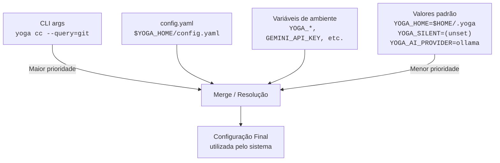

# Configuration Reference

Complete reference for Yoga configuration — `config.yaml` and environment variables.

---

## Resolução de Configuração



| Variable | Default | Description | Set By |
|----------|---------|-------------|--------|
| `YOGA_HOME` | `$HOME/.yoga` | Root directory for all yoga files | init.sh, all scripts |
| `YOGA_CONFIG` | `$YOGA_HOME/config.yaml` | Path to config file | Various scripts |
| `YOGA_SILENT` | (unset) | Set to `1` for ninja mode (no welcome) | User environment |
| `YOGA_WELCOMED` | (unset) | Set to `1` after first init | init.sh |
| `YOGA_SOCKET` | `$YOGA_HOME/daemon.sock` | Unix socket for daemon | ui.sh, daemon |
| `YOGA_PIDFILE` | `$YOGA_HOME/daemon.pid` | Daemon PID file | daemon |
| `YOGA_LOG` | `$YOGA_HOME/logs/daemon.log` | Daemon log file | daemon |
| `YOGA_STATE_DB` | `$YOGA_HOME/state.db` | SQLite database | api.sh |
| `YOGA_STATE_SCHEMA` | `$YOGA_HOME/core/state/schema.sql` | Schema file | api.sh |
| `YOGA_LOG_FILE` | `$YOGA_HOME/logs/yoga.jsonl` | JSONL log file | logger.sh |
| `YOGA_LOG_LEVEL` | `INFO` | Minimum log level (DEBUG, INFO, WARN, ERROR) | User environment |
| `YOGA_DEBUG` | (unset) | Set to `1` for debug output | logger.sh |
| `ASDF_DATA_DIR` | `$HOME/.asdf` | ASDF data directory | init.sh |
| `ASDF_DEFAULT_TOOL_VERSIONS_SOURCE_PRIORITY` | `asdf` | ASDF version resolution | init.sh |
| `YOGA_AI_PROVIDER` | `ollama` | AI provider (ollama for daemon, openai for terminal) | ai module |
| `YOGA_AI_MODEL` | `llama3.2` | AI model name (daemon default; terminal default is gpt-4) | ai module |
| `YOGA_OLLAMA_HOST` | `http://localhost:11434` | Ollama server URL | ai module |
| `CODE_DIR` | `$HOME/code` | Base projects directory | workspace module |
| `CF_TUNNEL_PATH` | `$HOME/cf-tunnels` | cf-tunnels directory | yoga-tunnel |
| `PYENV_ROOT` | `$HOME/.pyenv` | Python versions root | custom export |
| `NVM_DIR` | `$HOME/.nvm` | NVM directory | custom export |
| `FZF_DEFAULT_OPTS` | (colors+pointer) | fzf default options | custom export |
| `GEMINI_API_KEY` | (from env) | Google Gemini API key | custom export |
| `OLLAMA_API_KEY` | (from env) | Ollama API key | custom export |
| `LC_ALL` | `en_US.UTF-8` | Locale | custom export |
| `GIT_TERMINAL_PROMPT` | `0` | Disable git prompts | custom export |
| `LANG` | `en_US.UTF-8` | Language | custom export |

---

## config.yaml

Located at `$YOGA_HOME/config.yaml`. Full reference of every section and key.

### user

```yaml
user:
  name: "Yogi Developer"       # Display name
  email: "yogi@example.com"     # Email address
  github: "yogi-dev"            # GitHub username
  company: ""                    # Company name
  role: "Full Stack Developer"   # Role description
```

### preferences

```yaml
preferences:
  theme: "yoga_elements"   # yoga_elements | dark | light | auto
  ai_provider: "gemini"    # openai | copilot | gemini (daemon uses ollama)
  auto_save: true          # Auto-save files in editor
  auto_format: true        # Auto-format on save (biome/prettier)
  git_signing: false       # GPG sign commits
```

**`ai_provider`** controls which AI backend the system uses:
- `ollama` — Ollama local AI (daemon default, model: llama3.2)
- `openai` — OpenAI GPT-4 (terminal helper default)
- `gemini` — Google Gemini (config default, requires GEMINI_API_KEY)
- `copilot` — GitHub Copilot (requires `gh copilot`)

Note: The daemon module and terminal module have **different defaults**. The daemon defaults to `ollama`/`llama3.2`, while `bin/yoga-ai` defaults to `openai`/`gpt-4`.

### plugins

```yaml
plugins:
  enabled: []    # List of enabled plugin names
```

Plugins are managed via `yoga plugin enable/disable`. See [plugins.md](plugins.md).

### tools

```yaml
tools:
  javascript:
    package_manager: "npm"     # npm | yarn | pnpm
    linter: "biome"            # biome | eslint
    formatter: "biome"         # biome | prettier
    test_runner: "vitest"      # vitest | jest
    bundler: "vite"            # vite | webpack | esbuild

  typescript:
    strict: true               # TypeScript strict mode
    target: "ES2022"           # Compile target
    module: "ESNext"           # Module system
    jsx: "react-jsx"           # JSX transform

  node:
    version: "20.11.0"         # Managed via ASDF
    experimental_features: false

  editor:
    name: "lazyvim"             # Editor name
    font_family: "JetBrains Mono"
    font_size: 14
    line_numbers: true
    relative_line_numbers: true
    tab_size: 2
    use_tabs: false

  ai:
    model: "gemini-1.5-pro"    # AI model
    max_tokens: 2000            # Max response tokens
    temperature: 0.7            # Creativity (0-1)
    context_window: 10          # Context window size
    auto_suggestions: true      # Enable AI suggestions
```

### environment

```yaml
environment:
  projects_dir: "~/code"         # Default projects directory
  backup_dir: "~/.yoga/backups"  # Backup location
  logs_dir: "~/.yoga/logs"      # Log files location
  cache_dir: "~/.cache/yoga"    # Cache directory
```

### git

```yaml
git:
  default_profile: "personal"    # Default git profile
  profiles:
    personal:
      name: "Your Name"
      email: "personal@example.com"
      signing_key: ""
    work:
      name: "Your Work Name"
      email: "work@company.com"
      signing_key: ""
```

Git profiles are managed via `git-wizard` or `yoga cc` → git profile.

### integrations

```yaml
integrations:
  gemini:
    enabled: true
    api_key: "${GEMINI_API_KEY}"    # From environment variable

  openai:
    enabled: false
    api_key: "${OPENAI_API_KEY}"
    organization: ""

  github_copilot:
    enabled: true
    auto_suggestions: true

  opencode:
    enabled: false
    api_key: ""
```

**Note:** API keys should be set as environment variables, NOT hardcoded in config.yaml. The `${VAR}` syntax reads from the environment.

### aliases

```yaml
aliases:
  dev: "npm run dev"
  build: "npm run build"
  test: "npm run test"
  gs: "git status"
  gc: "git commit"
  gp: "git push"
  gl: "git pull"
  yogi: "yoga"
  flow: "yoga-flow"
  breathe: "yoga-breath"
  asdf-list: "yoga asdf list"
  asdf-install: "yoga asdf install"
  asdf-remove: "yoga remove"
  asdf-set: "yoga asdf set"
  asdf-update: "yoga asdf update"
  asdf-check: "yoga asdf check"
```

### colors

```yaml
colors:
  fire: "#c8a09c"     # Fogo - Vermelho energia
  water: "#7aa89f"    # Água - Ciano fluído
  earth: "#76946a"    # Terra - Verde natureza
  air: "#7e9cd8"      # Ar - Azul céu
  spirit: "#938aa9"   # Espírito - Roxo transcendência
```

These colors are used by `core/utils.sh` UI functions (yoga_fogo, yoga_agua, etc.).

### performance

```yaml
performance:
  lazy_loading: true          # Lazy-load plugins and modules
  cache_enabled: true        # Enable caching
  parallel_install: true     # Parallel package installation
  auto_cleanup: true         # Automatic cleanup of temp files
```

### observability

```yaml
observability:
  enabled: false    # Set to true to enable JSONL logging
```

When `enabled: true`, the `core/observability/logger.sh` writes events to `$YOGA_HOME/logs/yoga.jsonl`.

### security

```yaml
security:
  auto_update: true                # Auto-update checks
  check_vulnerabilities: true       # Check for vulnerabilities
  secure_shell: true                 # Secure shell settings
  encrypt_backups: false            # Encrypt backup files
```

### notifications

```yaml
notifications:
  enabled: true     # Enable notifications
  sound: false      # Sound on notifications
  desktop: true     # Desktop notifications
  terminal: true    # Terminal notifications
```

### debug

```yaml
debug:
  enabled: false        # Enable debug mode
  verbose: false         # Verbose output
  log_level: "info"      # debug | info | warn | error
```

---

## Shell Integration

### How init.sh works

1. Sets `YOGA_HOME` (default: `$HOME/.yoga`)
2. Checks if `$YOGA_HOME` exists (exits if not)
3. Sources `core/utils.sh` (UI functions and color constants)
4. Sources `core/aliases.sh` (all shell aliases)
5. Sources `core/functions.sh` (utility functions)
6. **Does NOT source `core/dashboard.sh`** (removed in 3.0)
7. **Does NOT alias `yoga` to `yoga_dashboard`** (removed in 3.0)
8. Adds `$YOGA_HOME/bin` to `PATH`
9. Sources ASDF if `$HOME/.asdf/asdf.sh` exists
10. Sets `YOGA_WELCOMED=1` (silent mode by default)

### .zshrc integration

Add to `~/.zshrc`:
```bash
# Yoga 3.0 - Lôro Barizon Edition
export YOGA_HOME="$HOME/.yoga"
source "$YOGA_HOME/init.sh"
```

Or for silent mode:
```bash
export YOGA_SILENT=1
export YOGA_HOME="$HOME/.yoga"
source "$YOGA_HOME/init.sh"
```

### Custom aliases

Custom aliases are stored in `core/shell/.custom.aliases.sh`. To add your own:

1. Edit `$YOGA_HOME/core/shell/.custom.aliases.sh`
2. Add your aliases following the existing format
3.Reload: `source ~/.zshrc`

### Custom functions

Custom functions are in `core/shell/.custom.functions.sh`. Includes:
- `rag()` — Query RAG system
- `cc()` — Command Center
- `ccp()` — Workspace Manager

### Custom exports

Environment variables configured in `core/shell/.custom.export.sh`:
- `PYENV_ROOT`, `PATH` modifications, `FZF_DEFAULT_OPTS`, `GEMINI_API_KEY`, `OLLAMA_HOST`, `NVM_DIR`, `LC_ALL`, `GIT_TERMINAL_PROMPT`, `LANG`

---

## Custom YOGA_* Variables Convention

Yoga uses a consistent variable naming convention:

| Prefix | Purpose | Example |
|--------|---------|---------|
| `YOGA_HOME` | Root directory | `~/.yoga` |
| `YOGA_COLOR_*` | ANSI color codes | `YOGA_COLOR_FOGO` |
| `YOGA_*_ICON` | Emoji icons | `YOGA_FOGO_ICON` |
| `YOGA_SOCKET` | Socket path | `~/.yoga/daemon.sock` |
| `YOGA_PIDFILE` | PID file | `~/.yoga/daemon.pid` |
| `YOGA_LOG_FILE` | Log file | `~/.yoga/logs/yoga.jsonl` |
| `YOGA_LOG_LEVEL` | Min log level | `INFO` |
| `YOGA_STATE_DB` | SQLite path | `~/.yoga/state.db` |
| `YOGA_AI_PROVIDER` | AI backend | `ollama` |
| `YOGA_AI_MODEL` | AI model | `llama3.2` |
| `YOGA_SILENT` | Ninja mode | `1` |
| `YOGA_WELCOMED` | First load flag | `1` |
| `YOGA_DEBUG` | Debug output | `1` |