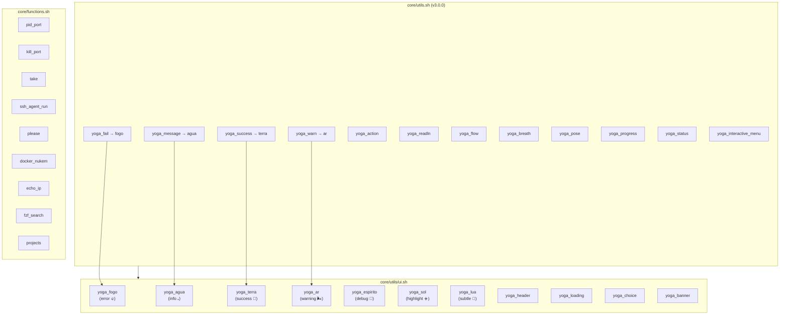

# Core Functions Reference

Complete reference for all functions, aliases, and exports across `core/` shell libraries.

---

## Grafo de Dependências



Core UI and utility functions. Sourced by `init.sh` and most other modules.

### Color Constants

| Variable | Value | Description |
|----------|-------|-------------|
| `YOGA_FOGO` | Red ANSI | Error/fire color |
| `YOGA_AGUA` | Blue ANSI | Info/water color |
| `YOGA_TERRA` | Green ANSI | Success/earth color |
| `YOGA_AR` | Yellow ANSI | Warning/air color |
| `YOGA_ESPIRITO` | Magenta ANSI | Debug/spirit color |
| `YOGA_SOL` | Gold ANSI | Highlight/sun color |
| `YOGA_LUA` | Silver ANSI | Subtle/moon color |
| `YOGA_RESET` | Reset ANSI | Reset all formatting |

### Icon Constants

| Variable | Value | Description |
|----------|-------|-------------|
| `YOGA_FOGO_ICON` | 🔥 | Fire icon |
| `YOGA_AGUA_ICON` | 💧 | Water icon |
| `YOGA_TERRA_ICON` | 🌿 | Earth icon |
| `YOGA_AR_ICON` | 🌬️ | Air icon |
| `YOGA_ESPIRITO_ICON` | 🧘 | Spirit icon |
| `YOGA_SOL_ICON` | ☀️ | Sun icon |
| `YOGA_LUA_ICON` | 🌙 | Moon icon |

### UI Functions

| Function | Signature | Description | Returns |
|----------|-----------|-------------|---------|
| `yoga_fogo` | `yoga_fogo "msg"` | Error message (red 🔥) | 1 |
| `yoga_agua` | `yoga_agua "msg"` | Info message (blue 💧) | 0 |
| `yoga_terra` | `yoga_terra "msg"` | Success message (green 🌿) | 0 |
| `yoga_ar` | `yoga_ar "msg"` | Warning message (yellow 🌬️) | 0 |
| `yoga_espirito` | `yoga_espirito "msg"` | Debug message (purple 🧘) | 0 |
| `yoga_sol` | `yoga_sol "msg"` | Highlight message (gold ☀️) | 0 |
| `yoga_lua` | `yoga_lua "msg"` | Subtle message (silver 🌙) | 0 |
| `yoga_fail` | `yoga_fail "msg"` | Legacy error (alias for fogo) | 1 |
| `yoga_success` | `yoga_success "msg"` | Legacy success (alias for terra) | 0 |
| `yoga_message` | `yoga_message "msg"` | Legacy message (alias for agua) | 0 |
| `yoga_warn` | `yoga_warn "msg"` | Legacy warning (alias for ar) | 0 |
| `yoga_action` | `yoga_action "msg"` | Action message (bold arrow) | 0 |
| `yoga_readln` | `yoga_readln "prompt" "var"` | Read input into variable | 0 |
| `yoga_flow` | `yoga_flow` | Start flow state mode | 0 |
| `yoga_breath` | `yoga_breath` | Breathing exercise animation | 0 |
| `yoga_pose` | `yoga_pose "theme"` | Random yoga pose | 0 |
| `yoga_meditation` | `yoga_meditation` | Meditation timer | 0 |
| `yoga_progress` | `yoga_progress "msg" "pct"` | Progress bar | 0 |
| `yoga_status` | `yoga_status` | Full environment status report | 0 |
| `yoga_interactive_menu` | `yoga_interactive_menu "title" "opts"` | fzf-based menu | selected option |

All `yoga_fogo`, `yoga_terra`, `yoga_agua`, `yoga_ar`, `yoga_espirito`, `yoga_sol`, `yoga_lua` functions are exported via `export -f` when running in Bash.

---

## core/utils/ui.sh

UI utilities for the daemon era (Yoga 3.0+). Auto-initializes via `yoga_ui_init`.

### Extended Color Constants

| Variable | Value | Description |
|----------|-------|-------------|
| `YOGA_COLOR_RESET` | `\033[0m` | Reset all formatting |
| `YOGA_COLOR_FOGO` | `\033[31m` | Red |
| `YOGA_COLOR_TERRA` | `\033[32m` | Green |
| `YOGA_COLOR_AGUA` | `\033[34m` | Blue |
| `YOGA_COLOR_AR` | `\033[33m` | Yellow |
| `YOGA_COLOR_ESPIRITO` | `\033[35m` | Magenta |
| `YOGA_COLOR_SOL` | `\033[1;33m` | Bold gold |
| `YOGA_COLOR_LUA` | `\033[2;37m` | Dim silver |
| `YOGA_COLOR_BOLD` | `\033[1m` | Bold |

### Daemon Constants

| Variable | Default | Description |
|----------|---------|-------------|
| `YOGA_SOCKET` | `${YOGA_HOME}/daemon.sock` | Unix socket path |
| `YOGA_PIDFILE` | `${YOGA_HOME}/daemon.pid` | Daemon PID file |
| `YOGA_LOG` | `${YOGA_HOME}/logs/daemon.log` | Daemon log |
| `YOGA_STATE_DB` | `${YOGA_HOME}/state.db` | SQLite database |
| `YOGA_STATE_SCHEMA` | `${YOGA_HOME}/core/state/schema.sql` | Schema file |

### Additional UI Functions

| Function | Signature | Description |
|----------|-----------|-------------|
| `yoga_header` | `yoga_header "title"` | Prominent header with borders |
| `yoga_section` | `yoga_section "title"` | Section header with arrow |
| `yoga_loading` | `yoga_loading "msg"` | Loading message with spinner |
| `yoga_success` | `yoga_success "msg"` | Success message (green ✓) |
| `yoga_error` | `yoga_error "msg"` | Error message (red ✗) |
| `yoga_warning` | `yoga_warning "msg"` | Warning message (yellow ⚠) |
| `yoga_info` | `yoga_info "msg"` | Info message (blue ℹ) |
| `yoga_debug` | `yoga_debug "msg"` | Debug message (gray 🔍) |
| `yoga_prompt` | `yoga_prompt "question"` | Styled prompt |
| `yoga_choice` | `yoga_choice "question" "opts"` | fzf choice selector |
| `yoga_tag` | `yoga_tag "label" "value"` | Key:value tag |
| `yoga_table_header` | `yoga_table_header "Col1" "Col2"` | Table column headers |
| `yoga_table_row` | `yoga_table_row "val1" "val2"` | Table row values |
| `yoga_clear_line` | `yoga_clear_line` | Clear current line |
| `yoga_spinner` | `yoga_spinner "msg" &` | Animated spinner (background) |
| `yoga_emoji` | `yoga_emoji "name"` | Return emoji by name |
| `yoga_banner` | `yoga_banner` | Display Yoga banner with version |
| `yoga_ui_init` | `yoga_ui_init` | Auto-initialization (runs on source) |

---

## core/common.sh

| Function | Signature | Description |
|----------|-----------|-------------|
| `workspace_install` | `workspace_install` | Install yoga workspace scripts and configs |
| `install_yoga` | `install_yoga` | Main installation function |
| `set_init_on_shell` | `set_init_on_shell "shell"` | Configure shell RC to source init.sh |

---

## core/functions.sh

### pid_port
```
pid_port "port_number"
```
Returns PID of process listening on specified TCP port. Validates port is integer 1-65535.

**Example:** `pid_port 3000` → `12345`

### kill_port
```
kill_port "port_number"
```
Kills the process listening on the specified port. Validates port range.

**Example:** `kill_port 3000`

### take
```
take "directory"
```
Creates directory with `mkdir -p` and cd's into it.

**Example:** `take ~/projects/my-app`

### ssh_agent_run
```
ssh_agent_run ["key_file"]
```
Starts ssh-agent if not running, adds specified SSH key.

### please
```
please
```
Re-runs last command with `sudo`. Safety check: refuses dangerous commands (rm, dd, mkfs, redirect).

### docker_nukem
```
docker_nukem
```
**⚠️ DANGEROUS** — Stops ALL containers, removes ALL containers, images, volumes, networks. No confirmation.

### docker_nukem_confirm
```
docker_nukem_confirm
```
Same as `docker_nukem` but requires typing "NUKE" to confirm.

### echo_ip
```
echo_ip
```
Returns external IP via `ipecho.net/plain`.

### dim_monitor_light
```
dim_monitor_light ["monitor"] ["brightness"]
```
Adjusts monitor brightness via xrandr. Default monitor: HDMI-1-1.

### ls_process_by
```
ls_process_by ["name_or_user"]
```
Lists processes by name or user. Default: current user. Shows PID, user, start time, memory, CPU, command.

### fzf_search
```
fzf_search "query"
```
Searches with fzf (height=50%, ansi, tac). Falls back to `grep` if fzf unavailable.

### projects
```
projects
```
Opens fzf selector for directories in `~/code/` and cd's into selected.

### gotodir
```
gotodir
```
Opens fzf selector for directory history (`dirs -l`).

### goto
```
goto
```
Interactive menu with `projects` and `gotodir` options via fzf.

---

## core/aliases.sh (v3.0)

Complete alias reference organized by category.

### Navigation
| Alias | Command |
|-------|---------|
| `..` | `cd ..` |
| `...` | `cd ../..` |
| `....` | `cd ../../..` |
| `~` | `cd ~` (zsh only) |
| `-` | `cd -` (zsh only) |

### Listing
| Alias | Command |
|-------|---------|
| `l` | `ls -lah` |
| `la` | `ls -lAh` |
| `ll` | `ls -lh` |
| `ls` | `ls -G` |
| `lsd` | `ls -lahF` |

### Git
| Alias | Command |
|-------|---------|
| `g` | `git` |
| `gs` | `git status` |
| `gc` | `git commit` |
| `gca` | `git commit -a` |
| `gcm` | `git commit -m` |
| `gp` | `git push` |
| `gpl` | `git pull` |
| `gb` | `git branch` |
| `gco` | `git checkout` |
| `gd` | `git diff` |
| `gl` | `git log --oneline --graph --decorate` |
| `gla` | `git log --oneline --graph --decorate --all` |

### npm/Node
| Alias | Command |
|-------|---------|
| `ni` | `npm install` |
| `nid` | `npm install --save-dev` |
| `nig` | `npm install -g` |
| `nr` | `npm run` |
| `nrd` | `npm run dev` |
| `nrb` | `npm run build` |
| `nrt` | `npm run test` |
| `nrs` | `npm run start` |
| `nrw` | `npm run watch` |

### TypeScript
| Alias | Command |
|-------|---------|
| `tsc` | `npx tsc` |
| `tsx` | `npx tsx` |
| `tsw` | `npx tsc --watch` |
| `tsinit` | `npx tsc --init` |

### Development
| Alias | Command |
|-------|---------|
| `dev` | `npm run dev` |
| `build` | `npm run build` |
| `test` | `npm run test` |
| `lint` | `npm run lint` |
| `format` | `npm run format` |
| `start` | `npm run start` |
| `watch` | `npm run watch` |

### Yoga
| Alias | Command |
|-------|---------|
| `yogi` | `yoga` |
| `flow` | `yoga_flow` |
| `breathe` | `yoga_breath` |
| `pose` | `yoga_pose` |
| `namaste` | `echo "🧘 Namastê, yogi!"` |
| `cheatsheet` | `bat ~/.yoga/docs/CHEATSHEET.md` |

### AI
| Alias | Command |
|-------|---------|
| `ai` | `yoga-ai` |
| `yai` | `yoga-ai` |
| `ai-debug` | `yoga-ai debug` |
| `ai-code` | `yoga-ai code` |
| `ai-help` | `yoga-ai help` |
| `ai-fix` | `yoga-ai fix` |
| `ai-explain` | `yoga-ai explain` |
| `ai-debug` | `yoga-ai debug` |

### Editor
| Alias | Command |
|-------|---------|
| `v` | `nvim` |
| `vi` | `nvim` |
| `vim` | `nvim` |
| `nv` | `nvim` |
| `code` | `nvim` |

### ASDF
| Alias | Command |
|-------|---------|
| `asdf-list` | `asdf list` |
| `asdf-current` | `asdf current` |
| `asdf-global` | `asdf global` |
| `asdf-local` | `asdf local` |
| `asdf-install` | `asdf install` |
| `asdf-uninstall` | `asdf uninstall` |
| `asdf-plugin` | `asdf plugin` |
| `asdf-update` | `asdf update && asdf plugin update --all` |

### System
| Alias | Command |
|-------|---------|
| `reload` | `source ~/.zshrc` |
| `zshrc` | `nvim ~/.zshrc` |
| `yogarc` | `nvim ~/.yoga/config.yaml` |
| `path` | `echo $PATH \| tr ":" "\n"` |

### Docker
| Alias | Command |
|-------|---------|
| `d` | `docker` |
| `dc` | `docker-compose` |
| `dps` | `docker ps` |
| `dpsa` | `docker ps -a` |
| `di` | `docker images` |
| `dex` | `docker exec -it` |
| `dlog` | `docker logs -f` |
| `dstop` | `docker stop $(docker ps -q)` |
| `drm` | `docker rm $(docker ps -aq)` |
| `drmi` | `docker rmi $(docker images -q)` |

### Utility Functions (in aliases.sh)

#### ports()
Lists all TCP LISTEN ports using `lsof` or `netstat`.

#### serve()
```
serve [port]
```
Starts Python HTTP server (default port 8000). Uses python3 if available.

### Safety Aliases
| Alias | Command |
|-------|---------|
| `rm` | `rm -i` |
| `cp` | `cp -i` |
| `mv` | `mv -i` |

### Clipboard (Linux)
Creates `pbcopy` and `pbpaste` aliases using `xclip` or `xsel` for macOS compatibility.

### Function Aliases
| Alias | Command |
|-------|---------|
| `mkcd` | `mkdir -p "$1" && cd "$1"` |
| `extract` | `tar -xvf "$1"` |
| `search` | `grep -r "$1" .` |
| `find-file` | `find . -name "*$1*"` |
| `find-text` | `grep -r "$1" . --include="*.$2"` |

### Quick Directories
| Alias | Command |
|-------|---------|
| `projects` | `cd ~/code` |
| `downloads` | `cd ~/Downloads` |
| `desktop` | `cd ~/Desktop` |
| `yoga-home` | `cd ~/.yoga` |

### Fun
| Alias | Command |
|-------|---------|
| `matrix` | `cmatrix` |
| `sl` | `sl` |
| `fortune` | `fortune` |

---

## core/shell/.custom.aliases.sh

Additional aliases loaded by custom shell system.

### Misc
| Alias | Command | Description |
|-------|---------|-------------|
| `catapimbas` | `fuck` | Thefuck correction |
| `lsd` | `ls -la` | Long listing |
| `cat` | `bat` | Better cat |
| `vim` | `nvim` | Neovim |
| `code` | `cd ~/code` | Go to projects |
| `pcperf` | `btm` | Bottom system monitor |

### RAG
| Alias | Command | Description |
|-------|---------|-------------|
| `rag-status` | Check RAG status | |
| `ask` | Query RAG | |

### Tmux
| Alias | Command | Description |
|-------|---------|-------------|
| `tmux-list` | `tmux list-sessions` | List sessions |
| `tmux-kill` | `tmux kill-session -t` | Kill session |
| `tmux-kill-pane` | `tmux kill-pane` | Kill pane |
| `tmux-kill-pane-local` | Kill pane locally | |
| `tmux-rename-session` | `tmux rename-session` | Rename session |
| `tmux-rename-window` | `tmux rename-window` | Rename window |

### Docker Extended
| Alias | Command | Description |
|-------|---------|-------------|
| `docker-list` | List containers | |
| `docker-rm` | Remove containers | |
| `docker-rmi` | Remove images | |
| `docker-rm-dangling` | Remove dangling images | |
| `docker-rm-all` | Remove all containers/images | |
| `docker-rm-stopped` | Remove stopped containers | |
| `dc-list` | List compose containers | |
| `dc-rm` | Remove compose | |
| `dc-rmi` | Remove compose images | |
| `dc-rm-dangling` | Remove dangling compose | |
| `dc-rm-all` | Remove all compose | |
| `dc-rm-stopped` | Remove stopped compose | |
| `dm-list` | List docker machines | |
| `dm-rm` | Remove machine | |
| `ds-list` | List swarm services | |
| `ds-rm` | Remove swarm service | |

---

## core/shell/.custom.functions.sh

| Function | Description |
|----------|-------------|
| `pid_port "port"` | Get PID on port (duplicate from functions.sh) |
| `kill_port "port"` | Kill process on port (duplicate) |
| `sshc "host"` | SSH with custom config |
| `rag "query"` | Query RAG system |
| `rag-reindex` | Rebuild RAG index |
| `rag-stop` | Stop RAG indexing |
| `rag-check` | Check RAG status |
| `aliases` | Show all defined aliases |
| `cc` | Command Center (`cc_standalone_run`) |
| `cc_data` | Gather CC environment data |
| `cc_preview` | Generate CC preview |
| `cc_action` | Process CC action |
| `ccp` | Workspace Manager (`workspace_standalone_run`) |

---

## core/shell/.custom.export.sh

| Variable | Value | Description |
|----------|-------|-------------|
| `PYENV_ROOT` | `$HOME/.pyenv` | Python versions directory |
| `PATH` | (modified) | Adds pyenv, fzf, opencode, mysql, nvm |
| `FZF_DEFAULT_OPTS` | `--height=40%...` | fzf colors and pointer |
| `GEMINI_API_KEY` | (from env) | Google Gemini API key |
| `OLLAMA_HOST` | `http://localhost:11434` | Ollama server URL |
| `OLLAMA_API_KEY` | (from env) | Ollama API key |
| `NVM_DIR` | `$HOME/.nvm` | NVM directory |
| `LC_ALL` | `en_US.UTF-8` | Locale |
| `GIT_TERMINAL_PROMPT` | `0` | Disable git credential prompts |
| `LANG` | `en_US.UTF-8` | Language |