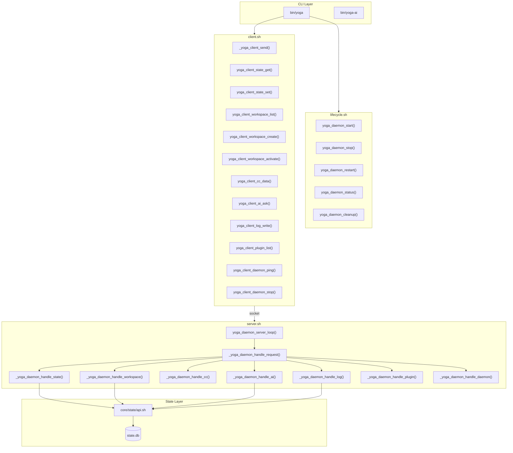

# Daemon — Yoga 3.0

## Visão Geral

O daemon é o núcleo de comunicação do Yoga 3.0. Opera como servidor Unix socket, recebendo requests do CLI (`bin/yoga`) via `core/daemon/client.sh` e processando-os através de handlers modulares que delegam para `core/state/api.sh` e os módulos registrados.

O daemon é **obrigatório** para funcionalidades que dependem de estado persistente: `ai ask`, `state get/set`, `plugin list`, `workspace` via engine. Operações standalone (CC, Workspace standalone, AI Terminal) funcionam sem o daemon.

## Arquitetura do Daemon



## Arquivos

### server.sh (`core/daemon/server.sh`)

Servidor principal do daemon. Escuta em Unix socket via `socat`.

**Variáveis de ambiente:**

| Variável | Default | Descrição |
|----------|---------|-----------|
| `YOGA_SOCKET` | `${YOGA_HOME}/daemon.sock` | Caminho do Unix socket |
| `YOGA_PIDFILE` | `${YOGA_HOME}/daemon.pid` | Arquivo PID |
| `YOGA_LOG` | `${YOGA_HOME}/logs/daemon.log` | Log do daemon |
| `PROTOCOL_VERSION` | `"1.0"` | Versão do protocolo |
| `DELIMITER` | `$'\x1E'` | Delimitador de mensagens (ASCII Record Separator) |

**Funções públicas:**

| Função | Assinatura | Descrição |
|--------|-----------|-----------|
| `yoga_daemon_server_start` | `yoga_daemon_server_start` | Inicia servidor em background. Verifica se já rodando, limpa socket antigo, faz fork, aguarda socket disponível (10 tentativas de 0.1s) |
| `yoga_daemon_server_stop` | `yoga_daemon_server_stop` | Para o servidor. Kill -TERM seguido de Kill -9 se necessário. Remove socket e pidfile |
| `yoga_daemon_is_running` | `yoga_daemon_is_running` | Verifica PID file existe + processo ativo + socket existe |

**Funções internas:**

| Função | Descrição |
|--------|-----------|
| `yoga_daemon_server_loop` | Loop principal. Aceita conexões via socat UNIX-LISTEN, lê linhas, delega para `_yoga_daemon_handle_request` |
| `_yoga_daemon_handle_request` | Parser de request. Extrai `module/command/args/req_id`, roteia para handler correto, envia response |
| `_yoga_daemon_handle_state` | Handler para módulo `state`. Suporta: `get`, `set`, `del`, `list` |
| `_yoga_daemon_handle_workspace` | Handler para módulo `workspace`. Suporta: `list`, `create`, `activate`, `current`, `kill` |
| `_yoga_daemon_handle_cc` | Handler para módulo `cc`. Suporta: `data`, `execute` |
| `_yoga_daemon_handle_ai` | Handler para módulo `ai`. Suporta: `ask`, `context_add`, `context_search` |
| `_yoga_daemon_handle_log` | Handler para módulo `log`. Suporta: `write`, `query` |
| `_yoga_daemon_handle_plugin` | Handler para módulo `plugin`. Suporta: `list`, `enable`, `disable` |
| `_yoga_daemon_handle_daemon` | Handler para módulo `daemon`. Suporta: `ping`, `stop`, `status` |

### client.sh (`core/daemon/client.sh`)

Cliente para comunicação com o daemon. Usado pelo `bin/yoga`.

**Variáveis:**

| Variável | Default | Descrição |
|----------|---------|-----------|
| `YOGA_SOCKET` | `${YOGA_HOME}/daemon.sock` | Caminho do socket |
| `DELIMITER` | `$'\x1E'` | Delimitador de mensagens |
| `TIMEOUT` | `5` | Timeout em segundos |

**Funções públicas:**

| Função | Assinatura | Descrição |
|--------|-----------|-----------|
| `_yoga_client_send` | `_yoga_client_send <module> <command> [args_json]` | Envia request ao daemon via socket. Tenta `socat` primeiro, fallback `nc`. Retorna dados do response ou erro |
| `yoga_client_state_get` | `yoga_client_state_get <key> [scope]` | Lê valor do estado. Default scope: `global` |
| `yoga_client_state_set` | `yoga_client_state_set <key> <value> [scope]` | Escreve valor no estado |
| `yoga_client_workspace_list` | `yoga_client_workspace_list` | Lista workspaces via daemon |
| `yoga_client_workspace_create` | `yoga_client_workspace_create <name> <path>` | Cria workspace |
| `yoga_client_workspace_activate` | `yoga_client_workspace_activate <id>` | Ativa workspace |
| `yoga_client_cc_data` | `yoga_client_cc_data` | Obtém dados do Command Center |
| `yoga_client_ai_ask` | `yoga_client_ai_ask <question>` | Envia pergunta à IA |
| `yoga_client_log_write` | `yoga_client_log_write <level> <module> <message>` | Escreve log |
| `yoga_client_plugin_list` | `yoga_client_plugin_list` | Lista plugins |
| `yoga_client_daemon_ping` | `yoga_client_daemon_ping` | Ping no daemon |
| `yoga_client_daemon_stop` | `yoga_client_daemon_stop` | Para o daemon |

### lifecycle.sh (`core/daemon/lifecycle.sh`)

Gerenciamento do ciclo de vida do daemon. Commands expostos via `yoga daemon <action>`.

**Funções:**

| Função | Assinatura | Descrição |
|--------|-----------|-----------|
| `yoga_daemon_start` | `yoga_daemon_start [--foreground]` | Inicia daemon. Verifica dependências (sqlite3, socat/nc, jq), cria diretórios, chama `yoga_daemon_server_start`. Com `--foreground`, aguarda no foreground |
| `yoga_daemon_stop` | `yoga_daemon_stop [--force]` | Para daemon. Com `--force`, modo forçado (não implementado diferentemente) |
| `yoga_daemon_status` | `yoga_daemon_status` | Exibe status: PID, uptime, socket, database, log. Se rodando, mostra estatísticas (workspaces, plugins, logs) |
| `yoga_daemon_restart` | `yoga_daemon_restart` | Stop + sleep 0.5s + Start |
| `yoga_daemon_cleanup` | `yoga_daemon_cleanup` | Remove socket stale e pidfile se processo não existe |
| `yoga_daemon_command` | `yoga_daemon_command <action>` | Router CLI. Ações: `start`, `stop`, `restart`, `status`, `cleanup`, `foreground` |

## Comandos do Daemon

```bash
yoga daemon start       # Inicia em background
yoga daemon stop        # Para o daemon
yoga daemon restart     # Restart
yoga daemon status      # Status com estatísticas
yoga daemon cleanup     # Remove arquivos stale
yoga daemon foreground  # Inicia em foreground (debug)
```

## Protocolo de Comunicação

### Formato

Requests são strings delimitadas por pipe (`|`) com 4 campos:

```
MODULE|COMMAND|ARGS_JSON|REQUEST_ID
```

Onde:
- `MODULE`: Categoria (`state`, `workspace`, `cc`, `ai`, `log`, `plugin`, `daemon`, `ping`)
- `COMMAND`: Ação dentro do módulo
- `ARGS_JSON`: Argumentos em JSON (default: `{}` para sem args)
- `REQUEST_ID`: Timestamp nanosegundos (gerado automaticamente)

Responses seguem o formato:

```
STATUS\x1ERESPONSE_JSON\x1EREQUEST_ID
```

Onde `STATUS` é `OK` ou `ERROR`, e o delimitador é `\x1E` (ASCII Record Separator).

### Categorias e Ações

| Módulo | Ação | Args | Response |
|--------|------|------|----------|
| `ping` | (nenhuma args) | `{}` | `{"pong":true}` |
| `state` | `get` | `{"key":"k","scope":"s"}` | `{"key":"k","value":"v","scope":"s"}` |
| `state` | `set` | `{"key":"k","value":"v","scope":"s"}` | `{"ok":true,"action":"set"}` |
| `state` | `del` | `{"key":"k"}` | `{"ok":true,"action":"del"}` |
| `state` | `list` | `{"scope":"s"}` | `{"keys":["k1","k2"]}` |
| `workspace` | `list` | `{}` | `{"workspaces":[...]}` |
| `workspace` | `create` | `{"name":"n","path":"p"}` | `{"id":"id","name":"n"}` |
| `workspace` | `activate` | `{"id":"id"}` | `{"ok":true,"activated":"id"}` |
| `workspace` | `current` | `{}` | `{"current":"id|name|path"}` |
| `workspace` | `kill` | `{"id":"id"}` | `{"ok":true,"killed":"id"}` |
| `cc` | `data` | `{}` | `{"data":[...]}` |
| `cc` | `execute` | `{"command":"cmd"}` | `{"status":"success","output":"..."}` |
| `ai` | `ask` | `{"question":"q"}` | `{"question":"q","response":"r"}` |
| `ai` | `context_add` | `{"content":"c"}` | `{"ok":true}` |
| `ai` | `context_search` | `{"query":"q"}` | `{"results":[...]}` |
| `log` | `write` | `{"level":"L","module":"M","message":"m"}` | `{"ok":true}` |
| `log` | `query` | `{"limit":50,"level":""}` | `{"logs":[...]}` |
| `plugin` | `list` | `{}` | `{"plugins":[...]}` |
| `plugin` | `enable` | `{"name":"n"}` | `{"ok":true,"enabled":"n"}` |
| `plugin` | `disable` | `{"name":"n"}` | `{"ok":true,"disabled":"n"}` |
| `daemon` | `ping` | `{}` | `{"pong":true,"version":"1.0","pid":123}` |
| `daemon` | `stop` | `{}` | `{"ok":true,"action":"stopping"}` |
| `daemon` | `status` | `{}` | `{"running":true,"pid":123,"socket":"..."}` |

## Exemplo: Request/Response Completo

### Enviar request (client):
```bash
# yoga_client_state_get "last_workspace" "global"
echo "state|get|{\"key\":\"last_workspace\",\"scope\":\"global\"}|1681500000000" | \
    socat - UNIX-CONNECT:$HOME/.yoga/daemon.sock
```

### Receber response (server):
```
OK\x1E{"key":"last_workspace","value":"my-project","scope":"global"}\x1E1681500000000
```

## Sequência de Startup

1. `yoga daemon start` chama `yoga_daemon_start()`
2. Verifica dependências: `sqlite3`, `socat` ou `nc`, `jq`
3. Cria diretórios: `${YOGA_HOME}/logs`, `${YOGA_HOME}/plugins`
4. Chama `yoga_daemon_server_start()`:
   - Verifica se já rodando (PID + socket)
   - Remove socket antigo se stale
   - Fork em background
   - Salva PID em pidfile
   - Aguarda socket ficar disponível (10 tentativas, 0.1s cada)
5. `_yoga_state_init()` inicializa o banco SQLite se não existe
6. Loop principal `yoga_daemon_server_loop()` começa a escutar via `socat UNIX-LISTEN`

## Sequência de Shutdown

1. `yoga daemon stop` chama `yoga_daemon_stop()`
2. Verifica se rodando
3. `yoga_daemon_server_stop()`:
   - Envia `SIGTERM` ao processo
   - Aguarda finalização (20 tentativas, 0.1s)
   - Se não parou, envia `SIGKILL`
4. Remove socket e pidfile
5. Confirma parada bem-sucedida

## Cleanup

`yoga_daemon_cleanup()` remove arquivos stale:
- Socket (`daemon.sock`) se processo associado não está rodando
- Pidfile (`daemon.pid`) se processo não existe

## Troubleshooting

### "Daemon não está rodando"
**Causa:** Daemon não foi iniciado ou crashou.  
**Solução:**
```bash
yoga daemon start        # Inicia o daemon
yoga daemon status       # Verifica status
```

### "Não foi possível conectar ao daemon"
**Causa:** Socket não encontrado ou permissões incorretas.  
**Solução:**
```bash
yoga daemon cleanup      # Remove arquivos stale
yoga daemon start        # Reinicia
```

### "socat ou nc não instalados"
**Causa:** Dependência de comunicação ausente.  
**Solução:**
```bash
sudo apt install socat   # Linux
brew install socat       # macOS
```

### "SQLite3 não encontrado"
**Causa:** Banco de dados requer sqlite3.  
**Solução:**
```bash
sudo apt install sqlite3  # Linux
brew install sqlite3      # macOS
```

### "jq não instalado"
**Causa:** Parse de JSON requer jq.  
**Solução:**
```bash
sudo apt install jq      # Linux
brew install jq           # macOS
```

### Socket stale após crash
**Causa:** Processo crashou sem cleanup.  
**Solução:**
```bash
rm -f ~/.yoga/daemon.sock ~/.yoga/daemon.pid
yoga daemon start
```