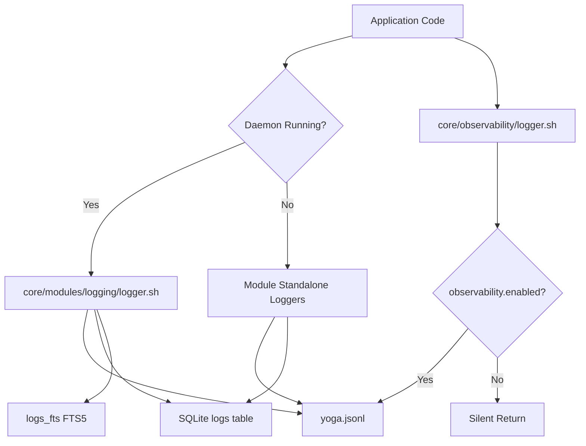

# Logging

Yoga 3.0 provides three logging subsystems that work together: a **structured JSONL logger** (daemon-era), an **opt-in observability logger**, and **module-level standalone loggers**. All three write to `${YOGA_HOME}/logs/yoga.jsonl` and/or SQLite for persistence and RAG retrieval.

---

## Architecture Overview



---

## System 1: Structured JSONL Logger

**File:** `core/modules/logging/logger.sh`

The primary logging subsystem for the daemon architecture. Writes structured JSONL entries to disk and simultaneously to SQLite for full-text search.

### Constants

| Constant | Value | Description |
|----------|-------|-------------|
| `LOG_LEVEL_DEBUG` | `0` | Debug severity (lowest) |
| `LOG_LEVEL_INFO` | `1` | Informational severity |
| `LOG_LEVEL_WARN` | `2` | Warning severity |
| `LOG_LEVEL_ERROR` | `3` | Error severity (highest) |

### Environment Variables

| Variable | Default | Description |
|----------|---------|-------------|
| `YOGA_LOG_FILE` | `${YOGA_HOME}/logs/yoga.jsonl` | Path to the JSONL log file |
| `YOGA_LOG_LEVEL` | `INFO` | Minimum log level to write: `DEBUG`, `INFO`, `WARN`, `ERROR` |
| `YOGA_DEBUG` | `0` | If `1`, also prints debug messages to console |

### Auto-Initialization

When `logger.sh` is sourced, it automatically:

1. Creates the `${YOGA_HOME}/logs/` directory (`mkdir -p`)
2. Calls `yoga_log_rotate` to rotate logs if they exceed the size threshold

---

### `_yoga_log_level_value`

**Signature:**
```zsh
function _yoga_log_level_value {
    case "${1^^}" in
    DEBUG) echo 0 ;;
    INFO) echo 1 ;;
    WARN) echo 2 ;;
    ERROR) echo 3 ;;
    *) echo 1 ;;
    esac
}
```

**Description:** Converts a log level string to its numeric value for comparison. Case-insensitive.

**Parameters:**

| Parameter | Type | Required | Description |
|-----------|------|----------|-------------|
| `$1` | string | Yes | Log level: `DEBUG`, `INFO`, `WARN`, `ERROR` |

**Return value:** Numeric value (0-3). Unknown levels default to 1 (`INFO`).

**Example:**
```zsh
level_val=$(_yoga_log_level_value "WARN")  # Returns 2
```

---

### `yoga_log`

**Signature:**
```zsh
function yoga_log {
    local level="${1:-INFO}"
    local module="${2:-unknown}"
    local message="${3:-}"
    local payload="${4:-{}}"
    ...
}
```

**Description:** Core logging function. Writes a structured JSONL entry to `$YOGA_LOG_FILE` and simultaneously inserts a row into the SQLite `logs` table via `yoga_log_db`. Also prints to console when `YOGA_DEBUG=1` and level is `DEBUG`.

**Parameters:**

| Parameter | Type | Required | Default | Description |
|-----------|------|----------|---------|-------------|
| `$1` (`level`) | string | No | `INFO` | Log level |
| `$2` (`module`) | string | No | `unknown` | Source module name |
| `$3` (`message`) | string | No | `""` | Log message text |
| `$4` (`payload`) | string | No | `{}` | JSON payload (must be valid JSON) |

**Return value:** Returns 0 after writing (unless below log level, then returns 0 immediately).

**Level filtering:** If `level` is below `YOGA_LOG_LEVEL`, the function returns immediately without writing.

**JSONL format:**
```json
{
  "timestamp": "2026-04-14T10:30:00+00:00",
  "level": "INFO",
  "module": "workspace",
  "message": "Workspace activated",
  "payload": {},
  "pid": 12345,
  "hostname": "my-machine"
}
```

**Side effects:**
1. Appends JSONL entry to `$YOGA_LOG_FILE`
2. Calls `yoga_log_db` to insert into SQLite (errors silently suppressed)
3. Conditionally prints to console via `yoga_debug` when `YOGA_DEBUG=1`

**Example:**
```zsh
yoga_log "INFO" "workspace" "Workspace activated" '{"workspace": "my-proj"}'
yoga_log "ERROR" "daemon" "Connection refused" '{"port": 8080}'
yoga_log "DEBUG" "state" "Cache hit" '{"key": "theme"}'
```

---

### `yoga_log_debug`

**Signature:**
```zsh
function yoga_log_debug {
    yoga_log "DEBUG" "$1" "$2" "${3:-{}}"
}
```

**Description:** Convenience function for DEBUG level logging.

**Parameters:**

| Parameter | Type | Required | Default | Description |
|-----------|------|----------|---------|-------------|
| `$1` | string | Yes | — | Module name |
| `$2` | string | Yes | — | Log message |
| `$3` | string | No | `{}` | JSON payload |

**Example:**
```zsh
yoga_log_debug "state" "Reading cache" '{"key": "last_branch"}'
```

---

### `yoga_log_info`

**Signature:**
```zsh
function yoga_log_info {
    yoga_log "INFO" "$1" "$2" "${3:-{}}"
}
```

**Description:** Convenience function for INFO level logging.

**Parameters:** Same as `yoga_log_debug`.

**Example:**
```zsh
yoga_log_info "workspace" "Workspace created" '{"name": "my-proj"}'
```

---

### `yoga_log_warn`

**Signature:**
```zsh
function yoga_log_warn {
    yoga_log "WARN" "$1" "$2" "${3:-{}}"
}
```

**Description:** Convenience function for WARN level logging.

**Parameters:** Same as `yoga_log_debug`.

**Example:**
```zsh
yoga_log_warn "daemon" "Slow response" '{"duration_ms": 5000}'
```

---

### `yoga_log_error`

**Signature:**
```zsh
function yoga_log_error {
    yoga_log "ERROR" "$1" "$2" "${3:-{}}"
}
```

**Description:** Convenience function for ERROR level logging.

**Parameters:** Same as `yoga_log_debug`.

**Example:**
```zsh
yoga_log_error "ai" "Provider connection failed" '{"provider": "ollama"}'
```

---

### `yoga_log_query`

**Signature:**
```zsh
function yoga_log_query {
    local filter="${1:-}"
    local limit="${2:-50}"
    local level="${3:-}"
    local module="${4:-}"
    ...
}
```

**Description:** Query the JSONL log file using `jq`. Supports filtering by message content, level, and module. Returns results sorted by timestamp in reverse chronological order.

**Parameters:**

| Parameter | Type | Required | Default | Description |
|-----------|------|----------|---------|-------------|
| `$1` (`filter`) | string | No | `""` | Text filter (matches `.message` using `contains`) |
| `$2` (`limit`) | integer | No | `50` | Maximum number of results |
| `$3` (`level`) | string | No | `""` | Filter by log level (`DEBUG`, `INFO`, `WARN`, `ERROR`) |
| `$4` (`module`) | string | No | `""` | Filter by module name |

**Return value:** Outputs JSON array of matching log entries. Returns 1 if the log file doesn't exist or if jq fails.

**jq filter logic:**
```jq
[. as $line | select($line | type == "object")
  | select(.level == "<level>"?)     # optional
  | select(.module == "<module>"?)    # optional
  | select(.message | contains("<filter>")?)  # optional
] | sort_by(.timestamp) | reverse | .[0:<limit>]
```

**Example:**
```zsh
# All ERROR logs
yoga_log_query "" 100 "ERROR" ""

# Filter by module
yoga_log_query "" 50 "" "workspace"

# Text search
yoga_log_query "connection" 20 "ERROR" "daemon"
```

---

### `yoga_log_tail`

**Signature:**
```zsh
function yoga_log_tail {
    local lines="${1:-50}"
    ...
}
```

**Description:** Follow the JSONL log file in real-time (similar to `tail -f`). Uses the system `tail` command.

**Parameters:**

| Parameter | Type | Required | Default | Description |
|-----------|------|----------|---------|-------------|
| `$1` (`lines`) | integer | No | `50` | Number of initial lines to display |

**Return value:** Returns 1 if the log file doesn't exist. Otherwise, streams output until interrupted (Ctrl+C).

**Example:**
```zsh
yoga_log_tail       # Last 50 lines, then follow
yoga_log_tail 100   # Last 100 lines, then follow
```

---

### `yoga_log_rotate`

**Signature:**
```zsh
function yoga_log_rotate {
    local max_size="${1:-10485760}"  # 10MB default
    local max_files="${2:-5}"
    ...
}
```

**Description:** Rotate the JSONL log file when it exceeds `max_size`. Maintains up to `max_files` rotated archives. Renames existing files with numeric suffixes (`.1`, `.2`, etc.).

**Parameters:**

| Parameter | Type | Required | Default | Description |
|-----------|------|----------|---------|-------------|
| `$1` (`max_size`) | integer | No | `10485760` (10MB) | Maximum file size in bytes before rotation |
| `$2` (`max_files`) | integer | No | `5` | Maximum number of rotated archives to keep |

**Return value:** None.

**Rotation process:**
1. Check current file size using `stat` (macOS and Linux compatible)
2. If size exceeds `max_size`:
   - Shift existing archives: `.4` → `.5`, `.3` → `.4`, `.2` → `.3`, `.1` → `.2`
   - Move current log to `.1`
   - Create new empty log file

**Example:**
```zsh
yoga_log_rotate                    # Default: 10MB max, 5 archives
yoga_log_rotate 5242880 3         # 5MB max, 3 archives
```

**Called automatically:** This function is called when `logger.sh` is sourced.

---

### `yoga_log_cleanup`

**Signature:**
```zsh
function yoga_log_cleanup {
    local days="${1:-30}"
    ...
}
```

**Description:** Remove old rotated log archives and clean up the SQLite logs table. Deletes files matching `yoga.jsonl.*` older than `days` days, then calls `yoga_log_cleanup_db` (through `yoga_log_cleanup` which delegates to the state API).

**Parameters:**

| Parameter | Type | Required | Default | Description |
|-----------|------|----------|---------|-------------|
| `$1` (`days`) | integer | No | `30` | Number of days to retain |

**Return value:** None.

**Side effects:**
1. Removes `${YOGA_HOME}/logs/yoga.jsonl.*` files older than `days` days via `find -mtime`
2. Calls `yoga_log_cleanup` from `core/state/api.sh` to delete old SQLite rows
3. Prints confirmation messages via `yoga_agua` and `yoga_terra`

**Example:**
```zsh
yoga_log_cleanup       # Remove logs older than 30 days
yoga_log_cleanup 7     # Remove logs older than 7 days
```

---

## System 2: Opt-in Observability Logger

**File:** `core/observability/logger.sh`

A lightweight, opt-in logging module that writes minimal JSONL entries. Only active when `observability.enabled=true` is set in the Yoga configuration file.

### Environment Variables

| Variable | Default | Description |
|----------|---------|-------------|
| `YOGA_HOME` | `$HOME/.yoga` | Root directory for Yoga files |

---

### `_yoga_obs_config_file`

**Signature:**
```zsh
_yoga_obs_config_file() {
    ...
}
```

**Description:** Locates the configuration file. Checks `$YOGA_HOME/config/config.yaml` first, then `$YOGA_HOME/config.yaml`.

**Parameters:** None.

**Return value:** Outputs the config file path to stdout. Empty string if not found.

**Search order:**

| Priority | Path |
|----------|------|
| 1 | `$YOGA_HOME/config/config.yaml` |
| 2 | `$YOGA_HOME/config.yaml` |

---

### `_yoga_obs_enabled`

**Signature:**
```zsh
_yoga_obs_enabled() {
    ...
}
```

**Description:** Checks whether observability is enabled in the configuration. Reads `observability.enabled` from the YAML config using `awk`.

**Parameters:** None.

**Return value:** Returns 0 (true) if `observability.enabled` is `"true"`, returns 1 (false) otherwise (including when config file is missing).

**Configuration required in `config.yaml`:**
```yaml
observability:
  enabled: true
```

**Example:**
```zsh
if _yoga_obs_enabled; then
    echo "Observability is ON"
else
    echo "Observability is OFF"
fi
```

---

### `_yoga_obs_log_file`

**Signature:**
```zsh
_yoga_obs_log_file() {
    echo "$YOGA_HOME/logs/yoga.jsonl"
}
```

**Description:** Returns the log file path for observability entries. Same path as the structured logger.

**Parameters:** None.

**Return value:** `${YOGA_HOME}/logs/yoga.jsonl`

---

### `yoga_obs_log`

**Signature:**
```zsh
yoga_obs_log() {
    local event="$1"
    shift || true
    ...
}
```

**Description:** Write a minimal JSONL observability entry. Only writes when observability is enabled. The entry is much simpler than the structured logger — containing only `ts`, `event`, and `msg` fields.

**Parameters:**

| Parameter | Type | Required | Description |
|-----------|------|----------|-------------|
| `$1` (`event`) | string | Yes | Event name/type |
| `$@` (remaining) | string | No | Message text (all remaining args joined) |

**Return value:** Returns 0 immediately if observability is disabled. Otherwise, returns 0 after writing.

**Behavior:**
1. Checks `_yoga_obs_enabled` — if false, returns immediately
2. Creates `${YOGA_HOME}/logs/` directory if it doesn't exist
3. If `jq` is available, writes structured JSONL:
   ```json
   {"ts":"2026-04-14T10:30:00Z","event":"module.start","msg":"Workspace initialized"}
   ```
4. If `jq` is not available, writes plain text:
   ```
   2026-04-14T10:30:00Z module.start Workspace initialized
   ```

**JSONL format:**
```json
{
  "ts": "2026-04-14T10:30:00Z",
  "event": "command.execute",
  "msg": "git status executed"
}
```

**Example:**
```zsh
yoga_obs_log "workspace.switch" "Switched to my-project"
yoga_obs_log "command.execute" "docker ps -a"
yoga_obs_log "plugin.load" "Loaded plugin: my-plugin v1.0.0"
```

---

## System 3: Module Standalone Loggers

These are lightweight logging functions embedded directly in module standalone scripts. They write to `${YOGA_HOME}/logs/yoga.jsonl` and update the SQLite database.

### `workspace_standalone_log`

**File:** `core/modules/workspace/standalone.sh:221`

**Signature:**
```zsh
function workspace_standalone_log {
    local action="$1"
    local name="$2"
    local dir="$3"
    ...
}
```

**Description:** Writes a JSONL log entry for workspace events. Appends to the shared log file at `${YOGA_HOME}/logs/yoga.jsonl`.

**Parameters:**

| Parameter | Type | Required | Description |
|-----------|------|----------|-------------|
| `$1` (`action`) | string | Yes | Action type: `"switch"`, `"create"`, `"kill"`, etc. |
| `$2` (`name`) | string | Yes | Workspace name |
| `$3` (`dir`) | string | Yes | Workspace directory path |

**JSONL format:**
```json
{
  "timestamp": "2026-04-14T10:30:00+00:00",
  "level": "INFO",
  "module": "workspace",
  "action": "switch",
  "workspace": "my-project",
  "path": "/home/user/code/my-project"
}
```

**Example:**
```zsh
workspace_standalone_log "switch" "my-project" "/home/user/code/my-project"
workspace_standalone_log "create" "new-proj" "/home/user/code/new-proj"
```

---

### `cc_standalone_log`

**File:** `core/modules/cc/standalone.sh:286`

**Signature:**
```zsh
function cc_standalone_log {
    local cmd="$1"
    local type="$2"
    local status="$3"
    local duration="$4"
    ...
}
```

**Description:** Logs command center activity to both SQLite and JSONL. Updates the `commands` table with UPSERT semantics (increments `usage_count` on conflict) and appends a JSONL entry.

**Parameters:**

| Parameter | Type | Required | Description |
|-----------|------|----------|-------------|
| `$1` (`cmd`) | string | Yes | Command string |
| `$2` (`type`) | string | Yes | Type: `'alias'`, `'function'`, `'git'`, `'docker'`, `'script'`, `'history'` |
| `$3` (`status`) | string | Yes | Status: `'success'`, `'error'`, `'copied'`, `'edited'`, `'contextual'` |
| `$4` (`duration`) | integer | Yes | Duration in milliseconds |

**SQLite operations:**
```sql
INSERT INTO commands (type, command, description, status, last_used)
VALUES ('<type>', '<cmd>', '<cmd[0:100]>', '<status>', datetime('now'))
ON CONFLICT(command) DO UPDATE SET
    usage_count = usage_count + 1,
    status = '<status>',
    last_used = datetime('now');
```

**JSONL format:**
```json
{
  "timestamp": "2026-04-14T10:30:00+00:00",
  "level": "INFO",
  "module": "cc",
  "command": "git status",
  "type": "git",
  "status": "success",
  "duration_ms": 150
}
```

**Side effects:**
1. Escapes single quotes in command text via `sed`
2. Inserts/updates the `commands` SQLite table
3. Appends JSONL entry to `${YOGA_HOME}/logs/yoga.jsonl`

**Example:**
```zsh
cc_standalone_log "git status" "git" "success" 150
cc_standalone_log "docker ps" "docker" "error" 0
```

---

## Comparison of Logging Systems

| Feature | Structured Logger | Observability | Module Standalone |
|---------|------------------|---------------|-------------------|
| File | `core/modules/logging/logger.sh` | `core/observability/logger.sh` | Per-module |
| Output | JSONL + SQLite | JSONL (conditional) | JSONL + SQLite |
| Activation | Always active | Config: `observability.enabled=true` | Always active |
| Format | Full (level, module, message, payload, pid, hostname) | Minimal (ts, event, msg) | Module-specific |
| Rotation | Auto (10MB, 5 archives) | None | None |
| Query | `yoga_log_query` | `jq` or grep | `jq` or grep |
| Tail | `yoga_log_tail` | `tail -f` | `tail -f` |
| Level filtering | `YOGA_LOG_LEVEL` env var | N/A | N/A |
| FTS/RAG | Yes (via `logs_fts`) | No | Yes (via `commands` table) |

---

## Log File Locations

| File | Path | Description |
|------|------|-------------|
| Main JSONL | `${YOGA_HOME}/logs/yoga.jsonl` | All systems write here |
| Rotated archives | `${YOGA_HOME}/logs/yoga.jsonl.1` through `.5` | Structured logger rotations |
| SQLite database | `${YOGA_HOME}/state.db` | Structured logs + commands + RAG |

---

## Rotation Policy

| Parameter | Default | Adjustable | Description |
|-----------|---------|------------|-------------|
| Max file size | 10MB | Yes (`yoga_log_rotate <bytes>`) | Triggers rotation when exceeded |
| Max archives | 5 | Yes (`yoga_log_rotate <bytes> <count>`) | Number of `.1`, `.2`, ... files kept |
| SQLite cleanup | 30 days | Yes (`yoga_log_cleanup <days>`) | Removes old `logs` rows |
| Rotated file cleanup | 30 days | Yes (`yoga_log_cleanup <days>`) | Removes old `.N` archive files |

---

## Querying Logs

### Using `yoga_log_query`

```zsh
# Last 50 entries
yoga_log_query

# Last 20 ERROR logs
yoga_log_query "" 20 "ERROR" ""

# All workspace module logs
yoga_log_query "" 100 "" "workspace"

# Text search in messages
yoga_log_query "connection refused" 10 "ERROR" "daemon"
```

### Using `yoga_log_tail`

```zsh
# Follow last 50 lines
yoga_log_tail

# Follow last 100 lines
yoga_log_tail 100
```

### Using SQLite directly

```zsh
# All errors in the last 24 hours
sqlite3 "$YOGA_HOME/state.db" "
  SELECT timestamp, module, message
  FROM logs
  WHERE level='ERROR'
    AND timestamp > datetime('now', '-1 day')
  ORDER BY timestamp DESC;
"

# Full-text search via FTS5
sqlite3 "$YOGA_HOME/state.db" "
  SELECT content FROM logs_fts
  WHERE logs_fts MATCH 'docker container'
  ORDER BY rank LIMIT 5;
"
```

### Using `jq` on JSONL directly

```zsh
# All errors
jq 'select(.level=="ERROR")' "$YOGA_HOME/logs/yoga.jsonl"

# Filter by module
jq 'select(.module=="workspace")' "$YOGA_HOME/logs/yoga.jsonl"

# Pretty-print all entries
jq '.' "$YOGA_HOME/logs/yoga.jsonl"
```