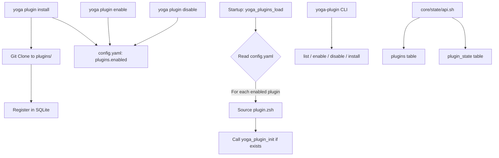

# Plugin System

The Yoga plugin system allows extending the framework with custom functionality. Plugins are directory-based modules with an entry point file (`plugin.zsh`) that are loaded at startup and managed through CLI commands, state database registration, and configuration files.

---

## Architecture Overview



---

## Component Architecture

The plugin system is composed of four layers:

| Layer | File | Responsibility |
|-------|------|----------------|
| CLI | `bin/yoga-plugin` | User-facing commands |
| Loader | `core/plugins/loader.sh` | Runtime plugin loading |
| State API | `core/state/api.sh` | SQLite registration |
| Daemon Client | `core/daemon/client.sh` | Remote plugin management |

---

## Plugin Directory Format

Each plugin resides in `${YOGA_HOME}/plugins/<name>/` and must contain at least:

```
plugins/
└── my-plugin/
    ├── plugin.zsh        # Required: entry point script
    └── (other files)      # Optional: additional scripts, configs
```

### `plugin.zsh` Requirements

The entry point must be a valid Zsh script that can be sourced. It may optionally define a `yoga_plugin_init` function which is called with the plugin name after sourcing, then immediately unset:

```zsh
# plugins/my-plugin/plugin.zsh

# Optional: initialization function called once at load time
function yoga_plugin_init {
    local plugin_name="$1"
    echo "🔌 Loading plugin: $plugin_name"
    # Register hooks, set variables, etc.
}

# Plugin functions become available in the shell
function my_plugin_hello {
    echo "Hello from my-plugin!"
}

# Export aliases or functions as needed
alias myhello='my_plugin_hello'
```

**Important:** The `yoga_plugin_init` function is called once and then unset (`unfunction yoga_plugin_init 2>/dev/null || true`) to avoid conflicts between plugins.

---

## CLI: `bin/yoga-plugin`

The `yoga-plugin` binary provides plugin management commands from the terminal.

### `usage`

**Description:** Display help text with available commands and requirements.

**Output:**
```
Usage:
  yoga-plugin list
  yoga-plugin enable <name>
  yoga-plugin disable <name>
  yoga-plugin install <name> <git-url>

Notes:
  Plugins live under ~/.yoga/plugins/<name>/plugin.zsh
  Enabled plugins are listed in config.yaml under plugins.enabled

Requirements:
  - zsh
  - git (for install)
```

---

### `cfg_file`

**Signature:**
```zsh
cfg_file() {
    ...
}
```

**Description:** Locates the configuration file. Checks `$YOGA_HOME/config/config.yaml` first, then `$YOGA_HOME/config.yaml`.

**Return value:** Outputs the config file path. Empty string if not found.

---

### `ensure_cfg`

**Signature:**
```zsh
ensure_cfg() {
    ...
}
```

**Description:** Ensures that a configuration file exists. If `cfg_file` returns empty, it creates the `config/` directory and attempts to copy the root config file.

**Side effects:**
1. Creates `$YOGA_HOME/config/` directory if needed
2. Copies `$YOGA_HOME/config.yaml` to `$YOGA_HOME/config/config.yaml` if the directory config doesn't exist

**Example:**
```zsh
ensure_cfg  # Called automatically by enable/disable commands
```

---

### `list_plugins`

**Signature:**
```zsh
list_plugins() {
    ...
}
```

**Description:** Lists all installed plugins (from the filesystem) and all enabled plugins (from `config.yaml`). Displays two sections: "Installed plugins" and "Enabled plugins".

**Installed plugins** are discovered by listing directories in `$YOGA_HOME/plugins/`.

**Enabled plugins** are parsed from the YAML config file using `awk`.

**Output format:**
```
Installed plugins:
my-plugin
another-plugin

Enabled plugins:
my-plugin
```

**Example:**
```zsh
yoga-plugin list
```

---

### `enable_plugin <name>`

**Signature:**
```zsh
enable_plugin() {
    local name="$1"
    ...
}
```

**Description:** Adds a plugin to the `plugins.enabled` list in `config.yaml`. If the plugin is already enabled, prints "Already enabled" and returns. If no `plugins:` section exists, appends one. Uses `awk` to safely modify the YAML file via a temporary file.

**Parameters:**

| Parameter | Type | Required | Description |
|-----------|------|----------|-------------|
| `$1` (`name`) | string | Yes | Plugin name to enable |

**Return value:** Returns 1 if config file not found.

**YAML modification logic:**

1. If the plugin name already exists in the enabled list → "Already enabled: \<name>"
2. If no `plugins:` section exists → Appends `plugins: enabled: - <name>` to the file
3. If `plugins:` exists but no `enabled:` → Inserts `enabled:` block under `plugins:`
4. If `plugins: enabled:` exists → Inserts `- <name>` at the top of the enabled list

**Example:**
```zsh
yoga-plugin enable my-plugin
# Output: Enabled: my-plugin
```

---

### `disable_plugin <name>`

**Signature:**
```zsh
disable_plugin() {
    local name="$1"
    ...
}
```

**Description:** Removes a plugin from the `plugins.enabled` list in `config.yaml`. Uses `awk` to safely modify the YAML file via a temporary file, removing the matching line.

**Parameters:**

| Parameter | Type | Required | Description |
|-----------|------|----------|-------------|
| `$1` (`name`) | string | Yes | Plugin name to disable |

**Return value:** Returns 1 if config file not found.

**Example:**
```zsh
yoga-plugin disable my-plugin
# Output: Disabled: my-plugin
```

---

### `install_plugin <name> <git-url>`

**Signature:**
```zsh
install_plugin() {
    local name="$1"
    local url="$2"
    ...
}
```

**Description:** Installs a plugin by cloning its Git repository into `$YOGA_HOME/plugins/<name>/`. If the plugin directory already contains a `.git` directory (i.e., it's already cloned), it performs a `git pull --rebase` to update instead.

**Parameters:**

| Parameter | Type | Required | Description |
|-----------|------|----------|-------------|
| `$1` (`name`) | string | Yes | Plugin name (becomes directory name) |
| `$2` (`url`) | string | Yes | Git URL to clone from |

**Side effects:**
1. Creates `$YOGA_HOME/plugins/` directory if it doesn't exist
2. If plugin already installed: runs `git -C ... pull --rebase`
3. If new: runs `git clone <url> <path>`

**Example:**
```zsh
yoga-plugin install my-plugin https://github.com/user/yoga-plugin-my.git
# Output: Installed: my-plugin

# Update existing plugin
yoga-plugin install my-plugin https://github.com/user/yoga-plugin-my.git
# Output: Updated: my-plugin
```

---

## Runtime Loader: `core/plugins/loader.sh`

The loader is sourced during shell initialization to load enabled plugins.

### `_yoga_plugins_config_file`

**Signature:**
```zsh
_yoga_plugins_config_file() {
    ...
}
```

**Description:** Locates the configuration file. Same logic as the CLI version — checks `$YOGA_HOME/config/config.yaml` first, then `$YOGA_HOME/config.yaml`.

**Return value:** Config file path, or empty string if not found.

---

### `_yoga_plugins_enabled`

**Signature:**
```zsh
_yoga_plugins_enabled() {
    ...
}
```

**Description:** Parses the YAML config file to extract the list of enabled plugin names. Uses `awk` to find and extract items under `plugins: enabled:`.

**Return value:** Outputs one plugin name per line. Returns empty (with exit 0) if config file is missing or has no enabled plugins.

**Example output:**
```
my-plugin
another-plugin
```

---

### `yoga_plugins_load`

**Signature:**
```zsh
yoga_plugins_load() {
    ...
}
```

**Description:** Main plugin loading function. Iterates through enabled plugins (from `_yoga_plugins_enabled`), sources each plugin's `plugin.zsh` file, and calls `yoga_plugin_init` if it exists.

**Loading sequence for each plugin:**

1. Check if `$YOGA_HOME/plugins/<name>/plugin.zsh` exists
2. Source the `plugin.zsh` file
3. If `yoga_plugin_init` function exists, call it with the plugin name
4. Unset `yoga_plugin_init` to prevent conflicts

**Pre-conditions:**
- `$YOGA_HOME/plugins/` directory must exist (returns early if not)
- Plugin must have a `plugin.zsh` file (skipped if not found)

**Example:**
```zsh
# Called during shell initialization
source "${YOGA_HOME}/core/plugins/loader.sh"
yoga_plugins_load
# Each enabled plugin's plugin.zsh is sourced
```

---

## CLI Commands

The following commands are available via the `yoga` CLI:

### `yoga plugin list`

Lists all installed and enabled plugins.

```bash
yoga plugin list
```

### `yoga plugin install <name> <git-url>`

Installs a plugin from a Git repository.

```bash
yoga plugin install my-plugin https://github.com/user/yoga-plugin-my.git
```

### `yoga plugin enable <name>`

Enables a plugin by adding it to `config.yaml`.

```bash
yoga plugin enable my-plugin
```

### `yoga plugin disable <name>`

Disables a plugin by removing it from `config.yaml`.

```bash
yoga plugin disable my-plugin
```

---

## Daemon Integration

When the daemon is running, plugin management can also be performed via the socket client.

### `yoga_client_plugin_list`

**File:** `core/daemon/client.sh:125`

**Signature:**
```zsh
function yoga_client_plugin_list {
    _yoga_client_send "plugin" "list" "{}"
}
```

**Description:** Requests the list of plugins from the daemon via the Unix socket interface.

**Parameters:** None.

**Return value:** Plugin list data from the daemon, or error message via `yoga_fogo`.

---

### `yoga_plugin_register`

**File:** `core/state/api.sh:316`

**Signature:**
```zsh
function yoga_plugin_register {
    local name="$1"
    local version="$2"
    local install_path="$3"
    ...
}
```

**Description:** Register a plugin in the SQLite `plugins` table. Sets `is_enabled=1` and `is_loaded=0` by default. Uses `INSERT OR REPLACE` to update existing entries.

**Parameters:**

| Parameter | Type | Required | Description |
|-----------|------|----------|-------------|
| `$1` (`name`) | string | Yes | Plugin name |
| `$2` (`version`) | string | Yes | Semantic version |
| `$3` (`install_path`) | string | Yes | Path to plugin directory |

**Example:**
```zsh
yoga_plugin_register "my-plugin" "1.0.0" "/home/user/.yoga/plugins/my-plugin"
```

---

### `yoga_plugin_enable`

**File:** `core/state/api.sh:333`

**Description:** Enable a plugin in SQLite by setting `is_enabled=1`.

**Example:**
```zsh
yoga_plugin_enable "my-plugin"
```

---

### `yoga_plugin_disable`

**File:** `core/state/api.sh:338`

**Description:** Disable a plugin in SQLite by setting `is_enabled=0` and `is_loaded=0`.

**Example:**
```zsh
yoga_plugin_disable "my-plugin"
```

---

### `yoga_plugin_list`

**File:** `core/state/api.sh:345`

**Description:** Lists all plugins from SQLite with emoji status indicators.

**Example:**
```zsh
yoga_plugin_list
# Output: my-plugin|1.0.0|✅|⚪
```

---

## SQLite Tables

### `plugins`

| Column | Type | Constraints | Description |
|--------|------|-------------|-------------|
| `id` | TEXT | PRIMARY KEY | Same as `name` |
| `name` | TEXT | NOT NULL, UNIQUE | Plugin display name |
| `version` | TEXT | NOT NULL | Semantic version |
| `description` | TEXT | — | Plugin description |
| `author` | TEXT | — | Author name |
| `source` | TEXT | — | Source URL (`git://`, `npm://`, `file://`) |
| `install_path` | TEXT | NOT NULL | Filesystem path |
| `is_enabled` | BOOLEAN | DEFAULT 1 | Active flag |
| `is_loaded` | BOOLEAN | DEFAULT 0 | Loaded-into-session flag |
| `installed_at` | DATETIME | DEFAULT CURRENT_TIMESTAMP | Install timestamp |
| `updated_at` | DATETIME | — | Last update timestamp |
| `hooks` | TEXT | — | JSON: `{pre_command, post_command, on_load}` |
| `metadata` | TEXT | — | Full manifest JSON |

**Index:** `idx_plugins_enabled` on `is_enabled`

---

### `plugin_state`

| Column | Type | Constraints | Description |
|--------|------|-------------|-------------|
| `plugin_id` | TEXT | PRIMARY KEY, FK → `plugins(id)` ON DELETE CASCADE | Referenced plugin |
| `state` | TEXT | — | JSON with plugin runtime state |
| `last_run` | DATETIME | — | Last execution timestamp |
| `run_count` | INTEGER | DEFAULT 0 | Number of executions |

---

## Configuration

### `config.yaml` Structure

```yaml
# $YOGA_HOME/config/config.yaml or $YOGA_HOME/config.yaml

plugins:
  enabled:
    - my-plugin
    - another-plugin
```

Plugin names in the `enabled` list must match the directory name under `$YOGA_HOME/plugins/`.

---

## How to Create a Plugin

### 1. Create the directory structure

```bash
mkdir -p ~/.yoga/plugins/my-awesome-plugin
```

### 2. Create `plugin.zsh`

```zsh
#!/usr/bin/env zsh
# ~/.yoga/plugins/my-awesome-plugin/plugin.zsh

function yoga_plugin_init {
    local plugin_name="$1"
    echo "🔌 Initializing: $plugin_name"
    # Register plugin in SQLite if needed
    if [[ -f "$YOGA_STATE_DB" ]]; then
        yoga_plugin_register "$plugin_name" "1.0.0" "$YOGA_HOME/plugins/$plugin_name"
    fi
}

# Plugin functions
function my_awesome_greet {
    local name="${1:-World}"
    yoga_terra "Hello, $name! Welcome to Yoga."
}

function my_awesome_status {
    yoga_info "Plugin my-awesome-plugin is active and running."
    yoga_state_get "my-awesome-plugin:status" "plugin" "unknown"
}

# Aliases
alias mygreet='my_awesome_greet'
alias mystatus='my_awesome_status'
```

### 3. Enable the plugin

```bash
yoga-plugin enable my-awesome-plugin
```

Or via CLI:

```bash
yoga plugin enable my-awesome-plugin
```

### 4. Restart shell or re-source

```bash
source "$YOGA_HOME/init.sh"
# Or: exec zsh
```

### 5. Verify

```bash
yoga-plugin list
# Installed plugins:
# my-awesome-plugin
# 
# Enabled plugins:
# my-awesome-plugin

# Use the plugin
mygreet "Developer"
# ✅ Hello, Developer! Welcome to Yoga.
```

---

## Publishing a Plugin

To make a plugin installable via `yoga-plugin install`:

1. Create a Git repository with the `plugin.zsh` entry point
2. Add a `README.md` with usage instructions
3. Optionally add a `manifest.json` with metadata:

```json
{
  "name": "my-awesome-plugin",
  "version": "1.0.0",
  "description": "An awesome Yoga plugin",
  "author": "Developer Name",
  "hooks": {
    "pre_command": [],
    "post_command": [],
    "on_load": []
  }
}
```

4. Push to a Git hosting service
5. Users install with:

```bash
yoga-plugin install my-awesome-plugin https://github.com/user/yoga-plugin-my-awesome.git
yoga-plugin enable my-awesome-plugin
```

---

## Full Workflow Example

```bash
# Install a plugin from Git
yoga-plugin install docker-helper https://github.com/example/yoga-plugin-docker-helper.git
# Output: Installed: docker-helper

# List plugins
yoga-plugin list
# Installed plugins:
# docker-helper
#
# Enabled plugins:
# (none yet)

# Enable it
yoga-plugin enable docker-helper
# Output: Enabled: docker-helper

# Restart shell to load
source "$YOGA_HOME/init.sh"

# Use commands provided by the plugin
docker-helper status

# Disable when not needed
yoga-plugin disable docker-helper
# Output: Disabled: docker-helper

# Uninstall (remove directory)
rm -rf ~/.yoga/plugins/docker-helper
```