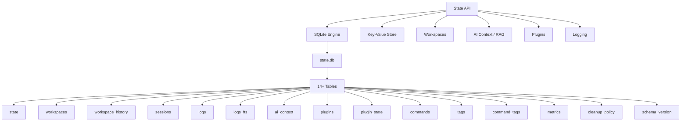

# State Management

Yoga 3.0 uses SQLite as a persistent state backend, providing key-value storage, workspace management, AI context indexing (RAG), plugin registries, command history, and structured logging. This document covers every function, table, and configuration detail.

---

## Architecture Overview



---

## Configuration

### Environment Variables

| Variable | Default | Description |
|----------|---------|-------------|
| `YOGA_HOME` | `$HOME/.yoga` | Root directory for Yoga files |
| `YOGA_STATE_DB` | `${YOGA_HOME}/state.db` | Path to the SQLite database file |
| `YOGA_STATE_SCHEMA` | `${YOGA_HOME}/core/state/schema.sql` | Path to the schema DDL file |

### Initialization Flow

When `core/state/api.sh` is sourced, it automatically calls `_yoga_state_init`. This function:

1. Checks if `sqlite3` is available on `$PATH`
2. If `state.db` doesn't exist, creates it by running `$YOGA_STATE_SCHEMA`
3. Prints confirmation via `yoga_terra`

---

## Database Schema

All tables are defined in `core/state/schema.sql`. The database uses WAL mode and has foreign keys enabled.

### `schema_version`

Tracks schema migrations applied to the database.

| Column | Type | Constraints | Description |
|--------|------|-------------|-------------|
| `version` | INTEGER | PRIMARY KEY | Schema version number |
| `applied_at` | DATETIME | DEFAULT CURRENT_TIMESTAMP | When the migration was applied |
| `description` | TEXT | — | Description of the migration |

**Initial row:** `(1, 'Initial schema for Yoga 3.0 Lôro Barizon Edition')`

---

### `state`

Global key-value store with TTL support, scoped storage, and automatic expiry.

| Column | Type | Constraints | Description |
|--------|------|-------------|-------------|
| `key` | TEXT | PRIMARY KEY | Unique key identifier |
| `value` | TEXT | NOT NULL | Stored value |
| `scope` | TEXT | DEFAULT `'global'` | Namespace: `'global'`, `'workspace:{id}'`, `'session:{id}'` |
| `created_at` | DATETIME | DEFAULT CURRENT_TIMESTAMP | Creation timestamp |
| `updated_at` | DATETIME | DEFAULT CURRENT_TIMESTAMP | Last update timestamp |
| `expires_at` | DATETIME | — | Expiry timestamp (NULL = never expires) |
| `metadata` | TEXT | — | JSON blob for additional data |

**Indexes:** `idx_state_scope` on `scope`, `idx_state_key_scope` on `(key, scope)`

**UPSERT behavior:** `yoga_state_set` uses `ON CONFLICT(key, scope) DO UPDATE` to update existing values.

---

### `workspaces`

Manages project workspaces with tmux integration support.

| Column | Type | Constraints | Description |
|--------|------|-------------|-------------|
| `id` | TEXT | PRIMARY KEY | SHA-256 hash (first 16 chars) of the workspace path |
| `name` | TEXT | NOT NULL | Human-readable workspace name |
| `path` | TEXT | NOT NULL, UNIQUE | Filesystem path to the workspace |
| `tmux_session` | TEXT | — | Associated tmux session name |
| `is_active` | BOOLEAN | DEFAULT 0 | Whether this workspace is currently active |
| `created_at` | DATETIME | DEFAULT CURRENT_TIMESTAMP | Creation timestamp |
| `last_accessed` | DATETIME | — | Last access timestamp |
| `metadata` | TEXT | — | JSON: `{env_vars, aliases, layout, ...}` |

**Indexes:** `idx_workspaces_path` on `path`, `idx_workspaces_active` on `is_active`

---

### `workspace_history`

Tracks workspace lifecycle events (created, activated, deactivated, killed).

| Column | Type | Constraints | Description |
|--------|------|-------------|-------------|
| `id` | INTEGER | PRIMARY KEY AUTOINCREMENT | Auto-generated row ID |
| `workspace_id` | TEXT | NOT NULL, FK → `workspaces(id)` ON DELETE CASCADE | Referenced workspace |
| `event_type` | TEXT | NOT NULL | Event type: `'created'`, `'activated'`, `'deactivated'`, `'killed'` |
| `tmux_state` | TEXT | — | JSON with tmux window/pane state |
| `timestamp` | DATETIME | DEFAULT CURRENT_TIMESTAMP | When the event occurred |

---

### `sessions`

Tracks daemon sessions for workspace association.

| Column | Type | Constraints | Description |
|--------|------|-------------|-------------|
| `id` | TEXT | PRIMARY KEY | Session identifier |
| `workspace_id` | TEXT | FK → `workspaces(id)` ON DELETE SET NULL | Associated workspace |
| `pid` | INTEGER | NOT NULL | Process ID of the daemon |
| `socket_path` | TEXT | — | Unix socket path for IPC |
| `started_at` | DATETIME | DEFAULT CURRENT_TIMESTAMP | Session start time |
| `last_ping` | DATETIME | — | Last heartbeat from daemon |

**Index:** `idx_sessions_pid` on `pid`

---

### `logs`

Structured command and activity log for debugging and RAG.

| Column | Type | Constraints | Description |
|--------|------|-------------|-------------|
| `id` | INTEGER | PRIMARY KEY AUTOINCREMENT | Auto-generated row ID |
| `timestamp` | DATETIME | DEFAULT CURRENT_TIMESTAMP | Log timestamp |
| `level` | TEXT | NOT NULL, CHECK(`level IN ('DEBUG','INFO','WARN','ERROR')`) | Log severity level |
| `module` | TEXT | NOT NULL | Source module: `'cc'`, `'workspace'`, `'ai'`, `'daemon'`, etc. |
| `command` | TEXT | — | Command that generated the log |
| `input` | TEXT | — | User input |
| `output` | TEXT | — | Generated output |
| `status` | TEXT | — | `'success'`, `'error'`, `'pending'` |
| `duration_ms` | INTEGER | — | Duration in milliseconds |
| `payload` | TEXT | — | JSON with extra data |

**Indexes:** `idx_logs_timestamp` on `timestamp`, `idx_logs_module_time` on `(module, timestamp)`, `idx_logs_level` on `level`

---

### `logs_fts`

Full-text search virtual table (FTS5 with Porter stemming) for RAG retrieval.

| Column | Type | Description |
|--------|------|-------------|
| `content` | TEXT | Indexed content (auto-populated from `logs` via triggers) |
| (virtual) | FTS5 | Uses `tokenize='porter'` for English stemming |

**Triggers:**

- `logs_fts_insert`: After INSERT on `logs`, inserts concatenated `module + command + input + output` into `logs_fts`
- `logs_fts_delete`: After DELETE on `logs`, removes the corresponding row from `logs_fts`

---

### `plugins`

Plugin registry tracking installed plugins.

| Column | Type | Constraints | Description |
|--------|------|-------------|-------------|
| `id` | TEXT | PRIMARY KEY | Plugin identifier (same as name) |
| `name` | TEXT | NOT NULL, UNIQUE | Plugin display name |
| `version` | TEXT | NOT NULL | Semantic version string |
| `description` | TEXT | — | Plugin description |
| `author` | TEXT | — | Plugin author |
| `source` | TEXT | — | Source URL: `'git://...'`, `'npm://...'`, `'file://...'` |
| `install_path` | TEXT | NOT NULL | Filesystem path to the plugin directory |
| `is_enabled` | BOOLEAN | DEFAULT 1 | Whether the plugin is active |
| `is_loaded` | BOOLEAN | DEFAULT 0 | Whether the plugin has been loaded into the current session |
| `installed_at` | DATETIME | DEFAULT CURRENT_TIMESTAMP | Installation timestamp |
| `updated_at` | DATETIME | — | Last update timestamp |
| `hooks` | TEXT | — | JSON: `{pre_command, post_command, on_load}` |
| `metadata` | TEXT | — | Full manifest JSON |

**Index:** `idx_plugins_enabled` on `is_enabled`

---

### `plugin_state`

Runtime state persistence for plugins.

| Column | Type | Constraints | Description |
|--------|------|-------------|-------------|
| `plugin_id` | TEXT | PRIMARY KEY, FK → `plugins(id)` ON DELETE CASCADE | Referenced plugin |
| `state` | TEXT | — | JSON with plugin state data |
| `last_run` | DATETIME | — | Last execution timestamp |
| `run_count` | INTEGER | DEFAULT 0 | Number of times the plugin has run |

---

### `ai_context`

Stores AI context entries for RAG (Retrieval-Augmented Generation).

| Column | Type | Constraints | Description |
|--------|------|-------------|-------------|
| `id` | INTEGER | PRIMARY KEY AUTOINCREMENT | Auto-generated row ID |
| `source` | TEXT | NOT NULL | Origin: `'log'`, `'command_history'`, `'workspace'`, `'manual'` |
| `content` | TEXT | NOT NULL | The actual content text |
| `embedding` | BLOB | — | Reserved for future vector search |
| `timestamp` | DATETIME | DEFAULT CURRENT_TIMESTAMP | When the content was indexed |
| `workspace_id` | TEXT | FK → `workspaces(id)` ON DELETE SET NULL | Associated workspace |
| `relevance_score` | REAL | — | Relevance score (0.0 - 1.0) |

**Index:** `idx_ai_context_timestamp` on `timestamp`

---

### `commands`

Command history and tracking for the Command Center module.

| Column | Type | Constraints | Description |
|--------|------|-------------|-------------|
| `id` | INTEGER | PRIMARY KEY AUTOINCREMENT | Auto-generated row ID |
| `timestamp` | DATETIME | DEFAULT CURRENT_TIMESTAMP | When the command was run |
| `type` | TEXT | NOT NULL | Type: `'alias'`, `'function'`, `'git'`, `'docker'`, `'script'`, `'history'` |
| `category` | TEXT | — | Category: `'git'`, `'docker'`, `'file'`, `'network'`, etc. |
| `command` | TEXT | NOT NULL | The command string |
| `description` | TEXT | — | Human-readable description |
| `usage_count` | INTEGER | DEFAULT 1 | Number of times executed |
| `last_used` | DATETIME | DEFAULT CURRENT_TIMESTAMP | Last execution timestamp |
| `workspace_id` | TEXT | FK → `workspaces(id)` ON DELETE SET NULL | Associated workspace |
| `is_favorite` | BOOLEAN | DEFAULT 0 | Whether command is favorited |

**Indexes:** `idx_commands_type` on `type`, `idx_commands_category` on `category`, `idx_commands_workspace` on `workspace_id`

**UPSERT behavior:** `cc_standalone_log` uses `ON CONFLICT(command) DO UPDATE SET usage_count = usage_count + 1`.

---

### `tags`

Label system for organizing commands.

| Column | Type | Constraints | Description |
|--------|------|-------------|-------------|
| `id` | INTEGER | PRIMARY KEY AUTOINCREMENT | Auto-generated row ID |
| `name` | TEXT | NOT NULL, UNIQUE | Tag name |
| `color` | TEXT | DEFAULT `'blue'` | Tag color |

---

### `command_tags`

Many-to-many relationship between commands and tags.

| Column | Type | Constraints | Description |
|--------|------|-------------|-------------|
| `command_id` | INTEGER | FK → `commands(id)` ON DELETE CASCADE | Referenced command |
| `tag_id` | INTEGER | FK → `tags(id)` ON DELETE CASCADE | Referenced tag |

**Primary key:** `(command_id, tag_id)`

---

### `metrics`

Performance and operational metrics.

| Column | Type | Constraints | Description |
|--------|------|-------------|-------------|
| `id` | INTEGER | PRIMARY KEY AUTOINCREMENT | Auto-generated row ID |
| `timestamp` | DATETIME | DEFAULT CURRENT_TIMESTAMP | When the metric was recorded |
| `metric_type` | TEXT | NOT NULL | Type: `'command_duration'`, `'daemon_uptime'`, `'memory_usage'` |
| `value` | REAL | NOT NULL | Metric value |
| `unit` | TEXT | — | Unit: `'ms'`, `'seconds'`, `'bytes'`, `'percent'` |
| `metadata` | TEXT | — | JSON with additional data |

**Index:** `idx_metrics_type_time` on `(metric_type, timestamp)`

---

### `cleanup_policy`

Defines automatic data retention policies.

| Column | Type | Constraints | Description |
|--------|------|-------------|-------------|
| `id` | INTEGER | PRIMARY KEY AUTOINCREMENT | Auto-generated row ID |
| `table_name` | TEXT | NOT NULL, UNIQUE | Target table for cleanup |
| `retention_days` | INTEGER | NOT NULL | Number of days to retain data |
| `enabled` | BOOLEAN | DEFAULT 1 | Whether the policy is active |

**Default policies (inserted on schema init):**

| Table | Retention Days |
|-------|---------------|
| `logs` | 30 |
| `commands` | 90 |
| `ai_context` | 60 |
| `metrics` | 7 |
| `workspace_history` | 30 |

---

## API Reference

### `_yoga_state_init`

**File:** `core/state/api.sh:16`

**Signature:**
```zsh
function _yoga_state_init
```

**Description:** Initializes the SQLite database. Checks for `sqlite3` binary availability and creates the database from the schema file if it doesn't already exist.

**Parameters:** None.

**Return value:** Returns 1 if `sqlite3` is not installed.

**Side effects:**
1. Checks `sqlite3` command availability
2. Creates `${YOGA_STATE_DB}` from `${YOGA_STATE_SCHEMA}` if it doesn't exist
3. Prints creation confirmation via `yoga_terra`

**Example:**
```zsh
source "${YOGA_HOME}/core/state/api.sh"
# _yoga_state_init is called automatically
# Output: 💾 Criando banco de dados... / ✅ Banco criado em /home/user/.yoga/state.db
```

---

### `_yoga_state_escape`

**File:** `core/state/api.sh:32`

**Signature:**
```zsh
function _yoga_state_escape {
    local str="$1"
    ...
}
```

**Description:** Escapes single quotes in a string for safe SQL embedding. Replaces `'` with `''` (SQL standard escaping).

**Parameters:**

| Parameter | Type | Required | Description |
|-----------|------|----------|-------------|
| `$1` (`str`) | string | Yes | String to escape |

**Return value:** Outputs the escaped string to stdout.

**Example:**
```zsh
escaped=$(_yoga_state_escape "it's a test's value")
echo "$escaped"  # Output: it''s a test''s value
```

---

### `_yoga_state_query`

**File:** `core/state/api.sh:38`

**Signature:**
```zsh
function _yoga_state_query {
    local query="$1"
    ...
}
```

**Description:** Low-level SQL query executor. Passes the query directly to `sqlite3` with the database file path.

**Parameters:**

| Parameter | Type | Required | Description |
|-----------|------|----------|-------------|
| `$1` (`query`) | string | Yes | SQL query to execute |

**Return value:** Outputs the query results to stdout.

**Warning:** This function does NOT parameterize queries. Values should be escaped with `_yoga_state_escape` before concatenation.

**Example:**
```zsh
_yoga_state_query "SELECT name FROM workspaces WHERE is_active=1;"
```

---

### `yoga_state_set`

**File:** `core/state/api.sh:49`

**Signature:**
```zsh
function yoga_state_set {
    local key="$1"
    local value="$2"
    local scope="${3:-global}"
    local ttl="${4:-0}"
    ...
}
```

**Description:** Set a key-value pair in the state store. Supports optional scoping and TTL (time-to-live). Uses UPSERT semantics — if the `(key, scope)` pair already exists, it updates the value and `updated_at`, and optionally the `expires_at`.

**Parameters:**

| Parameter | Type | Required | Default | Description |
|-----------|------|----------|---------|-------------|
| `$1` (`key`) | string | Yes | — | Key to store |
| `$2` (`value`) | string | Yes | — | Value to associate |
| `$3` (`scope`) | string | No | `'global'` | Namespace scope |
| `$4` (`ttl`) | integer | No | `0` | Time-to-live in seconds (0 = no expiry) |

**Return value:** Returns 0 on success, 1 if key is empty.

**Side effects:**
1. Escapes key, value, and scope for SQL safety
2. Calculates `expires_at` from `datetime('now', '+<ttl> seconds')` if `ttl > 0`
3. Logs the operation via `yoga_debug`

**SQL executed:**
```sql
INSERT INTO state (key, value, scope, expires_at, updated_at)
VALUES ('<key>', '<value>', '<scope>', <expires>, datetime('now'))
ON CONFLICT(key, scope) DO UPDATE SET
    value=excluded.value,
    updated_at=excluded.updated_at,
    expires_at=excluded.expires_at;
```

**Examples:**
```zsh
# Simple global key
yoga_state_set "theme" "dark"

# Scoped key
yoga_state_set "last_branch" "main" "workspace:abc123"

# Key with TTL (expires in 1 hour)
yoga_state_set "session_token" "xyz789" "global" 3600
```

---

### `yoga_state_get`

**File:** `core/state/api.sh:82`

**Signature:**
```zsh
function yoga_state_get {
    local key="$1"
    local scope="${2:-global}"
    local default_value="${3:-}"
    ...
}
```

**Description:** Retrieve a value from the state store. Automatically excludes expired entries (checks `expires_at > datetime('now')`). Returns a default value if the key is not found or has expired.

**Parameters:**

| Parameter | Type | Required | Default | Description |
|-----------|------|----------|---------|-------------|
| `$1` (`key`) | string | Yes | — | Key to look up |
| `$2` (`scope`) | string | No | `'global'` | Namespace scope |
| `$3` (`default_value`) | string | No | `""` | Value to return if key not found |

**Return value:** Outputs the stored value, or `default_value` if not found/expired.

**SQL executed:**
```sql
SELECT value FROM state
WHERE key='<key>' AND scope='<scope>'
AND (expires_at IS NULL OR expires_at > datetime('now'))
LIMIT 1;
```

**Examples:**
```zsh
theme=$(yoga_state_get "theme")
echo "$theme"  # "dark"

branch=$(yoga_state_get "last_branch" "workspace:abc123" "develop")
echo "$branch"  # "main" or "develop" if not found
```

---

### `yoga_state_del`

**File:** `core/state/api.sh:109`

**Signature:**
```zsh
function yoga_state_del {
    local key="$1"
    local scope="${2:-global}"
    ...
}
```

**Description:** Delete a key-value pair from the state store.

**Parameters:**

| Parameter | Type | Required | Default | Description |
|-----------|------|----------|---------|-------------|
| `$1` (`key`) | string | Yes | — | Key to delete |
| `$2` (`scope`) | string | No | `'global'` | Namespace scope |

**Return value:** None.

**Side effects:** Logs the deletion via `yoga_debug`.

**SQL executed:**
```sql
DELETE FROM state WHERE key='<key>' AND scope='<scope>';
```

**Example:**
```zsh
yoga_state_del "theme"
yoga_state_del "last_branch" "workspace:abc123"
```

---

### `yoga_state_list`

**File:** `core/state/api.sh:127`

**Signature:**
```zsh
function yoga_state_list {
    local scope="${1:-global}"
    ...
}
```

**Description:** List all non-expired keys in a given scope, ordered alphabetically.

**Parameters:**

| Parameter | Type | Required | Default | Description |
|-----------|------|----------|---------|-------------|
| `$1` (`scope`) | string | No | `'global'` | Namespace scope to list |

**Return value:** Outputs one key per line to stdout.

**SQL executed:**
```sql
SELECT key FROM state
WHERE scope='<scope>'
AND (expires_at IS NULL OR expires_at > datetime('now'))
ORDER BY key;
```

**Example:**
```zsh
yoga_state_list           # List global keys
yoga_state_list "workspace:abc123"  # List workspace-scoped keys
```

---

### `yoga_state_clear`

**File:** `core/state/api.sh:141`

**Signature:**
```zsh
function yoga_state_clear {
    local scope="${1:-global}"
    ...
}
```

**Description:** Delete all key-value pairs in a given scope.

**Parameters:**

| Parameter | Type | Required | Default | Description |
|-----------|------|----------|---------|-------------|
| `$1` (`scope`) | string | No | `'global'` | Namespace scope to clear |

**Return value:** None.

**Side effects:** Logs the operation via `yoga_debug`.

**SQL executed:**
```sql
DELETE FROM state WHERE scope='<scope>';
```

**Example:**
```zsh
yoga_state_clear "workspace:abc123"
```

---

### `yoga_workspace_create`

**File:** `core/state/api.sh:155`

**Signature:**
```zsh
function yoga_workspace_create {
    local name="$1"
    local path="$2"
    ...
}
```

**Description:** Create a new workspace entry. The workspace ID is derived from a SHA-256 hash (first 16 characters) of the workspace path. Uses `INSERT OR REPLACE` semantics.

**Parameters:**

| Parameter | Type | Required | Description |
|-----------|------|----------|-------------|
| `$1` (`name`) | string | Yes | Human-readable workspace name |
| `$2` (`path`) | string | Yes | Filesystem path to the workspace directory |

**Return value:** Outputs the generated workspace ID to stdout. Returns 1 if name or path is empty.

**Side effects:**
1. Generates ID via `echo "$path" | sha256sum | cut -c1-16`
2. Logs creation via `yoga_terra`

**SQL executed:**
```sql
INSERT OR REPLACE INTO workspaces (id, name, path, created_at)
VALUES ('<id>', '<name>', '<path>', datetime('now'));
```

**Example:**
```zsh
id=$(yoga_workspace_create "my-project" "/home/user/code/my-project")
echo "Workspace ID: $id"  # e.g., "a1b2c3d4e5f6g7h8"
```

---

### `yoga_workspace_activate`

**File:** `core/state/api.sh:179`

**Signature:**
```zsh
function yoga_workspace_activate {
    local identifier="$1"
    ...
}
```

**Description:** Activate a workspace by its ID or path. Deactivates all other workspaces first (only one active at a time). Records an `'activated'` event in `workspace_history`.

**Parameters:**

| Parameter | Type | Required | Description |
|-----------|------|----------|-------------|
| `$1` (`identifier`) | string | Yes | Workspace ID or path |

**Return value:** Returns 1 if workspace not found.

**Side effects:**
1. Deactivates ALL workspaces (`SET is_active=0`)
2. Activates the target workspace
3. Inserts `workspace_history` event
4. Logs via `yoga_terra`

**Example:**
```zsh
yoga_workspace_activate "a1b2c3d4e5f6g7h8"
yoga_workspace_activate "/home/user/code/my-project"
```

---

### `yoga_workspace_current`

**File:** `core/state/api.sh:216`

**Signature:**
```zsh
function yoga_workspace_current
```

**Description:** Get the currently active workspace details.

**Parameters:** None.

**Return value:** Outputs pipe-delimited string: `id:<id>|name:<name>|path:<path>`

**SQL executed:**
```sql
SELECT id, name, path FROM workspaces WHERE is_active=1 LIMIT 1;
```

**Example:**
```zsh
current=$(yoga_workspace_current)
echo "$current"  # id:a1b2c3d4|name:my-project|path:/home/user/code/my-project
```

---

### `yoga_workspace_list`

**File:** `core/state/api.sh:228`

**Signature:**
```zsh
function yoga_workspace_list
```

**Description:** List all workspaces with their status. Shows active/inactive indicator, tmux session indicator, and last access time.

**Parameters:** None.

**Return value:** Outputs one line per workspace in format: `<status>|<name>|<path>|<id>` where `<status>` is `🟢` (active), `⚪` (inactive), or with `📦` suffix if tmux session exists.

**Example:**
```zsh
yoga_workspace_list
# Output:
# 🟢📦|my-project|/home/user/code/my-project|a1b2c3d4
# ⚪|other-proj|/home/user/code/other|e5f6g7h8i9j0k1l2
```

---

### `yoga_workspace_kill`

**File:** `core/state/api.sh:245`

**Signature:**
```zsh
function yoga_workspace_kill {
    local identifier="$1"
    ...
}
```

**Description:** Delete a workspace by its ID or name. Records a `'killed'` event in `workspace_history` before deletion.

**Parameters:**

| Parameter | Type | Required | Description |
|-----------|------|----------|-------------|
| `$1` (`identifier`) | string | Yes | Workspace ID or name |

**Return value:** Returns 1 if workspace not found.

**Side effects:**
1. Inserts `'killed'` event into `workspace_history`
2. Deletes the workspace row
3. Logs via `yoga_terra`

**Example:**
```zsh
yoga_workspace_kill "a1b2c3d4e5f6g7h8"
yoga_workspace_kill "my-project"
```

---

### `yoga_ai_context_add`

**File:** `core/state/api.sh:276`

**Signature:**
```zsh
function yoga_ai_context_add {
    local content="$1"
    local source="${2:-manual}"
    local workspace_id="${3:-}"
    ...
}
```

**Description:** Add content to the AI context table for RAG (Retrieval-Augmented Generation). This content is later searchable via `ai_rag_retrieve`.

**Parameters:**

| Parameter | Type | Required | Default | Description |
|-----------|------|----------|---------|-------------|
| `$1` (`content`) | string | Yes | — | Text content to index |
| `$2` (`source`) | string | No | `'manual'` | Source: `'log'`, `'command_history'`, `'workspace'`, `'manual'` |
| `$3` (`workspace_id`) | string | No | `""` | Optional workspace association |

**Return value:** None (SQL INSERT).

**Example:**
```zsh
yoga_ai_context_add "Deployed v3.0.0 to production" "deploy"
yoga_ai_context_add "Fixed memory leak in worker" "fix" "a1b2c3d4"
```

---

### `yoga_ai_context_search`

**File:** `core/state/api.sh:294`

**Signature:**
```zsh
function yoga_ai_context_search {
    local query="$1"
    local limit="${2:-5}"
    ...
}
```

**Description:** Search the AI context using FTS5 full-text search. Uses the `logs_fts` virtual table with BM25 ranking for relevance-based retrieval.

**Parameters:**

| Parameter | Type | Required | Default | Description |
|-----------|------|----------|---------|-------------|
| `$1` (`query`) | string | Yes | — | Search query string |
| `$2` (`limit`) | integer | No | `5` | Maximum number of results |

**Return value:** Outputs matching `content` and `rank` columns. Empty result on error (suppressed).

**SQL executed:**
```sql
SELECT content, rank FROM (
    SELECT content, rank
    FROM logs_fts
    WHERE logs_fts MATCH '<query>'
    ORDER BY rank
    LIMIT <limit>
);
```

**Example:**
```zsh
yoga_ai_context_search "docker container" 3
```

---

### `yoga_plugin_register`

**File:** `core/state/api.sh:316`

**Signature:**
```zsh
function yoga_plugin_register {
    local name="$1"
    local version="$2"
    local install_path="$3"
    ...
}
```

**Description:** Register a plugin in the state database. Sets `is_enabled=1` and `is_loaded=0` by default. Uses `INSERT OR REPLACE` semantics.

**Parameters:**

| Parameter | Type | Required | Description |
|-----------|------|----------|-------------|
| `$1` (`name`) | string | Yes | Plugin name |
| `$2` (`version`) | string | Yes | Semantic version string |
| `$3` (`install_path`) | string | Yes | Filesystem path to the plugin directory |

**Return value:** None (SQL INSERT OR REPLACE).

**SQL executed:**
```sql
INSERT OR REPLACE INTO plugins
(id, name, version, install_path, is_enabled, is_loaded)
VALUES ('<name>', '<name>', '<version>', '<path>', 1, 0);
```

**Example:**
```zsh
yoga_plugin_register "my-plugin" "1.0.0" "/home/user/.yoga/plugins/my-plugin"
```

---

### `yoga_plugin_enable`

**File:** `core/state/api.sh:333`

**Signature:**
```zsh
function yoga_plugin_enable {
    local name="$1"
    ...
}
```

**Description:** Enable a plugin by setting `is_enabled=1`.

**Parameters:**

| Parameter | Type | Required | Description |
|-----------|------|----------|-------------|
| `$1` (`name`) | string | Yes | Plugin name |

**Example:**
```zsh
yoga_plugin_enable "my-plugin"
```

---

### `yoga_plugin_disable`

**File:** `core/state/api.sh:338`

**Signature:**
```zsh
function yoga_plugin_disable {
    local name="$1"
    ...
}
```

**Description:** Disable a plugin by setting `is_enabled=0` and `is_loaded=0`.

**Parameters:**

| Parameter | Type | Required | Description |
|-----------|------|----------|-------------|
| `$1` (`name`) | string | Yes | Plugin name |

**Example:**
```zsh
yoga_plugin_disable "my-plugin"
```

---

### `yoga_plugin_list`

**File:** `core/state/api.sh:345`

**Signature:**
```zsh
function yoga_plugin_list
```

**Description:** List all registered plugins with their status.

**Parameters:** None.

**Return value:** Outputs one line per plugin: `<name>|<version>|<enabled>|<loaded>` where enabled/loaded are emoji indicators (`✅`/`❌` for enabled, `🟢`/`⚪` for loaded).

**SQL executed:**
```sql
SELECT name, version,
       CASE is_enabled WHEN 1 THEN '✅' ELSE '❌' END as enabled,
       CASE is_loaded WHEN 1 THEN '🟢' ELSE '⚪' END as loaded
FROM plugins ORDER BY name;
```

**Example:**
```zsh
yoga_plugin_list
# Output: my-plugin|1.0.0|✅|⚪
```

---

### `yoga_log_db`

**File:** `core/state/api.sh:361`

**Signature:**
```zsh
function yoga_log_db {
    local level="$1"
    local module="$2"
    local command="$3"
    local input="${4:-}"
    local output="${5:-}"
    local status="${6:-success}"
    local duration="${7:-0}"
    ...
}
```

**Description:** Insert a log entry into the `logs` table. This is the primary programmatic interface for structured logging to SQLite.

**Parameters:**

| Parameter | Type | Required | Default | Description |
|-----------|------|----------|---------|-------------|
| `$1` (`level`) | string | Yes | — | Log level: `'DEBUG'`, `'INFO'`, `'WARN'`, `'ERROR'` |
| `$2` (`module`) | string | Yes | — | Source module: `'cc'`, `'workspace'`, `'ai'`, `'daemon'`, etc. |
| `$3` (`command`) | string | Yes | — | Command that generated the log |
| `$4` (`input`) | string | No | `""` | User input |
| `$5` (`output`) | string | No | `""` | Generated output |
| `$6` (`status`) | string | No | `'success'` | Status: `'success'`, `'error'`, `'pending'` |
| `$7` (`duration`) | integer | No | `0` | Duration in milliseconds |

**Example:**
```zsh
yoga_log_db "INFO" "workspace" "switch" "/home/user/code/proj" "" "success" 150
yoga_log_db "ERROR" "cc" "execute" "rm -rf /" "refused" "error" 0
```

---

### `yoga_log_cleanup`

**File:** `core/state/api.sh:381`

**Signature:**
```zsh
function yoga_log_cleanup
```

**Description:** Remove log entries older than 30 days from the `logs` table.

**Parameters:** None.

**Return value:** None.

**Side effects:** Logs cleanup message via `yoga_debug`.

**SQL executed:**
```sql
DELETE FROM logs WHERE timestamp < datetime('now', '-30 days');
```

**Example:**
```zsh
yoga_log_cleanup
```