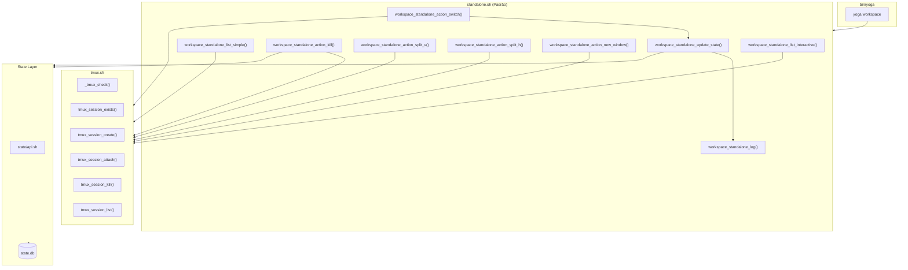
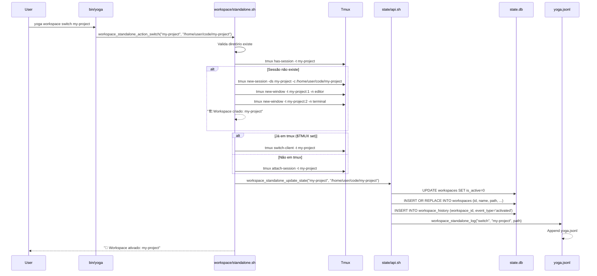

# Workspace Module — Yoga 3.0

## Visão Geral

Módulo **Workspace** — Gerenciamento de projetos e sessões tmux.

Versão: 3.0.0  
Standalone: Sim (não depende de daemon para operações básicas)  
Arquivos: `core/modules/workspace/{standalone.sh, engine.sh, tmux.sh, module.yaml}`

## Uso

```bash
yoga workspace                  # Lista interativa (fzf)
yoga workspace list             # Lista interativa
yoga workspace list --simple    # Lista simples (sem fzf)
yoga workspace create foo       # Cria workspace foo
yoga workspace switch foo       # Troca/cria workspace foo
yoga workspace activate foo     # Ativa workspace foo
yoga workspace kill foo         # Remove workspace foo
yoga workspace delete foo       # Alias para kill
yoga ws                         # Alias para workspace
```

## Arquitetura do Fluxo



## Arquivos

### standalone.sh (`core/modules/workspace/standalone.sh`)

Implementação standalone do módulo workspace.Não depende do daemon. Usa SQLite diretamente via `state/api.sh`.

**Variáveis:**
- `YOGA_HOME` — Default: `$HOME/.yoga`
- `CODE_DIR` — Default: `$HOME/code` (ou `$YOGA_CODE_DIR`)

**Sources:**
- `core/utils/ui.sh`
- `core/state/api.sh`

**Funções:**

#### `workspace_standalone_list_interactive`

**Assinatura:** `workspace_standalone_list_interactive`

**Descrição:** Lista workspaces interativamente com fzf. Principal ponto de entrada do módulo.

**Comportamento:**
1. Coleta sessões tmux ativas
2. Escaneia diretórios em `$CODE_DIR`
3. Marca sessões ativas com 🟢
4. Apresenta interface fzf com preview (`ls -la {2}`)
5. Processa ação via keybindings

**Keybindings no fzf:**

| Tecla | Ação |
|-------|------|
| Enter | Switch/Create sessão |
| Ctrl-X | Kill sessão |
| Ctrl-V | Split vertical |
| Ctrl-H | Split horizontal |
| Ctrl-T | New window |

**Retorno:** Navega para workspace selecionado

**Side-effects:**
- Cria sessão tmux se não existe
- Atualiza tabela `workspaces` no SQLite
- Log em `yoga.jsonl`

**Exemplo:**
```bash
workspace_standalone_list_interactive
```

---

#### `workspace_standalone_list_simple`

**Assinatura:** `workspace_standalone_list_simple`

**Descrição:** Lista workspaces de forma simples (não interativa). Mostra nome e status (🟢 ativo, ⚪ inativo).

**Retorno:** Lista de workspaces formatada

**Exemplo:**
```bash
workspace_standalone_list_simple
# Output:
# 🌌 Workspaces em /home/user/code:
#   🟢 my-project
#   ⚪ other-project
```

---

#### `workspace_standalone_action_switch`

**Assinatura:** `workspace_standalone_action_switch <name> <dir>`

**Descrição:** Cria/ativa workspace. É a ação principal do módulo.

**Parâmetros:**
- `name` (obrigatório): Nome do workspace (usado como nome da sessão tmux)
- `dir` (obrigatório): Caminho do diretório

**Comportamento:**
1. Valida que diretório existe
2. Cria sessão tmux se não existe (`tmux new-session -ds`)
3. Cria janelas padrão: `editor` e `terminal`
4. Attach ou switch (detecta se já em tmux)
5. Atualiza estado no SQLite via `workspace_standalone_update_state`

**Side-effects:**
- Cria sessão tmux
- UPDATE em `workspaces` (is_active=1)
- INSERT em `workspace_history` (event_type=activated)
- Log em `yoga.jsonl`

**Exemplo:**
```bash
workspace_standalone_action_switch "my-project" "/home/user/code/my-project"
```

---

#### `workspace_standalone_action_kill`

**Assinatura:** `workspace_standalone_action_kill <name>`

**Descrição:** Remove workspace. Pede confirmação, mata sessão tmux, remove do SQLite.

**Parâmetros:**
- `name` (obrigatório): Nome do workspace

**Comportamento:**
1. Pedir confirmação `[y/N]`
2. Mata sessão tmux se ativa
3. Remove entrada da tabela `workspaces`
4. Log da ação

**Side-effects:**
- `tmux kill-session`
- `DELETE FROM workspaces`
- Log em `yoga.jsonl`

**Exemplo:**
```bash
workspace_standalone_action_kill "old-project"
```

---

#### `workspace_standalone_action_split_v`

**Assinatura:** `workspace_standalone_action_split_v <dir>`

**Descrição:** Split vertical no tmux. Só funciona se dentro de uma sessão tmux.

**Parâmetros:**
- `dir`: Diretório para o novo pane

**Exemplo:**
```bash
workspace_standalone_action_split_v "/home/user/code/my-project"
```

---

#### `workspace_standalone_action_split_h`

**Assinatura:** `workspace_standalone_action_split_h <dir>`

**Descrição:** Split horizontal no tmux. Só funciona se dentro de uma sessão tmux.

**Parâmetros:**
- `dir`: Diretório para o novo pane

---

#### `workspace_standalone_action_new_window`

**Assinatura:** `workspace_standalone_action_new_window <dir> <name>`

**Descrição:** Cria nova janela no tmux. Só funciona se dentro de uma sessão tmux.

**Parâmetros:**
- `dir`: Diretório da janela
- `name`: Nome da nova janela

---

#### `workspace_standalone_update_state`

**Assinatura:** `workspace_standalone_update_state <name> <dir>`

**Descrição:** Atualiza estado do workspace no SQLite. Desativa todos os workspaces, ativa o selecionado, calcula ID sha256 do path.

**Parâmetros:**
- `name`: Nome do workspace
- `dir`: Caminho do diretório

**Side-effects:**
- `UPDATE workspaces SET is_active=0` (todos)
- `INSERT OR REPLACE INTO workspaces`
- Chama `workspace_standalone_log()`

---

#### `workspace_standalone_log`

**Assinatura:** `workspace_standalone_log <action> <name> <dir>`

**Descrição:** Registra ação do workspace em JSONL.

**Parâmetros:**
- `action`: Tipo de ação (switch, kill, split, etc.)
- `name`: Nome do workspace
- `dir`: Caminho do diretório

**Side-effects:**
- Append em `${YOGA_HOME}/logs/yoga.jsonl`

**Formato do log:**
```json
{
  "timestamp": "2026-04-13T20:00:00",
  "level": "INFO",
  "module": "workspace",
  "action": "switch",
  "workspace": "my-project",
  "path": "/home/user/code/my-project"
}
```

### engine.sh (`core/modules/workspace/engine.sh`)

Versão daemon do módulo workspace. Delega para `state/api.sh` em vez de SQLite direto.

**Sources:**
- `core/utils/ui.sh`
- `core/state/api.sh`
- `core/modules/workspace/tmux.sh`

**Funções:**

| Função | Descrição |
|--------|-----------|
| `workspace_engine_list_interactive` | Lista interativa (versão daemon, usa `yoga_workspace_list()`) |
| `workspace_action_switch` | Switch/Create workspace (versão daemon, usa `yoga_workspace_activate()`) |
| `workspace_action_kill` | Kill workspace (versão daemon, usa `yoga_workspace_kill()`) |
| `workspace_action_split_v` | Split vertical |
| `workspace_action_split_h` | Split horizontal |
| `workspace_action_new_window` | Nova janela |

### tmux.sh (`core/modules/workspace/tmux.sh`)

Utilitários de integração com tmux.

**Sources:**
- `core/utils/ui.sh`

**Funções:**

| Função | Assinatura | Descrição |
|--------|-----------|-----------|
| `_tmux_check` | `_tmux_check` | Verifica se tmux está instalado. Retorna 1 se não encontrado |
| `tmux_session_exists` | `tmux_session_exists <name>` | Verifica se sessão tmux existe. Usa `tmux has-session -t` |
| `tmux_session_create` | `tmux_session_create <name> <dir> [layout]` | Cria sessão detached. Layout default: `default` |
| `tmux_session_attach` | `tmux_session_attach <name>` | Attach ou switch-client (detecta se já em tmux) |
| `tmux_session_kill` | `tmux_session_kill <name>` | Mata sessão tmux |
| `tmux_session_list` | `tmux_session_list` | Lista todas as sessões tmux |

### module.yaml (`core/modules/workspace/module.yaml`)

```yaml
name: "workspace"
version: "3.0.0"
description: "Gerenciamento de projetos e sessões Tmux"
dependencies:
  - tmux
  - fzf
commands:
  - name: "list"
    description: "Lista workspaces"
  - name: "create"
    description: "Cria novo workspace"
  - name: "switch"
    description: "Ativa/troca workspace"
  - name: "kill"
    description: "Remove workspace"
```

## State Management

### Tabela: `workspaces`

```sql
CREATE TABLE IF NOT EXISTS workspaces (
    id TEXT PRIMARY KEY,           -- SHA256 hash do path (primeiros 16 chars)
    name TEXT NOT NULL,             -- Nome do workspace
    path TEXT NOT NULL UNIQUE,      -- Caminho absoluto
    tmux_session TEXT,             -- Nome da sessão tmux
    is_active BOOLEAN DEFAULT 0,    -- Workspace ativo
    created_at DATETIME DEFAULT CURRENT_TIMESTAMP,
    last_accessed DATETIME,         -- Último acesso
    metadata TEXT                   -- JSON: {env_vars, aliases, layout}
);
```

### Tabela: `workspace_history`

```sql
CREATE TABLE IF NOT EXISTS workspace_history (
    id INTEGER PRIMARY KEY AUTOINCREMENT,
    workspace_id TEXT NOT NULL,
    event_type TEXT NOT NULL,       -- 'activated', 'killed'
    tmux_state TEXT,                -- JSON com estado das janelas/panes
    timestamp DATETIME DEFAULT CURRENT_TIMESTAMP,
    FOREIGN KEY (workspace_id) REFERENCES workspaces(id) ON DELETE CASCADE
);
```

### Índices

```sql
CREATE INDEX IF NOT EXISTS idx_workspaces_path ON workspaces(path);
CREATE INDEX IF NOT EXISTS idx_workspaces_active ON workspaces(is_active);
```

## Log Format

**Arquivo:** `${YOGA_HOME}/logs/yoga.jsonl`

**Campos:**
```json
{
  "timestamp": "ISO-8601",
  "level": "INFO",
  "module": "workspace",
  "action": "switch|kill|split|...",
  "workspace": "name",
  "path": "/absolute/path"
}
```

## Fluxo Detalhado: `yoga workspace switch my-project`



## Troubleshooting

### "tmux não está instalado"
**Solução:** `sudo apt install tmux` ou `brew install tmux`

### "fzf não encontrado"
**Solução:** `sudo apt install fzf` ou `brew install fzf`

### "Workspace já existe mas não anexa"
**Causa:** Sessão tmux pode estar detached ou zombie.  
**Solução:**
```bash
tmux kill-session -t nome
yoga workspace switch nome
```

### "Nenhum projeto encontrado em $CODE_DIR"
**Causa:** Diretório `~/code` não existe ou está vazio.  
**Solução:**
```bash
mkdir -p ~/code
# ou defina YOGA_CODE_DIR
export YOGA_CODE_DIR="$HOME/projetos"
```