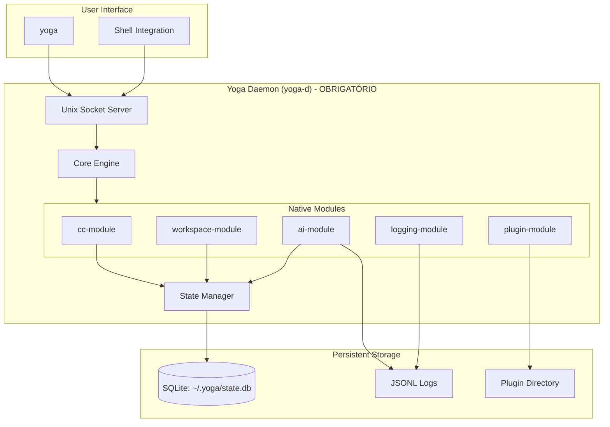

# TDD: Yoga 2.0 - Pragmatic Core Architecture (Efigenia Edition)

**File Target:** `specs/tdd-yoga-2-pragmatic-core.md`

---

## 1. Objective & Scope

### What
Yoga 2.0 Efigenia Edition é uma reimplementação **standalone completa** do yoga-files, transformando-o em uma **Engine de Desenvolvimento com Daemon Obrigatório**. O sistema reimplementa nativamente (sem wrappers ou dependências externas) as funcionalidades atualmente presentes em `~/.zsh/`, preservando a UX familiar mas operando de forma 100% independente.

### Why
- **Independência Total**: Yoga-files deve ser um sistema autônomo, não um agregador de funções externas
- **UX Preservada**: O usuário já domina workflows como `cc`, `ccp`, `rag` - o yoga deve oferecer a mesma experiência via `yoga cc`, `yoga workspace`, `yoga ai`
- **Daemon-Centric**: Todas as operações passam pelo daemon, garantindo state compartilhado e persistência
- **Interop Nativa**: Funciona com shell existente, mas como sistema standalone, não como proxy

### Success Criteria
- [ ] `yoga cc` reimplementa Command Center com fzf (como `~/.zsh/functions/cc.zsh`)
- [ ] `yoga workspace` reimplementa gerenciamento de projetos/tmux (como `ccp`)
- [ ] `yoga ai` integra RAG local (como `~/.zsh/functions/rag*.zsh`)
- [ ] Daemon OBRIGATÓRIO - sistema não funciona sem ele
- [ ] 100% standalone - nenhuma chamada a funções ~/.zsh/
- [ ] UX idêntica ou melhor que as funções originais

---

## 2. Proposed Technical Strategy

### 2.1 Arquitetura Daemon-Centric (Obrigatório)



**Princípio:** O daemon é o **cérebro**. CLI é apenas um cliente que envia comandos via socket Unix.

### 2.2 Reimplementação Nativa (Não Wrappers!)

| ~/.zsh/ Original | Yoga 2.0 Nativo | Implementação |
|------------------|-----------------|---------------|
| `cc.zsh` + componentes | `yoga cc` | Módulo `cc-module` em core/modules/cc/ |
| `ccp.zsh` | `yoga workspace` | Módulo `workspace-module` com tmux integration |
| `rag*.zsh` | `yoga ai ask` | Módulo `ai-module` com RAG local |
| `func-launcher.zsh` | `yoga functions` | Módulo `function-module` |
| `kill-port.zsh` | `yoga net kill-port` | Módulo `net-module` |
| Aliases git/docker | `yoga git`, `yoga docker` | Módulos específicos |

**Regra de Ouro:** Cada módulo é implementado **do zero** no yoga-files, seguindo o comportamento das funções originais como **especificação**, não como **dependência**.

### 2.3 Padrão de Documentação (Preservado)

Todo módulo/componente segue o padrão de docs do ~/.zsh/:

```bash
# @name: cc-module
# @desc: Command Center - Busca interativa para comandos, aliases, git, docker e histórico
# @usage: yoga cc [options]
# @example: yoga cc
# @author: Yoga 2.0 (based on ~/.zsh/functions/cc.zsh by Rodrigo Nascimento)
```

### 2.4 Impacted Files

**Nova Estrutura (100% standalone):**

```
yoga-files/
├── bin/
│   ├── yoga                    # CLI client (thin wrapper, apenas envia para daemon)
│   ├── yoga-daemon            # Daemon executable
│   └── yoga-admin             # Admin commands (daemon start/stop/status)
├── core/
│   ├── daemon/
│   │   ├── server.sh          # Unix socket server
│   │   ├── protocol.sh        # Comunicação socket
│   │   └── lifecycle.sh       # Start/stop/monitor
│   ├── modules/
│   │   ├── cc/
│   │   │   ├── module.yaml     # @name/@desc/@usage
│   │   │   ├── engine.sh       # Lógica do Command Center
│   │   │   ├── data.sh         # Coleta de dados (reimplementa cc-data)
│   │   │   ├── preview.sh      # Preview engine (reimplementa cc-preview)
│   │   │   └── action.sh       # Ações contextuais (reimplementa cc-action)
│   │   ├── workspace/
│   │   │   ├── module.yaml
│   │   │   ├── engine.sh       # Reimplementa ccp.zsh
│   │   │   ├── tmux.sh         # Tmux integration
│   │   │   └── projects.sh     # Scan ~/code/*
│   │   ├── ai/
│   │   │   ├── module.yaml
│   │   │   ├── engine.sh       # Reimplementa rag*.zsh
│   │   │   ├── provider.sh      # Ollama/OpenAI/Anthropic
│   │   │   ├── rag.sh          # RAG local
│   │   │   └── context.sh       # Contexto de workspaces
│   │   ├── logging/
│   │   │   ├── module.yaml
│   │   │   ├── logger.sh        # Structured JSONL logging
│   │   │   └── query.sh         # Query logs (para debug/AI context)
│   │   ├── plugin/
│   │   │   ├── module.yaml
│   │   │   ├── manager.sh       # Plugin lifecycle
│   │   │   ├── loader.sh        # Hot-load
│   │   │   └── registry.sh      # Plugin registry
│   │   └── net/
│   │       ├── module.yaml
│   │       └── utils.sh         # kill-port, pid-*, etc.
│   ├── state/
│   │   ├── schema.sql           # SQLite schema
│   │   ├── migrate.sh           # Migrations
│   │   └── api.sh               # State API
│   └── utils/
│       ├── ui.sh               # yoga_fogo, yoga_terra, etc.
│       └── system.sh             # System utilities
├── plugins/                     # Installed plugins
├── state.db                     # SQLite database
├── logs/
│   └── yoga.jsonl              # Structured logs
└── docs/
    └── modules/                 # Module documentation
```

**Nenhuma dependência em ~/.zsh/ - TUDO reimplementado nativamente.**

---

## 3. Implementation Plan

### 3.1 Component Architecture

#### 3.1.1 Daemon Core (`core/daemon/`)

**Servidor Socket Unix:**
```bash
# core/daemon/server.sh
# @name: daemon-server
# @desc: Unix socket server for yoga commands

YOGA_SOCKET="${YOGA_HOME}/daemon.sock"
YOGA_PIDFILE="${YOGA_HOME}/daemon.pid"

function yoga_daemon_start {
    # @usage: yoga-daemon start
    # Inicia daemon em background
    # Obrigatório: verifica se já existe, se não inicia
}

function yoga_daemon_stop {
    # @usage: yoga-admin daemon stop
    # Envia sinal de shutdown graceful
}

function _yoga_daemon_accept {
    # Loop principal
    # Aceita conexões socket
    # Roteia para módulos
}
```

**Protocolo de Comunicação:**
```
REQUEST FORMAT:
  MODULE|COMMAND|PARAMS_JSON|REQUEST_ID

RESPONSE FORMAT:
  STATUS|RESULT_JSON|REQUEST_ID
  
Exemplo:
  cc|run|{"query":"git"}|12345
  OK|{"selection":"git status","action":"execute"}|12345
```

#### 3.1.2 Módulo CC (Command Center) - `core/modules/cc/`

**Reimplementação de cc.zsh + componentes:**

```bash
# core/modules/cc/engine.sh
# @name: cc-engine
# @desc: Command Center interativo usando fzf
# @usage: yoga cc

function cc_engine_run {
    # 1. Coleta dados (delega para data.sh)
    local data=$(cc_data_collect)
    
    # 2. Interface fzf (igual cc.zsh original)
    local selected=$(echo "$data" | fzf \
        --prompt="🚀 Command Center > " \
        --height=90% \
        --layout=reverse \
        --border \
        --delimiter='\|' \
        --with-nth=2 \
        --preview 'cc_preview {}' \
        --preview-window=down:3:wrap \
        --expect=enter,ctrl-y,ctrl-e,ctrl-x)
    
    # 3. Processa seleção (delega para action.sh)
    cc_action_process "$selected"
}

# core/modules/cc/data.sh
# @name: cc-data
# @desc: Coleta dados de múltiplas fontes
# @usage: (internal)

function cc_data_collect {
    # Coleta: aliases, funções, git branches, docker containers,
    # scripts em ~/bin, histórico filtrado
    # Formato: "TYPE|LABEL|COMMAND"
}
```

**Funcionalidades Preservadas:**
- Enter: Executa
- Ctrl-Y: Copia para clipboard
- Ctrl-E: Abre no nvim
- Ctrl-X: Ação contextual (checkout, docker exec, etc.)

#### 3.1.3 Módulo Workspace - `core/modules/workspace/`

**Reimplementação de ccp.zsh:**

```bash
# core/modules/workspace/engine.sh
# @name: workspace-engine
# @desc: Gerenciamento de projetos e sessões tmux
# @usage: yoga workspace [ls|switch|create|kill]

function workspace_engine_list {
    # Lista projetos em ~/code/*
    # Mostra 🟢 para sessões ativas
    # Integração fzf igual ccp original
}

function workspace_engine_switch {
    local project="$1"
    # Cria ou attacha sessão tmux
    # Muda diretório
    # Atualiza state (current_workspace)
}

function workspace_engine_kill {
    local project="$1"
    # Mata sessão tmux
    # Atualiza state
}
```

**Atalhos Preservados:**
- Enter: Switch/Create
- Ctrl-X: Kill session
- Ctrl-V: Split vertical
- Ctrl-H: Split horizontal
- Ctrl-T: New window

#### 3.1.4 Módulo AI - `core/modules/ai/`

**Reimplementação de rag*.zsh:**

```bash
# core/modules/ai/engine.sh
# @name: ai-engine
# @desc: AI integration com RAG local
# @usage: yoga ai ask "pergunta"

function ai_engine_ask {
    local question="$1"
    local context=$(ai_rag_retrieve "$question")
    local response=$(ai_provider_query "$question" "$context")
    echo "$response"
}

# core/modules/ai/rag.sh
# @name: ai-rag
# @desc: RAG usando logs locais (sqlite fts5)

function ai_rag_retrieve {
    local query="$1"
    # Busca em ~/.yoga/logs/yoga.jsonl
    # Usa SQLite FTS5 para ranking
    # Retorna top-5 chunks relevantes
}
```

**Integração com Ollama (já configurado em exports.zsh):**
```bash
YOGA_OLLAMA_HOST="${OLLAMA_HOST:-http://localhost:11434}"
```

#### 3.1.5 State Manager (`core/state/`)

**SQLite Schema:**
```sql
-- Workspaces
CREATE TABLE workspaces (
    id TEXT PRIMARY KEY,
    name TEXT NOT NULL,
    path TEXT NOT NULL,
    tmux_session TEXT,
    created_at DATETIME DEFAULT CURRENT_TIMESTAMP,
    last_accessed DATETIME,
    metadata TEXT  -- JSON: env vars, aliases, etc.
);

-- Sessions (daemon state)
CREATE TABLE sessions (
    id TEXT PRIMARY KEY,
    workspace_id TEXT,
    pid INTEGER,
    started_at DATETIME,
    FOREIGN KEY (workspace_id) REFERENCES workspaces(id)
);

-- Logs (para RAG)
CREATE TABLE logs (
    id INTEGER PRIMARY KEY AUTOINCREMENT,
    timestamp DATETIME DEFAULT CURRENT_TIMESTAMP,
    module TEXT,
    command TEXT,
    input TEXT,
    output TEXT,
    status TEXT
);

-- FTS5 para RAG
CREATE VIRTUAL TABLE logs_fts USING fts5(content, tokenize='porter');
```

#### 3.1.6 Logging Module (`core/modules/logging/`)

```bash
# core/modules/logging/logger.sh
# @name: logging-engine
# @desc: Structured JSONL logging

function yoga_log {
    local level="$1"  # DEBUG|INFO|WARN|ERROR
    local module="$2"
    local message="$3"
    local payload="${4:-{}}"
    
    local entry=$(jq -n \
        --arg ts "$(date -Iseconds)" \
        --arg lvl "$level" \
        --arg mod "$module" \
        --arg msg "$message" \
        --argjson pld "$payload" \
        '{timestamp: $ts, level: $lvl, module: $mod, message: $msg, payload: $pld}')
    
    echo "$entry" >> "${YOGA_HOME}/logs/yoga.jsonl"
    
    # Também insere no SQLite para RAG
    sqlite3 "${YOGA_STATE_DB}" "INSERT INTO logs (module, command, output, status) VALUES (...)"
}
```

### 3.2 CLI Client (`bin/yoga`)

**Thin wrapper - apenas envia para daemon:**

```bash
#!/usr/bin/env zsh
# bin/yoga
# @name: yoga-cli
# @desc: CLI client for yoga daemon

function main {
    local module="$1"
    shift
    
    # Verifica se daemon está rodando
    if ! yoga_daemon_is_running; then
        yoga_fogo "Daemon não está rodando. Inicie com: yoga-admin daemon start"
        exit 1
    fi
    
    # Envia comando via socket
    local request="${module}|${1}|$(jq -n --argjson args "$@" '$args')|$(date +%s)"
    local response=$(echo "$request" | nc -U "${YOGA_SOCKET}" -w 5)
    
    # Processa resposta
    handle_response "$response"
}

main "$@"
```

### 3.3 Plugin System (`core/modules/plugin/`)

```bash
# core/modules/plugin/manager.sh
# @name: plugin-manager
# @desc: Gerenciamento de plugins

YOGA_PLUGINS_DIR="${YOGA_HOME}/plugins"

function plugin_install {
    local source="$1"  # git://, npm://, file://
    # Download, valida manifest, instala
}

function plugin_enable {
    local name="$1"
    # Marca como ativo no state
    # Carrega hooks
}

function plugin_disable {
    local name="$1"
    # Desativa, mantém instalado
}

# Plugin manifest (plugin.yaml)
# name: my-plugin
# version: 1.0.0
# hooks:
#   pre_command: hook.sh
#   post_command: hook.sh
```

---

## 4. MVP Scope (Fase 1)

### Obrigatório para V1:

1. **Daemon Infrastructure**
   - [ ] Daemon server (socket Unix)
   - [ ] CLI client (`bin/yoga`)
   - [ ] Daemon lifecycle (start/stop/status)
   - [ ] Auto-start no primeiro comando

2. **Módulo CC (Command Center)**
   - [ ] Reimplementa cc.zsh nativamente
   - [ ] fzf interface idêntica
   - [ ] Atalhos: Enter, Ctrl-Y, Ctrl-E, Ctrl-X
   - [ ] Coleta: aliases, git, docker, scripts

3. **Módulo Workspace**
   - [ ] Reimplementa ccp.zsh nativamente
   - [ ] Lista ~/code/* com status 🟢
   - [ ] Atalhos: Enter, Ctrl-X, Ctrl-V, Ctrl-H, Ctrl-T
   - [ ] Integração tmux

4. **State Manager**
   - [ ] SQLite schema
   - [ ] Workspaces persistence
   - [ ] Session tracking

5. **Logging**
   - [ ] JSONL structured logs
   - [ ] Query interface (`yoga logs`)

6. **Self-Update**
   - [ ] `yoga update` (git pull)
   - [ ] Rollback capability

### Pós-MVP (Fases Futuras):

- Módulo AI com RAG (reimplementa rag*.zsh)
- Plugin system completo
- Backup/export local
- Módulos net, git, docker (nativos)
- IDE integrations

---

## 5. Language-Specific Guardrails

### Shell (Zsh)

```bash
#!/usr/bin/env zsh
# @name: example-module
# @desc: Description here

emulate -L zsh
set -euo pipefail

# UI functions (de core/utils/ui.sh)
yoga_terra "Iniciando..."
yoga_agua "Processando..."
yoga_fogo "Erro!"  # + exit

# NUNCA usar eval
# SEMPRE usar subshells () para isolamento
# SEMPRE sanitizar inputs SQL
```

### SQLite

- WAL mode obrigatório
- Migrations versionadas
- Foreign keys enabled
- Quote escaping: `${var//\'/\'\'}`

### Protocolo Socket

- Mensagens com delimiter seguro (NUL ou newline escapado)
- Timeout de 5s para resposta
- Retry com backoff

---

## 6. Testing Strategy

### Unit Tests
```bash
# tests/modules/cc.test.zsh
source "${YOGA_HOME}/core/modules/cc/engine.sh"

function test_cc_data_collect {
    local result=$(cc_data_collect)
    [[ -n "$result" ]] || { echo "FAIL: cc_data_collect vazio"; return 1 }
    echo "PASS: cc_data_collect"
}

test_cc_data_collect
```

### Integration Tests
- Teste de socket communication
- Teste de daemon lifecycle
- Teste de workspace switch

---

## 7. Migration Path

**Fresh Install (novo usuário):**
```bash
git clone <repo> ~/.yoga-files
cd ~/.yoga-files && ./install.sh
# install.sh: adiciona ao PATH, inicia daemon
```

**Usuário existente ~/.zsh/: **
```bash
# NÃO remove ~/.zsh/ - funciona em paralelo
# yoga-files é standalone
# Usuário migra gradualmente (alias yoga=cc, etc.)
```

---

## 8. Documentação Requirements

Cada módulo deve ter:
1. `module.yaml` com @name/@desc/@usage/@example/@author
2. `README.md` interno se complexo
3. Docstrings em funções públicas

---

## 9. Approval Request

**STOP**: TDD Completo - Yoga 2.0 Efigenia Edition

**Pontos Críticos Confirmados:**
- ✅ **Daemon OBRIGATÓRIO** - sem fallback standalone
- ✅ **Reimplementação Nativa** - NENHUM wrapper ~/.zsh/
- ✅ **UX Preservada** - cc, ccp, rag comportamentos mantidos
- ✅ **Padrão de Docs** - @name/@desc/@usage/@example/@author
- ✅ **100% Standalone** - sistema autônomo

**Do you approve this technical approach, Developer?**

Aguardando aprovação explícita antes de iniciar implementação.

---

**Versão:** 2.0-Efigenia-Edition  
**Status:** 🟡 Aguardando Aprovação  
**Próximo Passo:** Após aprovação, gerar estrutura de diretórios e iniciar implementação do daemon + módulo cc

