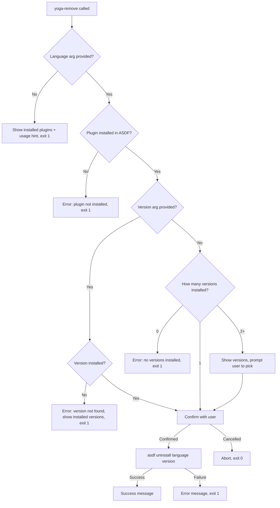

# Technical Design Document: yoga-remove Command

## Objective & Scope

**What:** Create a `yoga-remove` command that provides a simple, direct interface for uninstalling ASDF-managed language runtimes (e.g., Go, Python, Ruby).

**Why:** Currently, removing an ASDF-managed language requires either navigating the full interactive menu (`yoga asdf` → option 6) or remembering raw ASDF commands (`asdf uninstall golang 1.26.1`). A dedicated `yoga-remove` command gives the user a quick, memorable way to wipe out installed languages without friction.

**File Target:** This document is intended for `specs/tdd-yoga-remove.md`.

## Proposed Technical Strategy

### Logic Flow



### Impacted Files

| File | Action | Description |
|------|--------|-------------|
| `bin/yoga-remove` | **New** | Main command script |
| `bin/yoga` | **Modified** | Add `remove` to subcommand routing |
| `config.yaml` | **Modified** | Add `yoga-remove` alias |

### Language-Specific Guardrails (Shell)

- **Error handling:** `set -euo pipefail` at script top
- **Input validation:** Check all arguments before any ASDF operation
- **ASDF sourcing:** Validate `$HOME/.asdf/asdf.sh` exists before sourcing
- **Yoga init:** Source `$YOGA_HOME/init.sh` for themed output functions
- **Compatibility:** Use `zsh` (matching `bin/yoga` and `bin/yoga-asdf` convention)

## Implementation Plan (The "How")

### 1. `bin/yoga-remove` (new file)

```bash
#!/usr/bin/env zsh
# yoga-remove - Remove ASDF-managed language versions

emulate -L zsh
set -euo pipefail

YOGA_HOME="${YOGA_HOME:-$HOME/.yoga}"

# Source yoga initialization
if [ -f "$YOGA_HOME/init.sh" ]; then
    source "$YOGA_HOME/init.sh"
else
    echo "yoga-remove: missing: $YOGA_HOME/init.sh" >&2
    exit 1
fi

# Source ASDF
if [ -f "$HOME/.asdf/asdf.sh" ]; then
    source "$HOME/.asdf/asdf.sh"
else
    yoga_fogo "ASDF not found at $HOME/.asdf/asdf.sh"
    exit 1
fi

language="${1:-}"
version="${2:-}"

# No language provided → show installed plugins and usage
if [ -z "$language" ]; then
    yoga_fogo "Usage: yoga-remove <language> [version]"
    echo ""
    yoga_espirito "Installed plugins:"
    asdf plugin list 2>/dev/null || yoga_agua "  (none)"
    exit 1
fi

# Check plugin exists
if ! asdf plugin list 2>/dev/null | grep -q "^${language}$"; then
    yoga_fogo "Plugin '$language' is not installed"
    yoga_agua "Installed plugins:"
    asdf plugin list 2>/dev/null || echo "  (none)"
    exit 1
fi

# Get installed versions
installed=$(asdf list "$language" 2>/dev/null | sed 's/^[* ]*//' | xargs)

if [ -z "$installed" ]; then
    yoga_fogo "No versions installed for $language"
    exit 1
fi

# No version provided → auto-select if single, prompt if multiple
if [ -z "$version" ]; then
    count=$(echo "$installed" | wc -w | tr -d ' ')
    if [ "$count" -eq 1 ]; then
        version="$installed"
        yoga_agua "Only version installed: $version"
    else
        yoga_espirito "Installed versions for $language:"
        for v in $installed; do echo "  $v"; done
        echo ""
        echo -n "$(yoga_ar 'Version to remove: ')"
        read -r version
        if [ -z "$version" ]; then
            yoga_fogo "No version specified"
            exit 1
        fi
    fi
fi

# Validate version is actually installed
if ! asdf list "$language" 2>/dev/null | grep -q "$version"; then
    yoga_fogo "Version $version is not installed for $language"
    yoga_agua "Installed versions: $installed"
    exit 1
fi

# Confirm
yoga_agua "This will uninstall $language $version"
echo -n "$(yoga_ar 'Are you sure? (y/n): ')"
read -r confirm
if [[ ! "$confirm" =~ ^[Yy] ]]; then
    yoga_agua "Cancelled"
    exit 0
fi

# Execute
if asdf uninstall "$language" "$version"; then
    yoga_terra "Successfully uninstalled $language $version"
else
    yoga_fogo "Failed to uninstall $language $version"
    exit 1
fi
```

### 2. `bin/yoga` modification

Add `remove` case to the existing subcommand routing block so `yoga remove golang` delegates to `bin/yoga-remove golang`.

### 3. `config.yaml` modification

Add a `yoga-remove` alias entry under the aliases section for discoverability.

### Naming Standards

- Command name: `yoga-remove` (kebab-case, consistent with `yoga-asdf`)
- File location: `bin/yoga-remove` (consistent with other yoga commands)
- Subcommand: `yoga remove <lang> [version]`
